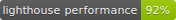

# Mokkapps Portfolio Website

Hi 👋 This is the code of [my personal portfolio website](<[www.mokkapps.de](https://www.mokkapps.de)>) where you can find all my private projects and other information about my person.

## Used Technologies

- [React](https://reactjs.org/)
- [Gatsby](https://www.gatsbyjs.org/)
- [Gatsby Starter Kit](https://github.com/greglobinski/gatsby-starter-kit)

## License

MIT © Mokkapps
