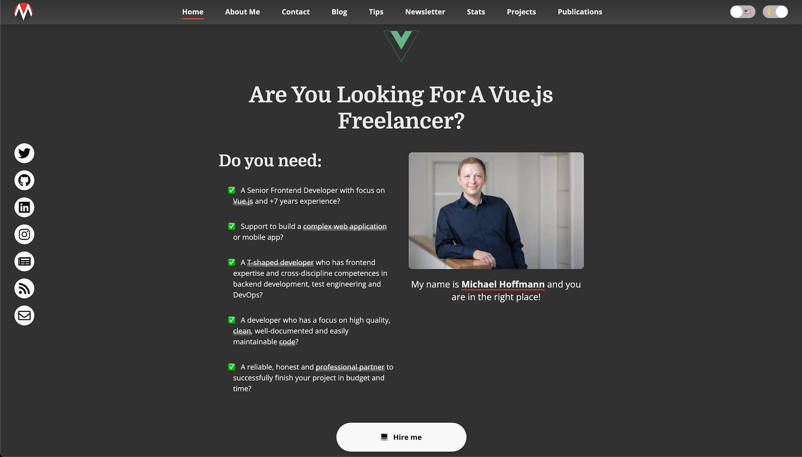
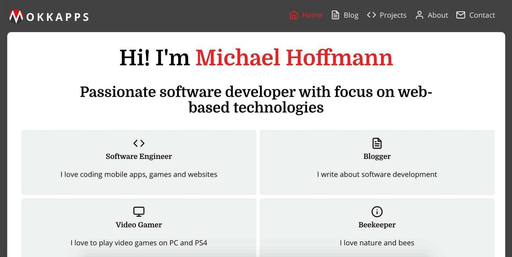
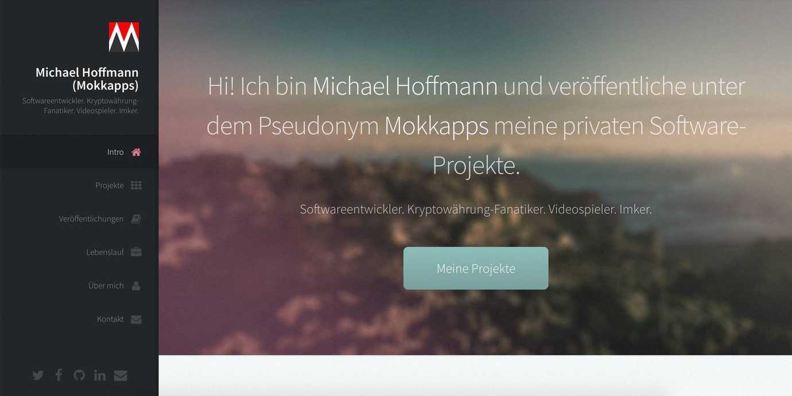
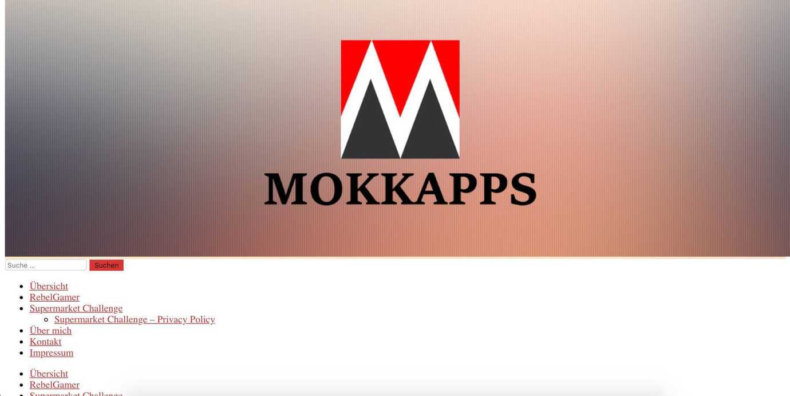

# Changelog

## Version 4 (2021 - now)

Used Technology: Gatsby, AWS Amplify

[Blog Article](https://mokkapps.de/blog/the-10-favorite-features-of-my-developer-portfolio-website/)

## Version 3 (2018 - 2021)

Used Technology: Gatsby

[Blog Article](https://mokkapps.de/blog/the-engineering-behind-my-portfolio-website/)

## Version 2 (2017 - 2018)

Used Technology: Hugo, Netlify

[Blog Article](https://dev.to/mokkapps/how-i-built-my-website-with-hugo-and-netlify-3n49)

## Version 1 (2015 - 2017)

Used Technology: WordPress

