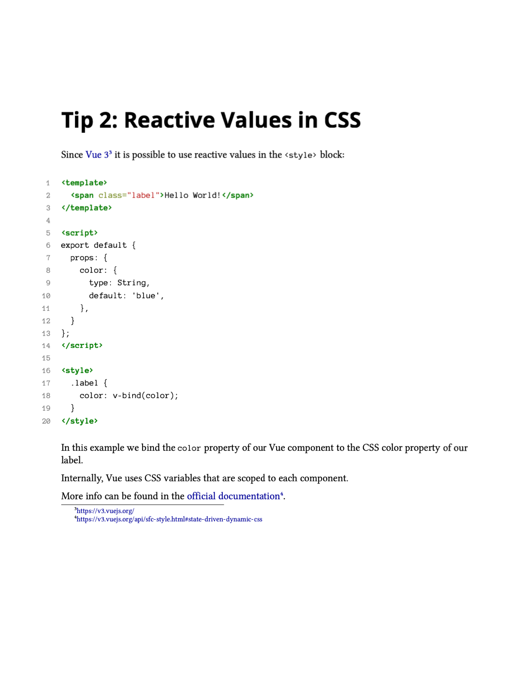
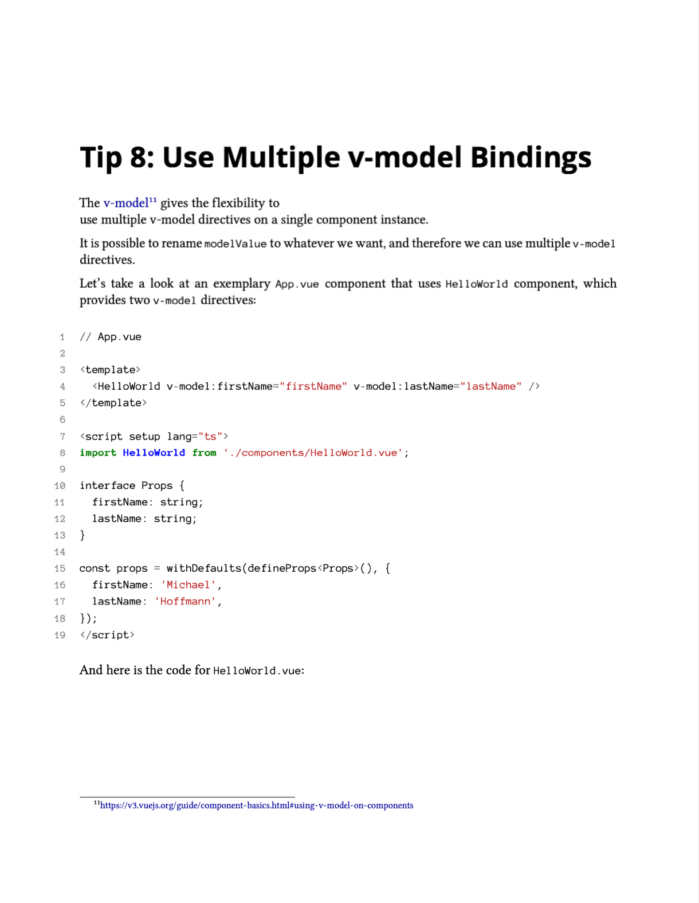

import NewsletterSubscription from 'components/NewsletterSubscription';
import Divider from 'components/Divider';

- Free eBook, 1th edition
- 40+ pages
- 4400+ words
- Includes code examples & playground links
- Available as PDF, ePub (Android and iOS) and Mobi (Kindle)

<Divider />

  

    Get It For Free!
    
      Subscribe to my newsletter to get your free copy of this eBook as a
      welcome present!
    
  

  <NewsletterSubscription />

<Divider />

 

Every week, on Monday, you will receive a new Vue tip and interesting articles about Vue and web development in general.

No worries, I respect your privacy and I will never abuse your email.

## Content

- Tip 1: Prefer Slots Over Props
- Tip 2: Reactive Values in CSS
- Tip 3: Detailed Prop Definitions
- Tip 4: Props and Context in Setup Method
- Tip 5: Avoid Empty Class Attributes
- Tip 6: Destructure in v-for
- Tip 7: Avoid Unwanted Re-Renders of an Element Using v-once
- Tip 8: Use Multiple v-model Bindings
- Tip 9: Trigger Watcher Immediately
- Tip 10: Simple Expressions in Templates
- Tip 11: Assign Handler for Uncaught Errors
- Tip 12: Use Teleport to Render a Component in a Different Place
- Tip 13: Automatic Global Registration of Base Components
- Tip 14: Display Raw HTML
- Tip 15: Scroll to Top When Navigating to a New Route
- Tip 16: Speed Up Initial Load Using Async Components
- Tip 17: Use Two Script Blocks
- Tip 18: Use Optional Chaining in Templates
- Tip 19: Special CSS Selectors
- Tip 20: Use Vuex in Vue Router Navigation Guards
- Tip 21: Watch Nested Values
- Tip 22: Use v-bind to Pass Multiple Props to Components
- Tip 23: Animate Child Component Before Route Leave
- Tip 24: Measure Performance
- Tip 25: Check Version at Runtime
- Tip 26: Query Inner Elements in Third-Party Components
- Tip 27: Create Custom v-model Modifier

## Preview

