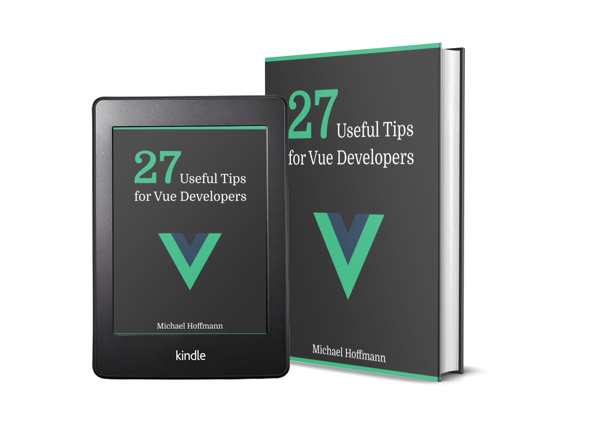
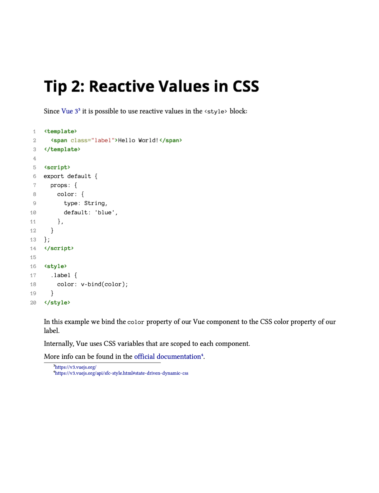
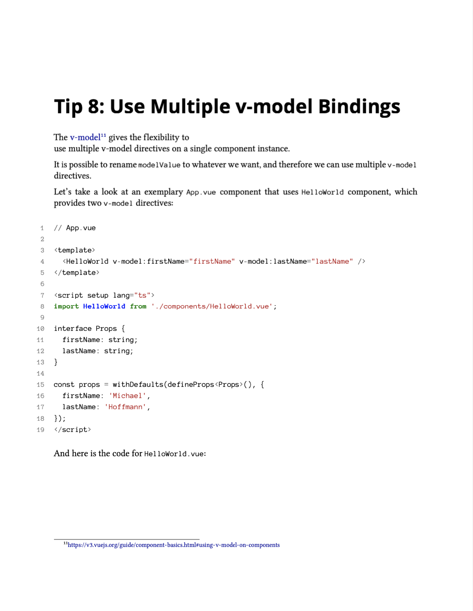

import NewsletterSubscription from 'components/NewsletterSubscription';
import Divider from 'components/Divider';

* Free eBook, 1th edition
* 40+ pages
* Includes code examples & playground links
* Available as PDF, ePub (Android and iOS) and Mobi (Kindle)

<Divider />

  

    Get It For Free!
    Subscribe to my newsletter to get your free copy of this eBook as a welcome present!
  

  <NewsletterSubscription />

<Divider />

 

Every week, on Monday, you will receive a new Vue tip and interesting articles about Vue and web development in general.

No worries, I respect your privacy and I will never abuse your email.

## Content

- Tip 1
- Tip 2

## Preview

