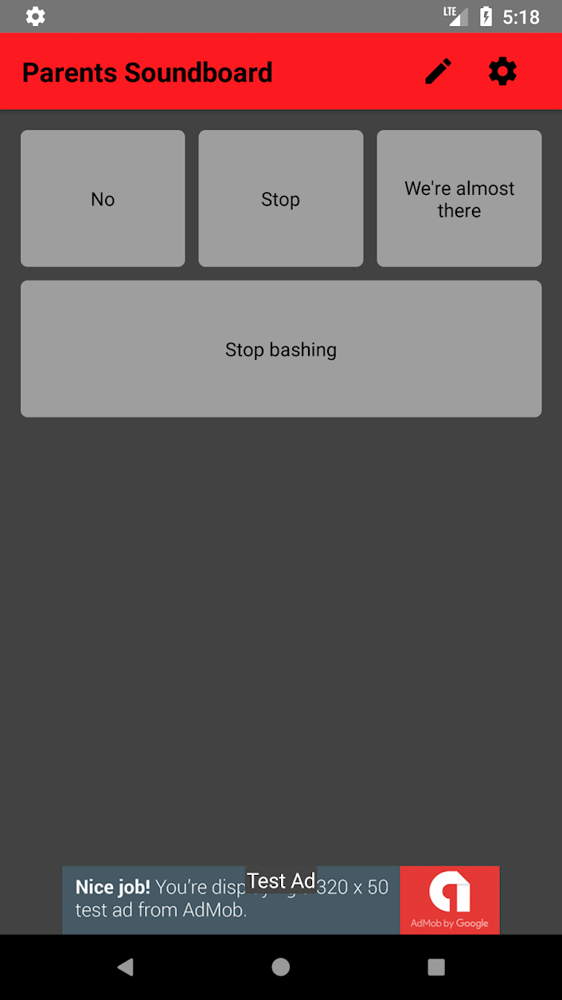

import AppStoreButton from '../../../components/AppStoreButton';
import config from '../../meta/config';

## iOS & Android Soundboard App

### Used Technology: [React Native](https://facebook.github.io/react-native/)

<h3>
  Source Code: {' '}
  <a
    href={config.projects[3].urls.github}
    target="_blank"
    rel="noopener noreferrer"
  >
    GitHub
  </a>
</h3>

You are annoyed speaking the same sentences over and over again to your children?

If yes, this soundboard will be your new best friend.

You can define custom sentences and let the smartphone speak them for you.

Your kids will hate it ;-)

  <AppStoreButton store="ios" url={config.projects[3].urls.appStore} />
  <AppStoreButton store="android" url={config.projects[3].urls.googlePlay} />

