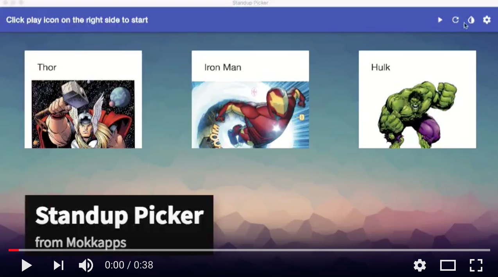

import config from '../../meta/config';

## A desktop application which can be used in Scrum teams to initiate the daily Scrum meeting

### Used Technologies: [Electron](https://electronjs.org/), [Angular](https://angular.io/)

<h3>
  Source Code: {' '}
  <a
    href={config.projects[1].urls.github}
    target="_blank"
    rel="noopener noreferrer"
  >
    GitHub
  </a>
</h3>

## Features

- Randomly select a team member. You can click on team member images to "ignore" them if they are not attending at the standup.
- Play standup music at a given time.
- Inform about ending standup time by a sound.

## Releases

All releases are available [here](https://github.com/Mokkapps/scrum-daily-standup-picker/releases).
