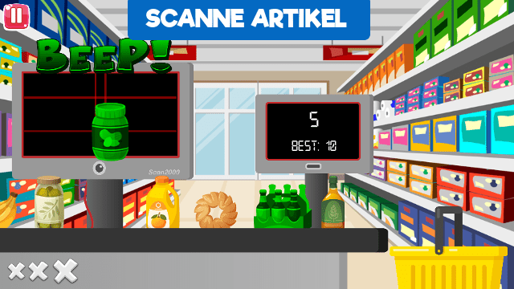

## iOS & Android smartphone game

### Used Technology: [Corona SDK](https://coronalabs.com/)

Supermarket Challenge delivers an addictive gameplay experience!

Challenge yourself and try to sustain at the supermarket cash register. Set a highscore and share it with your friends for a new challenge.

Alternatively you can try one of the 12 levels to get a better gameplay feeling.

You have to scan articles, enter the correct barcode for fruits and throw bombs away before they explode.

Surprise boxes can include useful extras or have a negative surprise for you.

Be careful! Unscanned articles in the shopping basket or articles which are thrown out of the screen, cost a life. You have three lifes per round.

