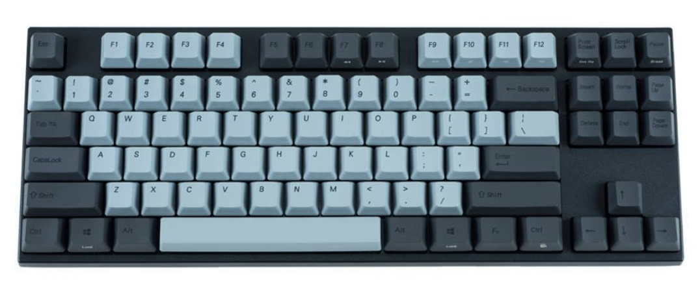

In the past, I stumbled upon many interesting tools by investigating the development setups of other developers. Therefore, I thought I could also present you my setup.

I change up things sometimes, so this page will serve as a living document and a place to point curious developers to when I get asked.

## IDE + Editor + Terminal

* [Visual Studio Code](https://code.visualstudio.com/) - Text editor.
* [IntelliJ Ultimate](https://www.jetbrains.com/idea/) - Main IDE.
* [iTerm2](https://iterm2.com/) as terminal including [Oh My Zsh](https://github.com/robbyrussell/oh-my-zsh) with [avit theme](https://github.com/robbyrussell/oh-my-zsh/wiki/themes#avit).
* [Fig](https://fig.io/) - Adds VSCode-style autocomplete to the terminal.
* [lazygit](https://github.com/jesseduffield/lazygit) - A simple terminal UI for git commands.
* [Cascadia Code](https://github.com/microsoft/cascadia-code) - My monospaced font.

## Desktop Apps

* [Firefox](https://www.mozilla.org/en-US/firefox/) - My main browser.
* [Postman](https://www.postman.com) - API development and testing.
* [Enpass](https://enpass.io/) - Password management.
* [Parallels](https://www.parallels.com/) - Windows virtualization.
* [FileZilla](https://filezilla-project.org) - FTP client.
* [Franz](https://meetfranz.com/) - A messaging app.
* [Spotify](https://www.spotify.com/) - My music streaming service.
* [Raycast](https://www.raycast.com/) - A blazingly fast and totally extendable launcher.
* [Dash](https://kapeli.com/dash) - An API documentation browser.
* [Toggl Track](https://toggl.com/track/) - My time tracking software.
* [Shottr](https://shottr.cc/) - Free screenshot tool for Mac with premium features.

## Hardware

### Notebook

I am using a MacBook Pro (16-inch, 2019) for development.

### Mechanical Keyboard

I use the Varmillo VA88M ISO-DE with clear MX switches:

### Mouse

I use the [Logitech MX Master 2 Wireless Mouse](https://www.logitech.com/en-ph/product/mx-master-2s-flow) as wireless mouse.

### Headphones

I am using the [Bose QuietComfort 35](https://www.bose.de/de_de/products/headphones/over_ear_headphones/quietcomfort-35-wireless-ii.html)
