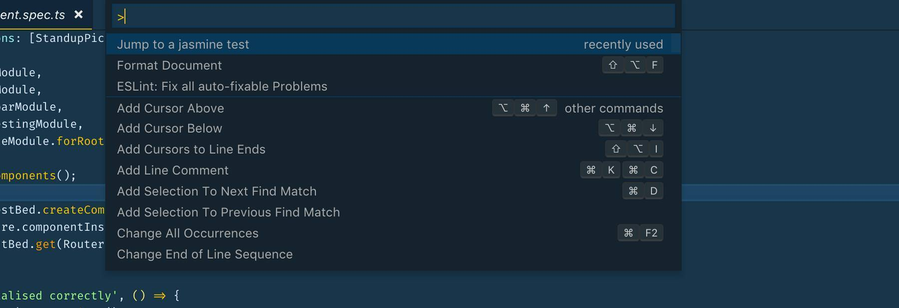
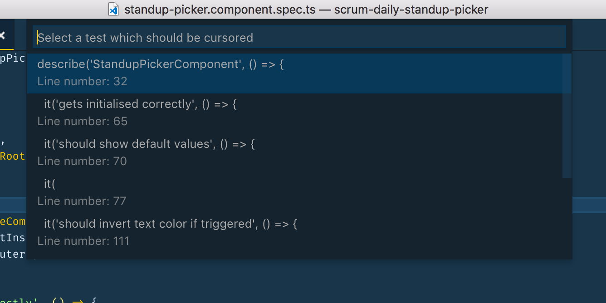

I am really a big fan of [Visual Code](https://code.visualstudio.com) and use it as my main IDE for software development. The available selection of extensions (see the [Extension Marketplace](https://marketplace.visualstudio.com/VSCode)) is amazing.

As I started using Visual Code I found every extension I was looking for. But last week I stumbled upon a feature where I could not find an extension for. So I decided to write my first VS code extension and let you know about my experiences during the development.

## The problem I wanted to solve

Currently, I am doing a lot of [Angular](https://angular.io/) development and therefore use [Jasmine](https://jasmine.github.io/) for unit tests. My first IDE which I used for web development was [WebStorm](https://www.jetbrains.com/webstorm/) which is based on [IntelliJ IDEA](https://www.jetbrains.com/idea/). In WebStorm, I often used and liked the plugin [ddescriber](https://github.com/andresdominguez/ddescriber) for Jasmine tests:

> Intellij plugin to quickly transform a JavaScript test block from describe() to ddescribe() and a test it() into iit()

This is a nice feature but I often used the plugin to list all available specs and then jump to certain `describe()` or `it()` block:

> Just type Ctrl + Shift + D (Command + Shift + D on a Mac) to launch a dialog that lets you choose which suites or unit tests you want to include or exclude.

This is useful in large unit tests which includes many `describe()` or `it()` blocks.

As I could not find a VS code extension which solves this problem, I decided to write my first own VS code extension.

## What the extension should handle

The first version of the extension should be able to:

- List all `describe()` or `it()` blocks as dropdown in an opened file in the editor
- If a block is selected, move the cursor to this block

### How to start?

Big applause to the VS code team for the amazing [documentation](https://code.visualstudio.com/docs/extensions/overview) on how to build your own VS code extension.

It is really easy to grab one of the example projects or create a new one using [Extension Generator](https://code.visualstudio.com/docs/extensions/yocode) and get started. Additionally, it is very easy to [run and debug your new extension](https://code.visualstudio.com/docs/extensions/developing-extensions#_running-and-debugging-your-extension).

Searching through the [Extension API documentation](https://code.visualstudio.com/docs/extensionAPI/overview) I found this method

> showQuickPick<T extends QuickPickItem>(items: T[] | Thenable<T[]>, options?: QuickPickOptions, token?: CancellationToken): Thenable<T | undefined>

which functionality is described as:

> Shows a selection list allowing multiple selections.

It looks this way in VS code if it is called:

So this sounded like a good opportunity to list all test blocks and provide a way to receive the selected value.

So basically I had to implement these steps:

- Grab all strings in the opened editor which include `it(` or `describe(` and the corresponding line number of this string
- Pass them to `showQuickPick` method
- Receive the selection and move the cursor the corresponding line number

The final output for a Jasmine test file looks like this:

### Publishing the extension

Another very nice experience was the very easy publishing process for VS code extensions. Basically I had just to follow the [official documentation](https://code.visualstudio.com/docs/extensions/publish-extension) which requires an [Visual Studio Team Services](https://docs.microsoft.com/vsts/accounts/create-account-msa-or-work-student) account.

The published extension is available in the [Visual Studio Code Marketplace](https://marketplace.visualstudio.com/items?itemName=Mokkapps.jasmine-test-selector#overview).

## Conclusion

In summary, it made a lot of fun to develop a VS code experience. The documentation and the provided examples are very good and I am very happy to have added a functionality to my favorite code editor which I have been missing.

## Links

- [Download the extension from the marketplace](https://marketplace.visualstudio.com/items?itemName=Mokkapps.jasmine-test-selector#overview)
- [Source code on GitHub](https://github.com/Mokkapps/jasmine-test-selector)
