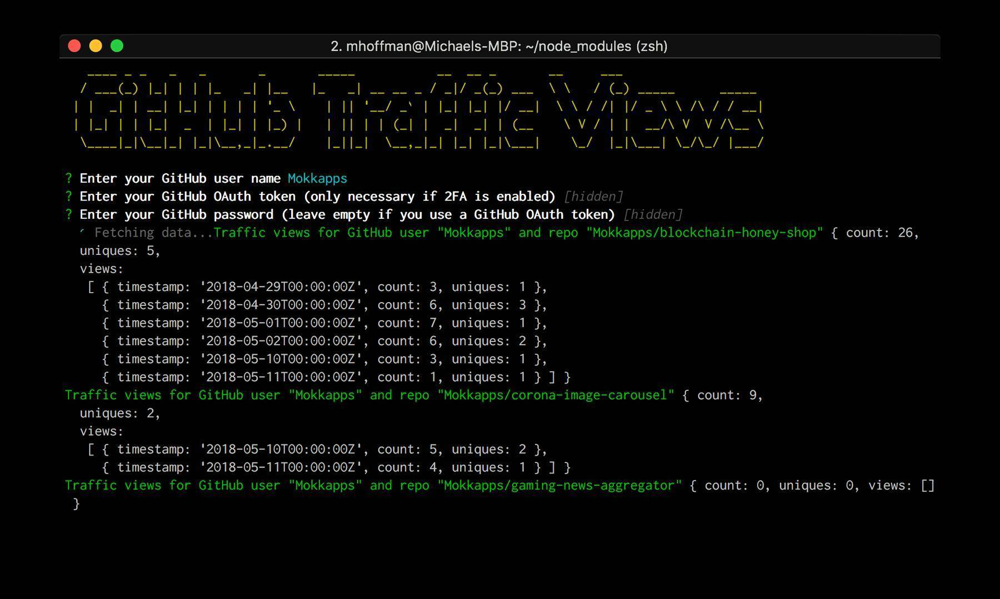

Since I published my first projects on [GitHub](https://github.com/Mokkapps) I really enjoyed viewing the traffic on my repositories. It is really interesting to see how many people visit or clone my repositories.

Unfortunately it costs a lot of time to click through all available repositories and I was looking for a more elegant way.

I stumbled upon the npm package [github-traffic](https://www.npmjs.com/package/github-traffic) which already provides an API to fetch the GitHub traffic. So I decided to write a command line interface (CLI) npm package which uses this API.

As a result I can check the traffic on all of my repositories with one CLI command:

## Develop & publish npm package

The process is very easy and documented in the [npm docs](https://docs.npmjs.com/getting-started/publishing-npm-packages).

## Used npm packages

- [chalk](https://www.npmjs.com/package/chalk): Terminal string styling done right
- [clui](https://www.npmjs.com/package/clui): Node.js toolkit for quickly building nice looking command line interfaces
- [commander](https://www.npmjs.com/package/commander): The complete solution for node.js command-line interfaces
- [figlet](https://www.npmjs.com/package/figlet): Terminal ASCII art from text
- [inquirer](https://www.npmjs.com/package/inquirer): A collection of common interactive command line user interfaces.

## Links

- [github-traffic-cli](https://www.npmjs.com/package/github-traffic-cli)
- [Source Code](https://github.com/Mokkapps/github-traffic-cli)
