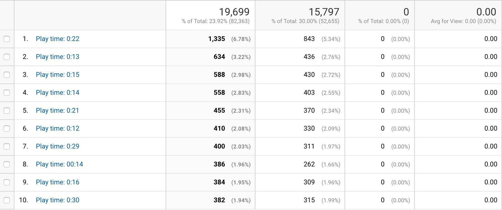

In 2017, I have released my first smartphone game "Supermarket Challenge" for [iOS]((https://itunes.apple.com/de/app/supermarket-challenge/id1207665675)) and [Android](https://play.google.com/store/apps/details?id=de.mokkapps.supermarketchallenge). I learned a lot of stuff during the game development and wanted to share my experiences with you.

## Why did I develop a game

I play and love video games since I am a little boy. Additionally, I started my software development career some years ago. As a result, I decided to combine both of my greatest passions to develop my own video game. Fortunately, I also had a good idea for my first game.

## The game idea

My plan was to develop a smartphone game like [Paper's Please](http://www.papersplea.se/) but in a supermarket scenario.

Check the following trailer to see Paper's Please in action:

<iframe width="700" height="400" src="https://www.youtube.com/embed/_QP5X6fcukM" frameborder="0" allow="autoplay; encrypted-media" allowfullscreen></iframe>

In my game, you would play a poor supermarket cashier which needs to spend each day after work the money for food, medicine, rent and so on.

## Market analysis

The first step was to analyze the market for similar existing smartphone games. My findings discovered an endless amount of supermarket-themed games. The main goal of these (mostly child-oriented) games was to take the money of the customers and return them the correct amount of money. I found two games which included the game mechanic I had in my mind:

### Crazy Market

<iframe width="700" height="315" src="https://www.youtube.com/embed/f-ix_6lbkPM" frameborder="0" allow="autoplay; encrypted-media" allowfullscreen></iframe>

Basically, this game nearly matched my expectations for the basic game mechanic at the supermarket checkout. But I disliked the Japan-styled theme, the aggressive In-App purchases and the level-based approach.

### Checkout Challenge

<iframe width="700" height="315" src="https://www.youtube.com/embed/SozFe1ES-S0" frameborder="0" allow="autoplay; encrypted-media" allowfullscreen></iframe>

Checkout Challenge isn't available anymore but provided a funny Arcade-focused supermarket checkout game.

### Another inspiration: Fruit Ninja

<iframe width="700" height="315" src="https://www.youtube.com/embed/a8z8XG6uThU" frameborder="0" allow="autoplay; encrypted-media" allowfullscreen></iframe>

I played Fruit Ninja a lot and had a nice high-score challenge with my friends. For my game, I wanted to achieve the same high-score challenge feeling and implement the three player lifes as they were available in Fruit Ninja.

### Market Analysis Conclusion

Summarizing, the market analysis resulted in these decisions:

* The game name should be "Supermarket Challenge" (inspired by "Checkout Challenge")
* It should be a 2D game
* Combine the best parts of "Fruit Ninja", "Crazy Market" and "Checkout Challenge"

## Prototype Development

Christmas 2016 I started to develop a first prototype of the game based on the [Unity](https://unity3d.com/) engine. I invested about 80 hours into the prototype including the training period for Unity.

Gameplay video of the first prototype:

<iframe width="700" height="315" src="https://www.youtube.com/embed/6NDQV2u1IT0" frameborder="0" allow="accelerometer; autoplay; encrypted-media; gyroscope; picture-in-picture" allowfullscreen></iframe>

I deployed the game to my smartphone and on a web platform to let friends and family try the game. The response was very positive so I decided to further develop the prototype to a publishable game.

## Development Start

In January 2017 I started the game development in my free time as I was in a full-time job during the whole development.

As a first step, I set up some expectations I had for the final result:

* The game should be a financial success.
* It should attract a big and recurring amount of gamers.
* The game mechanic should be scalable. First version should only include the Arcade mode with the basic game mechanic.
* It should not look like a low-budget game.
* It should include a minimal amount of ads.
* First versions should be free without In-App purchases.
* First release in App stores should be within one year.
* Team size: 1 developer (myself) and maybe 1 designer (if necessary)

As I tried to continue developing my Unity prototype I had a rude awakening: My spaghetti code was unmaintainable and not expandable.

In my full time job as software developer I was used to develop text-based without a full-blown IDE as it is provided by Unity. Implementing a known software architecture pattern in Unity was very difficult for me and the IDE itself is very complex.

So I decided to start researching for a new game engine which better suited my needs.

## New Game Engine

As I had concrete expectations for the new engine my research led to [Corona](https://coronalabs.com/):

* Focused on 2D games
* Cross-Platform (iOS, Android, Desktop applications, Smart TVs)
* Free (with few restrictions)
* Text-based with Lua as scripting language
* Includes a simulator with Live-Testing feature
* Good starting tutorials
* Integrated advertising possibilities

## My Tools

During the development I used the following tools:

* [Atom](https://atom.io/) (later [Visual Code](https://code.visualstudio.com/)) as text editors
* [Trello](https://trello.com/) as my project management tool
* [Gimp](https://www.gimp.org/) and [Inkscape](https://inkscape.org/) for image editing
* [Bitbucket](https://bitbucket.org/) for hosting my private repository

## Architecture

I structured my code based on scenes and components:

```lua
scenes
  * game
  	- lib
	  scanner.lua
	  supermarket-basket.lua
	  item.lua
	  ...
  * menu
  	- images
  	- sounds
  	- menu.lua
  * game-over
  * ...
```

A `scene` is a visible screen which is available in the game. The `lib` folder contains all components which are reused in different scenes.

## Development Progress

The following videos demonstrate the progress of the game from the first prototypes to the final version.

### Mid January 2017

Implemented basic game mechanic:

<iframe width="700" height="315" src="https://www.youtube.com/embed/XI19bXruh3M" frameborder="0" allow="accelerometer; autoplay; encrypted-media; gyroscope; picture-in-picture" allowfullscreen></iframe>

### Start February 2017

UX adjustments, tutorials, menus and more:

<iframe width="700" height="315" src="https://www.youtube.com/embed/UEgTW_pMIBY" frameborder="0" allow="accelerometer; autoplay; encrypted-media; gyroscope; picture-in-picture" allowfullscreen></iframe>

### Mid March 2017

I released the first beta version for about 10 testers (friends & family). Negative feedback was given due to the high difficulty and the inconsistent visual design. As a result, I asked a friend of mine to support and assist me in visual aspects of the game which resulted in a better design:

<iframe width="700" height="315" src="https://www.youtube.com/embed/Dvcqtvyaq2o" frameborder="0" allow="accelerometer; autoplay; encrypted-media; gyroscope; picture-in-picture" allowfullscreen></iframe>

### Version 1.0

Start of May 2017 I released the first version of "Supermarket Challenge" on iOS and Android. It included only the Arcade mode:

<iframe width="700" height="315" src="https://www.youtube.com/embed/hTc560JcyKg" frameborder="0" allow="accelerometer; autoplay; encrypted-media; gyroscope; picture-in-picture" allowfullscreen></iframe>

### Version 2.0

I further developed the game and implemented a new level mode and an easier Arcade mode. Version 2.0 was released in December 2017.


## Conclusion

### Interesting numbers

* Invested time: ~500hours / ~21 days
* Expenses: ~240€ (mostly for graphics, libraries and license)
* Ad revenues: ~1€

### Google Analytics

Some Google Analytics numbers which might be interesting:




In my opinion, especially the custom events like play time are very interesting. Based on this numbers I can assume that the game is still to hard as most of the players see the game over screen in less than one minute play time.

### My Insights

* Keep it simple: Start with small and realistic goals
* Help yourself, learn everything: Game design, writing code, image editing, ...
* Use free assets: Saves time and money, especially in the beginning
* Develop prototypes as early as possible
* Be active in social networks to build an active community. Trailer and teaser are a good way to keep people up-to-date.
* Be comfortable with your game engine and be not afraid to change it.

### Possible reasons for the missing success of the game

* App icon is not ideal in my opinion
* Bad ranking in the app stores
* No frequent app updates
* High-score challenge seems not to be attractive enough
* Too few advertising campaigns for the game

### Final words

I really had a lot of fun developing the game and I learned a ton of stuff. Unfortunately, the game was not a financial success but at least I released my first video game 😜

## Links

* [Download "Supermarket Challenge" at iTunes](https://itunes.apple.com/de/app/supermarket-challenge/id1207665675)
* [Download "Supermarket Challenge" at Google Play](https://play.google.com/store/apps/details?id=de.mokkapps.supermarketchallenge)
