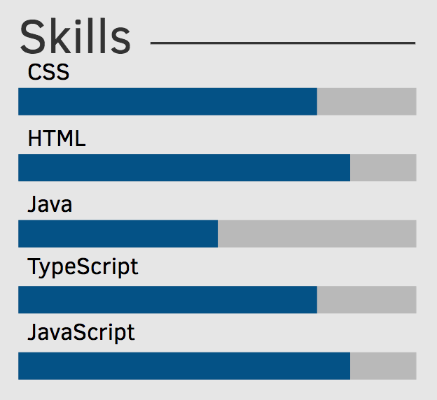
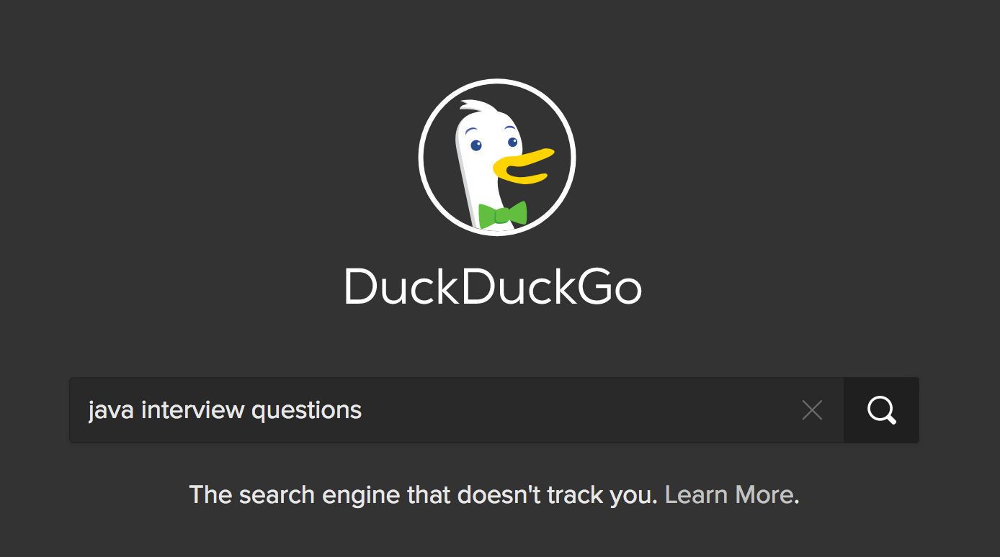

In my previous company I got the opportunity to be one of 20 so called "candidate interviewers". This meant that I participated in technical interviews; an essential part of this company's application procedure. I participated in about 30 interviews and learned a lot during this time and I want to share my experiences with you. In my opinion, there are some rules to adhere to, as to succeed in a technical interview.

## Table of Contents  <!-- omit in toc -->
- [Have a "good" CV and resume](#have-a-%22good%22-cv-and-resume)
- [Prepare yourself](#prepare-yourself)
- [Apply for everything that interests you and do not fear failures](#apply-for-everything-that-interests-you-and-do-not-fear-failures)
- [Be proud of your code](#be-proud-of-your-code)
- [Talk about yourself and not about others](#talk-about-yourself-and-not-about-others)
- [Learn to hand write code in front of people](#learn-to-hand-write-code-in-front-of-people)
- [Be a specialist in a certain topic](#be-a-specialist-in-a-certain-topic)
- [Be able to draw project architectures](#be-able-to-draw-project-architectures)
- [Be passionate](#be-passionate)
- [Conclusion](#conclusion)


## Have a "good" CV and resume

These are the first documents your interviewer will review. I mainly checked the documents looking for these marks:

#### Is it well structured?  <!-- omit in toc -->

My recommendation: Use a [LaTeX template](https://www.latextemplates.com/cat/curricula-vitae) and [Overleaf](https://www.overleaf.com/) for writing and publishing LaTeX files.

#### Are there any spelling errors?  <!-- omit in toc -->

Run a spell checker on your documents before you send it to HR. I often asked myself why people do not use technical assistance like spell checkers to avoid these kind of unnecessary hurdles during the application procedure.

#### What are his/her main skills?  <!-- omit in toc -->

Please use a rating for your technical skills. Can you guess what such a list should represent:

```
Programming languages: Java, Python, JavaScript, C++
```

Does this mean that you know Java the most or that you have the same knowledge for all languages?

I personally prefer a rated list like:

```
Programming languages

    Java:       Expert
    Python:     Intermediate
    JavaScript: Novice
```

or alternatively a graphical representation like



#### Have buzzwords been used to make the CV look better, without actually having the underlying knowledge?  <!-- omit in toc -->

Be prepared for some questions about tools/frameworks/libraries you mention in your CV or resume. Interviewer could pick some of them and ask little questions to see if you really have experience using it.

## Prepare yourself

This sounds stupid but is essential. I would say that more than 30 percent of my interviewees were poorly prepared.

For example, if you apply for a Java developer job you should know the fundamentals of the Java programming language.

In general, I recommend to ask the internet search engine of your choice and you will find a ton of possible interview questions:



Summarized, learn your favorite programming language and deep dive into all possible aspects of it.

## Apply for everything that interests you and do not fear failures

Believe me: As an interviewer you can sense if someone has experiences in technical interviews or if it is his/her first interview.

My recommendation: Go to as many job interviews as you can. Each time you will gain experience and get more confident. Even getting rejected from a job application will let you gain valuable experience in the process of job interviews.

## Be proud of your code

If you have some project or code snippet you are proud of, then add it to your application. As an interviewer, it can really be helpful to see some code from the person.

In my opinion, it is positive to see if a person participates in open source projects, writes blog posts, publishes YouTube videos or has an active Twitter channel.

A good example is for example [WesBos](http://wesbos.com). He has a very interesting Twitter channel, is an active YouTuber, has his own product (his courses website), an active GitHub profile, produces a podcast and talks at conferences. Of course, this is special but as you can probably imagine this can be impressive for interviewers.

So get yourself out there and make yourself interesting for other people.

## Talk about yourself and not about others

Talk about the decisions you have made in projects as this is the most interesting part for an interviewer. This way the interviewer can see if someone is able to make a decision and compare and advocate it against others.

It has a negative connotation if the interviewee only talks about decisions of other peoples.

## Learn to hand write code in front of people

This is a really essential skill that you should train. Take some coding challenges and practice them on a whiteboard or flip chart. You should feel comfortable in it as this can happen in any technical interview.

Most of the time you will have to solve any kind of algorithmic problem. I would suggest to follow these steps in such a situation:

- Take your time and think about a solution (do not start to immediately write code)
- Find a brute force solution and talk about it's [Big O notation](https://en.wikipedia.org/wiki/Big_O_notation)
- Try to find a more efficient solution and talk about the improved Big O notation
- Write down the steps of your solution in clear text. This is helpful for the interviewer and the interviewee to see if the proposed solution is correct
- Write down your code
- Test your written code with different parameters and check if it works
- Talk about possible code improvements and unit tests

## Be a specialist in a certain topic

You should be able to describe your profession in 1-2 short sentences. This is helpful for interviewers to identify your technical focus and you will probably be mainly asked about stuff you are really good at.

Bad example: _Software Developer_

Good example (again from [Wesbos](http://wesbos.com)): _Designer, Developer & Entrepreneur making the web an awesome place_

Reading the second sentence gives me a very clear picture of this developer in only one sentence.

Additionally, it is easier for yourself to find the perfect job offering if you are a specialist in a certain topic. If you are, for example, a JavaScript expert you can explicitly search for corresponding offerings. Otherwise, as a generalist you will likely have a broad knowledge of different programming languages and technologies, but not in-depth in a certain topic.

## Be able to draw project architectures

You should be able to draw a high-level project architecture of a project you worked with in an understandable but technical correct way.

A good example for a complex project:


## Be passionate

Let the interviewer know that software development is your passion. Talk about your favorite features of your preferred programming language, tool or framework. Let the interviewers know how you keep yourself up to date and why you love to write code.

## Conclusion

Of course, I cannot guarantee that you will success in every technical job interview if you follow my tips. But I am pretty sure that you are more confident, less nervous and better prepared.