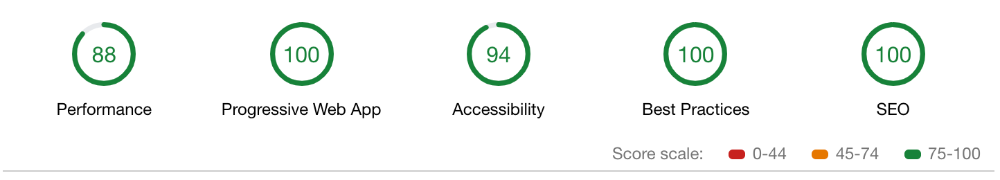

I created my first personal website in 2017 when I launched [my first smartphone game](https://www.mokkapps.de/blog/lessons-learned-my-first-smartphone-game/). I use Google Analytics in this game and it is therefore [necessary](https://privacypolicies.com/blog/privacy-policy-google-analytics/) to provide a link to a privacy policy website from inside the game. I used [WordPress](https://wordpress.org/) and a free theme as I had nearly no frontend knowledge at that time:


[See the first version in the web archive](https://web.archive.org/web/20170701233843/http://mokkapps.de:80/)

End of 2017 I then released a [new version](https://dev.to/mokkapps/how-i-built-my-website-with-hugo-and-netlify-3n49) based on the open-source static site generator [Hugo](https://gohugo.io/) using the [HTML5 Up Prologue theme](https://html5up.net/prologue). The idea was to have a more unique design and better control over the layout:


[See the second version in the web archive](https://web.archive.org/web/20180322183119/http://mokkapps.de/)

As I specialized myself more and more as frontend developer I wanted to create my own portfolio website with its own styling. The inspiration came from Ali Spittel's blog post ["Building a Kickass Portfolio"](https://dev.to/aspittel/building-a-kickass-portfolio-28ph).

Some of the main reasons which encouraged me to do the refactoring:

- Show my creativity and make a website that is a true expression of myself
- Design as much as possible myself without using pre-designed templates
- Make the site as fast and accessible as possible
- Provide a foundation to make the website easily extendable and adjustable
- Make the website fully responsive

The result can be seen at [www.mokkapps.de](https://www.mokkapps.de):


The basic implementation took about 40 hours of work. I did not draft my sites before moving to code but just started coding and experimented with different designs.

## Website Generator

I decided to use [Gatsby.js](https://www.gatsbyjs.org/) due to several reasons:

- I love using [React](https://reactjs.org/) and it has a rich ecosystem of libraries, components, etc.
- It uses [GraphQL](https://graphql.org/) which I wanted to gain some more practical experience with
- Very good [documentation](https://www.gatsbyjs.org/docs/), [plugins](https://www.gatsbyjs.org/plugins/) & [starters](https://www.gatsbyjs.org/starters/)
- Can be easily combined with several APIs, CMS and more

The following graphic from the official website showcases how Gatsby works:


As a starter, I used the fantastic [Gatsby Starter Kit](https://greglobinski.github.io/gatsby-starter-kit-docs/) which provided an ideal bare-bone application for my website.

## Hosting

I use [Netlify](https://www.netlify.com/) to host my website which is an all-in-one platform for automating modern web projects. 

It can be used for free if you have a public GitHub project. I decided to [provide my website code open-source on GitHub](https://github.com/mokkapps/website) as I wanted to demonstrate my skills to everybody who is interested in it.

## Styled Components

I really like the idea of [Styled Components](https://www.styled-components.com/) and how it nicely integrates into a React component.

Styled Components utilizes tagged template literals to style your components. It removes the mapping between components and styles. This means that when you're defining your styles, you're actually creating a normal React component, that has your styles attached to it.

Take a look at the following component of my website:

```javascript
import React from 'react';
import PropTypes from 'prop-types';
import styled from 'styled-components';

const StyledArticle = styled.article`
  max-width: 600px;
  margin: 0 auto 30px;

  background: white;
  border-radius: 10px;
  padding: 2rem;
  min-width: ${props => (props.narrow ? '50%' : '100%')};
`;

const Article = ({ children }) => <StyledArticle>{children}</StyledArticle>;

Article.propTypes = {
  children: PropTypes.node.isRequired,
};

export default Article;
```

In this example I use the `<article>` HTML tag but use it as `StyledArticle` which attaches my CSS styles. It is even possible to apply styles based on props which are passed to the component as you can see in this line: 

```javascript 
min-width: ${props => (props.narrow ? '50%' : '100%')};
```

## Responsive Images

Delivering images in the optimal size for the correct devices is very important for a good website. It ensures that your site loads quickly and does not slow down when you are using many pictures on the website. 

[The "gatsby-image" plugin](https://www.gatsbyjs.org/packages/gatsby-image/#gatsby-image) is an amazing solution for this requirement. It automatically resizes your images so that your site won't load huge images on a mobile device. Additionally, it lazy loads the images and provides a nice blur effect while the images are loaded:


## Typography

I wanted to have a typography design and used [Typography.js](https://kyleamathews.github.io/typography.js/) which is also recommended by the Gatsby documentation. 

My configuration file looks this way:

```javascript
import Typography from 'typography';
import CodePlugin from 'typography-plugin-code';
import theme from 'typography-theme-alton';

theme.overrideThemeStyles = ({ rhythm }, options) => ({
  a: {
    color: '#FC1A20',
    textDecoration: 'none',
  },

  'a:hover': {
    color: '#FC1A20',
    textDecoration: 'underline',
  },

  html: {
    boxSizing: 'border-box',
    background: '#424242',
  },
});

theme.plugins = [new CodePlugin()];

const typography = new Typography(theme);

export default typography;
```

In the next image you can see the difference between my landing page with (upper image) and without (lower image) Typography.js:


## Blog

I really enjoy writing articles in [Markdown](https://en.wikipedia.org/wiki/Markdown) and wanted to use Markdown files as source for my blog.

The Gatsby Starter Kit already includes some nice features for this requirement:

* Posts pages are automatically created from markdown files
* Categories are automatically created for blog posts
* Web pages are automatically created from markdown pages files

The relevant folder structure in the code looks this way:

```
root
  └── src
      ├── content
      │   ├── posts
      │   │   ├── 2018-05-11___my-first-vs-code-extension
      │   │   |   ├── jasmine-test-selector.png
      │   │   │   └── index.md
      │   │   ├── 2018-05-12___my-first-npm-package
      │   │   |   ├── github-traffic-cli.png
      │   │   │   └── index.md
      |   |
      |   |   ...
```

Using my Gatsby configuration it automatically creates a blog post page for each of the folders, e.g

`https://www.mokkapps.de/blog/my-first-vs-code-extension/`

## Continuous Integration

I use [Travis CI](https://travis-ci.org/) to deploy & test my website each time I push to my git master branch. 

Here is an excerpt of my `.travis.yml` file:

```yml
script:
  - npm run lint
  - npm run test:e2e:ci
  - npm run build

deploy:
  provider: script
  script: "curl -X POST -d '' https://api.netlify.com/build_hooks/5ba3c8da1f12b70cbbcaa1a3"
  skip_cleanup: true
  on:
    branch: master
```

So on each push to master, it runs the TS linter, E2E test and builds the application. If all scripts succeed, a deployment on Netlify is triggered via webhook.

I therefore disabled auto-publishing in Netlify which normally triggers a deployment each time a git push was detected on the configured branch.

In my case, I just want to trigger a deployment if the tests and the build were successful.


Netlify also automatically builds a preview with a unique URL. Like a staging environment for every PR or branch, previews are perfect for testing and collaboration. So I can even preview my new build before I manually deploy it.

## E2E Tests

For my E2E tests, I use [Cypress.io](https://www.cypress.io/) as I heard a lot of good stuff about it.

I created a set of tests which test the most important functionality of my application. 

This is, for example, the E2E test of my home page:

```javascript
import config from '../../src/content/meta/config';

describe('Home Page Test', () => {
  beforeEach(() => {
    cy.visit('/');
  });

  it('includes a heading and a quote', () => {
    cy.get('[data-cy=hero-heading]');
    cy.get('[data-cy=hero-quote]');
  });

  it('shows characteristics section', () => {
    cy.get('[data-cy=hero-characteristics-section]')
      .children()
      .should('have.length', 4);

    cy.get('[data-cy=hero-characteristics-more-button]').click();
    cy.url().should('include', '/about');
  });

  it('shows featured projects', () => {
    const countFeaturedProjects = config.projects.filter(p => p.featured);
    cy.get('[data-cy=hero-projects-section]')
      .children()
      .should('have.length', countFeaturedProjects.length);

    cy.get('[data-cy=hero-projects-more-button]').click();
    cy.url().should('include', '/projects');
  });

  it('shows latest blog post', () => {
    cy.get('[data-cy=blog-post-0]');
    cy.get('[data-cy=hero-blog-more-button]').click();
    cy.url().should('include', '/blog');
  });
});
```

This video shows a Cypress test run on my website:

[](https://youtu.be/HgbFzH5-YrQ "Cypress.io E2E test")

## Lighthouse

For me, it was important to have a good [Google Lighthouse score](https://developers.google.com/web/tools/lighthouse/) and with Gatsby.js you achieve great results nearly out of the box:



## Sentry

To be able to track errors on my website I use [Sentry](https://www.sentry.io/) which is a open-source error tracking software. It can be easily integrated in Gatsby using [gatsby-plugin-sentry](https://www.gatsbyjs.org/packages/gatsby-plugin-sentry/?=sentry#gatsby-plugin-sentry).


## Conclusion

I am really proud of my website and I enjoyed engineering it. This website represents myself in the world wide web and I am therefore very interested in its design, quality, accessibility and page views.

I use it to market myself in different aspects:

* Show specific skill to employers
* Tell people to read my blog
* Promote my private projects

In my opinion, each web developer should have its own custom website. A portfolio website is a true expression of yourself. We are programmers and it is a creative process, so use and demonstrate your creativity.

## Links

* [www.mokkapps.de](https://www.mokkapps.de)
* [Website code on GitHub](https://github.com/mokkapps/website)
* [Presentation Slides](https://mokkapps-website-lightning-talk.netlify.com/)