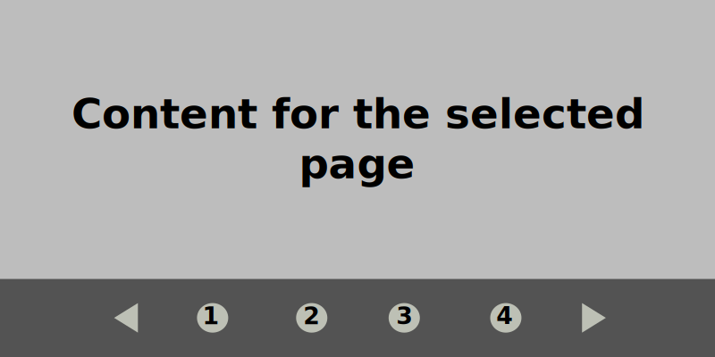
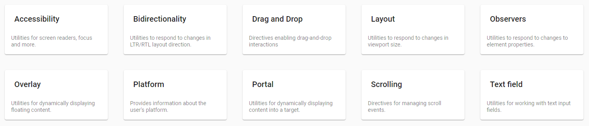

**Update 12.02.2018:** _Meanwhile I have created [a PR](https://github.com/angular/material2/pull/14710) to the Angular Material repository and added there an [official guide](https://material.angular.io/guide/creating-a-custom-stepper-using-the-cdk-stepper)_

Recently I had to refactor a quite complex legacy Angular component and I want to share my experiences with you.

## The Legacy Component

The component should look this way per design:



Basically, you can freely navigate through the content by clicking either the navigation arrows or clicking on a certain step in the navigation area on the bottom.

The HTML template of the legacy component looked similar to this simple example:

```html
<div *ngIf="isContent1 && !isContent2 && !isFinished && !noError">
  Content 1
</div>

<div *ngIf="!isContent1 && isContent2 && !isFinished && !noError">
  Content 2
</div>
```

So basically for each content page, there was a `div` container with multiple `*ngIf` statements. As only one content container could be visible per time their visibility was controlled by the `*ngIf` directives.

Maybe at a first glance, this sounds not that bad for you, but this approach had some major problems:

- It contained large and confusing `ngIf` statements
- Accessibility was not considered
- Keyboard interactions were not supported by default
- Managing which state is active had to be implemented manually
- It is a custom solution which needs to be tested
- It provided a non-scalable component architecture

Additionally, we got a new requirement: It should be possible to switch between the content pages in a linear way. That means, going from the first content page to the second content page should only be possible if the first page is completed and going backward should not be allowed.

## Refactoring

To be able to fulfill the new requirement I started research for existing components which provide a similar logic and found, for example, [Angular Archwizard](https://github.com/madoar/angular-archwizard).

This component is really nice and also worked fine with the latest Angular version but I could not easily modify the styling for our design requirements.

So I continued my research and stumbled upon the [Angular Material CDK Stepper](https://material.angular.io/cdk/stepper/overview) which was exactly what I was looking for.

## Angular Material CDK

On the [official website](https://material.angular.io/cdk/categories) they describe the Component Dev Kit (CDK) as:

> The Component Dev Kit (CDK) is a set of tools that implement common interaction patterns whilst being unopinionated about their presentation. It represents an abstraction of the core functionalities found in the Angular Material library, without any styling specific to Material Design. Think of the CDK as a blank state of well-tested functionality upon which you can develop your own bespoke components.

Basically, the CDK is divided into two parts: "Common Behaviors" and "Components"

### Common Behaviors

> Tools for implementing common application features

This is a list of common behaviors provided by the CDK:



### Components

> Unstyled components with useful functionality

The following image shows the list of components provided by the CDK:


### CDK Stepper

So the [CdkStepper](https://material.angular.io/cdk/stepper/overview) was exactly what I was looking for: A well-tested stepper functionality which I can design however I want to. Basically, it consists of a `CdkStep` used to manage the state of each step in the stepper and the `CdkStepper` which contains the steps (`CdkStep`) and primarily manages which step is active.

### Getting Started

It is very simple to add the CDK to your Angular project:

```bash
npm install --save @angular/cdk
```

Or alternatively for `Yarn`:

```bash
yarn add @angular/cdk
```

You also need to add the `CdkStepperModule` to your Angular module:

```typescript
import { NgModule } from '@angular/core';
import { BrowserModule } from '@angular/platform-browser';
import { CdkStepperModule } from '@angular/cdk/stepper'; // this is the relevant important

import { AppComponent } from './app.component';

@NgModule({
  imports: [BrowserModule, CdkStepperModule], // add the module to your imports
  declarations: [AppComponent],
  bootstrap: [AppComponent],
})
export class AppModule {}
```

### Demo Stepper Project

As the [official documentation](https://material.angular.io/cdk/stepper/overview) does not provide any code examples I created a [simple demo project on Stackblitz](https://stackblitz.com/edit/angular-basic-cdk-stepper?embed=1&file=src/app/custom-stepper/custom-stepper.component.ts) which I want to describe in the following sections.

#### Create CustomStepperComponent

The first step was to create a new Angular component for the `CdkStepper` to be able to modify it. Therefore, the component needs to extend from `CdkStepper`. The following example is a minimal implementation of a custom CDK stepper component:

```typescript
import { Directionality } from '@angular/cdk/bidi';
import { ChangeDetectorRef, Component } from '@angular/core';
import { CdkStepper } from '@angular/cdk/stepper';

@Component({
  selector: 'app-custom-stepper',
  templateUrl: './custom-stepper.component.html',
  styleUrls: ['./custom-stepper.component.css'],
  providers: [{ provide: CdkStepper, useExisting: CustomStepperComponent }],
})
export class CustomStepperComponent extends CdkStepper {
  constructor(dir: Directionality, changeDetectorRef: ChangeDetectorRef) {
    super(dir, changeDetectorRef);
  }
  
  onClick(index: number): void {
    this.selectedIndex = index;
  }
}
```

The HTML template for this basic component:

```html
<ng-container [ngTemplateOutlet]="selected.content"></ng-container>

<!-- This is the navigation bar of the stepper -->
<footer>
  <button cdkStepperPrevious>Previous</button>
  <button *ngFor="let step of _steps; let i = index;" (click)="onClick(i)">Step {{i + 1}}</button>
  <button cdkStepperNext>Next</button>
</footer>
```

And now we can already use our new `CustomStepperComponent` in another component:

```html
<app-custom-stepper>
  <cdk-step>
    <input type="text" name="a" value="a" />
  </cdk-step>
  <cdk-step>
    <input type="text" name="b" value="b" />
  </cdk-step>
</app-custom-stepper>
```

Each step needs to be wrapped inside a `<cdk-step>` tag. For multiple steps you can of course use `*ngFor` and use your custom step component inside:

```html
<app-custom-stepper>
  <cdk-step *ngFor="let step of mySteps; let stepIndex = index">
    <my-step-component [step]="step"></my-step-component>
  </cdk-step>
</app-custom-stepper>
```

### Linear Mode

The above example allowed the user to freely navigate between all steps. The `CdkStepper` additionally provides the [linear mode](https://material.angular.io/cdk/stepper/overview#linear-stepper) which requires the user to complete previous steps before proceeding.

You can either use a single form for the entire stepper or a form for each individual step to validate if a step is completed. Alternatively, you can pass the `completed` property to each of the steps and set the property value depending on your own logic without using a form.

A simple example without using forms could look this way:

```html
<app-custom-stepper linear>
  <cdk-step editable="false" [completed]="completed">
    <input type="text" name="a" value="Cannot proceed to next step" />
    <button (click)="completeStep()">Complete step</button>
  </cdk-step>
  <cdk-step editable="false">
    <input type="text" name="b" value="b" />
  </cdk-step>
</app-custom-stepper>
```

```typescript
export class MyComponent {
  completed = false;

  completeStep(): void {
    this.completed = true;
  }
}
```

The steps are marked as `editable="false"` which means that the user cannot return to this step once it has been marked as completed. It is not possible to navigate to the second step until the first one has been completed by clicking the `Complete Step` button.

If you are then on step 2 it is not possible to navigate back to step 1.

## Conclusion

I am very happy with the `CdkStepper` and it provided all the functionality I needed to refactor my legacy component. It was not necessary to write tests for this logic and it automatically provides keyboard interaction support and cares about accessibility.

My advice is: If you ever need to implement a common behavior or component logic for your Angular application please first take a look at the Angular Material CDK or similar libraries. Do not implement them yourself as you will never get the same level of quality which you get from a maintained, widely-used open-source project like Angular Material.
