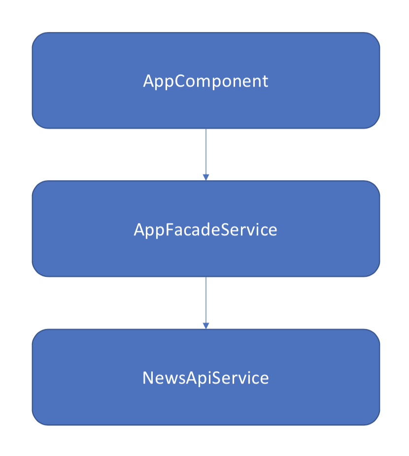
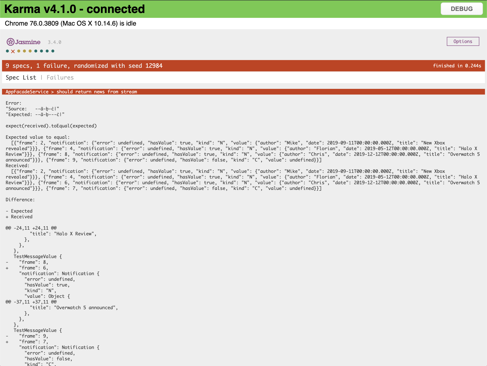

End of 2018 I wrote [an article](https://www.mokkapps.de/blog/how-i-write-marble-tests-for-rxjs-observables-in-angular/) about how I write marble tests for RxJS observables in Angular. The content in there is still valid but I found recently a new library which I like and which makes debugging marble tests easier.

If you do not know RxJS marble tests yet then I would recommend you to first read [my article](https://www.mokkapps.de/blog/how-i-write-marble-tests-for-rxjs-observables-in-angular/) which covers the basics.

As quick catchup, the following example shows a marble diagram which can be used in tests to represent an observable:

```ts
const obs = `-a-^-b--|`;
//              012345`, emits 'b' on frame 2, completes on 5 - hot observable ^ represents when the subscription started
```

In this article, I want to talk about [rx-sandbox](https://github.com/kwonoj/rx-sandbox) which is a marble diagram DSL based test suite for RxJS 6. It also has support for RxJS 5 in pre-1.x versions if you need that in your application. 

# Why rx-sandbox?

I found this library as I was looking for a better way to debug marble tests as it was not possible to see such a test output using the [jasmine-marbles](https://github.com/synapse-wireless-labs/jasmine-marbles) library:

```diff
Error: 
+ Source: "--x-x--|"
- Expected: "---x-x--|"
```

In my opinion, this is a really easy and understandable representation of what went wrong in the test. 

The library also has some other nice features:

* No dependencies to a specific test framework
* Near-zero configuration, works out of box
* Supports extended marble diagram DSL
* Provides feature parity to TestScheduler

## Hello World Example

This is simple example of a marble test using rx-sandbox from the [official GitHub repository](https://github.com/kwonoj/rx-sandbox#anatomy-of-test-interface):

```ts
import { expect } from 'chai';
import { rxSandbox } from 'rx-sandbox';

it('testcase', () => {
  const { hot, cold, flush, getMessages, e, s } = rxSandbox.create();
  const e1 = hot('  --^--a--b--|');
  const e2 = cold('   ---x--y--|', {x: 1, y: 2});

  const expected = e('       ---q--r--|');
  const sub =      s('       ^        !');

  const messages = getMessages(e1.merge(e2));

  flush();

  //assertion
  expect(messages).to.deep.equal(expected);
  expect(e1.subscriptions).to.deep.equal(sub);
});
```

## More Realistic Example

As things are typically more complicated than in the simple examples, I have created [a project which contains a more realistic scenario](https://github.com/Mokkapps/angular-rx-sandbox-marble-diagram) with this simple architecture:



The demo application contains these services:

* `NewsApiService`: Represents a service which simulates an API communication to fetch news
* `AppFacadeService`: The facade which is used between `AppComponent` and `NewsApiService` to handle the communication and add additional functionality on top of the API calls

The relevant marble tests are located in [app-facade.service.spec.ts](https://github.com/Mokkapps/angular-rx-sandbox-marble-diagram/blob/master/src/app/facade/app-facade.service.spec.ts).

### Create Test Instance

```ts
import { rxSandbox } from 'rx-sandbox';

import { AppFacadeService } from './app-facade.service';
import { NewsApiService, testData } from '../api/news-api.service';

describe('AppFacadeService', () => {
  let sut: AppFacadeService;
  let newsApiService: any;
  let rx: any;

  beforeEach(() => {
    // we need to create a  sandbox for each test run  
    rx = rxSandbox.create();
    const { cold, hot } = rx;

    // we mock the API service and return mocked observables which are created by marble strings
    newsApiService = jasmine.createSpyObj('NewsApiService', [
      'fetchNews',
      'connectToNewsStream'
    ]);
    newsApiService.fetchNews.and.returnValue(
      cold('a', {
        a: testData
      })
    );
    newsApiService.connectToNewsStream.and.returnValue(
      hot('a-^-a-b-c|', {
        a: testData[0],
        b: testData[1],
        c: testData[2]
      })
    );

    // we create a new instance of the service and pass the mock service to its constructor
    sut = new AppFacadeService(newsApiService);
  });
});
```

### Marble Test

After creating the test setup we are now ready for our first test:

```ts
it('should return news from stream', () => {
    const { e, getMessages, flush } = rx;

    // create the expected observable by using marble string
    const expectedObservable = e('--a-b-c|', {
      a: testData[0],
      b: testData[1],
      c: testData[2]
    });

    // get metadata from observable to assert with expected metadata values
    const messages = getMessages(sut.connect());

    // execute observables
    flush();

    // When assertion fails, 'marbleAssert' will display visual / object diff with raw object values for easier debugging.
    marbleAssert(messages).to.equal(expectedObservable);
  });
```

A failed test will show a similar output:



We can immediately see that the received observable emitted the events on different frames:

```
Error: 
"Source:   --a-b-c|"
"Expected: --a-b---c|"
```

Additionally, the frames may be correct but the emitted values from source and expected observable differ.

The output for each event is in this format:

```
{
    "frame": 2,           // at which frame the event occurred
    "notification": {
      "error": undefined, // any error information
      "hasValue": true,   // true if there is a value
      "kind": "N",        // type of the event, N: next, E: error, C: complete
      "value": {          // content of the next event
        "author": "Mike", 
        "date": 2019-09-11T00:00:00.000Z, 
        "title": "New Xbox revealed"
      }
}
```

So you will then compare these values from the received and expected observables. rx-sandbox will print you a diff to see the difference in the values:

```diff
@@ -17,18 +17,18 @@
     "notification": Notification {
       "error": undefined,
       "hasValue": true,
       "kind": "N",
       "value": Object {
-        "author": "Chris",
-        "date": 2019-12-12T00:00:00.000Z,
-        "title": "Overwatch 5 announced",
+        "author": "Florian",
+        "date": 2019-05-12T00:00:00.000Z,
+        "title": "Halo X Review",
       },
     },
   },
```

## Conclusion

In my experience, most developers struggle with interpreting the result of marble tests as libraries like `jasmine-marbles` do not provide a good visual representation of the expected and received streams.

`rx-sandbox` solves this problem by providing a visual representation of the expected & received marble string and a more readable diff of the values. Additionally, you can use the library in any frontend test framework. 

Let me know your thoughts about this library in the comments.