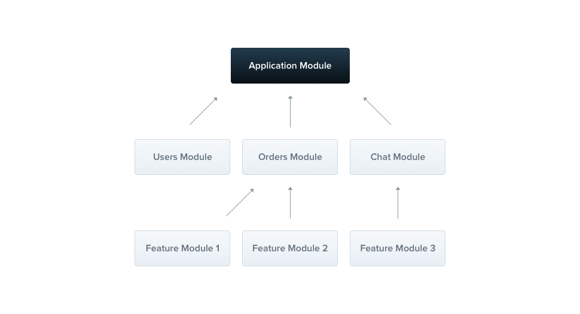
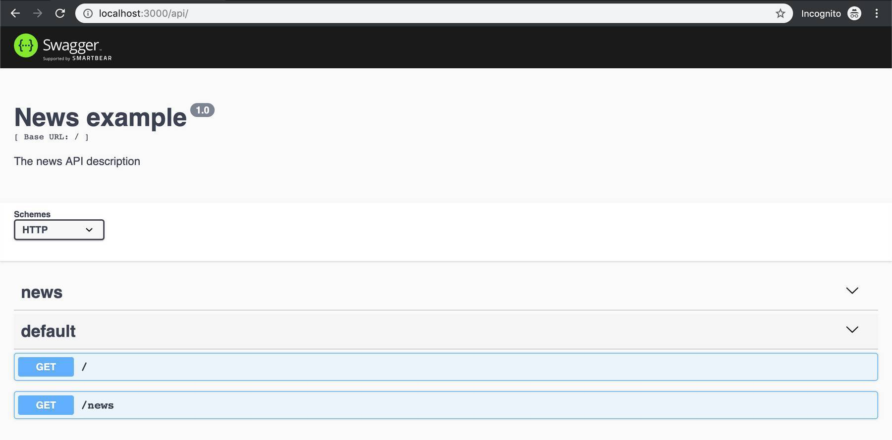

I think we all know this problem: You need to develop a new web application and therefore you need to implement the core of the application in the backend and frontend. Both can be time-consuming and if, in the beginning, you choose wrong architectural decisions it can get hardly maintainable over time. 

Additionally, projects are often started with a small core team. So it is important that the team provides a solid architecture and is able to provide a good first prototype in time and budget. I, therefore, believe that it could make sense to start with a full stack TypeScript approach where you use [Angular](https://angular.io) in the frontend and [NestJS](https://nestjs.com/) in the backend. 

In this article, I will tell you about NestJS (from now on called Nest in this article) and why I think that such a full stack TypeScript web application could be a good tech stack choice for web apps.

## Why should I use TypeScript in the backend?

In my opinion, this only makes sense in these scenarios:

1. You have a small core team which has a good TypeScript knowledge and this tech stack could fit the needs of your project now and in the future.
2. In a project with multiple microservices, you have a specific microservice which serves specifically as a backend for the frontend and is maintained by the frontend team.

If you have an existing backend team which is productive and happy with their tech stack there is, at least in my opinion, no need to use web technologies in the backend. But be at least open for the discussion and maybe it could also fit for your project. 

## What is Nest?


The official description on the website is:

> Nest is a framework for building efficient, scalable Node.js server-side applications. It uses progressive JavaScript, is built with and fully supports TypeScript (yet still enables developers to code in pure JavaScript) and combines elements of OOP (Object Oriented Programming), FP (Functional Programming), and FRP (Functional Reactive Programming).

> Under the hood, Nest makes use of robust HTTP Server frameworks like Express (the default) and Fastify. Nest provides a level of abstraction above these frameworks, but can also expose their APIs directly to the developer. This allows for easy use of the myriad third-party modules which are available for each platform.

So basically it uses well-known, existing frameworks like Node.js and Express and acts as a layer above. But why is this now so special?

In my opinion, it is so brilliant due to these facts:

- It is completely written in TypeScript and you can also implement your applications out-of-the-box in TypeScript
- Provides an out-of-the-box application architecture was deeply inspired by Angular

But even if it was inspired by Angular, Nest is a separate project and totally independent of the Angular project itself. You can build a front-end-agnostic API which can be used with other frameworks and libraries like React, Vue.js, and so on.

### TypeScript


Nest applications are written in [TypeScript]([https://www.typescriptlang.org/](https://www.typescriptlang.org/)) but you can also choose to write them in JavaScript (which I would not recommend). TypeScript is a superset of JavaScript and provides the flexibility of JavaScript with the safety and robustness of a typed language.

TypeScript is compiled to JavaScript and therefore the compiler can already catch possible runtime errors during compilation. The language calls itself "JavaScript that scales" and Nest also wants to provide a scalable backend architecture so I think this was a good choice.

Additionally, I would totally recommend you to use TypeScript in the frontend framework you are currently using. Angular provides TypeScript out-of-the-box but you can, of course, also use it in other popular frameworks like React or Vue. 

This way you have a common language in your frontend & backend code where you can even share your type definitions. This approach heavily reduces the efficiency losses by context switches from one language to another and it can increase your team performance in general.

### Nest Architecture



As already mentioned, Nest's architecture was deeply inspired by Angular. 

Usually, server-side JavaScript frameworks are more focused on flexibility than on providing a scalable architecture for your code. Normally, you need to invest time by yourself to arrange the code in a clear way and define guidelines for it.

Nest provides a nice architecture out of the box which we will now analyze in more details. Basically, it consists of modules, controllers and services.  

####File structure

A Nest project has a similar file structure than an Angular project: 

```text
.
|-- app.controller.spec.ts
|-- app.controller.ts
|-- app.module.ts
|-- app.service.ts
|-- main.ts
|-- news
    |-- news.controller.spec.ts
    |-- news.controller.ts
    |-- news.module.ts
    |-- news.service.spec.ts
    |-- news.service.ts
```

#### Dependency Injection

Nest is built like Angular around the design pattern Dependency Injection. You find a very good article about this pattern in the [official Angular documentation]([https://angular.io/guide/dependency-injection](https://angular.io/guide/dependency-injection)).

Let us look at a simple example:

If we need an instance of another class we just need to define it in the constructor:

```typescript
constructor(private readonly newsService: NewsService) {}
```

Nest will create and resolve an instance of `NewsService`. In the normal case of a singleton, it will return the existing instance if it has already been requested. Every class that can be injected needs to declare the `@Injectable` annotation as you can see later in the service section.

#### Modules

A module is the basic building block of each Nest application and groups related features like services and controllers. If you create a new Nest application you have the `AppModule` automatically available.

In theory, you could write your whole application in one module but this is in most of the cases, not the correct approach. It is recommended to group each of your features in a module, for example, a `NewsModule` and a `UserModule`.

A simple module example:

```typescript
@Module({
  controllers: [NewsController],
  providers: [NewsService],
})
export class NewsModule {}
```

Angular uses the same concept of modules and you even define them the same way in your code.

#### Controllers

In Nest you use annotations to define your controllers like it is done in frameworks like [Spring Boot]([https://spring.io/](https://spring.io/)). Controllers are responsible for handling incoming requests and returning responses to the client.

You decorate your controller class with the required `@Controller` decorator which you can pass a path as the primary route for this controller. Each method inside your controller class can be annotated by common decorators like `@Get`, `@Post`, `@Put`, and `@Delete`.

```typescript
@Controller('news')
export class NewsController {
  @Get()
  findAll(): string {
    return 'This action returns all news';
  }
}
```

As we did not add path information to our `@Get` decorator of the `findAll` method, Nest will map `GET /cats` requests to this handler.

#### Services

Services are used in Nest to keep your controllers slim and encapsulate the logic. 

```typescript
@Injectable()
export class NewsService {
  private readonly news: News[] = [{ title: 'My first news' }];

  create(news: News) {
    this.news.push(news);
  }

  findAll(): News[] {
    return this.news;
  }
}
```

Now we can use this service in our controller:

```typescript
@Controller('news')
export class NewsController {
  constructor(private readonly newsService: NewsService) {}

  @Get()
  async findAll(): Promise<News[]> {
    return this.newsService.findAll();
  }
}
```

### Testing


Nest provides us with a setup for unit, integration and end-to-end tests.

#### Unit Tests

[Jest]([https://jestjs.io/](https://jestjs.io/)) is used as unit test framework in Nest. If you also use the same test framework in the frontend this can be very beneficial and improve your team performance at all. 

A simple unit test for our NewsService:

```typescript
describe('NewsService', () => {
  let service: NewsService;

  beforeEach(async () => {
    const module: TestingModule = await Test.createTestingModule({
      providers: [NewsService],
    }).compile();

    service = module.get<NewsService>(NewsService);
  });

  it('should be defined', () => {
    expect(service).toBeDefined();
  });

  it('should return first news article', () => {
    expect(service.findAll()).toEqual([{ title: 'My first news' }]);
  });
});
```

Thanks to dependency injection it is also very easy to mock services, e.g. in your controller tests:

```typescript
describe('News Controller', () => {
  let controller: NewsController;

  const testNews = {
    title: 'Test News',
  };

  class NewsServiceMock {
    public findAll() {
      return [testNews];
    }
  }

  beforeEach(async () => {
    const module: TestingModule = await Test.createTestingModule({
      controllers: [NewsController],
      providers: [{ provide: NewsService, useClass: NewsServiceMock }],
    }).compile();

    controller = module.get<NewsController>(NewsController);
  });

  it('should be defined', () => {
    expect(controller).toBeDefined();
  });

  it('should get news', () => {
    expect(controller.findAll()).toEqual([testNews]);
  });
});
```

#### End-to-end test

With end-to-end tests you test the whole functionality of your API and not just one particular function. 

Nest uses [Supertest]([https://www.npmjs.com/package/supertest](https://www.npmjs.com/package/supertest)) which can be used to simulate HTTP requests:

```typescript
describe('News Controller (e2e)', () => {
  let app;

  beforeEach(async () => {
    const module: TestingModule = await Test.createTestingModule({
      imports: [NewsModule],
    }).compile();

    app = module.createNestApplication();
    await app.init();
  });

  it('/ (GET)', () => {
    return request(app.getHttpServer())
      .get('/news')
      .expect(200)
      .expect([{ title: 'My first news' }]);
  });
});
```

## Swagger

If you develop a public API you may need to use [OpenAPI]([https://swagger.io/specification/](https://swagger.io/specification/)) (Swagger) specification to describe RESTful APIs. Nest provides a module to integrate it.

We only need to install the swagger package (`@nestjs/swagger`) and add a few lines to our main.ts.

```typescript
async function bootstrap() {
  const app = await NestFactory.create(AppModule);

  const options = new DocumentBuilder()
    .setTitle('News example')
    .setDescription('The news API description')
    .setVersion('1.0')
    .addTag('news')
    .build();
  const document = SwaggerModule.createDocument(app, options);
  SwaggerModule.setup('api', app, document);

  await app.listen(3000);
}
bootstrap();
```

In our main.ts we specified that the API doc is available under `/api`. So if we open up a browser and navigate to [http://localhost:3000/api](http://localhost:3000/api) we get the following API doc.



## Getting Started

I can highly recommend the [official Nest documentation]([https://docs.nestjs.com/](https://docs.nestjs.com/r)) as a starting point.

Nest provides the Nest CLI which is a very nice command-line interface tool that helps you to initialize and develop your applications. You can scaffold a new project or add new services, component and more as you know it from the [Angular CLI]([https://github.com/angular/angular-cli](https://github.com/angular/angular-cli)).

Basically, you just need these three commands to let the basic project run locally at [http://localhost:3000/](http://localhost:3000/):

```bash
$ npm i -g @nestjs/cli
$ nest new project-name
$ npm run start
```

## The Future of Nest

Nest has currently more than 14k stars on [GitHub]([https://github.com/nestjs/nest](https://github.com/nestjs/nest)) and more than 100k weekly downloads on [npm]([https://www.npmjs.com/package/@nestjs/core](https://www.npmjs.com/package/@nestjs/core)). It is already used by [many companies in production]([https://docs.nestjs.com/discover/companies](https://docs.nestjs.com/discover/companies)) with Adidas as the biggest user. 

Nest is unique as server-side JavaScript framework due to its use of TypeScript and relation to Angular but it is missing the support of a large enterprise. This is just a minor concern but it should be taken into account if you choose a framework for your tech stack.

## Conclusion

In my opinion, Nest fits perfectly into a full stack Typescript web application tech stack, especially if you choose Angular in the frontend.

The folder structure and design patterns in Nest are heavily based on Angular. Due to this simple and similar structure, we as developers can more focus on the design of the endpoints instead of wasting time for application structuring. Nest hides a lot of the nasty Node.js and ugly JavaScript behind annotations, structures and patterns. Thanks to TypeScript as backend language, going from your frontend to backend code is less painful and without fewer context switches.