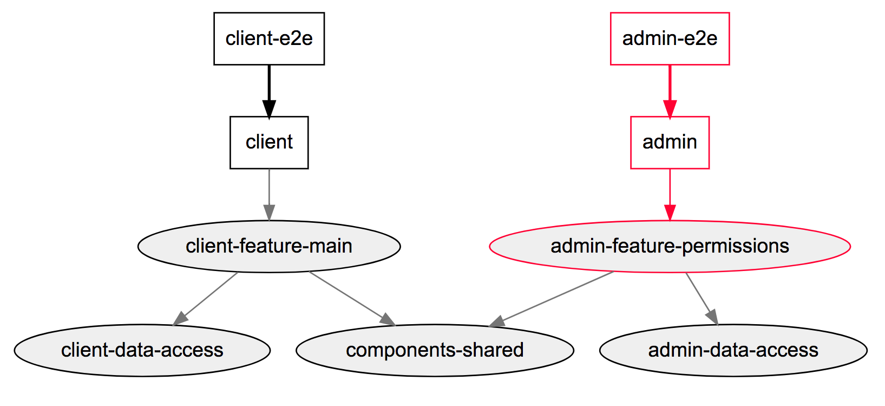

**Update November 2019: Updated article with some additional tips**

**Update September 2019: Added error handling**

In my opinion, [Angular](https://angular.io/) is the best choice for large enterprise applications. The basic project setup which is generated by using the [Angular CLI](https://cli.angular.io/) is good but I prefer another way to set up a new project. In this blog post I want to talk about these topics:

- Using Nx instead of the Angular CLI
- TypeScript configuration
- Internationalization
- UI Component Explorer
- Domain-driven Design for your models
- Error Handling
- Build Complex Components
- Miscellaneous

## Nx 

[Nx](https://nx.dev/angular/getting-started/what-is-nx) is not a replacement for the Angular CLI but it uses the power of the Angular CLI and enhances it with additional tools. Anything you can do with the Angular CLI can also be done with Nx and you configure your project (as usual) with the `angular.json` configuration file.

I love Nx due to these facts:

-   I can easily integrate modern tools like [Cypress](https://cypress.io), [Jest](https://jestjs.io/) and [Prettier](https://prettier.io/) to my Angular project
-   I can use effective development practices which are pioneered at Google, Facebook, and Microsoft

> Nx is an easy to use version of the powerful monorepo tools used at companies like Google.

Let us first talk about the usage of [Cypress](https://cypress.io) and [Jest](https://jestjs.io/) in Angular projects.

### Why should I consider using Cypress instead of Protractor?

[Check out this nice comparison](https://techblog.fexcofts.com/2018/09/24/end-to-end-e2e-angular-testing-protractor-vs-cypress/) to get more information about the differences between the two technologies.

Cypress is modern and interesting because it is not based on Selenium. Whereas Selenium executes remote commands through the network, Cypress runs in the same run-loop as your application. Additionally, it is fast and has nice features like:

* Time travel
* Debuggability
* Real-time reloads
* Automatic waiting
* Spies, stubs and clocks
* Network traffic control
* Consistent results
* Screenshots and videos

On the [official feature website](https://www.cypress.io/features) you can find further details about these features.

The greatest disadvantage of Cypress is, in my opinion, that it does not have full integration with tools like SauceLabs and BrowserStack and does not support other browsers than Chrome. This probably might change in the future but at the time of writing these features are not available yet. 

In my opinion, Cypress is not a perfect choice for every Angular project but I would recommend that you should give it a try and make your own decision. 

### Why should I consider using Jest instead of Karma/jasmine?

In my experience, the testing experience using Karma + jasmine is worse when the projects become bigger:

* Slow build times (especially initially)
* Recompiling does not work reliably  
* HTML reporter like [karma-jasmine-html-reporter](https://www.npmjs.com/package/karma-jasmine-html-reporter) tend to be buggy

[Jest](https://jestjs.io/) was created by Facebook and is faster than other test runners because it is parallelizing tests. Additionally, it provides a CLI and has less configuration effort than other testing frameworks. 

Some of the advantages of Jest compared to Karma + jasmine:

- Tests run faster as it can execute tests without building the whole app
- Using the CLI it is possible to filter by a filename or regex which reduces the need for `fdescribe`
- Nearly no configuration needed to get started
- Stable tests
- The syntax is similar to jasmine
- Provides [snapshot testing](https://jestjs.io/docs/en/snapshot-testing)
- More active community

To be honest, I haven't used Jest in any of my Angular projects yet but I will give it a try in one of my next Angular projects. The main reason why I haven't used it yet is that I worked on existing codebases with many jasmine tests and there was no need/time/budget to migrate them to Jest.  But I already used Jest in a Vue.js project and liked it.

If you are just annoyed with the verbose code produced by using Angular's [TestBed API](https://angular.io/guide/testing#component-dom-testing) I would suggest trying [Spectator](https://github.com/NetanelBasal/spectator) which allows us to write "readable, sleek and streamlined unit tests".

A summary of my testing suggestions:

* Consider using Spectator instead of the TestBed API of Angular.
* Consider using Jest instead of Karma/Jasmine (Migration is quite easy)
* Consider using [ng-mocks](https://www.npmjs.com/package/ng-mocks) to mock your component, directives, services, pipes and more. Your unit tests should be pure and therefore isolated. 
* Consider using a functional component testing approach over the technical class testing approach. Test your component from the DOM and not the class, you should think in user events instead of methods.

### Effective Development Practices

Using Nx you can work in a "monorepo" way of building your application. This approach is used by large software companies like Google, Facebook, Twitter and more to make it easier to work with multiple applications and libraries. These are some of the advantages of a monorepo approach:

* You commit a working piece of software which may include multiple parts like frontend and backend
* One toolchain setup
* Dependency management is easier, e.g. all applications & libs in a Nx workspace share one `package.json` and can thus use the same Angular version
* Code can be split into composable modules
* Consistent developer experience

What I also like is the possibility to create applications and libraries in Nx which provide a nice way to structure larger applications: 

>    * An application is anything that can run in the browser or on the server. It's similar to a binary.
>    * A library is a piece of code with a well-defined public API. A library can be imported into another library or application. You cannot run a library.

As an example, we could define a TypeScript library that shares our TypeScript interfaces between our TS-based application in our workspace. Of course, our workspace can contain applications that rely on different frontend (or backend) frameworks like React, Angular, NestJS and even more.

One of my favorite features is the dependency graph which can show me a graphical representation of my workspace by running `nx affected:dep-graph`: 



As we used `affected` we can see what parts of our workspace are affected by our current changes (highlighted in red). This way we can also run only tests or recompile code which was effected by our changes:

```bash
nx affected:apps  # prints the apps affected by a PR

nx affected:build  # reruns build for all the projects affected by a PR

nx affected:test  # reruns unit tests for all the projects affected by a PR

nx affected:e2e  # reruns e2e tests for all the projects affected by a PR

nx affected --target=lint  # reruns any target (for instance lint) for projects affected by a PR
```

See the [official documentation](https://nx.dev/angular/fundamentals/monorepos-automation) to read more about how to use these mechanics in Nx.

## TypeScript Configuration

I prefer to start with [this tslint configuration](https://github.com/mgechev/tslint-angular) as it uses the tslint configuration of [Angular CLI](https://github.com/angular/angular-cli) and aligns with the [Angular style guide](https://angular.io/guide/styleguide).

In my `tsconfig.json` file I enable [`strictNullChecks`](https://basarat.gitbooks.io/typescript/docs/options/strictNullChecks.html) which makes the code base more robust against possible `null` or `undefined` errors during runtime.

```json
{
  "compilerOptions": {
    "strictNullChecks": true
  }
}
```

From the [official documentation](https://www.typescriptlang.org/docs/handbook/compiler-options.html):
> In strict null checking mode, the null and undefined values are not in the domain of every type and are only assignable to themselves and any (the one exception being that undefined is also assignable to void).

## Internationalization (i18n)

I configure internationalization from the beginning of a project even if the product is only planned for one country. This has two reasons: 

* You get used to storing your translated texts in one file and not as hardcoded strings across the whole application
* If the application needs to get translated in another language you are prepared for it

I always use [ngx-translate](https://github.com/ngx-translate/core) in my Angular projects especially as it provides to switch between languages during runtime of your application. This can become handy if you need to implement a language switcher in your app.

## UI Component Explorer

If you develop your components it can be helpful to create a custom view with all available components or use existing solutions like [StoryBook](https://storybook.js.org/). 

In some projects, I created a separate page in the application (which was only visible to certain people) which showed a list of all available components. This page was used in manual testing sessions and provided a quick way to see if a new feature had an impact on any existing component. Additionally, it was possible to test the components in isolation.

## Use Domain-driven Design for your models

One of the main ideas behind Domain-Driven Design is the separation of business logic (domain) from the rest of the application or implementation details. This can be easily implemented in Angular using TypeScript. 

The goal of our domain model is to represent business logic. We want to avoid that certain business logic is split across multiple components and services but is available at a certain place. This way we can easily react and change the logic if something in the business requirement has changed.

An example of such a domain model could look like this:

```typescript
export class User {
  private firstName: string;
  private lastName: string;
  private age: number;

  get firstName() {
    return this.firstName;
  }

  get lastName() {
    return this.lastName;
  }

  get fullName() {
    return `${this.firstName} ${this.lastName}`;
  }

  get age() {
    return this.age;
  }

  constructor(firstName: string, lastName: string, age: number) {
    this.setName(firstName, lastName);
    this.setAge(age);
  }

  setName(firstName: string, lastName: string) {
    if (this.validName(firstName) && this.validName(lastName)) {
      this.firstName = firstName;
      this.lastName = lastName;
    }
  }

  setAge(age: number) {
    if (age >= 18) {
      this.age = age;
    } else {
      throw new Error('User age must be greater than 18');
    }
  }

  private validName(name: string) {
    if (name.length > 0 && /^[a-zA-Z]+$/.test(name)) {
      return true
    } else {
      throw new Error('Invalid name format');
    }
  }
}
```

If, for example, the minimum age should be changed from 18 to 16 this logic needs only to be changed in this domain model class.

[This article](https://coryrylan.com/blog/rich-domain-models-with-typescript) provides further details and a good approach to handle server-side business logic in your frontend application.

## Error Handling

I would always add a `LoggerService` and global error handler in the beginning of the project. 

Additionally, try to use an error tracking software like [Sentry](https://sentry.io/) to be able to monitor and fix crashes in real-time. 

Example for a `LoggerService`:

```ts
import { Injectable } from "@angular/core";

@Injectable()
export class LoggerService {
  debug(message: string, ...optionalParams: unknown[]): void {
    console.debug(message, ...optionalParams);
  }

  log(message: string, ...optionalParams: unknown[]): void {
    console.log(message, ...optionalParams);
  }

  warn(message: string, ...optionalParams: unknown[]): void {
    console.warn(message, ...optionalParams);
  }

  error(message: string, ...optionalParams: unknown[]): void {
    // Send error to Sentry
    Sentry.captureMessage(`Error message: ${message}, optionalParams: ${JSON.stringify(optionalParams)}`)

    console.error(message, ...optionalParams);
  }
}
```

To catch global errors in Angular you can use the [ErrorHandler](https://angular.io/api/core/ErrorHandler):

```ts
class MyErrorHandler implements ErrorHandler {

  constructor(loggerService: LoggerService) {}

  handleError(error) {
    // Send error to Sentry
    Sentry.captureError(error);
  }
}

@NgModule({
  providers: [{provide: ErrorHandler, useClass: MyErrorHandler}]
})
class CoreModule {}
```

## Build Complex Components

Often we need to develop complex components in our applications. For this case I suggest the following:

Try to solve your problem using the fantastic [Angular CDK](https://material.angular.io/cdk/categories) which provides a set of tools that implement common interaction patterns whilst being unopinionated about their presentation. Examples are tools for accessibility, overlays, scrolling, drag & drop, tables and more.

If you build your component also take a look at existing open-source Angular libraries like [Angular Material](https://github.com/angular/components). There you can see how components are written the "Angular way".

You can also look for existing Angular components in npm, therefore I can recommend taking a look at curated component lists like [Awesome Angular Components](https://github.com/brillout/awesome-angular-components) or [Awesome Angular](https://github.com/PatrickJS/awesome-angular). Anyways, I would advise to check the following for each 3rd party library you want to integrate into your project:
    * When was it published the last time?
    * Is it actively maintained? How many open issues are on GitHub? 
    * Is it actively used by checking npm weekly download numbers?

## Miscellaneous

* Use [Prettier](https://prettier.io/) as code formatter
* Use [Augury](https://augury.rangle.io/), [Redux DevTools](https://chrome.google.com/webstore/detail/redux-devtools/lmhkpmbekcpmknklioeibfkpmmfibljd) or any other useful browser dev tools 
* Use [Compodoc](https://github.com/compodoc/compodoc) (or any other similar tool) to generate documentation for your application. 
* Use [Husky](https://github.com/typicode/husky), to check if commit message has the correct format, code is formatted, linter has no errors and maybe also run unit tests before you push your code.
* [Lazy load](https://angular.io/guide/lazy-loading-ngmodules) all your modules. This way you can split your application in multiple smaller bundles which are only loaded if necessary. 

## Conclusion

It is important to agree with your team on such an opinionated setup. I would propose this approach to the team, discuss alternatives, advantages, disadvantages and try to find a good compromise. In the end, the project should be scalable and the team should be able to quickly deliver features.

This article showed you my approach to set up a new Angular project. It is not complete and maybe not a perfect approach but it is my experience, so your suggestions are always welcome in the comments.

I would also recommend you to read this free eBook from Manfred Steyer [Enterprise Angular - DDD, Nx Monorepos and Micro Frontends](https://leanpub.com/enterprise-angular) which covers a lot of the discussed topics in more detail.
