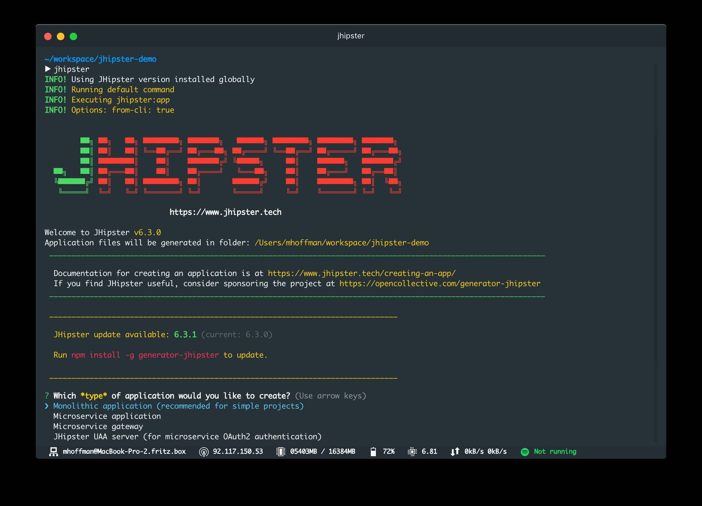
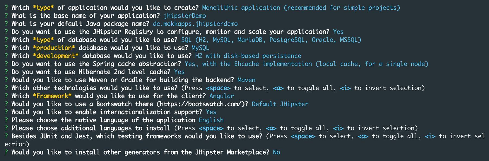
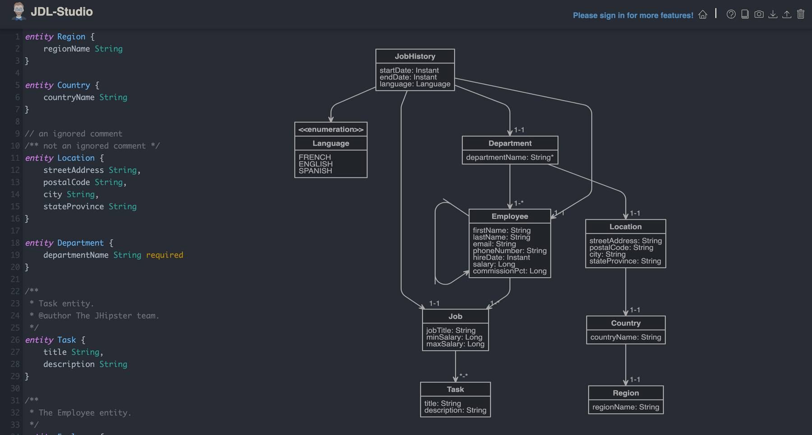
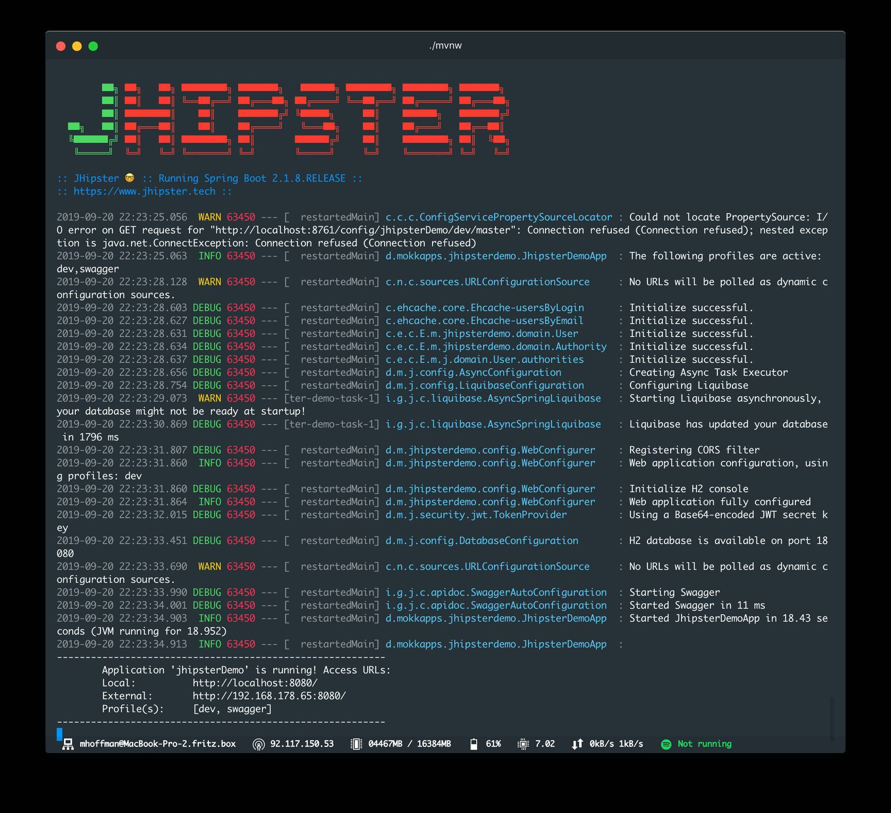
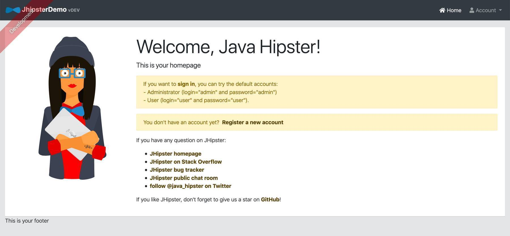
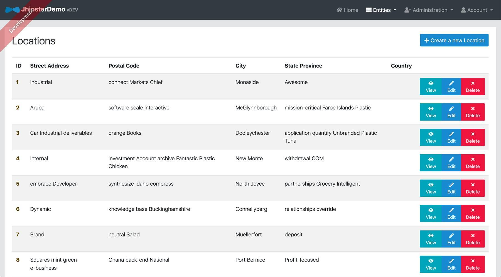
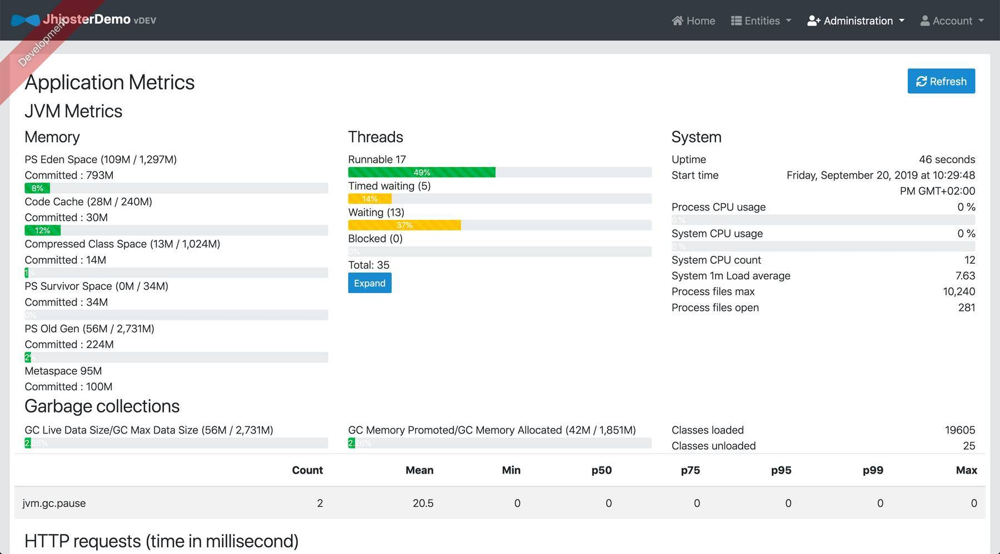
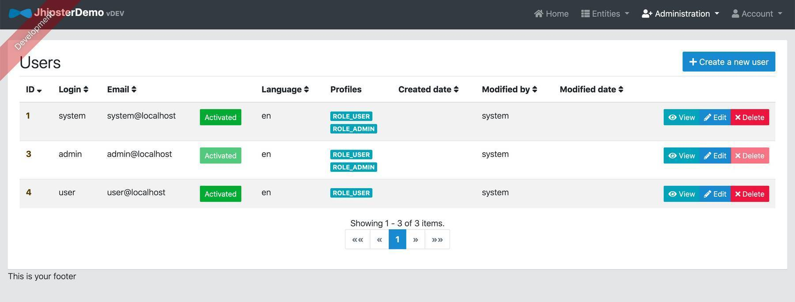

The last years I mainly worked on the frontend part of web & mobile applications but I also did some minor backend work. Since mid of this year, I am working to improve my backend knowledge and started to focus on Java backend development using Spring Boot.

As I watched multiple Java tutorials on [Pluralsight](https://www.pluralsight.com/) I stumbled upon [JHipster](https://www.jhipster.tech/) and felt immediately in love with it.

In this article, I will tell you why I love JHipster and how you can quickly start a JHipster project.

## What Is JHipster?

> JHipster is a development platform to generate, develop and deploy Spring Boot + Angular / React / Vue Web applications and Spring microservices. 

Basically, it is a [Yeoman](http://yeoman.io/) generator which creates applications that include Spring Boot, Bootstrap and Angular (or React or Vue).

Julien Dubois started the project in 2013 and is available on [GitHub](https://github.com/jhipster/generator-jhipster).

If you like to see JHipster in action, I can recommend the following screencast from [Matt Raible](https://twitter.com/mraible):

<iframe width="560" height="315" src="https://www.youtube-nocookie.com/embed/uQqlO3IGpTU" frameborder="0" allow="accelerometer; autoplay; encrypted-media; gyroscope; picture-in-picture" allowfullscreen></iframe>

## Why Should I Use JHipster?

In my opinion, JHipster is amazing as it
* is open source
* supports React, Vue, Angular for the frontend
* uses TypeScript for each frontend framework
* uses Spring Boot 2.1 so we can develop our application in Java 11+
* provides out-of-the-box user management including email verification and password reset
* can be easily deployed to CloudFoundry, Heroku, OpenShift or AWS
* provides a robust microservice architecture using Netflix OSS, Elastic Stack, and Docker
* uses powerful tools Yeoman, Webpack and Maven/Gradle
* has a good test coverage for entities on frontend and backend side

## Quick Start

### Install Prerequisites

Make sure to install [Java](http://www.oracle.com/technetwork/java/javase/downloads/index.html), [Git](https://git-scm.com/) and [Node.js](https://nodejs.org/) which are prerequisites for JHipster.

Then we can install JHipster as global npm package: `npm install -g generator-jhipster`

### Create New Project

Now we can create a new project and get started:

The first step, is to create a new directory and go into it 
    `mkdir jhipster-demo && cd jhipster-demo`

Now we can run `jhipster` which starts the generator 

with the following selections:

I chose a monolithic application as a microservice architecture would be an overkill for a simple demo project. Besides that, I selected Angular as frontend framework with i18n support and some backend configuration for database, caching and monitoring.  

Next step is to model our entities with [JDL Studio](https://start.jhipster.tech/jdl-studio/) and download the resulting `jhipster-jdl.jh` file:

[JDL Studio](https://start.jhipster.tech/jdl-studio/) is a nice graphical tool for drawing JHipster JDL diagrams based on the [JDL syntax](https://www.jhipster.tech/jdl/). You not need to use this graphical tool but can also [create entities using the command-line interface](https://www.jhipster.tech/creating-an-entity/).

After downloading the `.jh` file we can now generate the entities with `jhipster import-jdl jhipster-jdl.jh`. In our example, we just import the default JDL Studio file which is also shown in the picture above.

### Start Backend

Run `./mvnw` which starts the Spring Boot application:

### Start Frontend

Run `npm start` which starts the Angular application which is then accessible on `http://localhost:9000/`:

Finally, we can log in and see some of the out-of-the-box features like the possibility to see and edit our entities,

view metrics of the application

and a user management

## Conclusion

In this article, I just showed you a quick start project and mentioned some of the advantages of it. JHipster is much more powerful as you can see in the [official documentation](https://www.jhipster.tech/). In my opinion, it is also a good sign if large companies are using the framework, as you can see [in this official list](https://www.jhipster.tech/companies-using-jhipster/).

A disadvantage of JHipster is that you do not have a typical Angular CLI project. Angular CLI is included in JHipster but the project structure looks different than the one of a default Angular CLI project. 

Additionally, JHipster generates a lot of code which includes many libraries which you maybe do not know some of them. You can just add or modify the code without learning the fundamentals behind these libraries but this could lead to some future problems.

You should also keep in mind that a JHipster project is more of a big start than a small, lean project start. 
