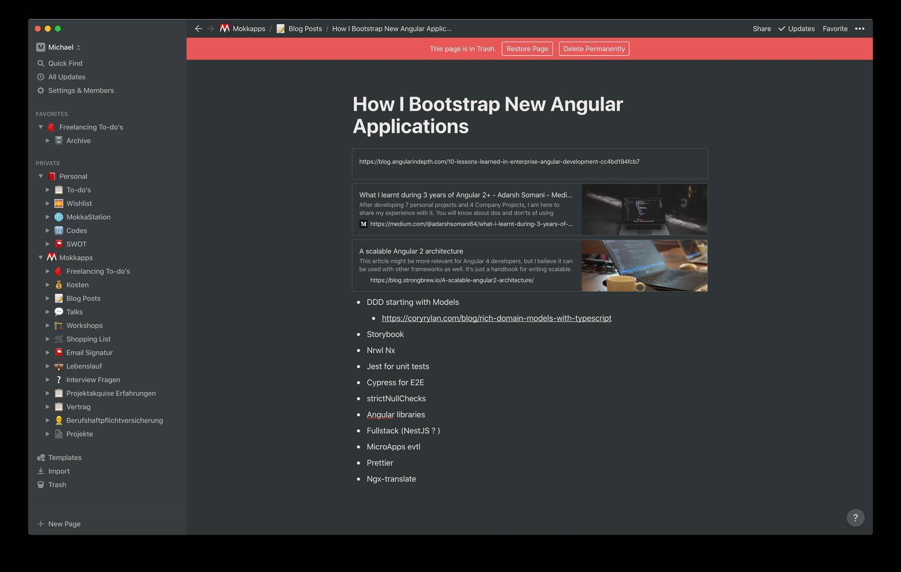
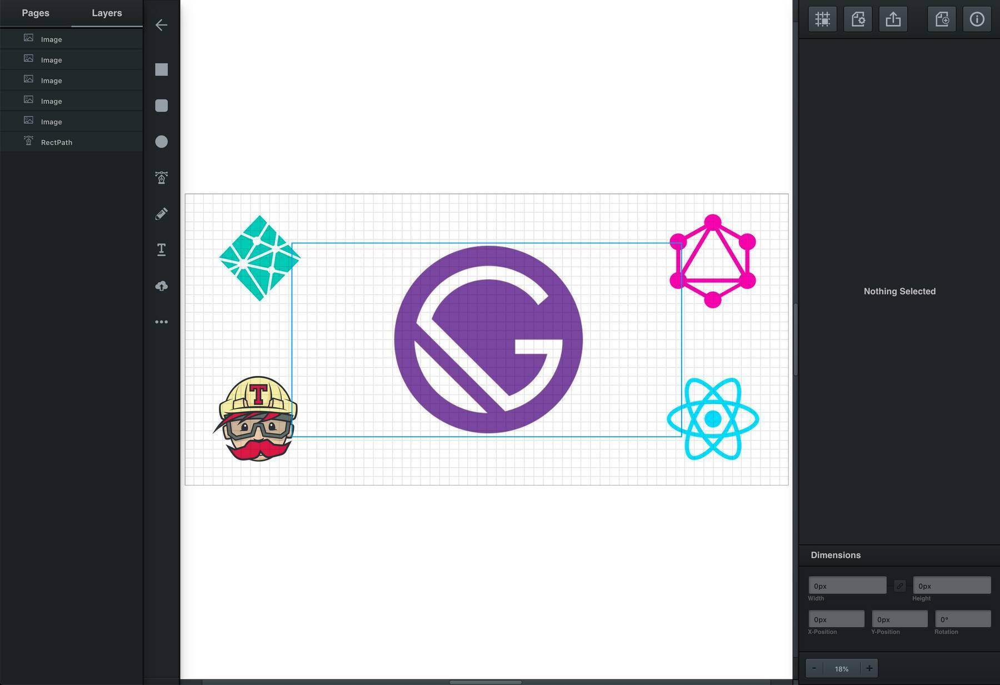
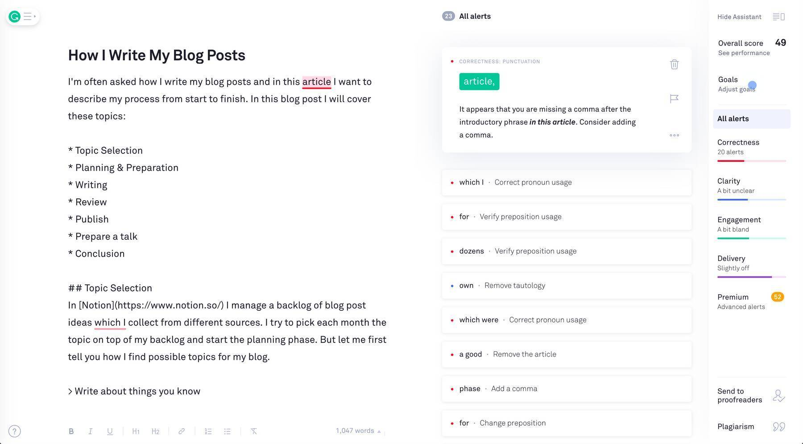

I'm often asked how I write my blog posts and in this article, I want to describe my process from start to finish. In this blog post I will cover these topics:

* Topic Selection
* Planning & Preparation
* Writing
* Review
* Publish
* Prepare a talk
* Conclusion

## Topic Selection
In [Notion](https://www.notion.so/) I manage a backlog of blog post ideas that I collect from different sources. I try to pick each month the topic on top of my backlog and start the planning phase. But let me first tell you how I find possible topics for my blog.

> Write about things you know

Most of my blog post ideas came up during my daily development work. If I think the topic could be also interesting for other developers I write an article about it. An example of such a blog post would be [NestJS - The missing piece to easily develop full-stack TypeScript web applications](https://www.mokkapps.de/blog/nest-js-the-missing-piece-to-easily-develop-full-stack-typescript-web-applications/).

Sometimes I also want to share some of my career experiences with other developers, for example, [what my definition of a senior developer is](http://www.mokkapps.de/blog/my-definition-of-a-senior-software-developer/).

I am also not afraid if my topic was already covered by dozens of other blog posts. I try to put my perspective and touch to the article so that is not just a copy but a unique content

> Write about uncovered topics

Writing about topics that were not (or only partly) covered is the hardest but most valuable content you can create. For example, I wrote about [How I Built A Custom Stepper/Wizard Component Using The Angular Material CDK](https://www.mokkkapps.de/blog/how-i-built-a-custom-stepper-wizard-using-angular-material-cdk/) as I did not find good documentation and helped a lot of other developers with this article.

## Planning & Preparation
My whole blog post planning is also done in [Notion](https://www.notion.so/). I create a new page for the new blog article where I start collecting relevant articles, ideas, code snippets and more.

During the preparation phase, I research for similar articles which I think are very good. I read through them, note interesting aspects and start writing a rough structure for my article. Like in this article, I first created the chapters defined in the introduction.

Additionally, I also analyze the top-ranked Google articles for their headlines and create my own based on this inspiration. Most of the time this is just a working title, which I update after I have finished writing and reviewing the article.

## Writing

The first step of the writing phase is to create a new branch in [my website repository](https://github.com/mokkapps/website) for the new blog article. Then I start writing the headlines and fill them with content in [Visual Studio Code](https://code.visualstudio.com/). I am also using the spell checker plugin [Spell Right](https://marketplace.visualstudio.com/items?itemName=ban.spellright) to prevent typos. Typically, the writing itself takes 1-4 hours depending on the content and if demo code is involved. A big focus is on the outline of the post where I try to list the main points I want to teach with the article and keep the reader motivated to continue reading.

My basic article structure is:
   - Introduction
   - Middle
   - Conclusion

The next step is to add a nice cover image where I first look at [unsplash.com](https://unsplash.com/) which provides nice, free stock photos. If I do not find a good image there (or I want to modify it), I use [Vectr](https://vectr.com/) which is a free online vector graphics software:

To make the article more attractive for readers I also add some images in between the text to have not only large text blocks but also some visual parts. Quotes, videos or charts are also a good way to add more appeal to the post.

## Review

At this phase, I read again through the article in my editor and I also run my website locally to see if the article looks good "in action". After that, I paste the article text in [Grammarly](https://app.grammarly.com/) to find grammar errors which happen quite often as I am no native English speaker but write my articles in English.

I will sleep one night and read again through the article. If I have someone special in mind, I also ping that person to review the article.

## Publish

If I am happy with the article I will merge my branch to master, push the changes and a new website deployment will automatically be triggered. Check [The Engineering Behind My Portfolio Website](http://www.mokkapps.de/blog/the-engineering-behind-my-portfolio-website/) if you want to learn more about how I deploy my blog. 

After this step, I will post the link to my new blog post on social channels like Twitter and LinkedIn (Instagram is coming soon). The latest blog post will also be mentioned in my [newsletter](http://www.mokkapps.de/newsletter).

The last step is to publish the article on [dev.to](https://dev.to/) which already fetched the blog content via my RSS feed so that I just need to review the prepared post there and publish it.

## Prepare A Talk

If I have the feeling that a blog post could be an interesting topic for a talk, e.g. at a Meetup meeting I will propose it to a Meetup organizer.

Most of the time, the preparation and talks are quite easy as I already invested enough time for the topic research during writing the article.

## Conclusion

Writing a blog post is a time investment but you can benefit a lot from it. 

A good blog is a perfect self-marketing tool. It is a showcase for my experience, expertise, and passion for coding and blogging. Additionally, it demonstrates possible clients my communication and teaching skills which are important in the tech industry. 

A lot of people think that it takes guts to put yourself out there but I think differently. I want to share my knowledge and I feel proud if only 10 people read the article if I could provide them any kind of value. Of course, I also sometimes struggle to publish certain articles like [The Mistakes I Made In My First Software Project](https://www.mokkapps.de/blog/the-mistakes-i-made-in-my-first-software-project/) where I take about mistakes I made in my career. 
In general, it is also not easy to publish articles in English as I am not a native speaker but it helps me to improve my written English. 

But until now I only gain from my blog and will continue it for sure.
