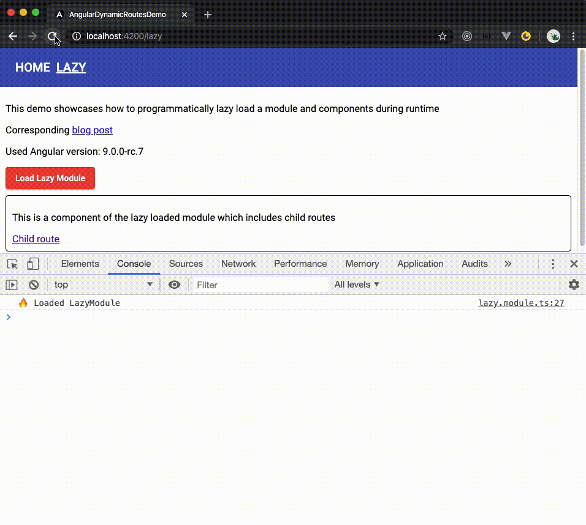

In Angular enterprise applications, it is often a requirement to load a configuration from a server via HTTP request which contains a UI configuration. Based on this configuration data, multiple modules and/or components need to be lazy-loaded and its routes dynamically added to the application.

In this blog post, I want to demonstrate how modules and components can be lazy-loaded at runtime using Angular 9+.

The following [StackBlitz demo](https://stackblitz.com/github/mokkapps/angular-manual-lazy-load-demo) includes the code described in the following chapters:

<iframe width="100%" height="500" src="https://stackblitz.com/github/mokkapps/angular-manual-lazy-load-demo?embed=1&file=src/app/app.component.ts"></iframe>

The source code of the demo is available on [GitHub](https://github.com/Mokkapps/angular-manual-lazy-load-demo).

## Lazy Load Module Using Router

> Lazy Loading: Load it when you need it

Since Angular 8 we can use the browser's built-in [dynamic imports](https://v8.dev/features/dynamic-import) to load JavaScript modules asynchronous in Angular.

A lazy-loaded module can be defined in the routing configuration using the new `import(...)` syntax for `loadChildren`:

```ts
@NgModule({
  imports: [
    RouterModule.forRoot([
      {
        path: 'lazy',
        loadChildren: () =>
          import('./lazy/lazy.module').then(m => m.LazyModule),
      },
    ]),
  ],
})
export class AppModule {}
```

[[warning]]
| Using Angular 8 (or previous versions) you need to write `loadChildren: './lazy/lazy.module#LazyModule` to enable lazy loading of a module using the Angular router as it does not support the `import(...)` syntax.

Angular CLI will then automatically create a separate JavaScript bundle for this module which is only loaded from the server if the selected route gets activated.

[[warning]]
| If you add `LazyModule` to any `imports` array of a module, it will be loaded eagerly (immediately).

## Manually Lazy Load Module

Sometimes you want to have more control over the lazy loading process and trigger the loading process after a certain event occurred (e.g. a button press). Usually, after this event occurred, a resource is accessed asynchronous (e.g. via an HTTP call to a backend) to fetch a configuration file which includes information about the modules and/or components that should be lazy-loaded.

In my [demo](https://github.com/Mokkapps/angular-manual-lazy-load-demo), I have implemented a `LazyLoaderService` to demonstrate that behaviour:

```ts
@Injectable({
  providedIn: 'root',
})
export class LazyLoaderService {
  private lazyMap: Map<string, Promise<unknown>> = new Map();

  constructor() {}

  getLazyModule(key: string): Promise<unknown> {
    return this.lazyMap.get(key);
  }

  loadLazyModules(): Observable<number | void> {
    return of(1).pipe(
      delay(2000),
      tap(() => {
        this.lazyMap.set(
          'lazy',
          import('./lazy/lazy.module').then(m => m.LazyModule)
        );
      })
    );
  }
}
```

The `loadLazyModules` method simulates a backend request. After a successful request, a module is registered using the `import(...)` syntax. If you now run the application you will see that a separate chunk for the module is created but it will not be loaded in the browser yet.


The module promise is stored in a `Map` with a key to be able to access it later.

We can now call this method in an `onClick` handler in our `AppComponent` and dynamically add a route to our router config:

```ts
  constructor(
    private router: Router,
    private lazyLoaderService: LazyLoaderService
  ) {}

  loadLazyModule(): void {
    this.lazyLoaderService.loadLazyModules().subscribe(() => {
      const config = this.router.config;
      config.push({
        path: 'lazy',
        loadChildren: () => this.lazyLoaderService.getLazyModule('lazy')
      });
      this.router.resetConfig(config);
      this.router.navigate(['lazy']);
    });
  }
```

We get the current router config from the Router via Dependency Injection and push our new routes into it.

[[warning]]
| Be careful if you have a wildcard route (`**`) in your route configuration. The wildcard route always needs to be at the last index of your routes array because it matches every URL and should be selected only if no other routes are matched first.

Next, we need to reset the router configuration used for navigation and generating links by calling `resetConfig` with our new configuration that includes the lazy-loaded module route.
Finally, we navigate to the new loaded route and see if it works:


We see three things happening after the "Load Lazy Module" button was clicked:

1. The chunk for the lazy module is requested from the server, a loading indicator is shown in the meantime
2. The browser URL changes to the new route `/lazy` after the loading has been finished
3. The lazy-loaded module is loaded and its `LazyHomeComponent` is rendered
4. The toolbar shows a new entry

Dynamically showing the available routes in the toolbar is done by iterating over the available routes from the router config in `app.component.html`:

```html
<mat-toolbar color="primary">
  <mat-toolbar-row>
    <a
      class="router-link"
      *ngFor="let route of routes"
      [routerLink]="route.path"
      routerLinkActive="active-link"
      >{{ route.path | uppercase }}</a
    >
  </mat-toolbar-row>
</mat-toolbar>
```

### Bookmark The Lazy-Loaded Route

A typical requirement is that users want to create a bookmark for certain URLs in the application as they visit them very often. Let us try this with our current implementation:



Reloading the lazy route leads to an error: `Error: Cannot match any routes. URL Segment: 'lazy'`

In the current implementation, we only load the module by clicking the "Load Lazy Module" button but we also need a trigger depending on the currently activated route. Therefore, we need to add the following code block to the `ngOnInit` method of our `AppComponent`:

```ts
  ngOnInit(): void {
    this.router.events.subscribe(async routerEvent => {
      if (routerEvent instanceof NavigationStart) {
        if (routerEvent.url.includes('lazy') && !this.isLazyRouteAvailable()) {
          this.loadLazyModule(routerEvent.url);
        }
      }
    });
    this.routes = this.router.config;
  }

  private isLazyRouteAvailable(): boolean {
    return this.router.config.filter(c => c.path === 'lazy').length > 0;
  }
```

We subscribe to the `NavigationStart` events of the Angular router and if the URL includes our lazy route, we check if it is already inside the Router config, otherwise we load it.

Now it is possible to bookmark the URL and the application will lazy load the module after the route is activated.

### Manually Load Angular Component

We can go one step further and dynamically load an Angular component in the manually lazy-loaded module.

In Angular version 2 to 8, it was quite complex to dynamically load a component, if you need a solution for one of these versions please take a look at the popular [hero-loader package](https://www.npmjs.com/package/@herodevs/hero-loader). Since Angular 9 it is much easier and I will describe the process for you.

Our LazyModule contains a child route with a placeholder component, that should show our dynamically loaded component:

```ts
export const LAZY_ROUTES: Routes = [
  {
    path: '',
    component: LazyHomeComponent,
    children: [
      {
        path: 'dynamic-component',
        component: PlaceholderComponent,
      },
    ],
  },
];
```

The template of the placeholder component consists only of a `<ng-template>` HTML tag:

```html
<ng-template></ng-template>
```

Inside `placeholder.component.ts` we now dynamically load a `DynamicLazyComponent` after the `PlaceholderComponent` got initialized:

```ts
@Component({
  selector: 'app-placeholder',
  templateUrl: './placeholder.component.html',
  styleUrls: ['./placeholder.component.css'],
})
export class PlaceholderComponent implements OnInit {
  @ViewChild(TemplateRef, { read: ViewContainerRef })
  private templateViewContainerRef: ViewContainerRef;

  constructor(
    private readonly componentFactoryResolver: ComponentFactoryResolver
  ) {}

  async ngOnInit() {
    import('../../dynamic-lazy/dynamic-lazy.component').then(
      ({ DynamicLazyComponent }) => {
        const component = this.componentFactoryResolver.resolveComponentFactory(
          DynamicLazyComponent
        );
        const componentRef = this.templateViewContainerRef.createComponent(
          component
        );
      }
    );
  }
}
```

Some notes to this code block:

* We use the `@ViewChild()` decorator to be able to query the `TemplateRef` instance of our `<ng-template>` element.
* The optional second argument of the `@ViewChild()` decorator (`{ read: ViewContainerRef }`) is used to read the `ViewContainerRef` instance from the view query.
* The `templateViewContainerRef` is used to tell the rendering engine where the lazy-loaded component should be rendered.
* We use the same `import(...)` syntax to lazy-load components the same way we did it for modules.

[[warning]]
| Since Angular 9, we do not need to register and add the `DynamicLazyComponent` inside any module as an entry component. If you want to dynamically load a component in Angular 8, please check out [Manually Lazy load Components in Angular 8](https://dev.to/binarysort/manually-lazy-load-components-in-angular-8-ffi)

The following picture demonstrates the lazy loading process of this component:


## Conclusion

Angular 9 provides a very clean and elegant solution to manually import modules and components at runtime using the `import(...)` syntax.

You should now be able to create very dynamic user interfaces, that can be configured in configuration files that are loaded at runtime and based on this information different modules and components are lazy-loaded with new routes.