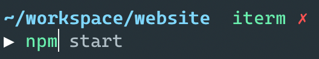
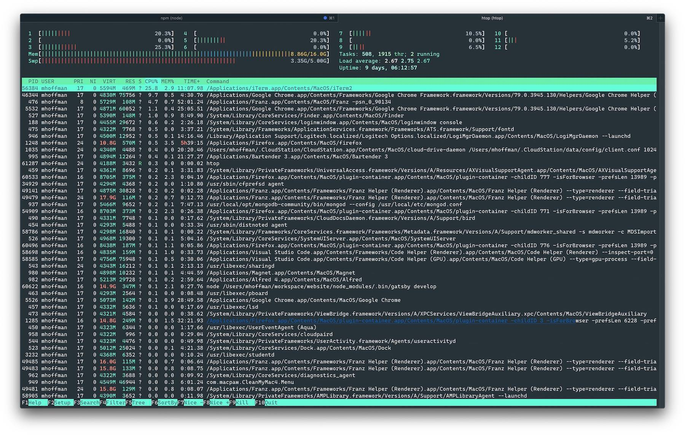
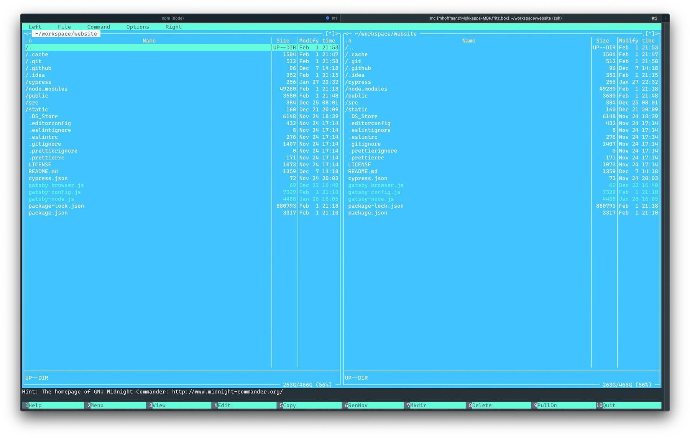
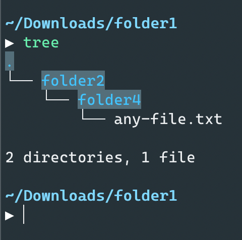

Using the terminal is one of the biggest productivity boosts you can gain in your daily work as a developer. If you know your shortcuts, you will be way faster than using the mouse. In this article, I want to show you my terminal setup and how I use it on a daily basis. The cover image shows my current setup in action.

> I am a macOS user so the article is mainly focused on this operating system but most of the software I demonstrate is also available for Windows and Linux users.

## Install Homebrew

[Homebrew](https://brew.sh/) is *the missing package manager for macOS (or Linux)* and makes installing packages super easy.

To install it on macOS you just need to paste this command in your terminal:

```bash
/usr/bin/ruby -e "$(curl -fsSL https://raw.githubusercontent.com/Homebrew/install/master/install)"
```

After that you should be able to run `brew`, you can check the successful installation by running `brew -v` in your terminal:

```bash
▶ brew -v
Homebrew 2.2.4
Homebrew/homebrew-core (git revision 22532; last commit 2020-01-31)
Homebrew/homebrew-cask (git revision 19d828; last commit 2020-01-31)
```

## iTerm2

I would recommend replacing the default `Terminal.app` in macOS by [iTerm2](https://www.iterm2.com/).

You can install it using `brew`:

```bash
brew install --cask iterm2
```

Some of the best [iTerm features](https://iterm2.com/features.html):

- Split your terminal into multiple panes which you can switch by hotkeys
- Register a hotkey that brings the terminal to the foreground when you're in another application
- A robust find-on-page feature
- Different user profiles to save your window arrangements and more
- Paste history that shows everything you’ve pasted into the terminal
- and [many more]((https://iterm2.com/features.html))

## ZSH and Oh My ZSH

Since macOS Catalina (10.15.2) the default shell is now ZSH instead of Bash. You can enrich ZSH by using the [Oh My ZSH](http://ohmyz.sh/) framework which provides some functionality that will boost your productivity:

- Autocompletion by pressing `Tab` key which allows selecting available directories, commands and files.
  
- Use alias commands, you can get a list of all available alias by running `alias` in your terminal
- You can omit the `cd` (change directory) command: `..` (instead of `cd ..`), `../..` (instead of `cd ../..`) `/` (for root directory) and `~` (for home directory) 
- `take` command creates a new directory and changes the path to it. Example: `take testFolder` is the same as `mkdir testFolder && cd testFolder`
- Use `-` to quickly navigate between your last and current path
- Many cool themes
- A list of amazing plugins
- Git integration
- And many more...

You can install it using this terminal command:

```bash
sh -c "$(curl -fsSL https://raw.githubusercontent.com/ohmyzsh/ohmyzsh/master/tools/install.sh)"
```

`Oh My ZSH` can be configured via the `.zshrc` configuration file:

```bash
vi ~/.zshrc
```

My `.zshrc` configuration looks similar to this one:

```bash
# If you come from bash you might have to change your $PATH.
export PATH=$HOME/bin:/usr/local/bin:$PATH

export JAVA_HOME="/Library/Java/JavaVirtualMachines/openjdk-11.0.2.jdk/Contents/Home/"

# jenv
export PATH="$HOME/.jenv/bin:$PATH"
eval "$(jenv init -)"

# Path to your oh-my-zsh installation.
export ZSH=/Users/mhoffman/.oh-my-zsh

# Set name of the theme to load. Optionally, if you set this to "random"
# it'll load a random theme each time that oh-my-zsh is loaded.
# See https://github.com/robbyrussell/oh-my-zsh/wiki/Themes
ZSH_THEME="avit"

# Which plugins would you like to load? (plugins can be found in ~/.oh-my-zsh/plugins/*)
# Custom plugins may be added to ~/.oh-my-zsh/custom/plugins/
# Example format: plugins=(rails git textmate ruby lighthouse)
# Add wisely, as too many plugins slow down shell startup.
plugins=(
  git
  brew
  docker
  npm
  osx
  bgnotify
  zsh-syntax-highlighting
  zsh-autosuggestions
  web-search
)

source $ZSH/oh-my-zsh.sh

# Set personal aliases, overriding those provided by oh-my-zsh libs,
# plugins, and themes. Aliases can be placed here, though oh-my-zsh
# users are encouraged to define aliases within the ZSH_CUSTOM folder.
# For a full list of active aliases, run `alias`.

alias zshconfig="nano ~/.zshrc"
alias ohmyzsh="nano ~/.oh-my-zsh"
alias gpf='git push -f'

# Docker alias
alias dkps="docker ps"
alias dkst="docker stats"
alias dkpsa="docker ps -a"
alias dkimgs="docker images"
alias dkcpup="docker-compose up -d"
alias dkcpdown="docker-compose down"
alias dkcpstart="docker-compose start"
alias dkcpstop="docker-compose stop"

# Kubectl alias
alias kdev='kubectl -n dev'
alias kpg='kubectl -n playground'
alias ktest='kubectl -n test'
alias kprod='kubectl -n prod'
alias kpreprod='kubectl -n preprod'
```

I use the [avit theme](https://github.com/ohmyzsh/ohmyzsh/wiki/Themes#avit) but there [are many other cool themes](https://github.com/ohmyzsh/ohmyzsh/wiki/Themes) available.

Some words about the used plugins, [here](https://github.com/ohmyzsh/ohmyzsh/tree/master/plugins) you can find a list of all available `Oh My ZSH` plugins:

- git: provides many [aliases](https://github.com/ohmyzsh/ohmyzsh/tree/master/plugins/git#aliases) and a few useful [functions](https://github.com/ohmyzsh/ohmyzsh/tree/master/plugins/git#functions) for [git](https://git-scm.com/).
- brew: adds several aliases for common [brew](https://brew.sh/) commands.
- docker: adds auto-completion for [docker](https://www.docker.com/).
- npm: provides completion as well as adding many useful aliases for [npm](https://www.npmjs.com/).
- osx: provides a few utilities for OSX.
- bgnotify: cross-platform background notifications for long running commands
  
- web-search: adds aliases for searching with Google, Wiki, Bing, YouTube and other popular services.
- [zsh-autosuggestions](https://github.com/zsh-users/zsh-autosuggestions): suggests commands as you type based on history and completions
  <br/><br/>
  <a href="https://asciinema.org/a/37390" target="_blank"></a>
- [zsh-syntax-highlighting](https://github.com/zsh-users/zsh-syntax-highlighting): provides syntax highlighting for the shell zsh, red for invalid and green for valid commands:
  
  

### Use Material Theme

I really like Material Design so I also use it in iTerm thanks to this [iTerm2 color scheme](https://github.com/MartinSeeler/iterm2-material-design). Installation instructions can be found [here](https://github.com/MartinSeeler/iterm2-material-design#how-to-use-it).

The result should look similar to my terminal:


### Use Minimal Theme

Choose *Minimal* theme to have a cleaner UI with smaller tabs as shown in the screenshot above:


### Change font to Cascadia Font

I use the [Cascadia Font](https://github.com/microsoft/cascadia-code) from Microsoft in iTerm. After installing the font on your operating system you need to select it as a font in your iTerm profile:


## Good CLI tools

In this chapter I want to demonstrate some CLI tools which I regularly use in my terminal and which can highly increase your productivty:

- [lazygit](https://github.com/jesseduffield/lazygit): a simple but amazing terminal UI for git commands
  <br/><br/>
  
- [HTTPie](https://httpie.org): *a command line HTTP client with an intuitive UI, JSON support, syntax highlighting, wget-like downloads, plugins, and more* which I often use    instead of graphical programs like [Postman](https://www.getpostman.com/) or [Insomnia](https://insomnia.rest/)
  
- [htop](https://hisham.hm/htop/): "an interactive process viewer for Unix systems", which I use instead of the macOS `Activity Monitor.app`
  
- [Midnight Commander](https://midnight-commander.org/): a visual file manager
  
- [tree](https://github.com/MrRaindrop/tree-cli): List contents of directories in tree-like format
  
- [bat](https://github.com/sharkdp/bat): a `cat` clone with syntax highlighting and Git integration
  
- [lnav](https://lnav.org/): an advanced log file viewer
  
- [kubectl](https://kubernetes.io/docs/tasks/tools/install-kubectl/): Kubernetes command-line tool to run commands against Kubernetes clusters
- [watch](https://linuxize.com/post/linux-watch-command/): Linux watch command, which is really helpful to run commands at a regular interval

## Free course

I highly recommend the free [Command Line Poweruser](https://commandlinepoweruser.com/) course from [Wes Bos](https://wesbos.com/) if you want to learn more about ZSH.

## Conclusion

I am still at the beginning of my terminal journey but I really enjoy it so far. Using the terminal more often I could reduce the time I need to grab my mouse and many operations can be done much faster using the CLI than using a graphical interface. And of course, you look like a cool hacker even if you are just browsing directories. 

Let me know what useful CLI tools you are using and what productivity tips you can share with me and the community.
