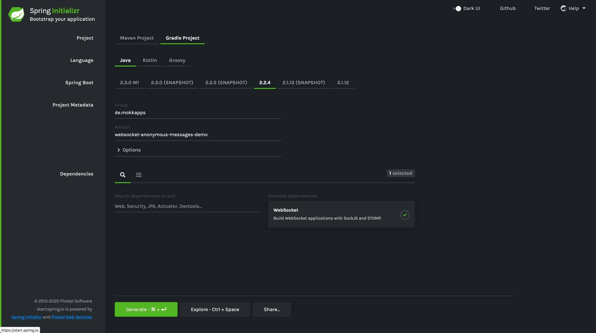

In my current, I had the opportunity to develop a new application based on [Vue.js](https://vuejs.org/) in the frontend and [Spring Boot](https://spring.io/projects/spring-boot) in the backend. The backend should send updates to the frontend via a WebSocket connection so that users do not need to refresh the website to see the latest information.

The view should show a list of transfers where the user can modify the results by using filters and pagination. As a requirement, each user should receive specific results based on his filters and pagination without broadcasting this to all other connected users. The user does not need to authenticate itself at the backend.

Most tutorials cover either the case of broadcasting messages to all connected users or to send messages to certain authenticated users. In this article, I will demonstrate how to send messages to anonymous users without broadcasting the messages.

## The Demo Project

I have a created a [demo project](https://github.com/Mokkapps/spring-boot-websocket-anonymous-messages-demo) to be able to demonstrate the functionality. It is a simple monorepo which contains a backend and a frontend folder.

### Backend

The Spring Boot backend was bootstrapped using [Spring Initializr](https://start.spring.io/) where I chose `WebSocket` as the only dependency:



#### Configure Websocket

The next step is to configure the application to use a WebSocket connection. To configure the Spring Boot application I followed [this tutorial](https://spring.io/guides/gs/messaging-stomp-websocket/) without the frontend part.

After this tutorial we have a working WebSocket controller that receives and sends messages via a WebSocket connection:

```java
@Slf4j
@Controller
public class GreetingController {

    @MessageMapping("/hello")
    @SendTo("/topic/greetings")
    public Greeting greeting(HelloMessage message) throws Exception {
        log.info("Received greeting message {}", message);
        greetingService.addUserName(principal.getName());
        Thread.sleep(1000); // simulated delay
        return new Greeting("Hello, " + HtmlUtils.htmlEscape(message.getName()) + "!");
    }
}
```

The `greeting()` method is called if a message is sent to the `/hello` destination. This is ensured by using the `@MessageMapping` annotation. The received message is then sent to `/ topic/greetings`. I have added a simulated delay to simulate any asynchronous operation that could be executed on the server-side in between receiving and sending messages. 

In this implementation, all messages are broadcasted to all connected users by using the `@SendTo` annotation.

`Greeting.java` and `HelloMessage.java` are simple Java classes which represent the transferred data objects:

```java
public class Greeting {

    private String content;

    public Greeting() {
    }

    public Greeting(String content) {
        this.content = content;
    }

    public String getContent() {
        return content;
    }
}
```

```java
public class HelloMessage {

    private String name;

    public HelloMessage() {
    }

    public HelloMessage(String name) {
        this.name = name;
    }

    public String getName() {
        return name;
    }

    public void setName(String name) {
        this.name = name;
    }
}
```

The WebSocket is configured in `WebSocketConfig.java`:

```java
@Configuration
@EnableWebSocketMessageBroker
public class WebSocketConfig implements WebSocketMessageBrokerConfigurer {

    @Override
    public void configureMessageBroker(MessageBrokerRegistry config) {
        config.enableSimpleBroker("/topic");
        config.setApplicationDestinationPrefixes("/app");
    }

    @Override
    public void registerStompEndpoints(StompEndpointRegistry registry) {
        registry.addEndpoint("/ws").setAllowedOrigins("*");
        registry.addEndpoint("/ws").setAllowedOrigins("*").withSockJS();
    }
}
```

In my project, we send updates to the clients via a scheduled interval so I also added this functionality to this demo 
project. The first step is to enable scheduling in the Spring Boot application using the `@EnableScheduling` annotation: 

```java
@SpringBootApplication
@EnableScheduling // this annotation enables scheduling
public class WebsocketAnonymousMessagesDemoApplication {

	public static void main(String[] args) {
		SpringApplication.run(WebsocketAnonymousMessagesDemoApplication.class, args);
	}
}
```

Next, a `Scheduler.java` class handles the scheduled tasks and triggers `GreetingService` to send a new message each second:

```java
@Slf4j
@Component
public class Scheduler {
    private final GreetingService greetingService;

    Scheduler(GreetingService greetingService) {
        this.greetingService = greetingService;
    }

    @Scheduled(fixedRateString = "6000", initialDelayString = "0")
    public void schedulingTask() {
        log.info("Send messages due to schedule");
        greetingService.sendMessages();
    }
}

```

`GreetingsService.java` injects `SimpMessagingTemplate` which provides methods to programmatically send WebSocket messages: 

```java
@Data
@Slf4j
@Service
public class GreetingService {
    private final SimpMessagingTemplate simpMessagingTemplate;
    private static final String WS_MESSAGE_TRANSFER_DESTINATION = "/topic/greetings";

    GreetingService(SimpMessagingTemplate simpMessagingTemplate) {
        this.simpMessagingTemplate = simpMessagingTemplate;
    }

    public void sendMessages() {
        simpMessagingTemplate.convertAndSend(WS_MESSAGE_TRANSFER_DESTINATION,
            "Hallo " + " at " + new Date().toString());
    }
}
```

`convertAndSend` is equivalent to the `@SendTo` annotation which was used in the controller to broadcast messages. 

### Frontend

The frontend was bootstrapped using the [Vue CLI](https://cli.vuejs.org):

```bash
# Install Vue CLI globally
npm install -g @vue/cli

# Create a new Vue project called "frontend"
vue create frontend
```

Next step is to add [STOMP.js](https://github.com/stomp-js/stompjs) as npm library which allows us to connect to our backend STOMP broker over WebSocket:

```bash
npm add @stomp/stompjs
```

I have created a `websocket-service.ts` as Singleton which handles the interaction with this library:

```ts
import { Client, messageCallbackType } from '@stomp/stompjs';

export class WebsocketService {
  private readonly webSocketUrl =
    process.env.NODE_ENV === 'development'
      ? 'ws://localhost:8080/ws'
      : `wss://${window.location.hostname}/ws`;
  private client: Client;
  private onConnectCb?: Function;
  private onDisconnectCb?: Function;
  private onErrorCb?: Function;
  private _isConnected = false;

  private static instance: WebsocketService;

  private constructor() {
    console.log(`${process.env.NODE_ENV === 'development' ? 'DEV' : 'PROD'} mode`);
    this.client = new Client({
      brokerURL: this.webSocketUrl,
      debug: function(str: string) {
        console.log('WS debug: ', str);
      },
      reconnectDelay: 5000,
      heartbeatIncoming: 4000,
      heartbeatOutgoing: 4000
    });

    this.client.onConnect = () => {
      this._isConnected = true;
      this.onConnectCb && this.onConnectCb();
    };

    this.client.onDisconnect = () => {
      this._isConnected = false;
      this.onDisconnectCb && this.onDisconnectCb();
    };

    this.client.onStompError = (frame: any) => {
      console.error('WS: Broker reported error: ' + frame.headers['message']);
      console.error('WS: Additional details: ' + frame.body);
      this.onErrorCb && this.onErrorCb();
    };
  }

  static getInstance(): WebsocketService {
    if (!WebsocketService.instance) {
      return new WebsocketService();
    }
    return WebsocketService.instance;
  }

  get isConnected(): boolean {
    return this._isConnected;
  }

  connect(
    onConnectCb: Function,
    onDisconnectCb: Function,
    onErrorCb: Function
  ): void {
    this.onConnectCb = onConnectCb;
    this.onDisconnectCb = onDisconnectCb;
    this.onErrorCb = onErrorCb;

    this.client.activate();
  }

  disconnect(): void {
    this.client.deactivate();
  }

  subscribe(destination: string, cb: messageCallbackType): void {
    this.client.subscribe(destination, cb);
  }

  sendMessage(destination: string, body: string): void {
    this.client.publish({ destination, body });
  }
}

```

In the constructor, the client configuration is done. If we run the backend locally the WebSocket connection is available at `localhost:8080/ws` that's why `ws://localhost:8080/ws` is used as broker URL in Vue development mode. 

The service provides this public API:

```ts
interface IWebSocketService {
  connect(
    onConnectCb: Function,
    onDisconnectCb: Function,
    onErrorCb: Function
  ): void;
  disconnect(): void;
  subscribe(destination: string, cb: messageCallbackType): void;
  sendMessage(destination: string, body: string): void;
}
```

Inside the `mounted()` method in `App.vue` the service is instantiated:

```ts
import { Component, Vue } from 'vue-property-decorator';
import { WebsocketService } from './services/websocket-service';

@Component({})
export default class App extends Vue {
  private webSocketService?: WebsocketService;
  private messages: string[] = [];

  private readonly webSocketGreetingsSubscribeEndpoint = '/topic/greetings';
  private readonly webSocketGreeetingsSendEndpoint = '/app/hello';

  mounted(): void {
    this.webSocketService = WebsocketService.getInstance();
    this.webSocketService.connect(
      () => {
        this.webSocketService &&
          this.webSocketService.subscribe(
            this.webSocketGreetingsSubscribeEndpoint,
            message => {
              if (message.body) {
                console.log('Received WS message: ', message.body);
                this.messages.push(message.body);
              } else {
                console.warn('Received empty message', message);
              }
            }
          );

        // send initial message to get jobs
        this.sendMessage();
      },
      () => {},
      () => {}
    );
  }

  private sendMessage(): void {
    this.webSocketService &&
      this.webSocketService.sendMessage(
        this.webSocketGreetingsSendEndpoint,
        JSON.stringify({name: 'Any Name'})
      );
  }
}
```

Received messages are rendered in the template:

```html
<template>
  <div id="app">
    <h1>Received WS messages</h1>
    <ul>
      <li v-for="message in messages" v-bind:key="message">{{ message }}</li>
    </ul>
  </div>
</template>
```

At this point we have a running application that can send & broadcast messages via a WebSocket connection:


## Prevent Message Broadcasting

As you can see in the video above, each connected user receives the same broadcasted message as we cannot identify certain users. In this chapter, I want to demonstrate how to prevent broadcasting messages to all users without a need for authentication.

The idea is to use UUIDs for each connected client and instead of broadcasting to all users messages are only sent to specific UUIDs.

These steps need to be performed:

1. Generate a Spring Security `Principal` name by UUID for each newly connected client by using `DefaultHandshakeHandler`
1. Store the UUID if a new message is received
1. Use `@SendToUser` instead of `@SendTo` annotation in the WebSocket controller
1. Change endpoint in frontend to have the `user`, so `/user/topic/greetings` instead of `/topic/greetings`;

Let's start by creating a `CustomHandshakeHandler.java`

```java
/**
 * Set anonymous user (Principal) in WebSocket messages by using UUID
 * This is necessary to avoid broadcasting messages but sending them to specific user sessions
 */
public class CustomHandshakeHandler extends DefaultHandshakeHandler {
    @Override
    protected Principal determineUser(ServerHttpRequest request,
                                      WebSocketHandler wsHandler,
                                      Map<String, Object> attributes) {
        // generate user name by UUID
        return new StompPrincipal(UUID.randomUUID().toString());
    }
}
```

which needs to be registered in `WebSocketConfig.java`:

```java
@Configuration
@EnableWebSocketMessageBroker
public class WebSocketConfig implements WebSocketMessageBrokerConfigurer {
    @Override
    public void registerStompEndpoints(StompEndpointRegistry registry) {
        registry
                .addEndpoint("/ws")
                .setAllowedOrigins("*")
                // use our new handler
                .setHandshakeHandler(new CustomHandshakeHandler());

        registry
                .addEndpoint("/ws")
                .setAllowedOrigins("*")
                // use our new handler
                .setHandshakeHandler(new CustomHandshakeHandler())
                .withSockJS();
    }
}
```

Now `GreetingController.java` has to be adopted:

```java
@Slf4j
@Controller
public class GreetingController {
    private final GreetingService greetingService;

    GreetingController(GreetingService greetingService) {
        this.greetingService = greetingService;
    }

    @MessageMapping("/hello")
    @SendToUser("/topic/greetings") // use @SendToUser instead of @SendTo
    public Greeting greeting(HelloMessage message, Principal principal) throws Exception {
        log.info("Received greeting message {} from {}", message, principal.getName());
        greetingService.addUserName(principal.getName()); // store UUID
        Thread.sleep(1000); // simulated delay
        return new Greeting("Hello, " + HtmlUtils.htmlEscape(message.getName()) + "!");
    }
}
```

`GreetingService` needs to be adjusted to be able to store the UUIDs in a list and we change `convertAndSend` to `convertAndSendToUser` where we iterate over all user names and send message to them: 

```java
@Data
@Slf4j
@Service
public class GreetingService {
    private final SimpMessagingTemplate simpMessagingTemplate;
    private static final String WS_MESSAGE_TRANSFER_DESTINATION = "/topic/greetings";
    private List<String> userNames = new ArrayList<>();

    GreetingService(SimpMessagingTemplate simpMessagingTemplate) {
        this.simpMessagingTemplate = simpMessagingTemplate;
    }

    public void sendMessages() {
        for (String userName : userNames) {
            simpMessagingTemplate.convertAndSendToUser(userName, WS_MESSAGE_TRANSFER_DESTINATION,
                    "Hallo " + userName + " at " + new Date().toString());
        }
    }

    public void addUserName(String username) {
        userNames.add(username);
    }
}
```

Finally, the topic endpoint in `App.vue` in the frontend code needs to be changed:

```ts
private readonly webSocketGreetingsSubscribeEndpoint = '/user/topic/greetings';
```

Let's see this in action:


## Conclusion

Sending WebSocket messages to specific anonymous users is not hard using Spring. You can also extend this mechanism by adding
another destination for broadcasted messages. This way, you can send certain messages to specific users and also broadcast messages to every connected user.  
