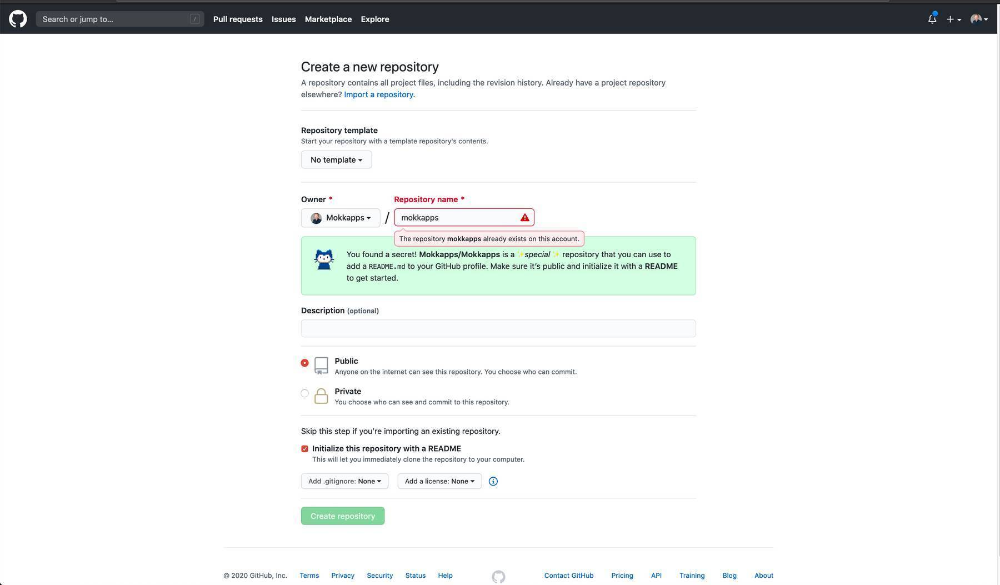

On [Hacker News](https://news.ycombinator.com/item?id=23807881) I discovered the article [Building a self-updating profile README for GitHub](https://simonwillison.net/2020/Jul/10/self-updating-profile-readme/). I was very fascinated about this new [GitHub](https://github.com) feature and wanted to build something similar for [my GitHub profile](https://github.com/Mokkapps).

## GitHub Profile README

GitHub profile READMEs are a new feature that allows users to have the content of a README markdown file rendered at the profile page.

To use this feature you just need to create a new repository that has the same name as your GitHub account. Mine is located at `github.com/mokkapps/mokkapps`.This repository needs to be public and initialized with a README:

Now you will see a new section at the top of your profile page which renders the content of this new README file:

In my example, I am showing five links to the latest blog posts on my website and the latest tweet I published on Twitter. This information is automatically updated and I want to show you how I implemented this functionality.

## Automatically Update The README

All the magic is happening in a GitHub Action defined in [build.yml](https://github.com/Mokkapps/mokkapps/blob/master/.github/workflows/build.yml). This action runs on every Git push, every 32 minutes past the hour (configured via a cron schedule) or by manually clicking a button in the GitHub Action UI (by using `workflow_dispatch` event).

The workflow performs these actions:

1. Fetches the latest tweet from my Twitter account using the Twitter API, renders it to a PNG using headless Chrome (from an R script) and saves it as PNG which is then embedded in the README (taken from [zhiiiyang](https://github.com/zhiiiyang)).
2. Runs a JavaScript script which fetches the five latest blog posts from my RSS feed and generates the final `README.md` (inspired by [simonw](https://github.com/simonw))
3. Commits and pushes the changes to the master branch of this repo

The JS script is quite simple and has only [~50 lines of code](https://github.com/Mokkapps/mokkapps/blob/master/index.js).

## Conclusion

The GitHub profile READMEs are a cool feature and by using GitHub Actions it can help us to provide up-to-date information for profile visitors. 

But most importantly I had a lot of fun building it and this is more important than everything else.
