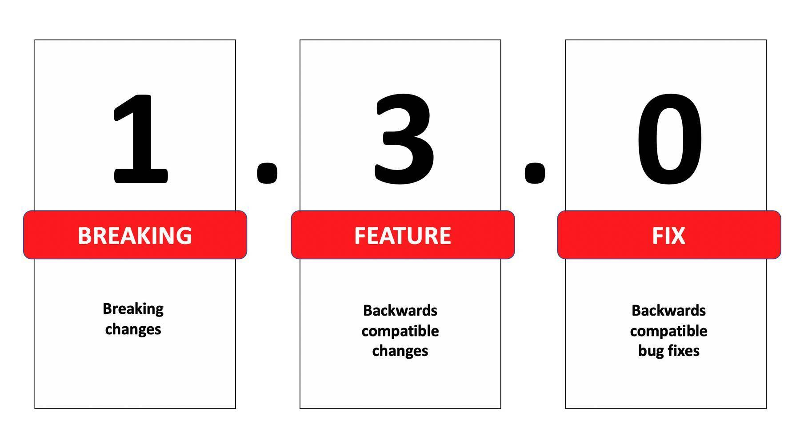
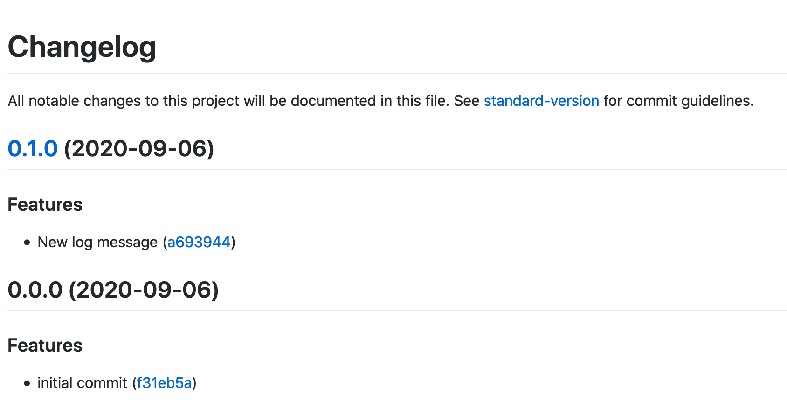

Creating a changelog is a usual task if a new software version is going to be released. It contains all the changes
which were made since the last release and is helpful to remember what has changed in the code and to be able to
inform the users of our code. 

In many projects, creating the changelog is a manual process that is often undesired, error-prone, and time-consuming.
This article describes some tools that can help to automate the changelog creation based on the Git history.

Let's start with some basics.

## Semantic Versioning 

[Semantic Versioning (SemVer)](https://semver.org/) is a de facto standard for code versioning. It specifies that a 
version number always contains these three parts: 



- **MAJOR**: is incremented when you add breaking changes, e.g. an incompatible API change 
- **MINOR**: is incremented when you add backward compatible functionality
- **PATCH**: is incremented when you add backward compatible bug fixes

## Conventional Commits

> The Conventional Commits specification proposes introducing a standardized lightweight convention on top of commit messages. 
> This convention dovetails with SemVer, asking software developers to describe in commit messages, features, fixes, and breaking changes that they make.

Developers tend to write commit messages that [serve no purpose](http://whatthecommit.com/). Usually, the message does not
describe where changes were made, what was changed, and what was the motivation for making the changes. 

So I recommend writing commit messages using the [Conventional Commits specification](https://www.conventionalcommits.org/en/v1.0.0-beta.2/):

```
<type>[optional scope]: <description>

[optional body]

[optional footer]
```

An example of such a message: 

```
fix: ABC-123: Caught Promise exception

We did not catch the promise exception thrown by the API call
and therefore we could not show the error message to the user
```

The commit type `<type>` can take one of these value:

- `fix:` a commit of this type patches a bug in your codebase and correlates with the patch version in semantic versioning
- `feat:` a commit of this type introduces a new feature to the codebase and correlates with a minor version in semantic versioning
- `BREAKING CHANGE:` a commit that has the text `BREAKING CHANGE:` at the beginning of its optional body or footer section 
introduces a breaking API change and correlates with a major version in semantic versioning. A breaking change can be part of 
commits of any type. e.g., a `fix:`, `feat:` & `chore:` types would all be valid, in addition to any other type.

Other types like `chore:`, `docs:`, `style:`, `refactor:`, `perf:`, `test:` are recommended by the
[Angular convention](https://github.com/angular/angular/blob/22b96b9/CONTRIBUTING.md#-commit-message-guidelines). These
types have no implicit effect on semantic versioning and are not part of the conventional commit specification.

I also recommend reading [How to Write Good Commit Messages: A Practical Git Guide](https://www.freecodecamp.org/news/writing-good-commit-messages-a-practical-guide/).

## Auto-Generate Changelog

Now we can start to automate the changelog creation.

1. Follow the [Conventional Commits Specification](https://conventionalcommits.org/) in your repository. We will use [@commitlint/config-conventional](https://github.com/conventional-changelog/commitlint/tree/master/%40commitlint/config-conventional) to enforce this via [Git hooks](https://git-scm.com/docs/githooks).
1. Use [standard-version](https://github.com/conventional-changelog/standard-version), a utility for versioning using SemVer and changelog generation powered by [Conventional Commits](https://www.conventionalcommits.org/).

I will demonstrate the usage based on this [demo project](https://github.com/Mokkapps/changelog-generator-demo) which 
was initialized running `npm init` and `git init`.

The next step is to install [husky](https://github.com/typicode/husky), which sets up your [Git hooks](https://git-scm.com/docs/githooks):

```
npx husky-init && npm install
```

Then install [commitlint](https://github.com/conventional-changelog/commitlint) with a config, which will be used to lint your commit message:

```
npm install @commitlint/{cli,config-conventional}
```

As we are using `config-conventional` we are automatically following the [Angular commit convention](https://github.com/angular/angular/blob/22b96b9/CONTRIBUTING.md#-commit-message-guidelines).

Now we need to tell Husky to run `commitlint` during the Git commit hook. Therefore, we need to add a `commit-msg` file to the `.husky` folder: 

```shell
#!/bin/sh
. "$(dirname "$0")/_/husky.sh"

npx --no-install commitlint --edit "$1"
```

Finally, we create a `.commitlintrc.json` file which extends the rules from [config-conventional](https://github.com/conventional-changelog/commitlint/tree/master/%40commitlint/config-conventional):

```json
{
  "extends": ["@commitlint/config-conventional"]
}
```

Running `git commit` with an invalid message will now cause an error:

```
▶ git commit -m "this commit message is invalid"
husky > commit-msg (node v14.8.0)
⧗   input: this commit message is invalid
✖   subject may not be empty [subject-empty]
✖   type may not be empty [type-empty]

✖   found 2 problems, 0 warnings
ⓘ   Get help: https://github.com/conventional-changelog/commitlint/#what-is-commitlint

husky > commit-msg hook failed (add --no-verify to bypass)
```

and valid commits will work: 

```
▶ git commit -m "feat: initial feature commit"
[master (root-commit) a87f2ea] feat: initial feature commit
 5 files changed, 1228 insertions(+)
 create mode 100644 .commitlintrc.json
 create mode 100644 .gitignore
 create mode 100644 index.js
 create mode 100644 package-lock.json
 create mode 100644 package.json
```

Now we are safe and can guarantee that only valid commit messages are in our repository. 

## Generate Changelog

Finally, we can create our changelog from our Git history. First step is to install [standard-version](https://github.com/conventional-changelog/standard-version):

```
npm i --save-dev standard-version
```

Now we can create some npm scripts in our `package.json`: 


```json
  "scripts": {
    "release": "standard-version",
    "release:minor": "standard-version --release-as minor",
    "release:patch": "standard-version --release-as patch",
    "release:major": "standard-version --release-as major"
  },
```

The changelog generation can be configured via a `.versionrc.json` file or placing a `standard-version` stanza in your `package.json`.

In our demo we use a `.versionrc.json` file based on the [Conventional Changelog Configuration Spec](https://github.com/conventional-changelog/conventional-changelog-config-spec/blob/master/versions/2.1.0/README.md): 

```json
{
    "types": [
      {"type": "feat", "section": "Features"},
      {"type": "fix", "section": "Bug Fixes"},
      {"type": "chore", "hidden": true},
      {"type": "docs", "hidden": true},
      {"type": "style", "hidden": true},
      {"type": "refactor", "hidden": true},
      {"type": "perf", "hidden": true},
      {"type": "test", "hidden": true}
    ],
    "commitUrlFormat": "https://github.com/mokkapps/changelog-generator-demo/commits/{{hash}}",
    "compareUrlFormat": "https://github.com/mokkapps/changelog-generator-demo/compare/{{previousTag}}...{{currentTag}}"
  }
  
```

An array of `type` objects represents the explicitly supported commit message types, and whether they should show up in the generated changelog file.
`commitUrlFormat` is an URL representing a specific commit at a hash and `compareUrlFormat` is an URL representing the comparison between two git shas.

The first release can be created by running `npm run release -- --first-release` in the terminal:

```
▶ npm run release -- --first-release

> changelog-generator-demo@0.0.0 release /Users/mhoffman/workspace/changelog-generator-demo
> standard-version "--first-release"

✖ skip version bump on first release
✔ created CHANGELOG.md
✔ outputting changes to CHANGELOG.md
✔ committing CHANGELOG.md
✔ tagging release v0.0.0
ℹ Run `git push --follow-tags origin master` to publish
```

An exemplary `CHANGELOG.md` could look similar to this one:



What I like is that the changelog is divided by the type of commit, it contains links to the specific commits and link to 
the diff of the version.

Of course, you can always edit the auto-generated changelog to make it more readable though. The generated changelog Markdown
text can be pasted into GitHub releases so that it shows up next to each release tag. There are a lot more options in 
the tools to customize linting commits or the changelog generation.

## Conclusion

For lazy developers like me, an automatic changelog generation is a nice tool that saves me a lot of time. Additionally,
we have better commit messages in our code repository as they follow an established specification. 

It needs some time to get used to the commit convention. You could encounter some discussions in your team as all 
code contributors need to follow the convention. The Git hook solution should catch the wrong messages as early as possible 
but you could also add a guard in your CI/CD pipeline. 

In my opinion, it is worth the effort to introduce the Git commit convention and the changelog generation in projects. 
We as developers do not need to invest much time & brain capacity for the changelog generation and have a helpful 
document where we can look up what has changed between our software releases. Additionally, we can easily share this 
with the users of our software so that they also see what they can expect from each new release.

