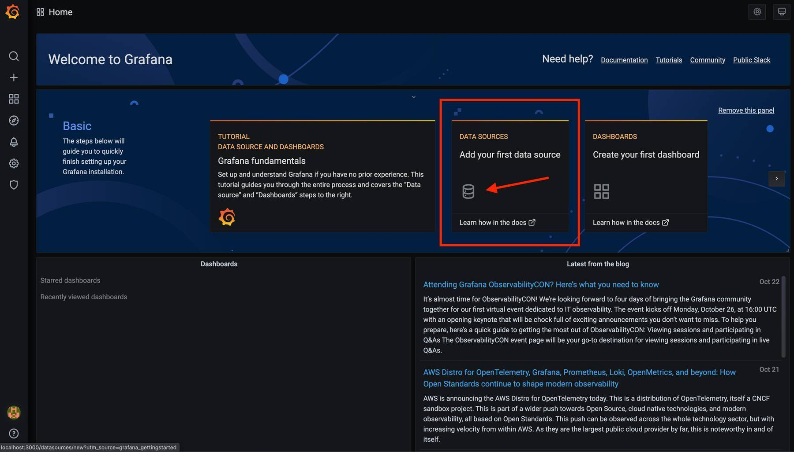
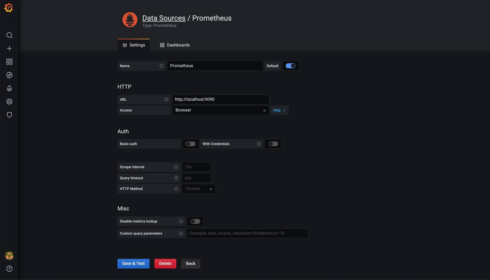
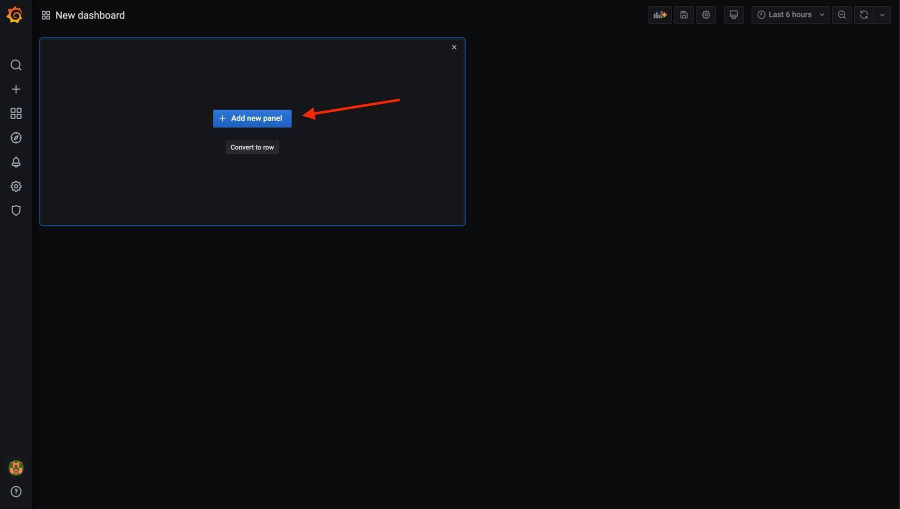
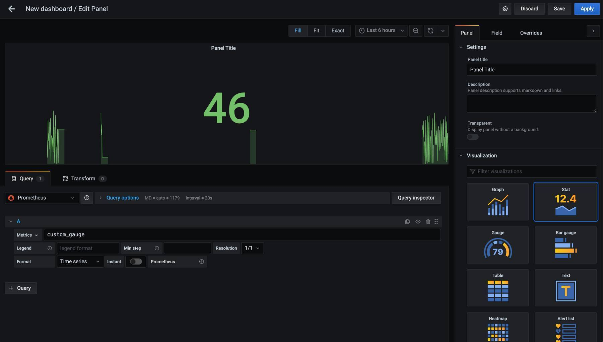
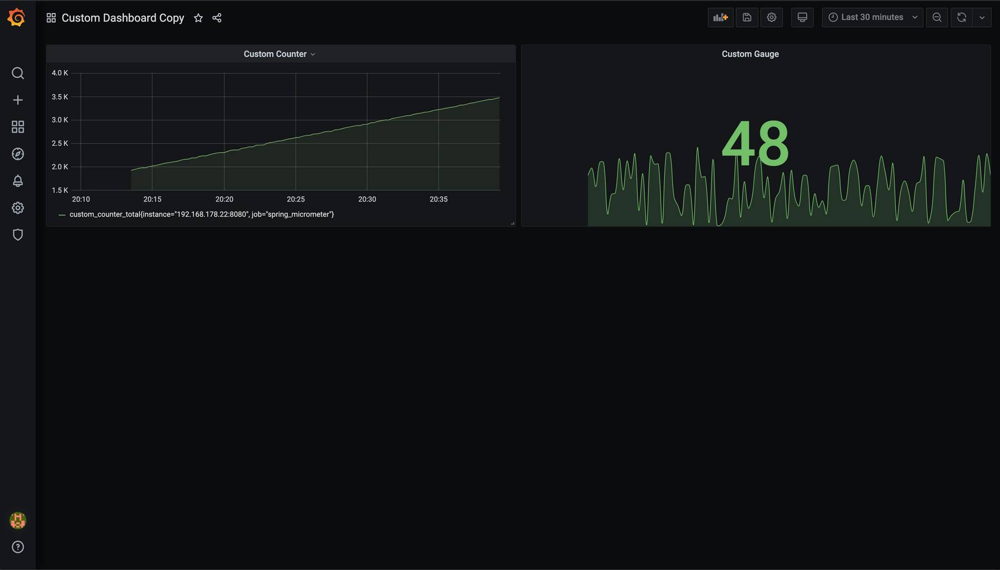

It is important to monitor an application's metrics and health which helps us to improve performance, manage the app in a better way, and notice unoptimized behavior. 
Monitoring each service is important to be able to maintain a system that consists of many microservices.

In this blog post, I will demonstrate how a Spring Boot web application can be monitored using [Micrometer](https://micrometer.io) which 
exposes metrics from our application, [Prometheus](https://prometheus.io) which stores the metric data, and [Grafana](https://grafana.com) to visualize the data in graphs.

Implementing these tools can be done quite easily by adding just a few configurations. Additional to the default JVM metrics I will show how you can expose custom metrics like a user counter.

As always, the code for the demo used in this article can be found on [GitHub](https://github.com/Mokkapps/custom-metrics-spring-boot-demo).

## Spring Boot

The base for our demo is a Spring Boot application which we initialize using [Spring Initializr](https://start.spring.io/#!type=gradle-project&language=java&platformVersion=2.3.4.RELEASE&packaging=jar&jvmVersion=11&groupId=de.mokkapps&artifactId=custom-metrics-demo&name=custom-metrics-demo&description=Custom%20metrics%20demo%20project%20for%20Spring%20Boot&packageName=de.mokkapps.custom-metrics-demo&dependencies=devtools,lombok,web,actuator,prometheus):


We initialized the project using `spring-boot-starter-actuator` which already exposes [production-ready endpoints](https://docs.spring.io/spring-boot/docs/current/reference/html/production-ready-endpoints.html).

If we start our application we can see that some endpoints like `health` and `info` are already exposed to the `/actuator` endpoint per default.

Triggering the `/actuator/health` endpoint gives us a metric if the service is up and running: 

```bash
▶ http GET "http://localhost:8080/actuator/health"
HTTP/1.1 200
Connection: keep-alive
Content-Type: application/vnd.spring-boot.actuator.v3+json
Date: Wed, 21 Oct 2020 18:11:35 GMT
Keep-Alive: timeout=60
Transfer-Encoding: chunked

{
    "status": "UP"
}
```

Spring Boot Actuator can be integrated into [Spring Boot Admin](https://github.com/codecentric/spring-boot-admin) which provides a visual admin interface for your application. 
But this approach is not very popular and has some limitations. Therefore, we use [Prometheus](https://prometheus.io) instead of Spring Boot Actuator and [Grafana](https://grafana.com) instead of Spring Boot Admin to have a more popular and framework/language-independent solution. 

This solution approach needs vendor-neutral metrics and [Micrometer](https://micrometer.io) is a popular tool for this use case.

## Micrometer

> Micrometer provides a simple facade over the instrumentation clients for the most popular monitoring systems, allowing you to instrument your JVM-based application code without vendor lock-in. 
> Think SLF4J, but for metrics.       

[Micrometer](https://micrometer.io) is an open-source project and provides a metric facade that exposes metric data in a vendor-neutral format that a monitoring system can understand. These monitoring systems are supported: 

- AppOptics
- Azure Monitor
- Netflix Atlas
- CloudWatch
- Datadog
- Dynatrace
- Elastic
- Ganglia 
- Graphite
- Humio
- Influx/Telegraf
- JMX
- KairosDB
- New Relic
- Prometheus
- SignalFx
- Google Stackdriver
- StatsD
- Wavefront

Micrometer is not part of the Spring ecosystem and needs to be added as a dependency. In our demo application, this was already done in the [Spring Initializr configuration](https://start.spring.io/#!type=gradle-project&language=java&platformVersion=2.3.4.RELEASE&packaging=jar&jvmVersion=11&groupId=de.mokkapps&artifactId=custom-metrics-demo&name=custom-metrics-demo&description=Custom%20metrics%20demo%20project%20for%20Spring%20Boot&packageName=de.mokkapps.custom-metrics-demo&dependencies=devtools,lombok,web,actuator,prometheus).

Next step is to expose the Prometheus metrics in `application.properties`: 

```
management.endpoints.web.exposure.include=prometheus,health,info,metric
```

Now we can trigger this endpoint and see the Prometheus metrics:

<details><summary>See response output</summary>
<p>

```bash
▶ http GET "http://localhost:8080/actuator/prometheus"
HTTP/1.1 200
Connection: keep-alive
Content-Length: 8187
Content-Type: text/plain; version=0.0.4;charset=utf-8
Date: Thu, 22 Oct 2020 09:19:36 GMT
Keep-Alive: timeout=60

# HELP tomcat_sessions_rejected_sessions_total
# TYPE tomcat_sessions_rejected_sessions_total counter
tomcat_sessions_rejected_sessions_total 0.0
# HELP system_cpu_usage The "recent cpu usage" for the whole system
# TYPE system_cpu_usage gauge
system_cpu_usage 0.0
# HELP jvm_buffer_count_buffers An estimate of the number of buffers in the pool
# TYPE jvm_buffer_count_buffers gauge
jvm_buffer_count_buffers{id="mapped",} 0.0
jvm_buffer_count_buffers{id="direct",} 3.0
# HELP jvm_memory_used_bytes The amount of used memory
# TYPE jvm_memory_used_bytes gauge
jvm_memory_used_bytes{area="heap",id="G1 Survivor Space",} 1.048576E7
jvm_memory_used_bytes{area="heap",id="G1 Old Gen",} 3099824.0
jvm_memory_used_bytes{area="nonheap",id="Metaspace",} 3.9556144E7
jvm_memory_used_bytes{area="nonheap",id="CodeHeap 'non-nmethods'",} 1206016.0
jvm_memory_used_bytes{area="heap",id="G1 Eden Space",} 3.3554432E7
jvm_memory_used_bytes{area="nonheap",id="Compressed Class Space",} 5010096.0
jvm_memory_used_bytes{area="nonheap",id="CodeHeap 'non-profiled nmethods'",} 6964992.0
# HELP jvm_gc_pause_seconds Time spent in GC pause
# TYPE jvm_gc_pause_seconds summary
jvm_gc_pause_seconds_count{action="end of minor GC",cause="Metadata GC Threshold",} 1.0
jvm_gc_pause_seconds_sum{action="end of minor GC",cause="Metadata GC Threshold",} 0.009
# HELP jvm_gc_pause_seconds_max Time spent in GC pause
# TYPE jvm_gc_pause_seconds_max gauge
jvm_gc_pause_seconds_max{action="end of minor GC",cause="Metadata GC Threshold",} 0.009
# HELP jvm_gc_live_data_size_bytes Size of old generation memory pool after a full GC
# TYPE jvm_gc_live_data_size_bytes gauge
jvm_gc_live_data_size_bytes 4148400.0
# HELP jvm_gc_max_data_size_bytes Max size of old generation memory pool
# TYPE jvm_gc_max_data_size_bytes gauge
jvm_gc_max_data_size_bytes 4.294967296E9
# HELP tomcat_sessions_active_current_sessions
# TYPE tomcat_sessions_active_current_sessions gauge
tomcat_sessions_active_current_sessions 0.0
# HELP process_files_open_files The open file descriptor count
# TYPE process_files_open_files gauge
process_files_open_files 69.0
# HELP http_server_requests_seconds
# TYPE http_server_requests_seconds summary
http_server_requests_seconds_count{exception="None",method="GET",outcome="SUCCESS",status="200",uri="/actuator/health",} 1.0
http_server_requests_seconds_sum{exception="None",method="GET",outcome="SUCCESS",status="200",uri="/actuator/health",} 0.041047824
# HELP http_server_requests_seconds_max
# TYPE http_server_requests_seconds_max gauge
http_server_requests_seconds_max{exception="None",method="GET",outcome="SUCCESS",status="200",uri="/actuator/health",} 0.041047824
# HELP jvm_threads_peak_threads The peak live thread count since the Java virtual machine started or peak was reset
# TYPE jvm_threads_peak_threads gauge
jvm_threads_peak_threads 32.0
# HELP process_uptime_seconds The uptime of the Java virtual machine
# TYPE process_uptime_seconds gauge
process_uptime_seconds 13.385
# HELP process_cpu_usage The "recent cpu usage" for the Java Virtual Machine process
# TYPE process_cpu_usage gauge
process_cpu_usage 0.0
# HELP jvm_memory_max_bytes The maximum amount of memory in bytes that can be used for memory management
# TYPE jvm_memory_max_bytes gauge
jvm_memory_max_bytes{area="heap",id="G1 Survivor Space",} -1.0
jvm_memory_max_bytes{area="heap",id="G1 Old Gen",} 4.294967296E9
jvm_memory_max_bytes{area="nonheap",id="Metaspace",} -1.0
jvm_memory_max_bytes{area="nonheap",id="CodeHeap 'non-nmethods'",} 7553024.0
jvm_memory_max_bytes{area="heap",id="G1 Eden Space",} -1.0
jvm_memory_max_bytes{area="nonheap",id="Compressed Class Space",} 1.073741824E9
jvm_memory_max_bytes{area="nonheap",id="CodeHeap 'non-profiled nmethods'",} 2.44105216E8
# HELP logback_events_total Number of error level events that made it to the logs
# TYPE logback_events_total counter
logback_events_total{level="warn",} 0.0
logback_events_total{level="debug",} 0.0
logback_events_total{level="error",} 0.0
logback_events_total{level="trace",} 0.0
logback_events_total{level="info",} 8.0
# HELP system_load_average_1m The sum of the number of runnable entities queued to available processors and the number of runnable entities running on the available processors averaged over a period of time
# TYPE system_load_average_1m gauge
system_load_average_1m 3.18994140625
# HELP jvm_gc_memory_promoted_bytes_total Count of positive increases in the size of the old generation memory pool before GC to after GC
# TYPE jvm_gc_memory_promoted_bytes_total counter
jvm_gc_memory_promoted_bytes_total 0.0
# HELP jvm_threads_states_threads The current number of threads having NEW state
# TYPE jvm_threads_states_threads gauge
jvm_threads_states_threads{state="runnable",} 14.0
jvm_threads_states_threads{state="blocked",} 0.0
jvm_threads_states_threads{state="waiting",} 11.0
jvm_threads_states_threads{state="timed-waiting",} 5.0
jvm_threads_states_threads{state="new",} 0.0
jvm_threads_states_threads{state="terminated",} 0.0
# HELP jvm_memory_committed_bytes The amount of memory in bytes that is committed for the Java virtual machine to use
# TYPE jvm_memory_committed_bytes gauge
jvm_memory_committed_bytes{area="heap",id="G1 Survivor Space",} 1.048576E7
jvm_memory_committed_bytes{area="heap",id="G1 Old Gen",} 1.31072E8
jvm_memory_committed_bytes{area="nonheap",id="Metaspace",} 4.1336832E7
jvm_memory_committed_bytes{area="nonheap",id="CodeHeap 'non-nmethods'",} 2949120.0
jvm_memory_committed_bytes{area="heap",id="G1 Eden Space",} 1.26877696E8
jvm_memory_committed_bytes{area="nonheap",id="Compressed Class Space",} 5767168.0
jvm_memory_committed_bytes{area="nonheap",id="CodeHeap 'non-profiled nmethods'",} 7012352.0
# HELP tomcat_sessions_active_max_sessions
# TYPE tomcat_sessions_active_max_sessions gauge
tomcat_sessions_active_max_sessions 0.0
# HELP jvm_buffer_memory_used_bytes An estimate of the memory that the Java virtual machine is using for this buffer pool
# TYPE jvm_buffer_memory_used_bytes gauge
jvm_buffer_memory_used_bytes{id="mapped",} 0.0
jvm_buffer_memory_used_bytes{id="direct",} 24576.0
# HELP jvm_gc_memory_allocated_bytes_total Incremented for an increase in the size of the young generation memory pool after one GC to before the next
# TYPE jvm_gc_memory_allocated_bytes_total counter
jvm_gc_memory_allocated_bytes_total 2.7262976E7
# HELP jvm_classes_loaded_classes The number of classes that are currently loaded in the Java virtual machine
# TYPE jvm_classes_loaded_classes gauge
jvm_classes_loaded_classes 7336.0
# HELP jvm_classes_unloaded_classes_total The total number of classes unloaded since the Java virtual machine has started execution
# TYPE jvm_classes_unloaded_classes_total counter
jvm_classes_unloaded_classes_total 0.0
# HELP tomcat_sessions_created_sessions_total
# TYPE tomcat_sessions_created_sessions_total counter
tomcat_sessions_created_sessions_total 0.0
# HELP process_files_max_files The maximum file descriptor count
# TYPE process_files_max_files gauge
process_files_max_files 10240.0
# HELP tomcat_sessions_alive_max_seconds
# TYPE tomcat_sessions_alive_max_seconds gauge
tomcat_sessions_alive_max_seconds 0.0
# HELP jvm_buffer_total_capacity_bytes An estimate of the total capacity of the buffers in this pool
# TYPE jvm_buffer_total_capacity_bytes gauge
jvm_buffer_total_capacity_bytes{id="mapped",} 0.0
jvm_buffer_total_capacity_bytes{id="direct",} 24576.0
# HELP system_cpu_count The number of processors available to the Java virtual machine
# TYPE system_cpu_count gauge
system_cpu_count 12.0
# HELP jvm_threads_live_threads The current number of live threads including both daemon and non-daemon threads
# TYPE jvm_threads_live_threads gauge
jvm_threads_live_threads 30.0
# HELP process_start_time_seconds Start time of the process since unix epoch.
# TYPE process_start_time_seconds gauge
process_start_time_seconds 1.603358363515E9
# HELP tomcat_sessions_expired_sessions_total
# TYPE tomcat_sessions_expired_sessions_total counter
tomcat_sessions_expired_sessions_total 0.0
# HELP jvm_threads_daemon_threads The current number of live daemon threads
# TYPE jvm_threads_daemon_threads gauge
jvm_threads_daemon_threads 26.0
```
</p>
</details>

### Custom Metrics

We can also define some custom metrics, which I will demonstrate in this section. The demo contains a `Scheduler` class which
periodically runs the included `schedulingTask` method. 

To be able to send custom metrics we need to import `MeterRegistry` from the Micrometer library and inject it into our class. For more detail please check the [official documentation](https://docs.spring.io/spring-boot/docs/current/reference/htmlsingle/#production-ready-metrics-custom).

It is possible to instantiate these types of meters from `MeterRegistry`:

- [Counter](https://github.com/micrometer-metrics/micrometer/blob/master/micrometer-core/src/main/java/io/micrometer/core/instrument/Counter.java#L25): reports merely a count over a specified property of an application
- [Gauge](https://github.com/micrometer-metrics/micrometer/blob/master/micrometer-core/src/main/java/io/micrometer/core/instrument/Gauge.java#L23): shows the current value of a meter
- [Timers](https://github.com/micrometer-metrics/micrometer/blob/master/micrometer-core/src/main/java/io/micrometer/core/instrument/Timer.java#L34): measures latencies or frequency of events
- [DistributionSummary](https://github.com/micrometer-metrics/micrometer/blob/master/micrometer-core/src/main/java/io/micrometer/core/instrument/DistributionSummary.java#L29): provides distribution of events and a simple summary

I implemented a counter and a gauge for demonstration purposes:

```java
@Component
public class Scheduler {

  private final AtomicInteger testGauge;
  private final Counter testCounter;

  public Scheduler(MeterRegistry meterRegistry) {
    // Counter vs. gauge, summary vs. histogram
    // https://prometheus.io/docs/practices/instrumentation/#counter-vs-gauge-summary-vs-histogram
    testGauge = meterRegistry.gauge("custom_gauge", new AtomicInteger(0));
    testCounter = meterRegistry.counter("custom_counter");
  }

  @Scheduled(fixedRateString = "1000", initialDelayString = "0")
  public void schedulingTask() {
    testGauge.set(Scheduler.getRandomNumberInRange(0, 100));

    testCounter.increment();
  }

  private static int getRandomNumberInRange(int min, int max) {
    if (min >= max) {
      throw new IllegalArgumentException("max must be greater than min");
    }

    Random r = new Random();
    return r.nextInt((max - min) + 1) + min;
  }
}
```

If we run the application we can see that our custom metrics are exposed via the `actuatuor/prometheus` endpoint: 

```bash
▶ http GET "http://localhost:8080/actuator/prometheus" | grep custom
# HELP custom_gauge
# TYPE custom_gauge gauge
custom_gauge 29.0
# HELP custom_counter_total
# TYPE custom_counter_total counter
custom_counter_total 722.0
```

As we now have the metrics available in a format that Prometheus can understand, we will look at how to set up Prometheus.

## Prometheus

[Prometheus](https://prometheus.io) stores our metric data in time series in memory by periodically pulling it via HTTP. The data can be visualized by a console template language, a built-in expression browser, or by integrating [Grafana](https://grafana.com) (which we will do after setting up Prometheus).

In this demo, we will run Prometheus locally in a Docker container and we, therefore, need some configurations in a `prometheus.yml` file that you can place anywhere on your hard drive: 

```yaml
global:
    scrape_interval: 10s # How frequently to scrape targets by default
  
scrape_configs:
    - job_name: 'spring_micrometer'         # The job name is assigned to scraped metrics by default.
      metrics_path: '/actuator/prometheus'  # The HTTP resource path on which to fetch metrics from targets.
      scrape_interval: 5s                   # How frequently to scrape targets from this job.
      static_configs:                       # A static_config allows specifying a list of targets and a common label set for them
        - targets: ['192.168.178.22:8080']
```

All available configuration options can be seen in the [official documentation](https://prometheus.io/docs/prometheus/latest/configuration/configuration/).

As we want to run Prometheus in a Docker container we need to tell Prometheus our IP address instead of `localhost` in `static_configs -> targets`. Instead of `localhost:8080` we are using `192.168.178.22:8080` where `192.168.178.22` is my IP address at the moment. To get your system IP you can use `ifconfig` or `ipconfig` in your terminal depending on your operating system.

Now we are ready to run Prometheus:

```bash
docker run -d -p 9090:9090 -v <path-to-your-prometheus.yml>:/etc/prometheus/prometheus.yml prom/prometheus
```

`<path-to-your-prometheus.yml>` should be the path where you placed the `prometheus.yml` configuration file described above.

Finally, we can open the Prometheus on `http://localhost:9090` in the web browser and search for our custom metric named `custom_gauge`:


To check that Prometheus is correctly listening to our locally running Spring Boot application we can navigate to `Status -> Targets` in the top main navigation bar:


Prometheus provides a query language PromQL, check the [official documentation](https://prometheus.io/docs/prometheus/latest/querying/basics/) for more details.

## Grafana

The included Prometheus browser graph is nice for basic visualization of our metrics but we will use [Grafana](https://grafana.com) instead. Grafana provides a rich UI where you create, explore and share dashboards that contain multiple graphs. 

Grafana can pull data from various data sources like Prometheus, Elasticsearch, InfluxDB, etc. It also allows you to set rule-based alerts, which then can notify you over Slack, Email, Hipchat, and similar.

We start Grafana also locally in a Docker container:

```bash
docker run -d -p 3000:3000 grafana/grafana
```

Opening `http://localhost:3000` in a browser should now show the following login page:


You can log in using the default username `admin` and the default password `admin`. After login, you should change these default passwords by visiting `http://localhost:3000/profile/password`.

The first step is to add our local Prometheus as our data source:






### Community Dashboard

The first dashboard we want to add is a [community dashboard](https://grafana.com/grafana/dashboards). As we are using a Spring Boot application we choose the popular [JVM dashboard](https://grafana.com/grafana/dashboards/4701):


After loading the URL we can see the imported dashboard:


### Custom Metric Dashboard

Finally, we want to create a new dashboard where we show our custom metrics. The first step is to create a new dashboard: 


Now we see a new dashboard where we can create a new panel:



In the first panel we add a visualization for our `custom_gauge` metric. I use the `Stat` visualization as it shows the current value and a simple graph: 



Additionally, a new panel for the `custom_counter` metric is added to our dashboard: 


In the end, the dashboard looks like this:



## Conclusion
It is important to monitor an application's metrics and health which helps us to improve performance, manage the app in a better way and notice unoptimized behavior. 
Monitoring each service is important to be able to maintain a system that consists of many microservices.

In this article, I showed how a Spring Boot web application can be monitored using [Micrometer](https://micrometer.io) which 
exposes metrics from our application, [Prometheus](https://prometheus.io) which stores the metric data and [Grafana](https://grafana.com) to visualize the data in graphs.

This popular monitoring approach should help you to maintain your applications and make your customers happy.

As always, the code for the demo used in this article can be found on [GitHub](https://github.com/Mokkapps/custom-metrics-spring-boot-demo).
