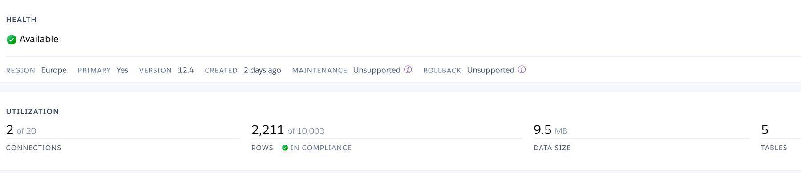
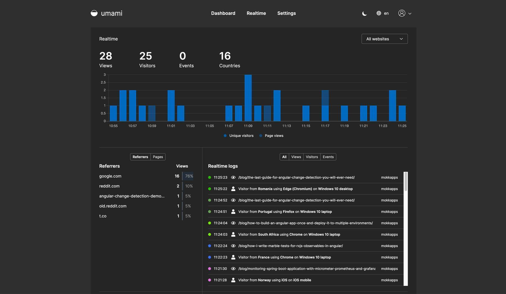

For me, it is important to see analytics about my portfolio website. This way, I can see which posts got the most views, which country my users are from, and which browser & operating system they are using.
The simplest solution to add analytics to your site is [Google Analytics](https://analytics.google.com/analytics/web/) as it is free and easy to set up. But as we all know, this service is only free
as we pay it indirectly by providing data to it. [What you need to know about Google Analytics and privacy](https://www.comparitech.com/blog/vpn-privacy/google-analytics-privacy/).

In this blog post, I will show you how I replaced [Google Analytics](https://analytics.google.com/analytics/web/) with [Umami](https://umami.is/) which is a simple, easy to use, self-hosted web analytics solution.

## Umami

I chose [Umami](https://umami.is/) because it 

- is [open-source](https://github.com/mikecao/umami)
- is privacy-focused
- simple
- easy to use
- has a [beautiful UI](https://app.umami.is/share/ISgW2qz8/flightphp.com)
- has [good documentation](https://umami.is/docs/about) 


Umami does not provide a hosting solution. Therefore, we need to host the service on our own. All you need to get Umami up and running is a database (either MySQL or PostgreSQL) and a server that can run Node.js (10.13 or newer). Check the [list of available hosting solutions](https://umami.is/docs/hosting).

I will show you two different approaches I tried to host Umami.

### Running on Heroku

> Heroku is a container-based cloud Platform as a Service (PaaS). Developers use Heroku to deploy, manage, and scale modern apps. The platform is elegant, flexible, and easy to use, offering developers the simplest path to getting their apps to market.

You can read more about [Heroku](https://www.heroku.com/) on their ["What is Heroku?"](https://www.heroku.com/about) page.

We can host Umami and a corresponding database for free on Heroku. The setup is well described in the [Umami documentation](https://umami.is/docs/running-on-heroku).

To get it running, I just had to modify the npm `start` script command to include the Heroku port: 

```bash
"start": "next start -p $PORT"
```

Using Heroku is for sure the easiest & fastest way to set up a running Umami instance but there is one drawback: It is expensive.

I collected analytics data from my website for about 2 days and I quickly realized that the free "Hobby Dev" [Heroku Postgres plan](https://elements.heroku.com/addons/heroku-postgresql#pricing) will not be enough.
 

 
 This free plan includes 10,000 database rows and I filled ~1000 per day. So the free plan would be reached in about 10 days. The next "Hobby Basic" plan for 9$/month would include 10,000,000 rows which would last for approximately 27 years (assuming 1000 new rows per day, so no increasing traffic on my website). The "Standard 0" plan for 50$/month provides unlimited rows but this is way too much money I would spend for a self-hosted analytics solution.
 
 ### Running on DigitalOcean & Vercel
 
 An alternative to Heroku is to host the database on [Digital Ocean](https://m.do.co/c/833a8650eb62) and Umami on [Vercel](https://vercel.com/).
 
 #### DigitalOcean
 
[Digital Ocean](https://m.do.co/c/833a8650eb62) is an affordable cloud hosting provider. Starting with 5$/month you get a cloud server for personal use and can scale it up as needed. Using [this link](https://m.do.co/c/833a8650eb62) you get a $100 credit for the first 60 days.

I host a MySQL database on DigitalOcean which required these steps to set up:

1. [Initial setup the server with Ubuntu 18.04](https://www.digitalocean.com/community/tutorials/initial-server-setup-with-ubuntu-18-04)
1. [Install MySQL on Ubuntu](https://www.digitalocean.com/community/tutorials/how-to-install-mysql-on-ubuntu-18-04)
1. Setup the MySQL database schema with the [Umami MySQL schema](https://github.com/mikecao/umami/blob/master/sql/schema.mysql.sql)
1. [Allow remote access to the database](https://www.digitalocean.com/community/questions/how-to-allow-remote-mysql-database-connection)


DigitalOcean also provides a [Node.js](https://www.digitalocean.com/community/questions/how-to-allow-remote-mysql-database-connection) droplet template that comes with Node.js, Ubuntu, and Nginx to host the Umami frontend. We will instead use [Vercel](https://vercel.com/) as it is completely free.

#### Vercel

[Vercel](https://vercel.com/) is the company behind the framework [Next.js](https://nextjs.org/) which is used by Umami and they provide a free frontend hosting service. As you can imagine, it is really easy to deploy a [Next.js](https://nextjs.org/) application on [Vercel](https://vercel.com/) as both applications are developed by the same company. 

The setup is described in the [official documentation](https://umami.is/docs/running-on-vercel).


If you now open the deployed Vercel app at `<app-name>.vercel.app` you need to perform these steps 
- [Login](https://umami.is/docs/login) 
- [Add your website to Umami](https://umami.is/docs/add-a-website)
- [Add tracking code to your website](https://umami.is/docs/collect-data)
- Optional: Umami is also able to [track events](https://umami.is/docs/track-events) that occur on your website

This should result in a working private, open-source, self-hosted analytics solution:




## Conclusion

I can sleep better as I now know that no more data is sent from my website to Google. I still have the possibility to track
my website analytics but in a simpler and privacy-focused way. Setting up Umami is quite easy if you are familiar with
software like Ubuntu and MySQL/Postgres. 

Of course, I know need to pay some money to store this analytics data on my server but for me, it is worth the money.
