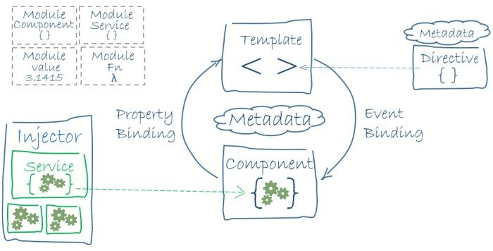

This article summarizes a list of Angular interview questions which I would ask candidates and that I get often asked in interviews. 

## Table of Contents

- [1. What is Angular? What is the difference between Angular and Vue.js / React?](#1-what-is-angular-what-is-the-difference-between-angular-and-vuejs--react)
- [2. What's new in Angular?](#2-whats-new-in-angular)
- [3. What are Angular's main concepts?](#3-what-are-angulars-main-concepts)
- [4. What is Dependency Injection?](#4-what-is-dependency-injection)
- [5. What are Observables?](#5-what-are-observables)
- [6. What is the difference between Promise and Observable?](#6-what-is-the-difference-between-promise-and-observable)
- [7. Can you explain various ways of component communication in Angular?](#7-can-you-explain-various-ways-of-component-communication-in-angular)
- [8. How can you bind data to templates?](#8-how-can-you-bind-data-to-templates)
- [9. What do you understand by services?](#9-what-do-you-understand-by-services)
- [10. What do you understand by directives?](#10-what-do-you-understand-by-directives)
- [11. JIT vs AOT](#11-jit-vs-aot)
- [12. What do you understand by lazy loading?](#12-what-do-you-understand-by-lazy-loading)
- [13. Can you explain Angular Components Lifecycle Hooks?](#13-can-you-explain-angular-components-lifecycle-hooks)
- [14. What is the difference between ViewChild and ContentChild?](#14-what-is-the-difference-between-viewchild-and-contentchild)
- [15. What is the difference between an Angular module and a JavaScript module?](#15-what-is-the-difference-between-an-angular-module-and-a-javascript-module)
- [16. What are @HostBinding and @HostListener?](#16-what-are-hostbinding-and-hostlistener)
- [17. What is the difference between OnPush and default change detection?](#17-what-is-the-difference-between-onpush-and-default-change-detection)
- [18. What is ViewEncapsulation?](#18-what-is-viewencapsulation)
- [Conclusion](#conclusion)
- [Links](#links) 


## 1. What is Angular? What is the difference between Angular and Vue.js / React?

[Angular](https://angular.io) is an application design framework and development platform for creating efficient and sophisticated single-page apps. Angular is built entirely in TypeScript and uses it as a primary language. As it is a framework it has many useful built-in features like routing, forms, HTTP client, Internationalization (i18n), animations, and many more.

[Vue.js](https://vuejs.org/) and [React](https://reactjs.org/) are no application frameworks but JavaScript libraries to build user interfaces. Vue.js describe itself as `an incrementally adoptable ecosystem that scales between a library and a full-featured framework` and React as `a JavaScript library for building user interfaces`.

## 2. What's new in Angular?

Check the [Angular blog](https://blog.angular.io) for latest release notes, for example, the [Angular 11 release](https://blog.angular.io/version-11-of-angular-now-available-74721b7952f7).

## 3. What are Angular's main concepts?

- **Component**: The basic building block of an Angular application and is used to control HTML views.
- **Modules**: An Angular module contains basic building blocks like components, services, directives, etc. Using modules you can split your application into logical pieces where each piece performs a single task and is called a "module".
- **Templates**: A template represents the view of an Angular application.
- **Services**: Services are used to create components that can be shared across the entire application.
- **Metadata**: Metadata is used to add more data to an Angular class.



## 4. What is Dependency Injection?

Dependency Injection (DI) is an important design pattern in which a class does not create dependencies itself but requests them from external sources. Dependencies are services or objects that a class needs to perform its function. Angular uses its own DI framework for resolving dependencies. The DI framework provides declared dependencies to a class when that class is instantiated.

## 5. What are Observables?

Angular heavily relies on [RxJS](https://rxjs.dev/), a library for composing asynchronous and callback-based code in a functional, reactive style using Observables. RxJS introduces Observables, a new Push system for JavaScript where an Observable is a producer of multiple values, "pushing" them to Observers (Consumers).

## 6. What is the difference between Promise and Observable?

Observable | Promise
:------ | :------
They can be run whenever the result is needed as they do not start until subscription | Execute immediately on creation  
Provides multiple values over time | Provides only one value
Subscribe method is used for error handling which makes centralized and predictable error handling | Push errors to the child promises
Provides chaining and subscription to handle complex applications | Uses only .then() clause

## 7. Can you explain various ways of component communication in Angular?
1. Data sharing between parent and one or more child components using the `@Input()` and `@Output()` directives.
2. Data sharing using an Angular service
3. Using state management, like [NgRx](https://ngrx.io/)
4. Read and write data to local storage
5. Pass data via URL parameters

## 8. How can you bind data to templates?

- **Property binding**: Property binding in Angular helps you set values for properties of HTML elements or directives
```html

```
- **Event binding**: Event binding allows you to listen for and respond to user actions such as keystrokes, mouse movements, clicks, and touches.
```html
<button (click)="onSave()">Save</button>
```
- **Two-way binding**: Two-way binding gives components in your application a way to share data. Use two-way binding binding to listen for events and update values simultaneously between parent and child components.
```html
<app-sizer [(size)]="fontSizePx"></app-sizer>
```

## 9. What do you understand by services? 

> Service is a broad category encompassing any value, function, or feature that an app needs. A service is typically a class with a narrow, well-defined purpose. It should do something specific and do it well.

An Angular component should focus on presenting data and enabling the user experience. It should mediate between the application logic (data model) and the view (rendered by the template).

Angular services help us to separate non-view-related functionality to keep component classes lean and efficient. 

### How do you provide a service? 

You must register at least one provider of any service you are going to use. A service can be provided for specific modules or components or it can be made available everywhere in your application. 

#### Provide at root level

```ts
@Injectable({
 providedIn: 'root',
})
```

Angular creates a single, shared instance if a service is provided at root level. This shared instance is injected into any class that asks for it. By using the `@Injectable()` metadata, Angular can remove the service from the compiled app if it isn't used.

### Provide with a specific NgModule

Registering a provider with a specific NgModule will return the same instance of a service to all components in that NgModule if they ask for it.

```ts
@NgModule({
  providers: [
  BackendService,
  Logger
 ],
 ...
})
```

#### Provide at component level

A new instance of a service is generated for each new instance of the component if you register the provider at component level. 

```ts
@Component({
  selector:    'app-hero-list',
  templateUrl: './hero-list.component.html',
  providers:  [ HeroService ]
})
```

## 10. What do you understand by directives?

Directives add behavior to an existing DOM element or an existing component instance. The basic difference between a component and a directive is that a component has a template, whereas an attribute or structural directive does not have a template and only one component can be instantiated per an element in a template.
     
We can differentiate between three types of directives:
- **Components**: These directives have a template.
- **Structural directives**: These directives change the DOM layout by adding and removing DOM elements.
- **Attribute directives**: These directives change the appearance or behavior of an element, component, or another directive.

## 11. JIT vs AOT

Angular provides two ways to compile your app. The compilation step is needed as Angular templates and components cannot be understood by the browser therefore the HTML and TypeScript code is converted into efficient JavaScript code.

When you run the `ng serve` or `ng build` CLI commands, the type of compilation (JIT or AOT) depends on the value of the `aot` property in your build configuration specified in `angular.json`. By default, `aot` is set to true for new CLI apps.

### Just-in-Time (JIT)

JIT compiles your app in the browser at runtime. This was the default until Angular 8.

### Ahead-of-Time (AOT)

AOT compiles your app at build time. This is the default since Angular 9.

#### What are the advantages of AOT?
- The application can be rendered without compiling the app because the browser downloads a pre-compiled version of the application.
- External CSS style sheets and HTML templates are included within the application JavaScript code. This way, a lot of AJAX requests can be saved.
- It is not necessary to download the Angular compiler which reduces the application payload.
- Template binding errors can be detected and reported during the build step itself
- No injection attacks as HTML templates and components are compiled into JavaScript.

## 12. What do you understand by lazy loading?
By default, NgModules are eagerly loaded, which means that as soon as the app loads, so do all the NgModules, whether or not they are immediately necessary. For large apps with lots of routes, consider lazy loading—a design pattern that loads NgModules as needed. Lazy loading helps keep initial bundle sizes smaller, which in turn helps decrease load times.

## 13. Can you explain Angular Components Lifecycle Hooks?

After your application instantiates a component or directive by calling its constructor, Angular calls the hook methods you have implemented at the appropriate point in the lifecycle of that instance.


Angular calls these hook methods in the following order:

1. **ngOnChanges**: Is called, when an input/output binding value changes.
2. **ngOnInit**: Is called after the first ngOnChanges.
3. **ngDoCheck**: Is called, if we as developer triggered a custom change detection.
4. **ngAfterContentInit**: Is called after the content of a component is initialized.
5. **ngAfterContentChecked**: Is called after every check of the component's content.
6. **ngAfterViewInit**: Is called after a component's views are initialized.
7. **ngAfterViewChecked**: Is called after every check of a component's views.
8. **ngOnDestroy**: Is called just before the directive is destroyed.

## 14. What is the difference between ViewChild and ContentChild?

ViewChild and ContentChild are used for component communication in Angular, for example, if a parent component wants access to one or multiple child components.

- A ViewChild is any component, directive, or element which is part of a template.
- A ContentChild is any component or element which is projected in the template.

In Angular exist two different DOMs: 

- **Content DOM** which has only knowledge of the template provided by the component at hand or content injected via `<ng-content>`.
- **View DOM** which has only knowledge of the encapsulated and the descending components.

## 15. What is the difference between an Angular module and a JavaScript module?
Both types of modules can help to modularize code and Angular relies on both kinds of modules but they are very different.
    
A JavaScript module is an individual file with JavaScript code, usually containing a class or a library of functions for a specific purpose within your app.
    
NgModules are specific to Angular and a NgModule is a class marked by the `@NgModule` decorator with a metadata object.

## 16. What are @HostBinding and @HostListener?

- `@HostListener()` function decorator allows you to handle events of the host element in the directive class. For example, it can be used to change the color of the host element if you hover over the host element with the mouse.
- `@HostBinding()` function decorator allows you to set the properties of the host element from the directive class. In this directive class, we can change any style property like height, width, color, margin, border, etc.

## 17. What is the difference between OnPush and default change detection?

Please read my article [The Last Guide For Angular Change Detection You'll Ever Need](https://www.mokkapps.de/blog/the-last-guide-for-angular-change-detection-you-will-ever-need/) for a detailed explanation.

## 18. What is ViewEncapsulation?

Component CSS styles are encapsulated into the component's view to avoid styling side effects in the rest of the Angular application. 

The type of encapsulation can be controlled per component via the `encapsulation` property in the component metadata: 

```ts
// warning: few browsers support shadow DOM encapsulation at this time
encapsulation: ViewEncapsulation.ShadowDom
```

You can choose between the following modes: 

- `ViewEncapsulation.Emulated` which is the default mode and emulates the shadow DOM behavior. It renames and preprocesses the CSS code to effectively scope the CSS to the component's view. Each DOM element gets attached some additional attributes like `_nghost` or `_ngcontent`. An element that would be a shadow DOM host in native encapsulation has a generated `_nghost` attribute. This is typically the case for component host elements. An element within a component's view has a `_ngcontent` attribute that identifies to which host's emulated shadow DOM this element belongs.
- `ViewEncapsulation.None` which tells Angular to not use view encapsulation and adds CSS to the global styles. Essentially, this is the same behavior as pasing the component's styles into the HTML.
- `ViewEncapsulation.ShadowDom` which uses the browser's native [shadow DOM](https://developer.mozilla.org/en-US/docs/Web/Web_Components/Shadow_DOM) implementation. It attaches a shadow DOM to the component's host element and then puts the component view inside that shadow DOM. The component's styles are included within the shadow DOM.


## Conclusion

I hope this list of Angular interview questions will help you to get your next Angular position. Leave me a comment if you know any other important Angular interview questions. 

## Links

- [Angular Docs](https://angular.io/docs)
- [250+ Angular Interview Questions & Answers](https://github.com/sudheerj/angular-interview-questions)
