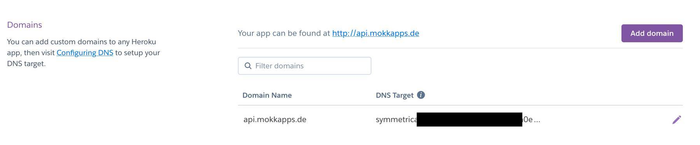
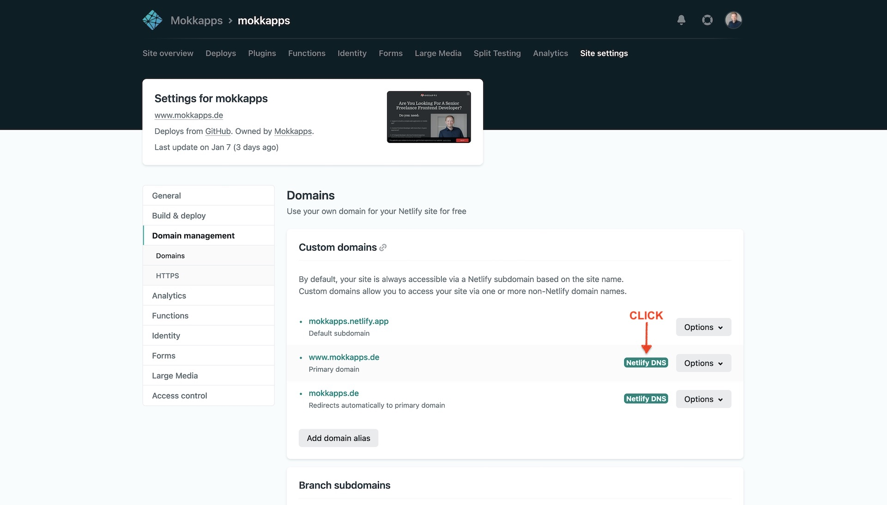
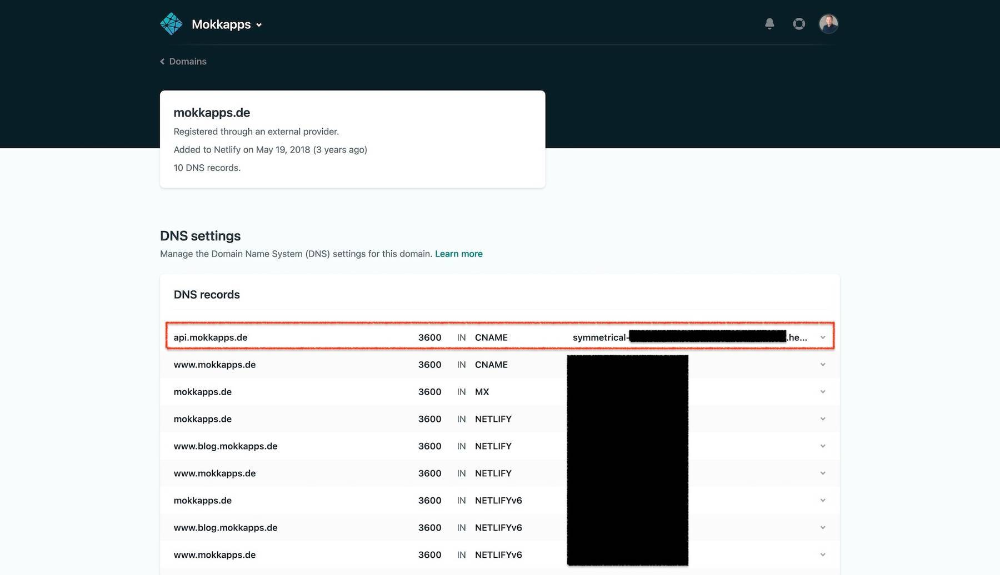

On my main domain [mokkapps.de](https://mokkapps.de) I have deployed my private portfolio website. For different use cases, I want to have a [Node.js backend](https://nodejs.org/) deployed to a subdomain, e.g. [api.mokkapps.de](http://api.mokkapps.de).

This blog post describes how you can deploy a [Heroku](https://www.heroku.com/) application to a [Netlify](https://www.netlify.com/) subdomain.

## What is a domain?

Domain names provide a human-readable address for any web server available on the Internet and are a key part of the Internet infrastructure. 
You can reach any computer which is connected to the Internet through a public IP address. This IP can either be an IPv6 address (e.g. `2001:0DB8:0000:0001:0000:0000:0010:01FF`), or an IPv4 address (e.g. `174.195.122.45`)

It is no problem for computers to handle such addresses, but we humans struggle to find out what service the website offers or who's running the server. For us, it is hard to remember IP addresses, and they also might change over time. 

All those problems are solved by domain names, like [mokkapps.de](https://mokkapps.de) in my case.

## What is a subdomain?

A subdomain is a domain that is part of a larger domain. An example: 

```
Root domain: www.mokkapps.de

Subdomain: api.mokkapps.de
```

Why should you host projects on subdomains? I see two main advantages: 

1. You are more flexible by using a different technology stack on your subdomain
1. Code can be in a different Git repository which can help to separate concerns

## Configure Heroku

I wanted to deploy a [Node.js backend](https://nodejs.org/) to [Heroku](https://www.heroku.com/) and followed the [official tutorial](https://devcenter.heroku.com/articles/getting-started-with-nodejs) to set up the application.

The next step is to configure the new subdomain in the Heroku dashboard in the `Settings` tab:



As you can see, I already have added my subdomain `api.mokkapps.de`, a new domain can be added by pressing the `Add domain` button. 

[[warning | ⚠️]]
| All default `appname.herokuapp.com` domains are already SSL-enabled and can be accessed by using HTTPS, for example, `https://appname.herokuapp.com`. To enable SSL on a custom domain you need to use the [SSL Endpoint](https://elements.heroku.com/addons/ssl) add-on which is a **paid** add-on service.

## Configure Netlify

As a final step, we need to configure our root domain DNS provider (Netlify) to point to the DNS Target (the Node.js backend deployed via Heroku) shown in the [Heroku dashboard](https://dashboard.heroku.com/).

First, we need to navigate to the Netlify DNS settings and add a new record:




Finally, we are now able to access our Node.js backend via `http://api.mokkapps.de`. 

## Conclusion

It is quite easy to configure a Heroku application to be accessible via a Netlify subdomain. The only drawback is that SSL for the Heroku custom domain is a paid add-on. 

If you do not pay for the SSL endpoint you will not be able to trigger HTTP requests from your root domain to your custom subdomain as these requests are blocked by [CORS](https://developer.mozilla.org/de/docs/Web/HTTP/CORS). 

If your website delivers HTTPS pages, all active mixed content delivered via HTTP on these pages will be blocked by default. The best strategy to avoid mixed content blocking is to serve all the content as HTTPS instead of HTTP and therefore it makes sense to pay for the Heroku SSL endpoint.
