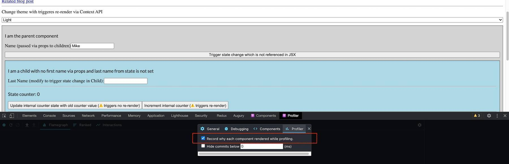
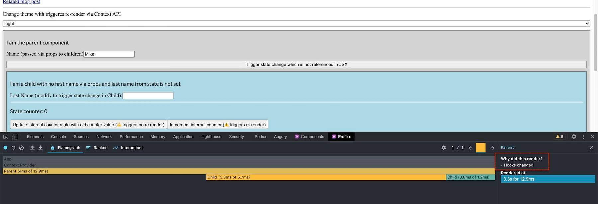
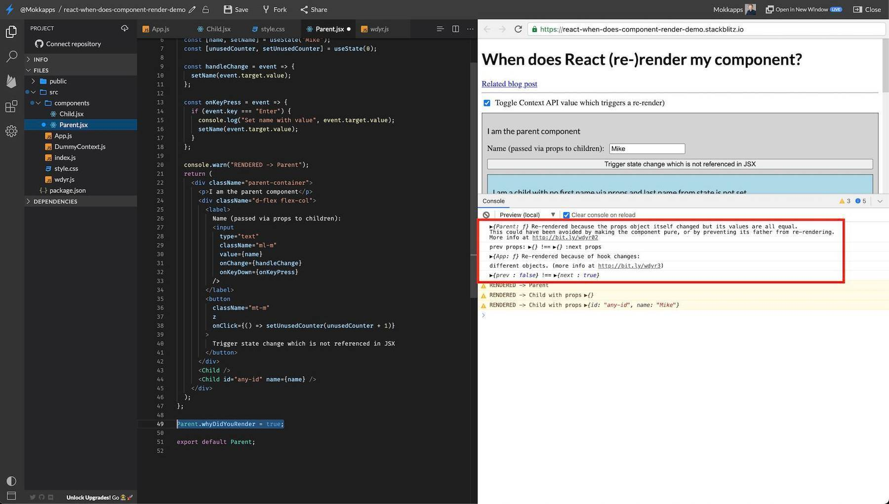

<small><span>Photo by <a href="https://unsplash.com/@flowforfrank?utm_source=unsplash&amp;utm_medium=referral&amp;utm_content=creditCopyText">Ferenc Almasi</a> on <a href="https://unsplash.com/?utm_source=unsplash&amp;utm_medium=referral&amp;utm_content=creditCopyText">Unsplash</a></span></small>  

<br/><br/>

[React](https://reactjs.org/) is known for its performance by using the Virtual DOM (VDOM). It only triggers an update for the parts of the real DOM that have changed. In my opinion, it is important to know when React triggers a re-rendering of a component to be able to debug performance issues and develop fast and efficient components. 

After reading this article, you should have a good understanding of how React rendering mechanism is working and how you can debug re-rendering issues.

## Table of Contents

- [What is rendering?](#what-is-rendering)
- [Virtual DOM](#virtual-dom)
- [What causes a render in React?](#what-causes-a-render-in-react)
- [Debug why a component rendered](#debug-why-a-component-rendered)
- [Conclusion](#conclusion)

## What is rendering?

First, we need to understand what rendering in the context of a web application means. 

If you open a website in the browser, what you see on your screen is described by the [DOM (Document Object Model)](https://www.w3.org/DOM/Overview) and represented through [HTML (Hypertext Markup Language)](https://en.wikipedia.org/wiki/HTML).

> The W3C Document Object Model (DOM) is a platform and language-neutral interface that allows programs and scripts to dynamically access and update the content, structure, and style of a document.

DOM nodes are created by React if the JSX code is converted. We should be aware that real DOM updates are slow as they cause a re-drawing of the UI. This becomes a problem if React components become too big or are nested on multiple levels. Each time a component is re-rendered its JSX is converted to DOM nodes which takes extra computation time and power. This is where React's Virtual DOM comes into the game.

## Virtual DOM

React uses a Virtual DOM (VDOM) as an additional abstraction layer on top of the DOM which reduces real DOM updates. If we change the state in our application, these changes are first applied to the VDOM. The [React DOM library](https://www.npmjs.com/package/react-dom) is used to efficiently check what parts of the UI **really** need to be visually updated in the real DOM. This process is called __diffing__ and is based on these steps:

1. VDOM gets updated by a state change in the application.
1. New VDOM is compared against a previous VDOM snapshot.
1. Only the parts of the real DOM are updated which have changed. There is no DOM update if nothing has changed.


More details about this mechanism can be found in [React's documentation about reconciliation](https://reactjs.org/docs/reconciliation.html).

## What causes a render in React?

A rendering in React is caused by 

- changing the state
- passing props
- using [Context API](https://reactjs.org/docs/context.html)

React is extremely careful and re-renders "everything all the same time". Losing information by not rendering after a state change could be very dramatic this is why re-rendering is the safer alternative.

I created a demo project on [StackBlitz](https://stackblitz.com/edit/react-when-does-component-render-demo) which I will use in this article to demonstrate React's rendering behavior:

<iframe width="100%" height="500" src="https://stackblitz.com/edit/react-when-does-component-render-demo?file=src/App.js&embed=1&ctl=1"></iframe>
<br/>

The project contains a parent component, which basically consists of two child components where one component receives props and the other not:

```jsx
class Parent extends React.Component {
  render() {
    console.warn('RENDERED -> Parent');
    return (
      <div>
        <Child />
        <Child name={name} />
      </div>
    );
  }
}
```

As you can see, we log a warning message in the console each time the component's `render` function is called. 
In our example, we use functional components and therefore the execution of the whole function is similar to the `render` function of class components.

If you take a look at the console output of the [StackBlitz demo](https://stackblitz.com/edit/react-when-does-component-render-demo), you can see that the render method is called **three** times:

1. Render `Parent` component
1. Render `Child` even if it has no props
1. Render `Child` with `name` value from state as prop

If you now modify the name in the input field we trigger a state change for each new value. Each state change in the parent 
component triggers a re-rendering of the child components even if they did not receive any props.

Does it mean that React re-renders the real DOM each time we call the `render` function? No, React only updates the part of the UI that changed.
A render is scheduled by React each time the state of a component is modified. For example, updating state via the `setState`
hook will not happen immediately but React will execute it at the best possible moment.

But calling the `render` function has some side-effects even if the real DOM is not re-rendered: 
- the code inside the render function is executed each time, which can be time-consuming depending on its content
- the diffing algorithm is executed for each component to be able to determine if the UI needs to be updated

### Visualize rendering

It is possible to visualize React's VDOM as well as the native DOM rendering in the web browser.

To show the React's **virtual** render you need to install [React DevTools](https://chrome.google.com/webstore/detail/react-developer-tools/fmkadmapgofadopljbjfkapdkoienihi) in your browser. You can then enable this feature under `Components -> View Settings -> Highlight updated when component render`.
This way we can see when React calls the render method of a component as it highlights the border of this component. This is similar to the console logs in my demo application.


Now we want to see what gets updated in the real DOM, therefore we can use the Chrome DevTools. Open it via `F12`, go to the three-dot menu on right and select `More tools -> Rendering -> Paint flashing`:


## Debug why a component rendered

In our small example, it was quite easy to analyze what action caused a component to render. In larger applications, this can be more tricky as components tend to be more complex. Luckily, we can use some tools which help us to debug what caused a component to render. 

### React DevTools
We can again use the Profiler of the [React DevTools](https://chrome.google.com/webstore/detail/react-developer-tools/fmkadmapgofadopljbjfkapdkoienihi). This feature records why each component rendered while the profiling was active. You can enable it in the React DevTools Profiler tab: 



If we now start the profiling, trigger a state change, and stop the profiling we can see that information: 



But as you can see, we only get the information that the component rendered because of a state change triggered by hook but we still don't know why this hook caused a rendering.

### Why did you render?

To debug why a  hook caused a React component to render we can use the npm package [Why Did You Render](https://github.com/welldone-software/why-did-you-render). 

> It monkey patches React to notify you about avoidable re-renders.

So it is very useful to track when and why a certain component re-renders. 

I included the npm package in my demo project on [StackBlitz](https://stackblitz.com/edit/react-when-does-component-render-demo), to enable it you need to enable it inside the `Parent.jsx` component:

```jsx
Parent.whyDidYouRender = true;
```

If we now trigger a parent re-rendering by toggling the "Toggle Context API" checkbox we can see additional console logs from the library:



The console output is:

```
{Parent: ƒ}
Re-rendered because the props object itself changed but its values are all equal.
This could have been avoided by making the component pure, or by preventing its father from re-rendering.
More info at http://bit.ly/wdyr02

prev props: {} !== {} :next props
```
```
{App: ƒ}
Re-rendered because of hook changes:
different objects. (more info at http://bit.ly/wdyr3)
{prev : false} !== {next : true}
```

As you can see from the output we get detailed information on what caused the re-rendering (for example if it was a prop or hook change) and which data were compared, for example, which props and state were used for the diffing.

## Conclusion

In this article, I explained why React re-renders a component and how you can visualize and debug this behavior. I learned a lot while writing this article
and building the demo application. I also hope that you got a better understanding of how React rendering works and that you now know how to debug your re-rendering issues. 

In the future, I will write more about React, so follow me on [Twitter](https://twitter.com/mokkapps) to get notified about the latest articles.
