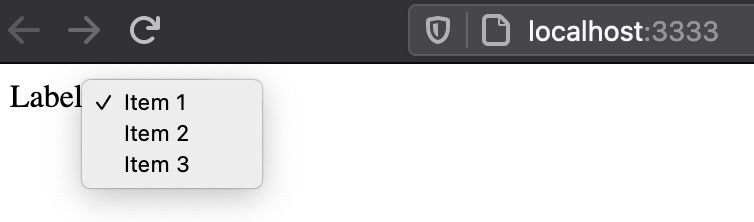
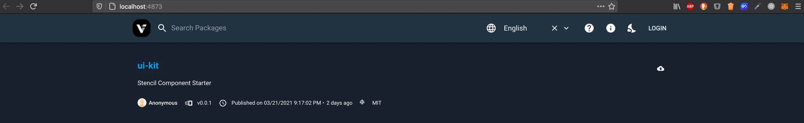
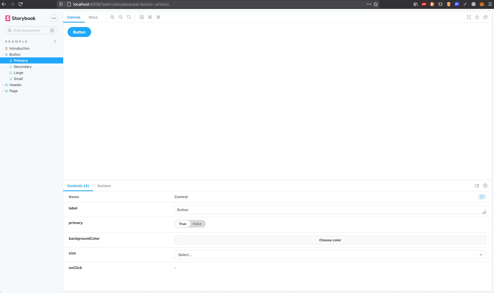
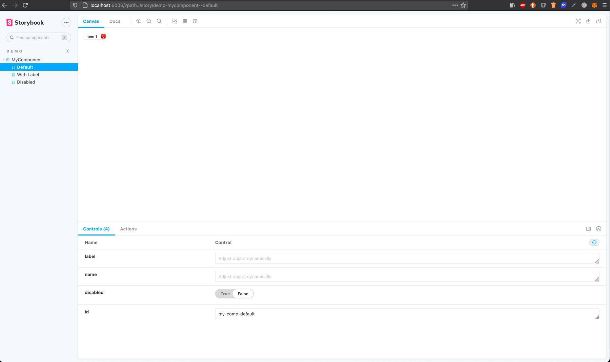

I recently joined a project where the team used two separate Git repositories for their web components based on [Stencil](https://stenciljs.com/) and [Storybook](https://storybook.js.org/). But the idea of Storybook is that the so-called "stories" live next to the components source code. Therefore, it made no sense to me to have those two tools in different repositories, and I combined them both in one repository.

My goal was that developers can also use Storybook stories via hot reload during development. Additionally, it should still be possible to separately deploy the web components to a [npm](https://www.npmjs.com/) registry and Storybook to a public URL.

This article describes the necessary steps to combine Storybook and Stencil in one repository. I wrote this article as there is currently no official documentation available on how to use Storybook with Stencil. Let's start with some basics.

## Stencil

> Stencil is a toolchain for building reusable, scalable Design Systems. Generate small, blazing fast, and 100% standards based Web Components that run in every browser.

Stencil combines the "best concepts of the most popular frameworks into a simple build-time tool" that provides features like:

- TypeScript support
- JSX support
- One way data-binding

As you can see from these picked concepts, Stencil is a [React](https://reactjs.org/)-inspired web component library. I previously worked with [lit-element](https://lit-element.polymer-project.org/) but due to the above-mentioned features, I prefer working with Stencil, especially in React projects.

### Init Stencil

Let's create a new Stencil project which will be the base for the demo project of this article which is available at [GitHub](https://github.com/Mokkapps/stencil-storybook-demo):

```bash
npm init stencil
```

We choose the `component` starter as we want to build a web component library that can be shared via npm:

```bash
? Pick a starter › - Use arrow-keys. Return to submit.

  ionic-pwa     Everything you need to build fast, production ready PWAs
  app           Minimal starter for building a Stencil app or website
❯ component     Collection of web components that can be used anywhere
```

Now we modify the automatically created `my-component.tsx` to be a bit more complex:

```ts
export interface CompOption {
  value: string;
  displayText: string;
}

@Component({
  tag: 'my-component',
  styleUrl: 'my-component.css',
  shadow: true,
})
export class MyComponent {
  /**
   * The text which is shown as label
   */
  @Prop() label: string;

  /**
   * Is needed to reference the form data after the form is submitted
   */
  @Prop({ reflect: true }) name: string;

  /**
   * If true, the button is displayed as disabled
   */
  @Prop({ reflect: true }) disabled = false;

  /**
   * Define the available options in the drop-down list
   */
  @Prop() options: CompOption[] = [];

  render() {
    return (
      <div>
        <label htmlFor={this.name}>{this.label}</label>

        <select name={this.name} id={this.name} disabled={this.disabled}>
          {this.options.map(o => (
            <option value={o.value}>{o.displayText}</option>
          ))}
        </select>
      </div>
    );
  }
}
```

Our demo component is a native HTML select component that gets its options passed via property. Some values like the label text, the component name, and if the component is disabled are also passed via props to the web component.

### Run Stencil web components

To be able to locally test our demo component we need to adjust `src/index.html` which is used if we start Stencil:

```html
<!DOCTYPE html>
<html dir="ltr" lang="en">
  <head>
    <meta charset="utf-8" />
    <meta
      name="viewport"
      content="width=device-width, initial-scale=1.0, minimum-scale=1.0, maximum-scale=5.0"
    />
    <title>Stencil Component Starter</title>

    <script type="module" src="/build/ui-kit.esm.js"></script>
    <script nomodule src="/build/ui-kit.js"></script>
  </head>
  <body>
    <my-component
      id="my-comp"
      label="Label"
      name="MyComp"
      disabled="false"
    ></my-component>
  </body>
  <script>
    document.getElementById('my-comp').options = [
      {
        value: 'Item 1',
        displayText: 'Item 1',
      },
      {
        value: 'Item 2',
        displayText: 'Item 2',
      },
      {
        value: 'Item 3',
        displayText: 'Item 3',
      },
    ];
  </script>
</html>
```

Now we can locally test our demo component by running `npm run start-stencil` which is an auto-generated npm script from Stencil. The component should now be visible at `http://localhost:3333`: 



### Build & deploy to npm registry

The next step is to deploy our component to an npm registry. For this demo, I use [Verdaccio](https://verdaccio.org) which is a "lightweight open source private npm proxy registry". First, it needs to be installed globally

```bash
npm install -g verdaccio
```

and then it can be started locally:

```bash
▶ verdaccio
 warn --- config file  - /Users/mhoffman/.config/verdaccio/config.yaml
 warn --- Verdaccio started
 warn --- Plugin successfully loaded: verdaccio-htpasswd
 warn --- Plugin successfully loaded: verdaccio-audit
 warn --- http address - http://localhost:4873/ - verdaccio/4.12.0
```

Now we have a local npm registry available at `http://localhost:4873/` so we need to tell npm to use that registry, for example, by modifying `.npmrc`:

```
registry=http://localhost:4873
```

Additionally, we need to create a user in our registry:

```bash
npm adduser --registry http://localhost:4873
```

Finally, we can pack the package and publish it to the npm registry:

```bash
npm pack
npm publish
```

It should now be visible in our private registry at `http://localhost:4873/`:



At this point, we have a working Stencil web component library that can be deployed to any npm registry. The next step is to integrate Storybook into our repository.

## Storybook

> Storybook is an open source tool for developing UI components in isolation for React, Vue, Angular, and more

A typical use case for [Storybook](https://storybook.js.org/) is to have a visual representation of a web component library. This allows
any developer or designer to see which components are currently available and how they look and behave.

### Init Storybook

As Stencil components are compiled to web components we can use the [Storybook for HTML](https://storybook.js.org/docs/guides/guide-html/) project type:

```bash
npx -p @storybook/cli sb init -t html
```

### Run & build Storybook

If we now run `npm run storybook` it opens a browser window at `http://localhost:6006` which shows some automatically generated components & stories:



Now let's write a story for our `<my-component>` demo web component:

```js
export default {
  title: 'Demo/MyComponent',
  argTypes: {
    label: { type: 'text', description: 'The text which is shown as label' },
    name: {
      type: 'text',
      description:
        'Is needed to reference the form data after the form is submitted',
    },
    disabled: {
      type: 'boolean',
      description: 'If true, the button is displayed as disabled',
      defaultValue: { summary: false },
    },
  },
};

const defaultArgs = {
  disabled: false,
};

const Template = args => {
  return <my-component {...args}></my-component>;
};

export const MyComponent = Template.bind({});
Default.MyComponent = { ...defaultArgs };
```

In our story, we defined [Controls](https://storybook.js.org/docs/react/essentials/controls#gatsby-focus-wrapper) to be able to manipulate
our component properties inside Storybook. We also added some default values and descriptions.

But unfortunately, we cannot see our component inside Storybook and need to do some further adjustments to the project setup.

First, we need to load and register our web components in `.storybook/preview.js` to include them in webpack's dependency graph. This JavaScript code is added to the preview canvas of every Storybook story and is therefore available for the webpack build:

```js
// highlight-start
import { defineCustomElements } from '../dist/esm/loader';

defineCustomElements();
// highlight-end

export const parameters = {
  actions: { argTypesRegex: '^on[A-Z].*' },
};
```

Now we need to add [@storybook/react](https://www.npmjs.com/package/@storybook/react) to be able to use our component in the story:

```bash
npm add -D @storybook/react
```

Next step is to modify our `my-component.stories.js`:

```js
//highlight-next-line
import React from 'react';
//highlight-next-line
import MyComponent from '../../../dist/collection/components/my-component/my-component';

export default {
  title: 'Demo/MyComponent',
  //highlight-next-line
  component: MyComponent,
  argTypes: {
    label: { type: 'text', description: 'The text which is shown as label' },
    name: {
      type: 'text',
      description:
        'Is needed to reference the form data after the form is submitted',
    },
    disabled: {
      type: 'boolean',
      description: 'If true, the button is displayed as disabled',
      defaultValue: { summary: false },
    },
  },
};

const defaultArgs = {
  disabled: false,
};

const Template = args => {
  return <my-component {...args}></my-component>;
};

export const Default = Template.bind({});
Default.args = { ...defaultArgs };
```

Finally, we need to add two new npm scripts:

```json
  "scripts": {
    "build-stencil:watch": "stencil build --docs-readme --watch --serve",
    "start-storybook": "start-storybook -p 6006 -s dist"
  },
```

By running Stencil's build process with the `--watch` flag it generates the correct output with the `esm/loader.mjs` file we reference in the `preview.js` file. We then just need to tell Storybook to use the `dist` folder generated by the Stencil build command and disable its caching mechanism.

If we now run `build-stencil:watch` and then `start-storybook` in a separate terminal we can see our component in Storybook:



You can now also modify your Stencil web component and due to the hot reload you can see immediately your changes in Storybook.

You might also wonder how we can set options via property? It is possible by using `setTimeout` inside the Template function in `my-component.stories.js` to ensure that the component has been loaded: 

```js
const Template = args => {
  args.id = args.id ? args.id : 'my-component';
  setTimeout(() => {
    document.getElementById(args.id).options = [
      {
        value: 'Item 1',
        displayText: 'Item 1',
      },
      {
        value: 'Item 2',
        displayText: 'Item 2',
      },
      {
        value: 'Item 3',
        displayText: 'Item 3',
      },
    ];
  });
  return <my-component {...args}></my-component>;
};
```

### Deploy Storybook

Finally, we want to deploy Storybook to a public URL and therefore we use [storybook-deployer](https://github.com/storybookjs/storybook-deployer) which provides a nice way to deploy it to GitHub Pages or AWS S3. We will deploy it to AWS S3 by installing the tool

```bash
npm i @storybook/storybook-deployer --save-dev
```

and adding some new scripts to `package.json`:

```json
  "scripts": {
    "build-storybook": "build-storybook -o ./distStorybook",
    "predeploy-storybook": "npm run build-storybook",
    "deploy-storybook": "storybook-to-aws-s3 --existing-output-dir ./distStorybook --bucket-path <AWS_BUCKET_PATH>",
  },
```

Before we deploy Storybook we trigger a build, this is done by using `build-storybook` as [pre script](https://docs.npmjs.com/cli/v7/using-npm/scripts#pre--post-scripts). You also need to ensure that your [AWS S3 has public access allowed](https://havecamerawilltravel.com/photographer/how-allow-public-access-amazon-bucket/).

For example, my demo project is hosted at [http://mokkapps-stencil-storybook-demo.s3-website.eu-central-1.amazonaws.com](http://mokkapps-stencil-storybook-demo.s3-website.eu-central-1.amazonaws.com).

## Conclusion

It is a bit tricky to combine Stencil and Storybook and it would be nice to have official documentation for this topic. 

But I think it is worth the effort, and it can also improve the local component development due to Storybook's features.

The code for the demo project is available at [GitHub](https://github.com/Mokkapps/stencil-storybook-demo).

If you liked this article, follow me on [Twitter](https://twitter.com/mokkapps) to get notified about new blog posts and more content from me.  
