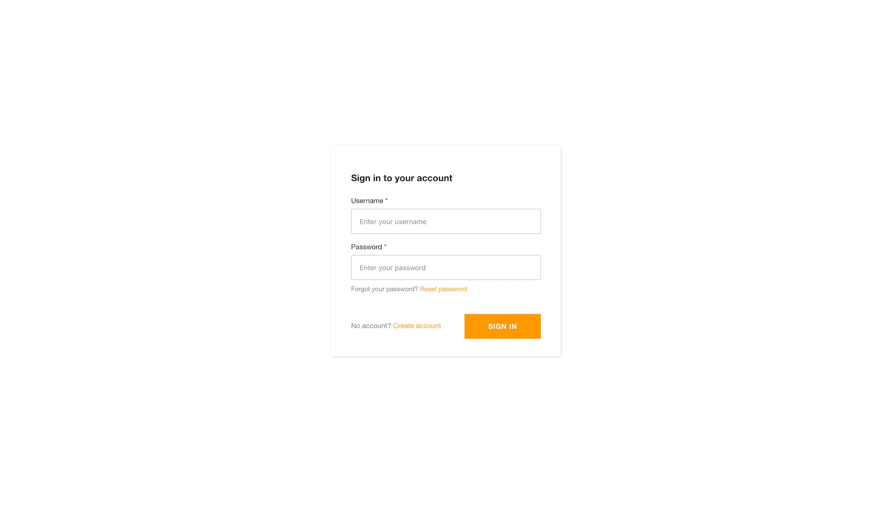
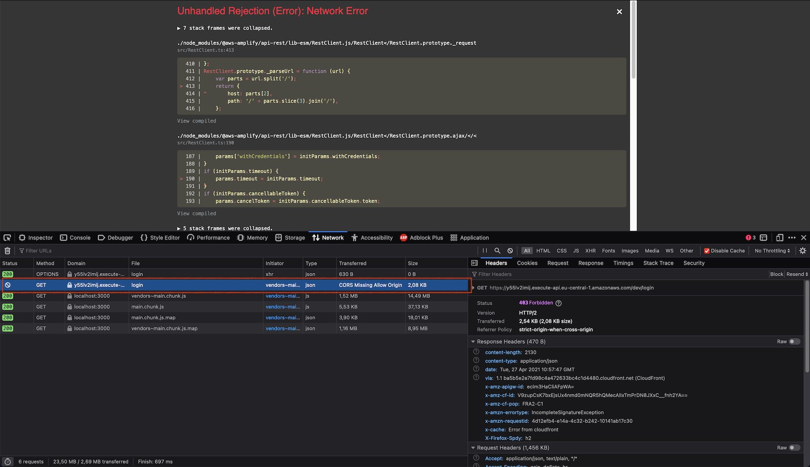
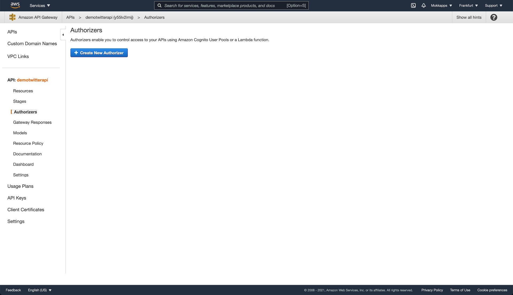
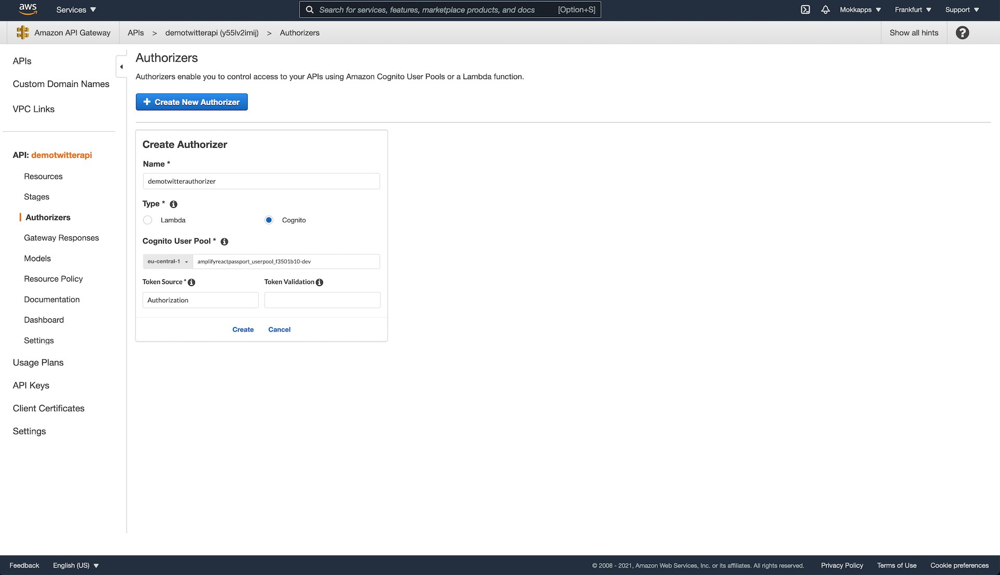
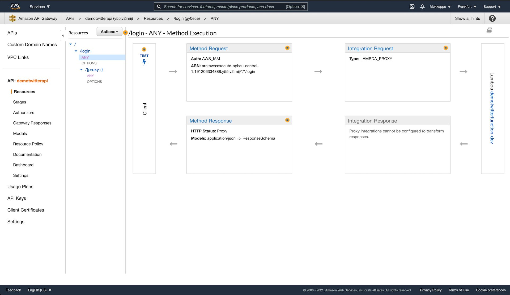
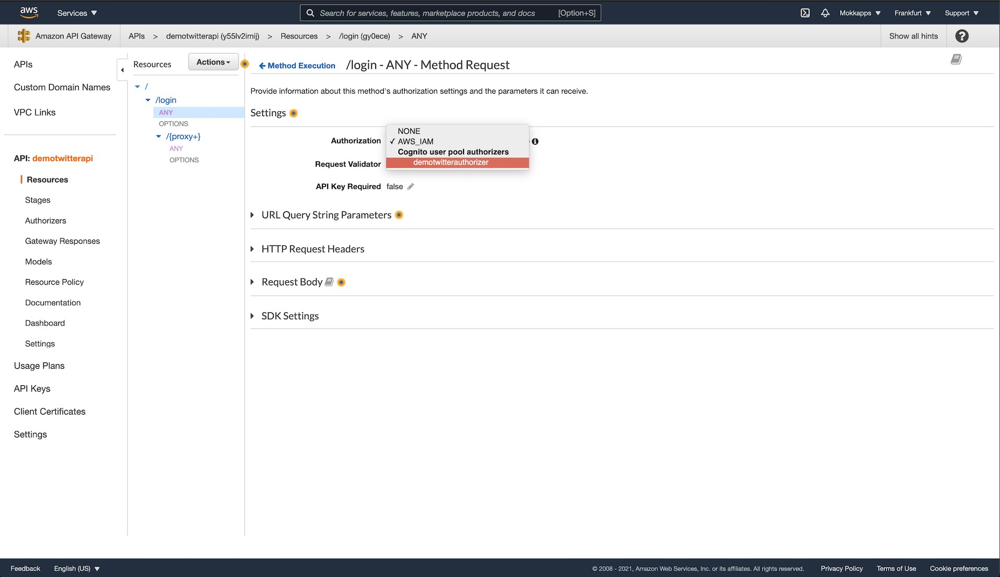
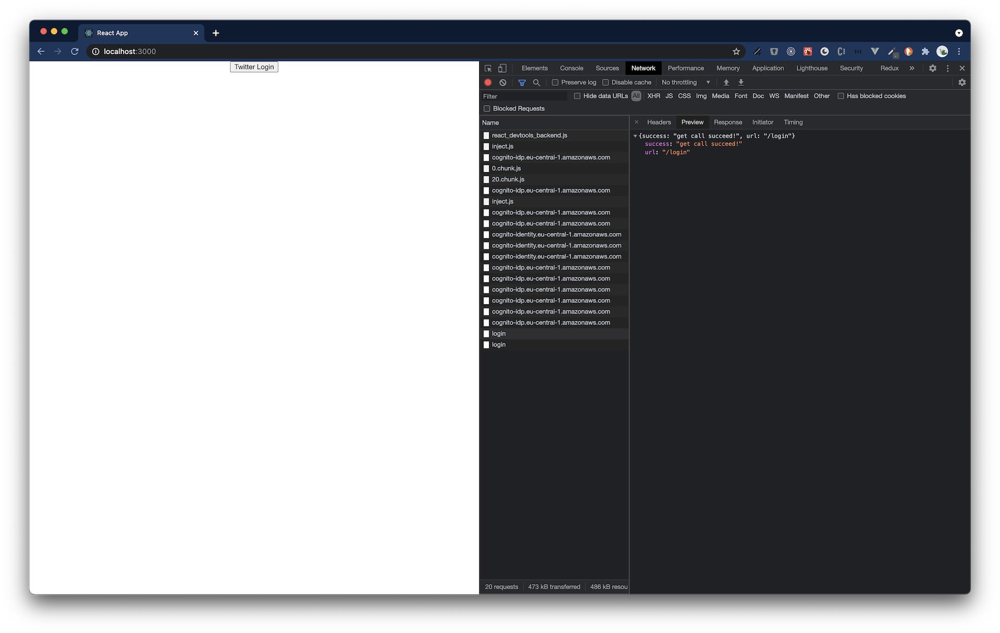

I am currently developing a private application based on [AWS Amplify](https://aws.amazon.com/amplify/) which should include Twitter authentication. In this article, I want to demonstrate how Twitter OAuth can be integrated in an Amplify application.

## Setup fullstack Amplify project

> Fastest, easiest way to build mobile and web apps that scale

[AWS Amplify](https://aws.amazon.com/amplify/) provides tools and services to build scalable full stack applications powered by [AWS](https://aws.amazon.com/). With Amplify configuring backends and deploying static web apps is easy. It supports web frameworks like Angular, React, Vue, JavaScript, Next.js, and mobile platforms including iOS, Android, React Native, Ionic and Flutter.

First we want to setup a new Amplify React project based on the [official tutorial](https://docs.amplify.aws/start):

You'll need to [create an AWS account](https://portal.aws.amazon.com/billing/signup?redirect_url=https%3A%2F%2Faws.amazon.com%2Fregistration-confirmation#/start) in order to follow the following steps. No worries, after signing up you have access to the AWS Free Tier which does not include any upfront charged or term commitments.

Next step is to install the Amplify Command Line Interface (CLI). In my case I used cURL on macOS:

```shell
curl -sL https://aws-amplify.github.io/amplify-cli/install | bash && $SHELL
```

Alternatively, you can watch [this video](https://www.youtube.com/watch?v=fWbM5DLh25U) to learn how to install and configure the Amplify CLI.

Now we can configure Amplify using the CLI

```shell
amplify configure
```

which will ask us to sign into the AWS Console. Once we’re signed in, Amplify CLI will ask us to create an [AWS IAM](https://aws.amazon.com/iam/) user:

```shell
Specify the AWS Region
? region:  # Your preferred region
Specify the username of the new IAM user:
? user name:  # User name for Amplify IAM user
Complete the user creation using the AWS console
```

We''ll be redirected to IAM where we need to finish the wizard and create a user with `AdministratorAccess` to our account to provision AWS resources. Once the user is created, Amplify CLI will ask us to provide the `accessKeyId` and `secretAccessKey` to connect Amplify CLI with our created IAM user.

```shell
Enter the access key of the newly created user:
? accessKeyId:  # YOUR_ACCESS_KEY_ID
? secretAccessKey:  # YOUR_SECRET_ACCESS_KEY
This would update/create the AWS Profile in your local machine
? Profile Name:  # (default)

Successfully set up the new user.
```

## Setup fullstack project

### Setup React frontend

At this point, we are ready to setup our fullstack project. Therefore, we create a new React app with [create-react-app](https://reactjs.org/docs/create-a-new-react-app.html). From our projects directory we run the following commands to create our new React app in a directory called `amplify-react-passport-twitter-demo` and switches us into that new directory:

```shell
npx create-react-app amplify-react-passport-twitter-demo
cd amplify-react-passport-twitter-demo
```

To start our React app we can run

```shell
npm start
```

which will start the development server at `http://localhost:3000`.

## Initialize Amplify

Now it's time to initialize Amplify in our project. From the root of the project we run

```shell
amplify init
```

which will prompt some information about the app:

```shell
Enter a name for the project (amplifyreactpassport)

? Enter a name for the project amplifyreactpassport
The following configuration will be applied:

Project information
| Name: amplifyreactpassport
| Environment: dev
| Default editor: Visual Studio Code
| App type: javascript
| Javascript framework: react
| Source Directory Path: src
| Distribution Directory Path: build
| Build Command: npm run-script build
| Start Command: npm run-script start

? Initialize the project with the above configuration? Yes

# This is the profile you created with the `amplify configure` command in the introduction step.
Do you want to use an AWS profile
```

When our new Amplify project is initialized, the CLI:

- creates a file called `aws-exports.js` in the src directory that holds all the configuration for the services we create with Amplify
- creates a top level directory called `amplify` that contains our backend definition
- modifies the `.gitignore` file and adds some generated files to the ignore list

Additionally, a new cloud project is created in the [AWS Amplify Console](https://docs.aws.amazon.com/amplify/latest/userguide/welcome.html) that can be accessed by running `amplify console. Amplify Console provides two main services, hosting and the Admin UI. More information can be found [here](https://docs.aws.amazon.com/amplify/latest/userguide/welcome.html).

Next step is to install some Amplify libraries:

```shell
npm install aws-amplify @aws-amplify/ui-react
```

- `aws-amplify`: the main library for working with Amplify in your apps
- `@aws-amplify/ui-react`: includes React specific UI components

Next, we need to configure Amplify on the client. Therefore, we need to add this code into `src/index.js` below the last import:

```javascript
import Amplify from 'aws-amplify';
import awsExports from './aws-exports';
Amplify.configure(awsExports);
```

Now Amplify is configured and we can add our REST API in the next step.

## Create Express REST API

Now it's time to setup our REST Express backend which will handle the Twitter OAuth logic.

We run the following command in your project’s root folder

```shell
amplify add api
```

and select `REST` as service type:

```shell
▶ amplify add api
? Please select from one of the below mentioned services: REST
? Provide a friendly name for your resource to be used as a label for this category in the project: demotwitterapi
? Provide a path (e.g., /book/{isbn}): /login
? Choose a Lambda source Create a new Lambda function
? Provide an AWS Lambda function name: demotwitterfunction
? Choose the runtime that you want to use: NodeJS
? Choose the function template that you want to use: Serverless ExpressJS function (Integration with API Gateway)

Available advanced settings:
- Resource access permissions
- Scheduled recurring invocation
- Lambda layers configuration

? Do you want to configure advanced settings? No
? Do you want to edit the local lambda function now? No
Successfully added resource demotwitterfunction locally.
```

Now it's time to update our backend by running

```shell
amplify push
```

Our [Express](https://expressjs.com/) server code is available at `amplify/backend/function/twitterfunction/src/app.js` which contains
the logic for our `/login` endpoint:

```javascript
app.get('/login', function (req, res) {
  // Add your code here
  res.json({ success: 'get call succeed!', url: req.url });
});
```

The endpoint URL of our API can be found in the `aws-export.js` file.

We want to trigger the login from frontend so we adjust our `App.js` file:

```javascript
import React from 'react';
import './App.css';

import { withAuthenticator } from '@aws-amplify/ui-react';
import { API, Auth } from 'aws-amplify';

function App() {
  const getJwtToken = async () => {
    return `Bearer ${(await Auth.currentSession()).getIdToken().getJwtToken()}`;
  };

  const loginTwitter = async () => {
    const token = await getJwtToken();
    const myInit = {
      headers: {
        Authorization: token,
      },
    };

    //highlight-next-line
    await API.get('demotwitterapi', '/login', myInit);
  };

  return (
    <div className="App">
      <section>
        <button onClick={loginTwitter}>Twitter Login</button>
      </section>
    </div>
  );
}

//highlight-next-line
export default withAuthenticator(App);
```

The login flow can easily be handled by using the `withAuthenticator` wrapper from the `@aws-amplify/ui-react` package. Running `npm start` will now start the app with an authentication flow allowing users to sign up and sign in.

Additionally, we added a button that triggers our API endpoint by using the API code generated by AWS.



If we are now logged, we see the `Twitter login` button but if we try to press it we will receive a CORS Missing Allow Origin error.








Now we can continue implementing the remaining endpoints using [Passport.js](https://www.passportjs.org) and [passport-twitter](https://github.com/jaredhanson/passport-twitter). Therefore we'll need these endpoints in our API:

- `/login`: Redirect the user to Twitter for authentication. When complete, Twitter will redirect the user back to the application at /oauth/callback configure my-login route to authenticate using added "local" strategy if a user is logged in, send him back a message
- `/oauth/callback`: Twitter will redirect the user to this URL after approval. Finish the authentication process by attempting to obtain an access token. If access was granted, the user will be logged in. Otherwise, authentication has failed.
- `/logout`: Logs user out from Twitter.

We can add these endpoints by running `amplify update api`:

```shell
▶ amplify update api
Scanning for plugins...
Plugin scan successful
? Please select from one of the below mentioned services: REST
? Please select the REST API you would want to update demotwitterapi
? What would you like to do Add another path
? Provide a path (e.g., /book/{isbn}): /oauth/callback
? Choose a Lambda source Use a Lambda function already added in the current Amplify project
? Choose the Lambda function to invoke by this path demotwitterfunction
? Restrict API access Yes
? Who should have access? Authenticated users only
? What kind of access do you want for Authenticated users? read
? Do you want to add another path? Yes
? Provide a path (e.g., /book/{isbn}): /logout
? Choose a Lambda source Use a Lambda function already added in the current Amplify project
? Choose the Lambda function to invoke by this path demotwitterfunction
? Restrict API access Yes
? Who should have access? Authenticated users only
? What kind of access do you want for Authenticated users? read
? Do you want to add another path? No
Successfully updated resource
```

Then we just need to push our changes using `amplify push` and add the Authorizer to the endpoints in the API Gateway as described in x.x.x

Now we to install the npm packages in `amplify/backend/function/twitterfunction/src`:

```shell
npm install passport passport-twitter express-session morgan aws-sdk
```

- `passport`:
- `passport-twitter`:
- `express-session`:
- `morgan`:
- `aws-sdk`:

Now we need to adjust `app.js` to use these libraries.

## Creating Twitter OAuth Client

Before we can use passport's Twitter Authentication strategy, we need to register our new web application with Twitter, see [the official docs](https://developer.twitter.com/en/docs/twitter-api/getting-started/getting-access-to-the-twitter-api). After we have created a new Twitter project we need to store the API key and secret. AWS provides a way to store secrets by using the [AWS Secrets Manager](https://eu-central-1.console.aws.amazon.com/secretsmanager/home).

Additionally, we need to configure OAuth for our application:

For `passport-twitter` we need two secrets

To be able to retrieve these secrets we define a `retrieveSecrets.js` file:

```javascript
const AWS = require('aws-sdk');

module.exports = () => {
  const client = new AWS.SecretsManager();
  const SecretId = 'dev/amplifyreactpassport/twitterapi';
  return new Promise((resolve, reject) => {
    client.getSecretValue({ SecretId }, (err, data) => {
      if (err) {
        reject(err);
      } else {
        resolve(JSON.parse(data.SecretString));
      }
    });
  });
};
```

These secrets need to be added as new statement to `PolicyDocument` in `demotwitterfunction-cloudformation-template.json`:

```json
        "PolicyDocument": {
          "Statement": [
            {
              "Effect": "Allow",
              "Action": [
                "secretsmanager:GetSecretValue"
              ],
              "Resource": {
                "Fn::Sub": [
                  "arn:aws:secretsmanager:eu-central-1:191206334888:secret:dev/amplifyreactpassport/twitterapi-s7UulB",
                  {
                    "region": {
                      "Ref": "AWS::Region"
                    },
                    "account": {
                      "Ref": "AWS::AccountId"
                    }
                  }
                ]
              }
            },
          ],
        }
       }
```

Now it's time to use passport in our app.js

```javascript
const passport = require('passport');
const TwitterStrategy = require('passport-twitter').Strategy;

const retrieveSecrets = require('./retrieveSecrets');

// Configure Passport authenticated session persistence.
//
// In order to restore authentication state across HTTP requests, Passport needs
// to serialize users into and deserialize users out of the session.  In a
// production-quality application, this would typically be as simple as
// supplying the user ID when serializing, and querying the user record by ID
// from the database when deserializing.  However, due to the fact that this
// example does not have a database, the complete Twitter profile is serialized
// and deserialized.
passport.serializeUser(function (user, cb) {
  cb(null, user);
});

passport.deserializeUser(function (obj, cb) {
  cb(null, obj);
});

const express = require('express');
const bodyParser = require('body-parser');

const awsServerlessExpressMiddleware = require('aws-serverless-express/middleware');

// declare a new express app
const app = express();
app.use(bodyParser.json());
app.use(awsServerlessExpressMiddleware.eventContext());
// Use application-level middleware for common functionality, including
// logging, parsing, and session handling.
app.use(require('morgan')('combined'));
app.use(require('body-parser').urlencoded({ extended: true }));
app.use(
  require('express-session')({
    secret: 'any-twitter-secret',
    resave: true,
    saveUninitialized: true,
  })
);

// Initialize Passport and restore authentication state, if any, from the
// session.
app.use(passport.initialize());
app.use(passport.session());

// Enable CORS for all methods
app.use(function (req, res, next) {
  res.header('Access-Control-Allow-Origin', '*');
  res.header('Access-Control-Allow-Headers', '*');
  next();
});

// Redirect the user to Twitter for authentication.  When complete, Twitter
// will redirect the user back to the application at /oauth/callback
// configure my-login route to authenticate using added "local" strategy
// if a user is logged in, send him back a message
app.get('/login', passport.authenticate('twitter'));

// Twitter will redirect the user to this URL after approval.  Finish the
// authentication process by attempting to obtain an access token.  If
// access was granted, the user will be logged in.  Otherwise,
// authentication has failed.
app.get(
  '/oauth/callback',
  passport.authenticate('twitter', {
    successRedirect: `http://localhost:3000/twitter`,
    failureRedirect: `http://localhost:3000/login-error`,
  })
);

// Triggers logout by destroying the current session
app.get('/logout', function (req, res) {
  req.session.destroy(function (err) {
    res.redirect('/');
  });
});

const port = 3000;
app.listen(port, async function () {
  console.log(`🚀 App started on port ${port}`);

  try {
    const secrets = await retrieveSecrets();
    const secretKey = secrets['TWITTER_API_SECRET_KEY'];
    const apiKey = secrets['TWITTER_API_KEY'];

    passport.use(
      new TwitterStrategy(
        {
          consumerKey: apiKey,
          consumerSecret: secretKey,
          callbackURL: `${process.env.DEV_API_BASE_URL}/oauth/callback`,
        },
        function (token, tokenSecret, profile, cb) {
          console.log('TWITTER verify', { token, tokenSecret, profile });
          // User.findOrCreate(..., function(err, user) {
          //   if (err) { return done(err); }
          //   done(null, user);
          // });
          // In this example, the user's Twitter profile is supplied as the user
          // record.  In a production-quality application, the Twitter profile should
          // be associated with a user record in the application's database, which
          // allows for account linking and authentication with other identity
          // providers.
          return cb(null, profile);
        }
      )
    );
  } catch (e) {
    console.error('Failed to init passport', e);
  }
});

// Export the app object. When executing the application local this does nothing. However,
// to port it to AWS Lambda we will create a wrapper around that will load the app from
// this file
module.exports = app;
```

As you can see we reference `process.env.DEV_API_BASE_URL` to call the `/oauth/callback` endpoint of our API. Environment variables which does not contain sensitive data can be added to `demotwitterfunction-cloudformation-template.json`:

```json
  "Parameters": {
    "backendDevApiUrlKey" : {
      "Type" : "String",
      "Default" : "https://<HASH>.execute-api.eu-central-1.amazonaws.com/dev"
    }
  }
  "Environment": {
     "Variables":{
        "DEV_API_BASE_URL": {
          "Ref": "backendDevApiUrlKey"
        }
     }
  }
```

Finally, we need to add the OAuth success & failure routes to our React application: 

```shell
npm install react-router-dom
```

## Conclusion
