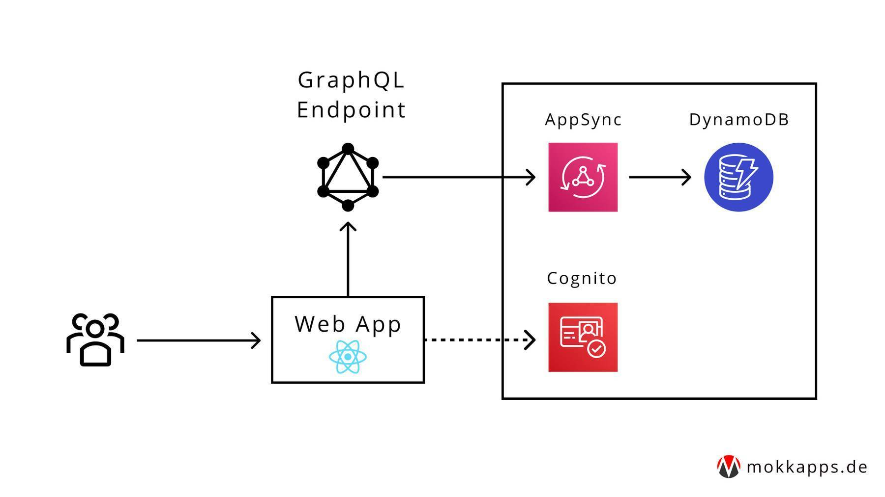
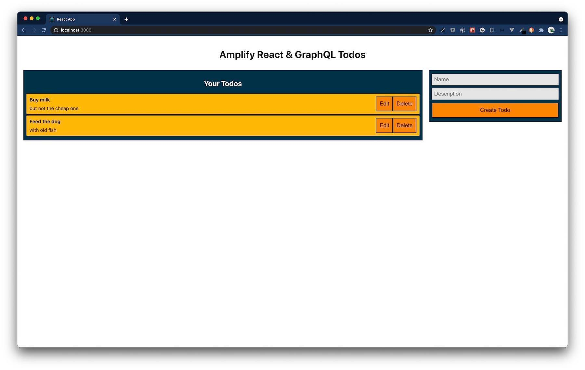

Recently I recognized that some SaaS (Software as a Service) products use [AWS Amplify](https://aws.amazon.com/amplify/) which helps them to build serverless full-stack applications. I think [serverless computing](https://www.cloudflare.com/learning/serverless/why-use-serverless/) will be the future of apps and software. Therefore, I wanted to gather some
hands-on experience, and I built a serverless application using AWS Amplify that uses React as frontend framework and GraphQL as backend API. 

In this article, I want to guide you through the process how to build and deploy such an Amplify application.

## Table of Contents

* [Set up Amplify](#set-up-amplify)
* [Set up fullstack Amplify project](#set-up-fullstack-amplify-project)
  - [Create React frontend](#create-react-frontend)
  - [Initialize Amplify](#initialize-amplify)
  - [Create GraphQL API](#create-graphql-api)
  - [Connect frontend to API](#connect-frontend-to-api)
  - [Add authentication](#add-authentication)
  - [Deploy and host app](#deploy-and-host-app)
* [What's next](#whats-next)
* [Conclusion](#conclusion)

## Set up Amplify

[AWS Amplify](https://aws.amazon.com/amplify/) describes itself as:

> Fastest, easiest way to build mobile and web apps that scale

Amplify provides tools and services to build scalable full-stack applications powered by [AWS (Amazon Web Services)](https://aws.amazon.com/). With Amplify configuring backends and deploying static web apps is easy. It supports web frameworks like Angular, React, Vue, JavaScript, Next.js, and mobile platforms including iOS, Android, React Native, Ionic, and Flutter.

You'll need to [create an AWS account](https://portal.aws.amazon.com/billing/signup?redirect_url=https%3A%2F%2Faws.amazon.com%2Fregistration-confirmation#/start) to follow the following steps. No worries, after signing up you have access to the AWS Free Tier which does not include any upfront charges or term commitments.

The next step is to install the Amplify Command Line Interface (CLI). In my case I used cURL on macOS:

```shell
curl -sL https://aws-amplify.github.io/amplify-cli/install | bash && $SHELL
```

Alternatively, you can watch [this video](https://www.youtube.com/watch?v=fWbM5DLh25U) to learn how to install and configure the Amplify CLI.

Now we can configure Amplify using the CLI

```shell
amplify configure
```

which will ask us to sign in to AWS Console. Once we’re signed in, Amplify CLI will ask us to create an [AWS IAM](https://aws.amazon.com/iam/) user:

```shell
Specify the AWS Region
? region:  # Your preferred region
Specify the username of the new IAM user:
? user name:  # User name for Amplify IAM user
Complete the user creation using the AWS console
```

We'll be redirected to IAM where we need to finish the wizard and create a user with `AdministratorAccess` in our account to provision AWS resources. Once the user is created, Amplify CLI will ask us to provide the `accessKeyId` and `secretAccessKey` to connect Amplify CLI with our created IAM user:

```shell
Enter the access key of the newly created user:
? accessKeyId:  # YOUR_ACCESS_KEY_ID
? secretAccessKey:  # YOUR_SECRET_ACCESS_KEY
This would update/create the AWS Profile in your local machine
? Profile Name:  # (default)

Successfully set up the new user.
```

## Set up full-stack Amplify project

At this point, we are ready to set up our full-stack project using a [React](https://reactjs.org/) application in the frontend and [GraphQL](https://graphql.org/) as backend API. We'll build a Todo CRUD (create, read, update, delete) application that uses this architecture: 



The complete source code of this demo is available at [GitHub](https://github.com/Mokkapps/amplify-react-graphql-todo-demo/). 

### Create React frontend
Let's start by creating a new React app using [create-react-app](https://reactjs.org/docs/create-a-new-react-app.html). From our projects directory we run the following commands to create our new React app in a directory called `amplify-react-graphql-demo` and to navigate into that new directory:

```shell
npx create-react-app amplify-react-graphql-demo
cd amplify-react-graphql-demo
```

To start our React app we can run

```shell
npm start
```

which will start the development server at `http://localhost:3000`.

### Initialize Amplify

Now it's time to initialize Amplify in our project. From the root of the project we run

```shell
amplify init
```

which will prompt some information about the app:

```shell
▶ amplify init
? Enter a name for the project amplifyreactdemo
The following configuration will be applied:

Project information
| Name: amplifyreactdemo
| Environment: dev
| Default editor: Visual Studio Code
| App type: javascript
| Javascript framework: react
| Source Directory Path: src
| Distribution Directory Path: build
| Build Command: npm run-script build
| Start Command: npm run-script start

? Initialize the project with the above configuration? Yes
Using default provider  awscloudformation
? Select the authentication method you want to use: AWS profile
? Please choose the profile you want to use: default
```

When our new Amplify project is initialized, the CLI:
- created a file called `aws-exports.js` in the src directory that holds all the configuration for the services we create with Amplify
- created a top-level directory called `amplify` that contains our backend definition
- modified the `.gitignore` file and adds some generated files to the ignore list

Additionally, a new cloud project is created in the [AWS Amplify Console](https://docs.aws.amazon.com/amplify/latest/userguide/welcome.html) that can be accessed by running `amplify console`. Amplify Console provides two main services: hosting and the Admin UI. More information can be found [here](https://docs.aws.amazon.com/amplify/latest/userguide/welcome.html).

The next step is to install some Amplify libraries:

```shell
npm install aws-amplify @aws-amplify/ui-react typescript
```

- `aws-amplify`: the main library for working with Amplify in your apps
- `@aws-amplify/ui-react`: includes React specific UI components
- `typescript`: we will use [TypeScript](https://www.typescriptlang.org/) in some parts of this demo

Next, we need to configure Amplify on the client. Therefore, we need to add the following code below the last import in `src/index.js` :

```javascript
import Amplify from 'aws-amplify';
import awsExports from './aws-exports';
Amplify.configure(awsExports);
```

At this point wee have a running React frontend application, Amplify is configured, and we can now add our GraphQL API.

### Create GraphQL API

We will now create a backend that provides a GraphQL API using AWS AppSync (a managed GraphQL service) that uses Amazon DynamoDB (a NoSQL database).

To add a new API we need to run the following command in our project’s root folder:

```shell
▶ amplify add api
? Please select from one of the below mentioned services: GraphQL
? Provide API name: demoapi
? Choose the default authorization type for the API: API key
? Enter a description for the API key:
? After how many days from now the API key should expire (1-365): 7
? Do you want to configure advanced settings for the GraphQL API: No, I am done.
? Do you have an annotated GraphQL schema? No
? Choose a schema template: Single object with fields (e.g., “Todo” with ID, name, description)
```

After the process finished successfully we can inspect the GraphQL schema at `amplify/backend/api/demoapi/schema.graphql`:

```graphql
type Todo @model {
  id: ID!
  name: String!
  description: String
}
```

The generated Todo type is annotated with a `@model` directive that is part of the [GraphQL transform](https://docs.amplify.aws/cli/graphql-transformer/model) library of Amplify. The library contains multiple directives which can be used for authentication, to define data models, and more. Adding the `@model` directive will create a database table for this type (in our example a Todo table), the CRUD (create, read, update, delete) schema, and the corresponding GraphQL resolvers.

Now it's time to deploy our backend:

```shell
▶ amplify push
✔ Successfully pulled backend environment dev from the cloud.

Current Environment: dev

| Category | Resource name | Operation | Provider plugin   |
| -------- | ------------- | --------- | ----------------- |
| Api      | demoapi       | Create    | awscloudformation |
? Are you sure you want to continue? Yes
? Do you want to generate code for your newly created GraphQL API: Yes
? Choose the code generation language target: typescript
? Enter the file name pattern of graphql queries, mutations and subscriptions: src/graphql/**/*.ts
? Do you want to generate/update all possible GraphQL operations - queries, mutations and subscriptions: Yes
? Enter maximum statement depth [increase from default if your schema is deeply nested] 2
? Enter the file name for the generated code: src/API.ts
```

After it is finished successfully our GraphQL API is deployed and we can interact with it. To see and interact with the GraphQL API in the AppSync console at any time we can run:

```bash
amplify console api
```


Alternatively, we can run this command

```bash
amplify console api
```

to view the entire app in the Amplify console.

### Connect frontend to API

The GraphQL mutations, queries and subscriptions are available at `src/graphql`. To be able to interact with them we can use the generated `src/API.ts` file. So we need extend `App.js` to be able to create, edit and delete Todos via our GraphQL API:

```javascript
import React, { useEffect, useState } from 'react';
// highlight-next-line
import { API, graphqlOperation } from '@aws-amplify/api';

import { listTodos } from './graphql/queries';
import { createTodo, deleteTodo, updateTodo } from './graphql/mutations';
import TodoList from './components/TodoList';
import CreateTodo from './components/CreateTodo';

const initialState = { name: '', description: '' };

function App() {
  const [formState, setFormState] = useState(initialState);
  const [todos, setTodos] = useState([]);
  const [apiError, setApiError] = useState();
  const [isLoading, setIsLoading] = useState(false);

  useEffect(() => {
    fetchTodos();
  }, []);

  function setInput(key, value) {
    setFormState({ ...formState, [key]: value });
  }

  async function fetchTodos() {
    setIsLoading(true);
    try {
      // highlight-next-line
      const todoData = await API.graphql(graphqlOperation(listTodos));
      const todos = todoData.data.listTodos.items;
      setTodos(todos);
      setApiError(null);
    } catch (error) {
      console.error('Failed fetching todos:', error);
      setApiError(error);
    } finally {
      setIsLoading(false);
    }
  }

  async function addTodo() {
    try {
      if (!formState.name || !formState.description) {
        return;
      }
      const todo = { ...formState };
      setTodos([...todos, todo]);
      setFormState(initialState);
      // highlight-next-line
      await API.graphql(graphqlOperation(createTodo, { input: todo }));
      setApiError(null);
    } catch (error) {
      console.error('Failed creating todo:', error);
      setApiError(error);
    }
  }

  async function removeTodo(id) {
    try {
      // highlight-next-line
      await API.graphql(graphqlOperation(deleteTodo, { input: { id } }));
      setTodos(todos.filter(todo => todo.id !== id));
      setApiError(null);
    } catch (error) {
      console.error('Failed deleting todo:', error);
      setApiError(error);
    }
  }

  async function onItemUpdate(todo) {
    try {
      // highlight-start
      await API.graphql(
        graphqlOperation(updateTodo, {
          input: {
            name: todo.name,
            description: todo.description,
            id: todo.id,
          },
        })
      );
      // highlight-end
      setApiError(null);
    } catch (error) {
      console.error('Failed updating todo:', error);
      setApiError(error);
    }
  }

  const errorMessage = apiError && (
    <p style={styles.errorText}>
      {apiError.errors.map(error => (
        <p>{error.message}</p>
      ))}
    </p>
  );

  if (isLoading) {
    return 'Loading...';
  }

  return (
    <div style={styles.container}>
      <h1 style={styles.heading}>Amplify React & GraphQL Todos</h1>
      {errorMessage}
      <div style={styles.grid}>
        <TodoList
          todos={todos}
          onRemoveTodo={removeTodo}
          onItemUpdate={onItemUpdate}
        />
        <CreateTodo
          description={formState.description}
          name={formState.name}
          onCreate={addTodo}
          onDescriptionChange={setInput}
          onNameChange={setInput}
        />
      </div>
    </div>
  );
}

export default App;
```

The full source code of this demo is available at [GitHub](https://github.com/Mokkapps/amplify-react-graphql-todo-demo/).

The application should show a list of available Todos which can be edited or deleted. Additionally, we have the possibility to create new Todos:



### Add authentication

Amplify uses [Amazon Cognito](https://aws.amazon.com/cognito/) as the main authentication provider. We'll use it to add authentication to our application by adding a login that requires a password and username.

To add authentication we need to run

```bash
▶ amplify add auth
Using service: Cognito, provided by: awscloudformation
 The current configured provider is Amazon Cognito.

 Do you want to use the default authentication and security configuration? Default configuration
 Warning: you will not be able to edit these selections.
 How do you want users to be able to sign in? Username
 Do you want to configure advanced settings? No, I am done.
```

and deploy our service by running

```bash
amplify push
```

Now we can add the login UI to our frontend. The login flow can easily be handled by using the `withAuthenticator` wrapper from the `@aws-amplify/ui-react` package. We just need to adjust our `App.js` and import `withAuthenticator`:

```javascript
import { withAuthenticator } from '@aws-amplify/ui-react';
```

Now we need to wrap the main component with the `withAuthenticator` wrapper:

```javascript
export default withAuthenticator(App);
```

Running `npm start` will now start the app with an authentication flow allowing users to sign up and sign in:


### Deploy and host app

Finally, we want to deploy our app which can be either done manually or via automatic continuous deployment. In this demo I want to deploy
it manually and host it as static web app. If you want to use continuous deployment instead, please check out [this official guide](https://docs.aws.amazon.com/amplify/latest/userguide/multi-environments.html#standard).

First, we need to add hosting:

```bash
▶ amplify add hosting
? Select the plugin module to execute: Hosting with Amplify Console (Managed hosting with custom domains, Continuous deployment)
? Choose a type: Manual deployment
```

and then we are ready to publish our app:

```bash
amplify publish
```

After publishing, we can see the app URL where our application is hosted on an `amplifyapp.com domain in our terminal.

## What's next

Amplify provides also a way to run your API locally, [check out this tutorial](https://docs.amplify.aws/start/getting-started/data-model/q/integration/react#optional-test-your-api).

Here are some cool things that you can additionally add to your Amplify application:

- [DataStore](https://docs.amplify.aws/lib/datastore/getting-started/q/platform/js) 
- [User File Storage](https://docs.amplify.aws/lib/storage/getting-started/q/platform/js) 
- [Serverless APIs](https://docs.amplify.aws/lib/graphqlapi/getting-started/q/platform/js) 
- [Analytics](https://docs.amplify.aws/lib/analytics/getting-started/q/platform/js) 
- [AI/ML](https://docs.amplify.aws/lib/predictions/getting-started/q/platform/js) 
- [Push Notification](https://docs.amplify.aws/lib/push-notifications/getting-started/q/platform/js) 
- [PubSub](https://docs.amplify.aws/lib/pubsub/getting-started/q/platform/js) 
- [AR/VR](https://docs.amplify.aws/lib/xr/getting-started/q/platform/js)

Take a look at the [official Amplify docs](https://docs.amplify.aws) for further information about the framework.

## Conclusion

In this article I showed you that building and deploying a full-stack serverless application using AWS Amplify requires a minimum amount of work.
Without using such a framework it would be much harder and this way you can focus more on the end product instead of what is happening inside.

If you liked this article, follow me on [Twitter](https://twitter.com/mokkapps) to get notified about new blog posts and more content from me. 
