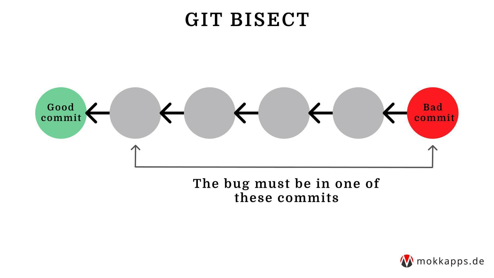

As a developer you know that situation: the code worked like a charm and suddenly there is a bug but you have no idea where and when it was introduced.

If you are working in a big team the chances may be quite high that many commits have been added in the meantime. So finding the commit where the bug was introduced can become quite nasty.

Luckily, [Git](https://git-scm.com/) offers a tool that helps to detect the first bad commit that introduces the bug. It is called "git bisect".

## How does it work?

We need to provide Git Bisect two information to be able to identify

1. A "good" commit where the bug **was not** present.
2. A "bad" commit where the bug **is** present.

This way Git "knows" that the bug has to between the "good" and the "bad" commit. Starting the bisect process will split the range of commits between the "good" and "bad " commit in half and check out a commit in the middle:



Our task is now to validate the code at this commit. This can be done by compiling, running the application or launching a test case for the given bug. Next, we need to tell Git if the test was "good" or "bad". Git will simply repeat this process until we've singled out the commit that contains the bug.

The used algorithm is called [binary search](https://en.wikipedia.org/wiki/Binary_search_algorithm).


## Practical Example

Let's look at how we can run Git Bisect from the command line. First, we need to start the process

```bash
$ git bisect start
```

Next step is to provide Git a "good" and "bad" commit. The "bad" commit is often the current state which refers to "HEAD":

```bash
$ git bisect bad HEAD
```

To be able to find "good" commit you need to check out any older revision where you are quite sure that the bug did not exist. After you have checked it out and verified that the bug is not present there, we provide Git the corresponding commit hash :

```bash
$ git bisect good acd72832
```

Now we are ready to start the "bisecting" process. Git will check out a commit in the middle of the range between the "good" and "bad" commit we provided:

```bash
Bisecting: 6 revisions left to test after this (roughly 2 step)
[commit_ABC] Added controller
```

At this point we need to verify if the bug is still present or not. If it is still present we need to run

```bash
$ git bisect bad
```

otherwise we run

```bash
$ git bisect good
```

to mark it as "good".

Depending on the result, Git will again split the original commit range and select either the first or second half. It will again check out a commit in the middle and we need to verify if the bug is present there.

This process is repeated until we've successfully singled out the bad commit!

Once we've found the culprit, we can end the bisect process by running:

```bash
$ git bisect reset
```

Git will then finish the bisect process and take us back to our previous HEAD revision.

## Conclusion

Git Bisect can be a helpful tool to track down a bug. I only use `git bisect` when I absolutely have no idea where the bug was introduced and I need to search through a lot of potentially unrelated changes.

For more information about Git Bisect take a look at the [official docs](https://git-scm.com/docs/git-bisect).

If you liked this article, follow me on [Twitter](https://twitter.com/mokkapps) to get notified about new blog posts and more content from me.
