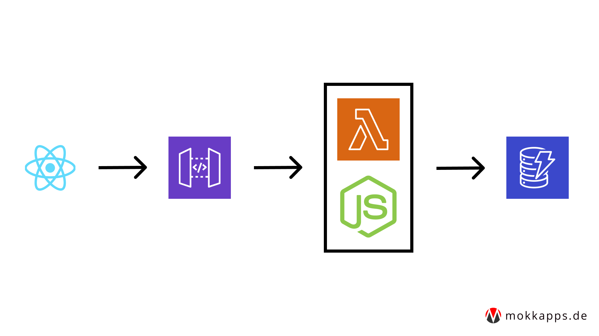
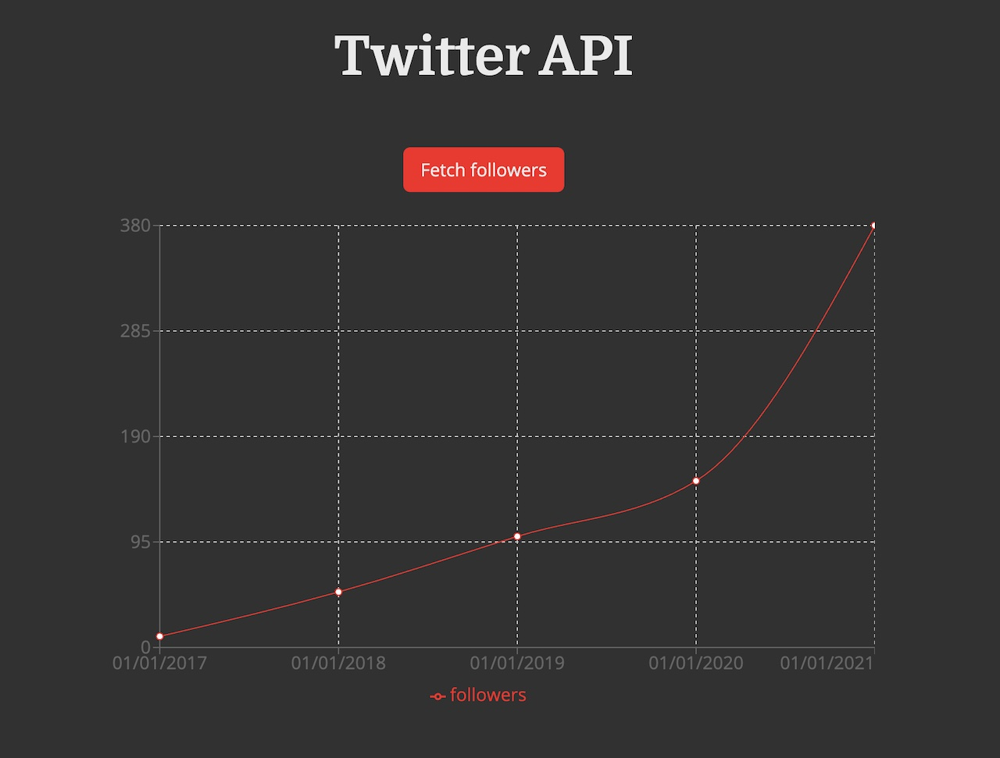

In March 2021 I started to use [FeedHive](https://feedhive.io) to help me grow an audience on Twitter.
Recently, I wanted to check how my Twitter followers have grown over time. Unfortunately, [Twitter Analytics](https://analytics.twitter.com) only provides data from the last 30 days. So I decided to develop a simple serverless API to fetch and store my follower count each month.

## Tech Stack

As I already use [AWS Amplify](https://aws.amazon.com/amplify/) for some private APIs, I wanted to reuse this framework for this new project.



For this new project I need the following components:

- [React](https://reactjs.org/) for the frontend web application which will fetch the data from my serverless API
- [AWS API Gateway](https://aws.amazon.com/api-gateway/) which provides traffic management, CORS support, authorization and access control, throttling, monitoring, and API version management for the new API
- [AWS Lambda](https://aws.amazon.com/lambda/) with [Node.js](https://nodejs.org/) that fetches the follower count from [Twitter API](https://developer.twitter.com/en/docs/twitter-api)
- [AWS DynamoDB](https://aws.amazon.com/de/dynamodb/) which is a NoSQL database and which will store the follower count

## Fetching follower count from backend

The first step is to add a new Node.js REST API to our Amplify application that provides a `/twitter` endpoint which is triggered on a recurring schedule. In my case, it will be on every 1st day of the month. The [official documentation](https://docs.amplify.aws/guides/api-rest/node-api/q/platform/js/) will help you to set up such a new REST API.

To be able to fetch the follower count from Twitter API I decided to use [FeedHive's Twitter Client](https://github.com/FeedHive/twitter-api-client). This library
needs four secrets to be able to access Twitter API. We will store them in the [AWS Secret Manager](https://aws.amazon.com/secrets-manager/), my article ["How to Use Environment Variables to Store Secrets in AWS Amplify Backend"](https://www.mokkapps.de/blog/how-to-use-environment-variables-to-store-secrets-in-aws-amplify-backend/) will guide you through this process.

After the API is created and pushed to the cloud, we can write the basic functionality to fetch the Twitter followers inside our AWS Lambda function:

```js
const twitterApiClient = require('twitter-api-client');
const AWS = require('aws-sdk');

const twitterUsername = 'yourTwitterUsername';
const secretsManager = new AWS.SecretsManager();
const responseHeaders = {
  'Content-Type': 'application/json',
  'Access-Control-Allow-Headers':
    'Content-Type,X-Amz-Date,Authorization,X-Api-Key,X-Amz-Security-Token',
  'Access-Control-Allow-Methods': 'OPTIONS,POST',
  'Access-Control-Allow-Credentials': true,
  'Access-Control-Allow-Origin': '*',
  'X-Requested-With': '*',
};

exports.handler = async event => {
  const secretData = await secretsManager
    .getSecretValue({ SecretId: 'prod/twitterApi/twitter' })
    .promise();
  const secretValues = JSON.parse(secretData.SecretString);

  const twitterClient = new twitterApiClient.TwitterClient({
    apiKey: secretValues.TWITTER_API_KEY,
    apiSecret: secretValues.TWITTER_API_KEY_SECRET,
    accessToken: secretValues.TWITTER_ACCESS_TOKEN,
    accessTokenSecret: secretValues.TWITTER_ACCESS_TOKEN_SECRET,
  });

  try {
    const response = await twitterClient.accountsAndUsers.usersSearch({
      q: twitterUsername,
    });
    const followersCount = response[0].followers_count;

    return {
      statusCode: 200,
      headers: responseHeaders,
      body: followersCount,
    };
  } catch (e) {
    console.error('Error:', e);
    return {
      statusCode: 500,
      headers: responseHeaders,
      body: e.message ? e.message : JSON.stringify(e),
    };
  }
};
```

The next step is to add DynamoDB support to be able to store a new follower count and get a list of the stored data.

Therefore, we need to add a new storage to our AWS Amplify application, see ["Adding a NoSQL database"](https://docs.amplify.aws/cli/storage/overview/#adding-a-nosql-database) for detailed instructions.

We are adding a NoSQL table that has the following columns:

- `id`: A unique string identifier for each row as a string
- `follower_count`: the current follower count as number
- `data`: an ISO timestamp string that represents the time when the follower count was fetched

Now, we need to allow our Lambda function to access this storage:

```bash
▶ amplify update function
? Select the Lambda function you want to update twitterfunction
? Which setting do you want to update? Resource access permissions
? Select the categories you want this function to have access to. storage
? Storage has 3 resources in this project. Select the one you would like your Lambda to access twitterdynamo
? Select the operations you want to permit on twitterdynamo create, read, update, delete
```

Finally, we can use the [AWS SDK](https://github.com/aws/aws-sdk-js) to store and read from DynamoDB:

```js
const twitterApiClient = require('twitter-api-client');
const AWS = require('aws-sdk');
const { v4: uuidv4 } = require('uuid');

const secretsManager = new AWS.SecretsManager();

const twitterUsername = 'yourTwitterUsername';
const responseHeaders = {
  'Access-Control-Allow-Origin': '*',
  // ...
};

// highlight-start
const docClient = new AWS.DynamoDB.DocumentClient();

let tableName = 'twittertable';
if (process.env.ENV && process.env.ENV !== 'NONE') {
  tableName = `${tableName}-${process.env.ENV}`;
}

const tableParams = {
  TableName: tableName,
};

async function getStoredFollowers() {
  console.log(`👷 Start scanning stored follower data...`);
  return docClient.scan({ ...tableParams }).promise();
}

async function storeFollowersCount(followerCount) {
  console.log(`👷 Start storing follower count...`);
  return docClient
    .put({
      ...tableParams,
      Item: {
        id: uuidv4(),
        follower_count: followerCount,
        date: new Date().toISOString(),
      },
    })
    .promise();
}
// highlight-end

async function fetchFollowerCount(twitterClient) {
  console.log(`👷 Start fetching follower count...`);
  const data = await twitterClient.accountsAndUsers.usersSearch({
    q: twitterUsername,
  });
  return data[0].followers_count;
}

exports.handler = async event => {
  const secretData = await secretsManager
    .getSecretValue({ SecretId: 'prod/twitterApi/twitter' })
    .promise();
  const secretValues = JSON.parse(secretData.SecretString);

  const twitterClient = new twitterApiClient.TwitterClient({
    apiKey: secretValues.TWITTER_API_KEY,
    apiSecret: secretValues.TWITTER_API_KEY_SECRET,
    accessToken: secretValues.TWITTER_ACCESS_TOKEN,
    accessTokenSecret: secretValues.TWITTER_ACCESS_TOKEN_SECRET,
  });

  try {
    const followersCount = await fetchFollowerCount(twitterClient);

    // highlight-start
    await storeFollowersCount(followersCount);
    const storedFollowers = await getStoredFollowers();
    // highlight-end

    return {
      statusCode: 200,
      headers: responseHeaders,
      body: JSON.stringify(storedFollowers.Items),
    };
  } catch (e) {
    console.error('Error:', e);
    return {
      statusCode: 500,
      headers: responseHeaders,
      body: e.message ? e.message : JSON.stringify(e),
    };
  }
};
```

A successful API response will have a similar JSON array in its body:

```json
[
    {
        "follower_count": 350,
        "date": "2021-08-09T11:39:50.885Z",
        "id": "9b1deb4d-3b7d-4bad-9bdd-2b0d7b3dcb6d"
    },
    {
        "follower_count": 380,
        "date": "2021-09-09T11:39:50.885Z",
        "id": "a5a2a894-166b-4672-aefe-cea01c70a01a"
    }
]
```

## Show data in frontend

To be able to show the data in the React frontend I use the [Recharts library](https://recharts.org/en-US) which is "a composable charting library built on React components".

The React component is quite simple and uses the [AWS Amplify REST API library](https://docs.amplify.aws/lib/restapi/fetch/q/platform/js/) to fetch the data from our API endpoint:

```jsx
import { API } from 'aws-amplify';
import { useState } from 'react';
import {
  LineChart,
  Line,
  XAxis,
  YAxis,
  CartesianGrid,
  Tooltip,
  Legend,
} from 'recharts';

const TwitterPage = () => {
  const [isLoading, setIsLoading] = useState(false);
  const [apiError, setApiError] = useState();
  const [followerData, setFollowerData] = useState();

  const triggerEndpoint = async () => {
    setIsLoading(true);

    try {
      const data = await API.get('twitterapi', '/twitter');
      setFollowerData(
        data.map((d) => {
          d.followers = d.follower_count;
          d.date = new Date(d.date).toLocaleDateString();
          return d;
        })
      );
    } catch (error) {
      console.error('Failed to trigger Twitter endpoint', error);
      setApiError(JSON.stringify(error));
    } finally {
      setIsLoading(false);
    }
  };

  return (
    <div>
      <h1>Twitter API</h1>
      <section>
        <button onClick={triggerEndpoint}>
          Fetch followers
        </button>
        {followerData ? (
          <LineChart
            width={700}
            height={500}
            data={followerData}
            margin={{
              top: 30,
              bottom: 30,
            }}
          >
            <CartesianGrid strokeDasharray="3 3" />
            <XAxis dataKey="date" />
            <YAxis dataKey="followers" />
            <Tooltip />
            <Legend />
            <Line
              type="monotone"
              dataKey="followers"
              stroke="#FC1A20"
              activeDot={{ r: 8 }}
            />
          </LineChart>
        ) : null}
        {apiError ? <p className="py-4">{JSON.parse(apiError)}</p> : null}
      </section>
    </Layout>
  );
};

export default TwitterPage;
```

which results in such a graph:



## Conclusion

Using serverless functions it is quite easy and cheap to build a custom solution to track Twitter follower growth over time. 

What do you use to track your follower growth? Leave a comment and tell me about your solution.

If you liked this article, follow me on [Twitter](https://twitter.com/mokkapps) to get notified about new blog posts and more content from me.
