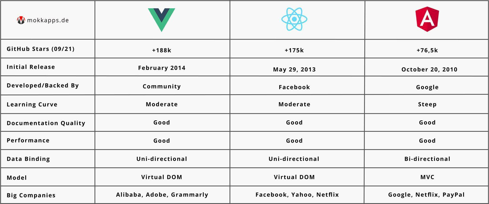
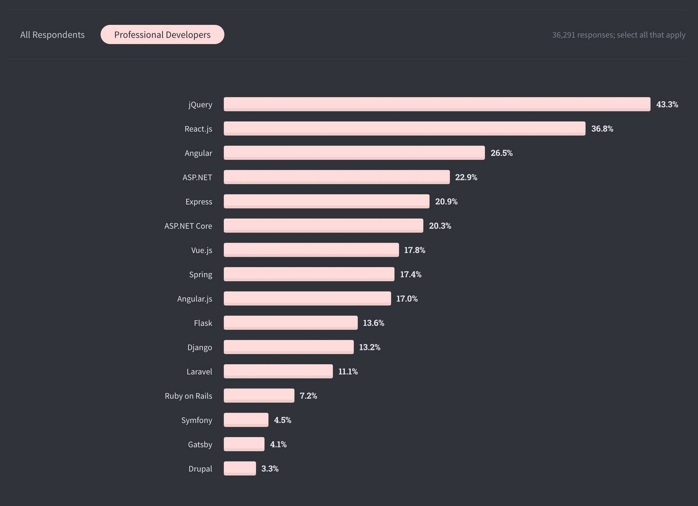
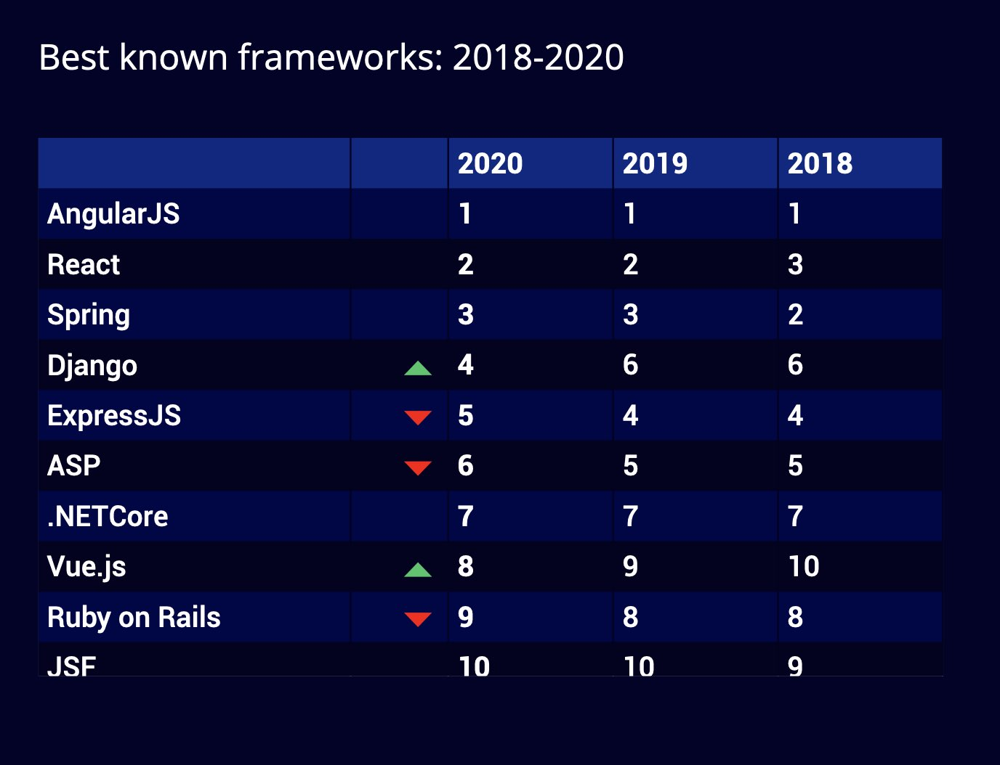
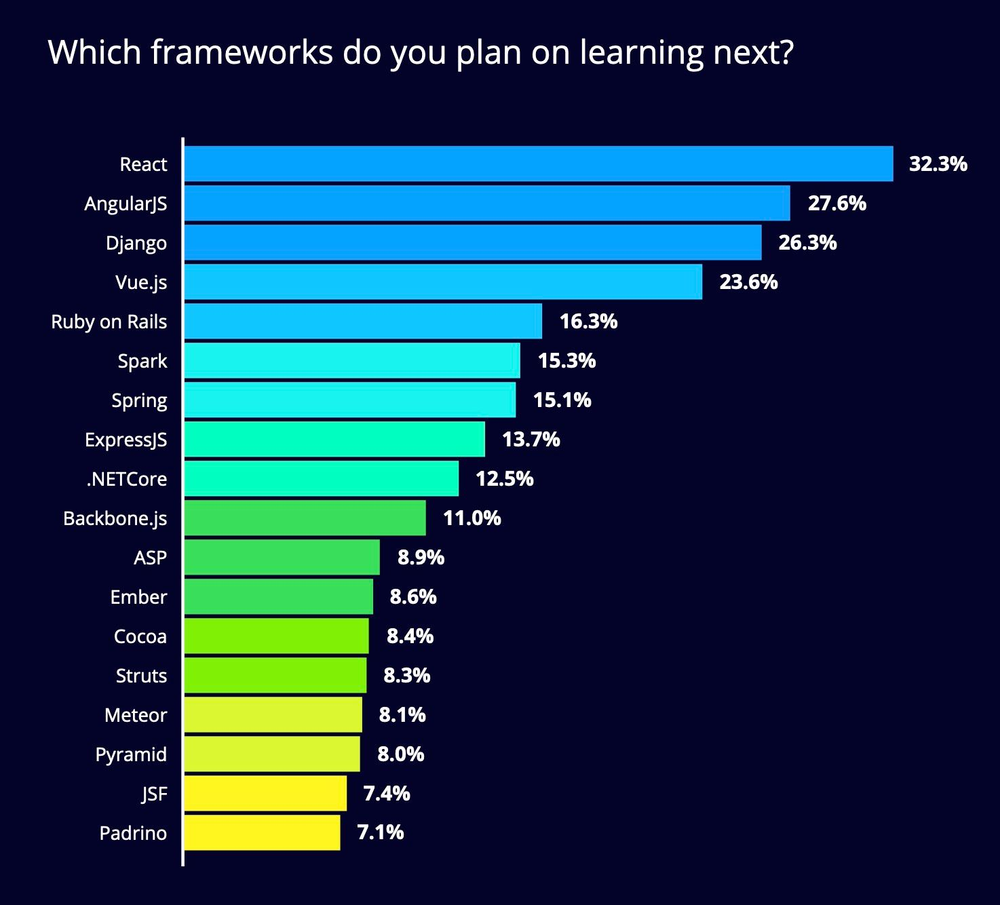
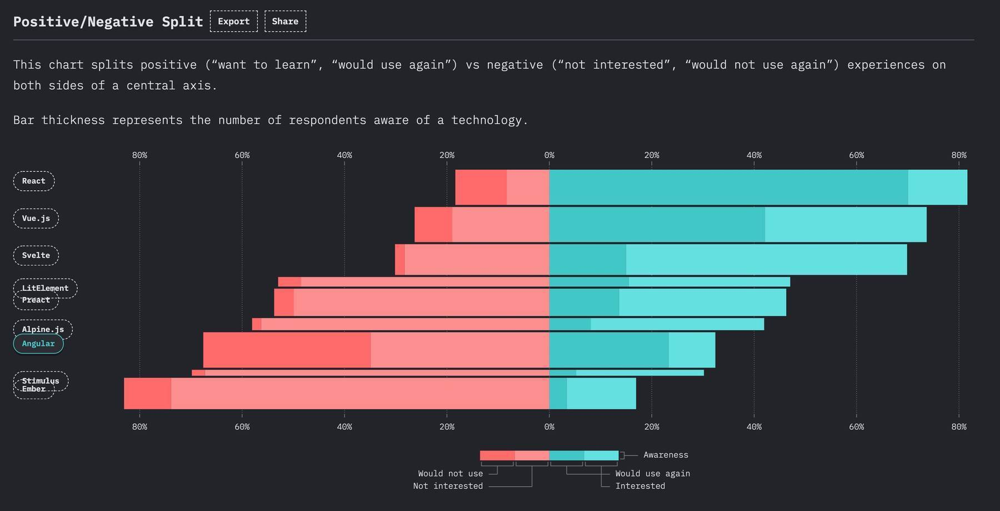

I have professional experience with the three big players in web development: [Angular](https://angular.io), [Vue.js](https://vuejs.org/) and [React](https://reactjs.org/).
I've reached the point in my career where I need to choose one of the three frameworks/libraries that I will use for my future freelancing career.

As the title already reveals, I chose Vue and in this article, I will describe to you why I picked it instead of React or Angular. 

[[warning | ⚠️]]
| This article will not provide a full comparison between the three technologies.


## Table of Contents

* [Why Do I Need a Niche?](#why-do-i-need-a-niche)
* [My Freelancing History](#my-freelancing-history)
* [What I Love About Vue](#what-i-love-about-vue)
* [What I Don't Like In Vue](#what-i-dont-like-in-vue)
* [What I Miss In Vue](#what-i-miss-in-vue)
* [Vue's Popularity](#vues-popularity)
* [Conclusion](#conclusion)

## Why Do I Need a Niche?


Finding your niche as a freelancer can have an extremely positive impact on your career. It took me some time to find mine, but finally, I found it and I can take my business to the next level. It has some advantages to be a jack of all but in the end, it's even better to be the master of one trade. Having a niche can boost your income, helps to find new projects easier, and is useful to advertise yourself as an expert. 

I can also give you an example of how the niche saves me time every day: 

My previous search queries for job agents on freelancer platforms looked like this: `React OR Angular OR TypeScript OR JavaScript OR React Native OR Vue`. This way, I got job agent emails with dozens of job offers that I had to manually scan for interesting projects.

With a niche in place, I modified these search queries to `Vue` and now the job agent emails contain only a few freelancer projects but they are tailored to my skills.

## My Freelancing History

When I started freelancing back in 2019 my tech focus was on web development using the [Angular](https://angular.io) framework.
But for my first freelancing project I choose a [Vue.js](https://vuejs.org/) project and I stayed there for about two years. I chose this project
because I already had professional experience with Angular and some experience with React as I used it for my [portfolio website](https://mokkapps.de) and two React Native apps that I developed and published. I wanted to see how it compares to Angular and React. After this project, beginning from January to September 2021 I worked in a [React](https://reactjs.org/) project as I wanted to gain some professional experience with the library.

I could easily further specialize in Angular, but I have no good belly feeling with this choice. Therefore, I had to choose between React and Vue.

## What I Love About Vue

> TL;DR: In my opinion, Vue.js combines the best parts of Angular and React. Vue.js is a more flexible, less opinionated solution than Angular but it's still a framework and not a UI library like React.



### Less Usage of JavaScript's "this" keyword

Angular components are full of the JavaScript keyword `this`. I don't like this and thankfully we can write React and Vue components without the `this` keyword by using [React Hooks](https://reactjs.org/docs/hooks-intro.html) and [Vue 3's Composition API](https://v3.vuejs.org/api/composition-api.html).

### Outstanding Documentation

The [official Vue documentation](https://v3.vuejs.org/guide/introduction.html) is amazing and one of the best resources to learn Vue. 

### Best Parts of React and Angular

In its early development phase, Vue took inspiration from the good things of [AngularJS](https://angularjs.org/) (the first version of Angular). 
Vue also got inspired by React and they share some similarities:

- They have their focus in the core library. Concerns like global state management and routing are handled by separate companion libraries.
- Both provide reactive and composable view components.
- One and the other use a virtual DOM.

### Less Optimization Efforts

In Vue, I need to care less about optimization efforts in comparison to React. React triggers a re-rendering of the entire component tree when a component's state changes. Read my article ["Debug Why React (Re-)Renders a Component"](https://www.mokkapps.de/blog/debug-why-react-re-renders-a-component/) for further details.

There are multiple ways to avoid unnecessary re-rendering of child components in React:

- use [PureComponent](https://reactjs.org/docs/react-api.html#reactpurecomponent)
- implement `shouldComponentUpdate` if you are using class components
- use immutable data structures

Angular developers also need to take care of the change detection, you can read my article ["The Last Guide For Angular Change Detection You'll Ever Need"](https://www.mokkapps.de/blog/the-last-guide-for-angular-change-detection-you-will-ever-need/) if you want to deep-dive into that mechanism.

Vue automatically tracks a component's dependencies during its render. Therefore, it knows precisely which components need to be re-rendered when the state changes. As a Vue developer, I can more focus on building the app than on performance optimizations.

### Templates

Vue uses HTML templates, but there’s an option to write the render function in [JSX](https://reactjs.org/docs/introducing-jsx.html). On the other hand, in React there's solely JSX. A Vue component is split into three parts: HTML (`<template>`), CSS (`<style>`) and JavaScript (`<script>`) which most web developers should already be familiar with.

In React, we use JSX to render our component's template. This has some advantages:

- You don't have to learn an extra DSL (Domain-Specific Language) but can use pure JavaScript to build your view.
- JSX has good tooling support (e.g. linting, type checking, and editor auto-completion).

I liked this approach in the beginning but I have changed my opinion. For beginners, it might be really helpful to write the templates in JSX because they need to learn JavaScript basics like `Array.prototype.map()` to render lists. But writing code using an extra DSL (Domain-Specific Language) helps us to write less code. 

[Rich Harris](https://twitter.com/Rich_Harris) wrote a great blog post ["Write less code"](https://svelte.dev/blog/write-less-code) that reminds us that all code is buggy: 

> All code is buggy. It stands to reason, therefore, that the more code you have to write the buggier your apps will be.

More code 

- takes more time
- number of bugs grows quadratically with the size of the codebase
- is harder to review in the code review process

So using the DSL provided by Angular and Vue we write less code which is good.

### Scaling Up

React provides a robust routing ([React Router](https://reactrouter.com/)) and state management solution ([Redux](https://redux.js.org/)) that are maintained by the community and create a more fragmented ecosystem. Vue provides companion libraries for routing and state management which are all officially supported and kept up-to-date with the core library. This is similar to the Angular framework which provides a collection of well-integrated libraries that cover a wide variety of features, including routing, forms management, client-server communication, and more.

### Scaling Down

Getting started with Vue is much simpler than with React or Angular as you can use it completely without any build system and just use a single script tag in your HTML.

```html
<script src="https://cdn.jsdelivr.net/npm/vue@3"></script>
```

I already used this simple approach in a large [Django](http://www.djangoproject.com/) monolithic application to be able to add new UI features without using the Django templating engine based on Python. 

I know it's also possible to use React with Babel Standalone but this is not a suitable approach for production usage.

### TypeScript

Vue 3 is written in [TypeScript](https://www.typescriptlang.org/) so we don't need any additional tooling to use TypeScript with Vue - it has first-class citizen support. Angular is even stricter and uses TypeScript per default. 

## What I Don't Like In Vue

### Community

Vue already has a good community but React is way more popular and therefore the community is bigger. 

### Less opinionated

Angular is very opinionated and I like that for large applications. Vue is less opinionated and has no restrictions on how you structure
your code or which build system you use. I like to have some restrictions in my framework as this reduces discussion time
between developers.


## What I Miss In Vue

### Better Mobile App Support

Vue.js does not natively support mobile app development. There are a [number of solutions](https://v3.vuejs.org/guide/mobile.html#hybrid-app-development) for creating native iOS and Android apps with Vue.js but React and [React Native](https://reactnative.dev/) provide a better experience for React developers.

### Angular's HTTP module

I love that Angular provides a separate [HTTP module](https://angular.io/guide/http) to be able to communicate with servers using
the HTTP protocol. It provides features like:

- The ability to request typed response objects.
- Streamlined error handling.
- Testability features.
- Request and response interception.

Vue provides no specific library to make HTTP requests so you can either use the Fetch API or libraries like [axios](https://github.com/axios/axios).

### Angular's Forms Module

Vue does not provide a form validation pattern like Angular's [Reactive Forms](https://angular.io/guide/reactive-forms) but we can use 3rd party libraries like [Vuelidate](https://vuelidate-next.netlify.app).

## Vue's Popularity

In [StackOverflow's 2020 Developer Survey](https://insights.stackoverflow.com/survey/2020#overview) we can see that Vue.js
is not as popular as Angular and React:



We can see the same in [HackerRank's 2020 Developer Skills Report](https://research.hackerrank.com/developer-skills/2020). But in this report Vue.js has shown steady growth, rising one spot per year since 2018:



Additionally, 23.6% of the developers want to learn Vue.js next:



[The State of JavaScript Survey 2020](https://2020.stateofjs.com/en-US/) shows that developers are more and more interested in React and Vue.js but get less interested in Angular:



## Conclusion

I'm pretty happy with my choice and the future will show if it was the right decision or not. 

Which framework or technology did you pick for your niche? Tell me in the comments!

If you liked this article, follow me on [Twitter](https://twitter.com/mokkapps) to get notified about new blog posts and more content from me.
