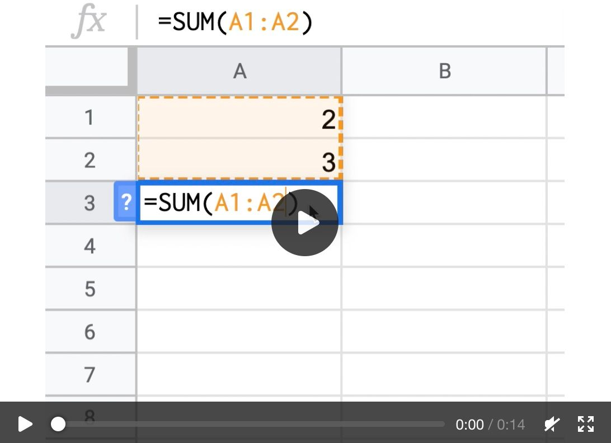

This article summarizes a list of Vue.js interview questions that I would ask candidates and that I get often asked in interviews.

## Table of Contents

* [1. What is Vue.js?](#1-what-is-vuejs)
* [2. What are some of the main features of Vue.js?](#2-what-are-some-of-the-main-features-of-vuejs)
* [3. Why would you choose Vue instead of React or Angular?](#3-why-would-you-choose-vue-instead-of-react-or-angular)
* [4. What is an SFC?](#4-what-is-an-sfc)
* [5. What are computed properties?](#5-what-are-computed-properties)
* [6. What are watchers?](#6-what-are-watchers)
* [7. What is the difference between registering a component locally and globally?](#7-what-is-the-difference-between-registering-a-component-locally-and-globally)
* [8. What are some of the most important directives in Vue?](#8-what-are-some-of-the-most-important-directives-in-vue)
* [9. What is the Vue application instance?](#9-what-is-the-vue-application-instance)
* [10. What is the difference between one-way data flow and two-way data binding?](#10-what-is-the-difference-between-one-way-data-flow-and-two-way-data-binding)
* [11. What is the difference between a slot and a scoped slot?](#11-what-is-the-difference-between-a-slot-and-a-scoped-slot)
* [12. How does Vue know when it should rerender?](#12-how-does-vue-know-when-it-should-rerender)
* [13. How can code be reused between components?](#13-how-can-code-be-reused-between-components)
* [14. How to optimize Vue.js performance?](#14-how-to-optimize-vuejs-performance)
* [15. Which lifecycles and corresponding hooks are available in Vue?](#15-which-lifecycles-and-corresponding-hooks-are-available-in-vue)
* [Conclusion](#conclusion)

## 1. What is Vue.js?

[Vue](https://vuejs.org) is a progressive framework for building user interfaces that was designed to be incrementally adoptable.
Its core library is focused exclusively on the view layer so that it can easily be integrated with other projects or libraries.

But in contrast to [React](https://reactjs.org/), Vue provides companion libraries for routing and state management which are all officially supported and kept up-to-date with the core library.

## 2. What are some of the main features of Vue.js?

- Virtual DOM: Vue uses a [Virtual DOM](https://vuejs.org/v2/guide/render-function.html#The-Virtual-DOM), similar to other frameworks such as React, Ember, etc.
- Components: Components are the basic building block for reusable elements in Vue applications.
- Templates: Vue uses HTML-based templates.
- Routing: Vue provide it's [own router](https://router.vuejs.org/).
- Built-in [directives](https://v3.vuejs.org/api/directives.html): For example, v-if or v-for
- Lightweight: Vue is a lightweight library compared to other frameworks.

## 3. Why would you choose Vue instead of React or Angular?

Vue.js combines the best parts of Angular and React. Vue.js is a more flexible, less opinionated solution than Angular but it's still a framework and not a UI library like React

I recently decided to focus my freelancer career on [Vue.js](https://vuejs.org), you can read more about this decision in the [corresponding blog post](https://www.mokkapps.de/blog/why-i-picked-vue-js-as-my-freelancer-niche/).

## 4. What is an SFC?

Vue [Single File Components](https://v3.vuejs.org/guide/single-file-component.html) (aka `*.vue` files, abbreviated as SFC) is a special file format that allows us to encapsulate the template (`<template>`), logic (`<script>`), and styling (`<style>`) of a Vue component in a single file.

Vue SFC is a framework-specific file format and must be pre-compiled by [@vue/compiler-sfc](https://github.com/vuejs/vue-next/tree/master/packages/compiler-sfc) into standard JavaScript and CSS. A compiled SFC is a standard JavaScript (ES) module.

## 5. What are computed properties?

[Computed properties](https://v3.vuejs.org/guide/computed.html#computed-properties) should be used to remove as much logic as possible from the templates as otherwise the template gets bloated and is harder to maintain. If you have complex logic including reactive data in your template you should use a computed property instead.

Instead of methods, computed properties are cached based on their reactive dependencies. A computed property will only re-evaluate when some of its reactive dependencies have changed.

## 6. What are watchers?

[Watchers](https://v3.vuejs.org/guide/computed.html#watchers) are a more generic way to react to data changes instead of using computed properties.

They should be used when asynchronous or expensive operations need to be executed in response to changing data.

## 7. What is the difference between registering a component locally and globally?

If a component is [registered globally](https://v3.vuejs.org/guide/component-registration.html#global-registration) it can be used in the template of any component instance within this application:

```js
const app = Vue.createApp({});

app.component('component-a', {
  /* ... */
});

app.mount('#app');
```

Global registration can unnecessarily increase your JavaScript bundle if you are using build systems like Webpack. If you stop using a component in your code, it will still be included in the final build.

To avoid this, we can [register components locally](https://v3.vuejs.org/guide/component-registration.html#local-registration) by defining them in the component where it is needed:

```js
import ComponentA from './ComponentA.vue';

export default {
  components: {
    ComponentA,
  },
  // ...
};
```

Note that locally registered components are not available in subcomponents.

## 8. What are some of the most important directives in Vue?

- [v-if](https://v3.vuejs.org/api/directives.html#v-if) adds or removes DOM elements based on the given expression.
- [v-else](https://v3.vuejs.org/api/directives.html#v-else) displays content only when the expression adjacent v-if resolves to false.
- [v-show](https://v3.vuejs.org/api/directives.html#v-show) is similar to v-if, but it renders all elements to the DOM and then uses the CSS display property to show/hide elements.
- [v-for](https://v3.vuejs.org/api/directives.html#v-for) allows us to loop through items in an array or object.
- [v-model](https://v3.vuejs.org/api/directives.html#v-model) is used for two-way data bindings.
- [v-on](https://v3.vuejs.org/api/directives.html#v-on) attaches an event listener to the element.

[Here](https://v3.vuejs.org/api/directives.html#v-model) you can find all available directives.

## 9. What is the Vue application instance?

The [application instance](https://v3.vuejs.org/guide/instance.html#creating-an-application-instance) is used to register _globals_ that can then be used by components within that application. An application instance is created with the `createApp`:

```js
const app = Vue.createApp({
  /* options */
});
```

In Vue 2 this was called [Vue instance](https://vuejs.org/v2/guide/instance.html) and created this way:

```js
const vm = new Vue({
  // options
});
```

## 10. What is the difference between one-way data flow and two-way data binding?


Vue uses a one-way data flow. Parents can pass data to child components using a prop and bind the data using the [v-bind directive](https://vuejs.org/v2/api/#v-bind). When the parent component updates the prop value, it's automatically updated in the child component. You should avoid mutating the property inside the child component and it will not affect the property in the parent component (unless it's an array or object).
Using [Events](https://vuejs.org/v2/api/#v-bind) the child component can communicate back to the parent.

Vue provides the [v-model directive](https://vuejs.org/v2/api/#v-model) for two-way data binding of form inputs. `v-model` is just syntax sugar for `v-bind` combined with `v-on:input`.

## 11. What is the difference between a slot and a scoped slot? 

A [slot](https://v3.vuejs.org/guide/component-slots.html#slots) is a placeholder in a child component that is filled with content passed from the parent. Content of a regular slot is compiled in the parent’s scope and then passed to the child component.

Scoped slots are needed if the slot content needs to have access to data only available in the child component. We can bind attributes a `<slot>`, these elements are called __slot props__. Now, in the parent scope, we can use `v-slot` with a value to define a name for the slot props we've been provided:


## 12. How does Vue know when it should rerender?

[[info]]
| The following explanation is based on [Vue 3's Reactivity](https://v3.vuejs.org/guide/reactivity-fundamentals.html#reactivity-fundamentals). [This article](https://www.sitepoint.com/vue-3-reactivity-system/) describes how Vue 2 implemented reactivity.

Vue uses an unobtrusive reactivity system which is one its most distinct features.

But what is reactivity? Reactivity is a programming paradigm that allows us to adjust to changes in a declarative manner.

The official documentation uses an Excel spreadsheet to demonstrate reactivity:

[](https://v3.vuejs.org/images/reactivity-spreadsheet.mp4)

As you can see, we get the SUM if we put the number 2 in the first cell and number 3 in the second cell. The reactive part happens if we update the first number and the SUM automatically gets updated too.

Unfortunately, JavaScript variables are not reactive by default:

```js
let value1 = 1;
let value2 = 2;
let sum = value1 + value2;

console.log(sum); // 5
value1 = 3;
console.log(sum); // Still 5
```

Therefore, Vue 3 added an abstraction on [JavaScript Proxy](https://developer.mozilla.org/en-US/docs/Web/JavaScript/Reference/Global_Objects/Proxy) to be able to achieve the reactiveness.

In Vue 3, we can easily declare a reactive state using the `reactive` method

```js
import { reactive } from 'vue';

// reactive state
const state = reactive({
  count: 0,
});
```

or create standalone reactive values as `refs`:

```js
import { ref } from 'vue';

const count = ref(0);
console.log(count.value); // 0

count.value++;
console.log(count.value); // 1
```

## 13. How can code be reused between components?

In Vue 2 and 3 we can use [Mixins](https://vuejs.org/v2/guide/mixins.html) to reuse code between components.

Since Vue 3 the framework provides the [Composition API](https://v3.vuejs.org/guide/composition-api-introduction.html#why-composition-api) that
resolves the [Mixins drawbacks](https://v3.vuejs.org/guide/composition-api-introduction.html#why-composition-api).

## 14. How to optimize Vue.js performance?

There are multiple reasons why your Vue application may become slow: 

- You are using too many third-party libraries that are too big or used in the wrong way
- You have a lot of images that are not optimized and compressed
- You don't lazy load your images
- You aren't reusing functionalities across your application to minimize duplicated code
- You have a lot of pages and load every page on the initial load

[This article](https://blog.logrocket.com/methods-optimizing-vue-js-applications/) provides the solution to the above-mentioned performance issues.

## 15. Which lifecycles and corresponding hooks are available in Vue?

Each Vue component instance goes through a series of initialization steps when it's created. For example, it needs to set up data observation, compile the template, mount the instance to the DOM, and update the DOM when data changes. Along the way, it also runs functions called [lifecycle hooks](https://v3.vuejs.org/guide/instance.html#lifecycle-hooks), which allows us to execute custom code at specific stages.

- Creation hooks (`beforeCreate` and `created`) allow us to perform actions before the component has even been added to the DOM. These hooks are also executed during server-side rendering. The `created` hook is the perfect lifecycle hook to trigger HTTP requests and populate any initial data that the component needs.
- Mounting hooks (`beforeMount`, `mounted`) are often the most-used hooks and allow us to access the component immediately before and after the first render. The `mounted` hook is an ideal time to integrate 3rd party libraries or to access the DOM.
- Updating hooks (`beforeUpdate`, `updated`) are called whenever a reactive property used by the component changes, or something else causes it to re-render. In the `updated` hook the DOM and the model are in-sync while in the `beforeUpdate` hook only the model is updated but not the DOM.
- Destruction hooks (`beforeDestroy`, `destroyed`) allow us to perform actions when the component is destroyed, such as cleanup or sending analytics. In the `beforeDestroy` hook we still have access to the Vue instance and can, for example, emit events. `destroyed` is the ideal place for a final cleanup, e.g. removing event listeners.  

Below is a diagram for the instance lifecycle:


There exists an additional interesting lifecycle hook called [errorCaptured](https://v3.vuejs.org/api/options-lifecycle-hooks.html#unmounted) which is called when an error from any descendent component is captured. 

This hook receives three arguments: the error, the component instance that triggered the error, and a string containing information on where the error was captured. The hook can return false to stop the error from propagating further.

## Conclusion

Of course, this list does not guarantee that you will pass an upcoming Vue job interview. There are hundreds of questions that you might
get asked in such an interview. I recommend reading the [official docs](https://v3.vuejs.org/) and take some courses on [Vue Mastery](https://www.vuemastery.com/) if you prefer video courses. 

Let me know in the comments if you would ask any other important questions about Vue.

If you liked this article, follow me on [Twitter](https://twitter.com/mokkapps) to get notified about new blog posts and more content from me.

Alternatively (or additionally), you can also [subscribe to my newsletter](https://mokkapps.de/newsletter).
