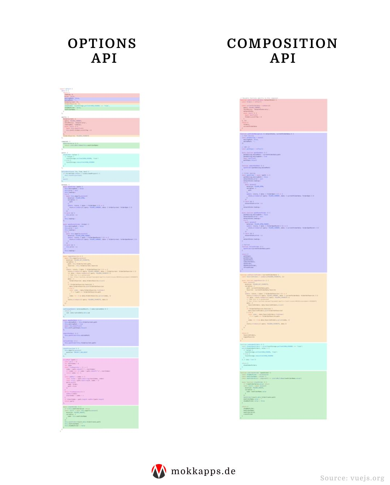

  
[Vue 3](https://v3.vuejs.org/) introduced the [Composition API](https://v3.vuejs.org/guide/composition-api-introduction.html) to provide a better way to collocate code related to the same logical concern. In this article, I want to tell you why I love this new way of writing Vue components.

First, I will show you how you can build components using Vue 2, and then I will show you the same component implemented using Composition API. I'll explain some of the Composition API basics and why I prefer Composition API for building components.

For this article, I created a [Stackblitz Vue 3 demo application](https://stackblitz.com/edit/vue-3-composition-api-demo?file=src/App.vue) which includes all the components that I'll showcase in this article:

<iframe width="100%" height="500" src="https://stackblitz.com/edit/vue-3-composition-api-demo?file=src/App.vue&embed=1&ctl=1"></iframe>
<br/>

The source code is also available on [GitHub](https://github.com/Mokkapps/vue-3-composition-api-demo/).

## Options API

First, let's look at how we build components in Vue 2 without the Composition API.

In Vue 2 we build components using the Options API by filling (option) properties like methods, data, computed, etc. An example component could look like this:

```vue
<template>
  <div>...</div>
</template>

<script>
  data () {
    return {
      // Properties for data, filtering, sorting and paging
    }
  },
  methods: {
    // Methods for data, filtering, sorting and paging
  },
  computed: {
    // Values for data, filtering, sorting and paging
  }
</script>
```

As you can see, Options API has a significant drawback: The logical concerns (filtering, sorting, etc.) are not grouped but split between the different options of the Options API. Such fragmentation is what makes it challenging to understand and maintain complex Vue components. 

Let's start by looking at [CounterOptionsApi.vue](https://github.com/Mokkapps/vue-3-composition-api-demo/blob/master/src/components/CounterOptionsApi.vue), the Options API counter component:

```vue
<template>
  <div>
    <h2>Counter Options API</h2>
    <p>Count: {{ count }}</p>
    <p>2^Count: {{ countPow }}</p>
    <button @click="increment()">Increase Count</button>
    <button @click="incrementBy(5)">Increase Count by 5</button>
    <button @click="decrement()">Decrease Count</button>
  </div>
</template>

<script>
export default {
  props: {
    initialValue: {
      type: Number,
      default: 0,
    },
  },
  emits: ['counter-update'],
  data: function () {
    return {
      count: this.initialValue,
    };
  },
  watch: {
    count: function (newCount) {
      this.$emit('counter-update', newCount);
    },
  },
  computed: {
    countPow: function () {
      return this.count * this.count;
    },
  },
  methods: {
    increment() {
      this.count++;
    },
    decrement() {
      this.count--;
    },
    incrementBy(count) {
      this.count += count;
    },
  },
  mounted: function () {
    console.log('Options API counter mounted');
  },
};
</script>
```

This simple counter component includes multiple essential Vue functionalities:
- We use a `count` data property that uses the `initialValue` property as its initial value.
- `countPow` as computed property which calculates the `count` value to the power of two.
- A watcher that emits the `counter-update` event if the `count` value has changed.
- Multiple methods to modify the `count` value.
- A `console.log` message that is written if the [mounted lifecycle hook](https://vuejs.org/v2/api/#mounted) was triggered.

If you are not familiar with the Vue 2 features mentioned above, you should first read the [official Vue 2 documentation](https://vuejs.org/v2/guide/) before you continue reading this article.

## Composition API

Since Vue 3 we can **additionally** use [Composition API](https://v3.vuejs.org/guide/composition-api-introduction.html#why-composition-api) to build Vue components.

[[info]]
| Composition API is fully optional, and we can still use Options API in Vue 3.

In my [demo application](https://stackblitz.com/edit/vue-3-composition-api-demo?file=src/App.vue) I use the same template for all Vue components, so let's focus on the `<script>` part of the [CounterCompositionApi.vue](https://github.com/Mokkapps/vue-3-composition-api-demo/blob/master/src/components/CounterCompositionApi.vue) component:

```vue
<script lang="ts">
import { ref, onMounted, computed, watch } from 'vue';

export default {
  props: {
    initialValue: {
      type: Number,
      default: 0,
    },
  },
  emits: ['counter-update'],
  setup(props, context) {
    const count = ref(props.initialValue);

    const increment = () => {
      count.value += 1;
    };
    const decrement = () => {
      count.value -= 1;
    };
    const incrementBy = (value: number) => {
      count.value += value;
    };

    const countPow = computed(() => count.value * count.value);

    watch(count, (value) => {
      context.emit('counter-update', value);
    });

    onMounted(() => console.log('Composition API counter mounted'));

    return {
      count,
      increment,
      decrement,
      incrementBy,
      countPow,
    };
  },
};
</script>
```

Let's analyze this code:

The entry point for all Composition API components is the new `setup` method. It is executed **before** the component is created and once the props are resolved. The function returns an object, and all of its properties are exposed to the rest of the component.

[[warning]]
| We should avoid using `this` inside setup as it won't refer to the component instance. `setup` is called before data properties, computed properties, or methods are resolved, so that they won't be available within setup.

But we need to be careful: The variables we return from the setup method are, by default, not reactive. 

We can use the `reactive` method to create a reactive state from a JavaScript object. Alternatively, we can use `ref` to make a standalone primitive value (for example, a string, number, or boolean) reactive:

```ts
import { reactive, ref } from 'vue';

const state = reactive({
  count: 0
})
console.log(state.count); // 0

const count = ref(0);
console.log(count.value); // 0
```

The `ref` object contains only one property named `value`, which can access the property value.

Vue 3 also provides different new methods like `computed`, `watch`, or `onMounted` that we can use in our `setup` method to implement the same logic we used in the Options API component.

### Extract Composition Function

But we can further improve our Vue component code by extracting the counter logic to a standalone **composition function** ([useCounter](https://github.com/Mokkapps/vue-3-composition-api-demo/blob/master/src/composables/useCounter.ts)): 

```ts
import { ref, computed, onMounted } from 'vue';

export default function useCounter(initialValue: number) {
  const count = ref(initialValue);

  const increment = () => {
    count.value += 1;
  };
  const decrement = () => {
    count.value -= 1;
  };
  const incrementBy = (value: number) => {
    count.value += value;
  };

  const countPow = computed(() => count.value * count.value);

  onMounted(() => console.log('useCounter mounted'));

  return {
    count,
    countPow,
    increment,
    decrement,
    incrementBy,
  };
}
```

This drastically reduces the code in our [CounterCompositionApiv2.vue](https://github.com/Mokkapps/vue-3-composition-api-demo/blob/master/src/components/CounterCompositionApiv2.vue) component and additionally allows us to use the counter functionality in any other component: 

```vue
<script lang="ts">
import { watch } from 'vue';
import useCounter from '../composables/useCounter';

export default {
  props: {
    initialValue: {
      type: Number,
      default: 0,
    },
  },
  emits: ['counter-update'],
  setup(props, context) {
    const { count, increment, countPow, decrement, incrementBy } = useCounter(
      props.initialValue
    );

    watch(count, (value) => {
      context.emit('counter-update', value);
    });

    return { count, countPow, increment, decrement, incrementBy };
  },
};
</script>
```

In Vue 2, [Mixins](https://vuejs.org/v2/guide/mixins.html#Basics) were mainly used to share code between components. But they have a few issues:

- It's impossible to pass parameters to the mixin to change its logic which drastically reduces its flexibility.
- Property name conflicts can occur as properties from each mixin are merged into the same component.
- It isn't necessarily apparent which properties came from which mixin if a component uses multiple mixins.

Composition API addresses all of these issues.

### SFC Script Setup

[Vue 3.2](https://blog.vuejs.org/posts/vue-3.2.html) allows us to get rid of the `setup` method by providing the `<script setup>`. It's the recommended syntax if you use Composition API and [SFC (Single File Component)](https://v3.vuejs.org/api/sfc-spec.html#sfc-syntax-specification). 

This syntactic sugar provides several advantages over the normal `<script>` syntax:

- We can declare props and emitted events using TypeScript
- Less boilerplate
- More concise code
- Better runtime performance: The template is compiled into a render function in the same scope, without an intermediate proxy
- Better IDE type-inference performance: The language server has less work to extract types from code.

[CounterCompositionApiv3.vue](https://github.com/Mokkapps/vue-3-composition-api-demo/blob/master/src/components/CounterCompositionApiv3.vue) demonstrates our counter example using the `<script setup>` syntax:

```vue
<script setup lang="ts">
import { defineProps, defineEmits, watch } from 'vue';
import useCounter from '../composables/useCounter';

interface Props {
  initialValue?: number;
}

const props = withDefaults(defineProps<Props>(), {
  initialValue: 0,
});

const emit = defineEmits(['counter-update']);

const { count, countPow, increment, decrement, incrementBy } = useCounter(
  props.initialValue
);

watch(count, (value) => {
  emit('counter-update', value);
});
</script>
```

### Using the Composition API with Vue 2

If you can’t migrate to Vue 3 today, then you can still use the Composition API already. You can do this by installing [the official Composition API Vue 2 Plugin](https://github.com/vuejs/composition-api).

## Conclusion

You've seen the same counter component created in Vue 2 using Options API and created in Vue 3 using Composition API.

Let's summarize all the things I love about Composition API:

- More readable and maintainable code with the feature-wise separation of concerns brought with the composition API.
- No more `this` keyword, so we can use arrow functions and use functional programming.
- We can only access the things we return from the `setup` method, making things more readable.
- Vue 3 is written in TypeScript and [fully supports Composition API](https://v3.vuejs.org/guide/typescript-support.html#using-with-composition-api).
- Composition functions can easily be unit tested.

The following image shows a large component where colors group its logical concerns and compares Options API versus Composition API:



You can see that Composition API groups logical concerns, resulting in better maintainable code, especially for larger and complex components.

I can understand that many developers still prefer Options API as it is easier to teach people who are new to the framework and have JavaScript knowledge. But I would recommend that you use Composition API for complex applications that require a lot of domains and functionality. Additionally, Options API does not work very well with TypeScript, which is, in my opinion, also a must-have for complex applications.

If you liked this article, follow me on [Twitter](https://twitter.com/mokkapps) to get notified about new blog posts and more content from me.

Alternatively (or additionally), you can also [subscribe to my newsletter](https://mokkapps.de/newsletter).
