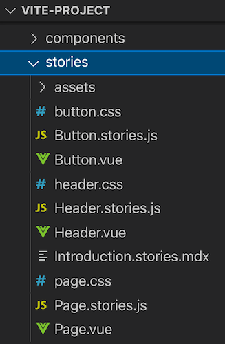

[Storybook](https://storybook.js.org/) is my tool of choice for UI component documentation. Vue.js is very well supported in the Storybook ecosystem and has first-class integrations with [Vuetify](https://github.com/vuetifyjs/vue-cli-plugins/tree/master/packages/vue-cli-plugin-vuetify-storybook) and [NuxtJS](https://storybook.nuxtjs.org/). It also has official support for [Vue 3](https://v3.vuejs.org/), the latest major installment of Vue.js.

This article will demonstrate how you can set up Storybook with zero-config and built-in TypeScript support, auto-generate controls & documentation, and perform automated snapshot tests for your Vue components.

## Why Storybook?

We have components that can have many props, states, slots, etc., which influences its visual representation and more.

This circumstance causes some typical problems for any front-end developer:

- How can I create documentation for my component that doesn't get outdated?
- How can I get an overview of all different states and kinds of my component?
- How can I guarantee that my changes don't influence other states and kinds?
- How can I show the current implementation to non-developer team members?

Storybook will help us here.

## Storybook Setup

First, we need to create a Vue 3 application. We'll use [Vite](https://vitejs.dev/), a new build tool from [Evan You](https://twitter.com/youyuxi), the creator of Vue.js:

```bash
npm init vite@latest
```

Setting up Storybook in an existing Vue 3 project can be done with zero configuration:

```bash
npx sb init
```

This command installs Storybook with its dependencies, configures the Storybook instance, and generates some demo components and stories which are located at `src/stories`:



We can now run the following command, which starts a local development server for Storybook and automatically opens it in a new browser tab:

```bash
npm run storybook
```


These generated Vue components and stories are good examples of how to write Vue 3 stories. I want to show you some advanced documentation examples using a custom component.

## Custom Component Demo

I created a `Counter.vue` demo component to demonstrate the Storybook integration for this article. The source code is available at [GitHub](https://github.com/Mokkapps/vue-3-storybook-demo).

The component provides basic counter functionality, has two different visual variants and two slots for custom content.

Let's take a look at the component's code:

```vue
<template>
  <p>{{ label }}</p>
  // highlight-next-line
  <!-- @slot Slot to show content below label -->
  <slot name="sub-label" />
  <div class="container" :class="variant">
    <button @click="increment()">+</button>
    <p class="value">{{ count }}</p>
    <button @click="decrement()">-</button>
  </div>
  // highlight-next-line
  <!-- @slot Default slot to show any content below the counter -->
  <slot />
</template>

<script lang="ts">
import { ref, watch, PropType } from 'vue';
import { Variant } from './types';

// highlight-start
/**
 * This is my amazing counter component
 *
 * It can increment and decrement!
 */
// highlight-end
export default {
  props: {
    // highlight-start
    /**
     * The initial value for the counter
     */
    // highlight-end
    initialValue: {
      type: Number,
      default: 0,
    },
    // highlight-start
    /**
     * Text shown above the counter
     */
    // highlight-end
    label: {
      type: String,
      default: 'Counter',
    },
    // highlight-start
    /**
     * If true, the counter can show negative numbers
     */
    // highlight-end
    allowNegativeValues: {
      type: Boolean,
      default: false,
    },
    // highlight-start
    /**
     * Defines the visual appearance of the counter
     */
    // highlight-end
    variant: {
      type: String as PropType<Variant>,
      default: Variant.Default,
    },
  },
  emits: ['counter-update'],
  setup(props, context) {
    const count = ref(props.initialValue);

    const increment = () => {
      count.value += 1;
    };
    
    const decrement = () => {
      const newValue = count.value - 1;
      if (newValue < 0 && !props.allowNegativeValues) {
        count.value = 0;
      } else {
        count.value -= 1;
      }
    };

    watch(count, value => {
      context.emit('counter-update', value);
    });

    return {
      count,
      increment,
      decrement,
    };
  },
};
</script>
<style scoped></style>
```

In the above code, you can see that I've annotated the Vue component with [JSDoc](https://jsdoc.app/) comments. Storybook converts them into living documentation alongside our stories.

[[warning]]
| Unfortunately, I found no way to add JSDoc comments to the `counter-update` event. I think it is currently not supported in [vue-docgen-api](https://github.com/vue-styleguidist/vue-styleguidist/tree/dev/packages/vue-docgen-api), which Storybook uses under the hood to extract code comments into descriptions. Leave a comment if you know a way how to document events in Vue 3.

Storybook uses so-called [stories](https://storybook.js.org/docs/react/get-started/whats-a-story): 

> A story captures the rendered state of a UI component. Developers write multiple stories per component that describe all the “interesting” states a component can support.

A component’s stories are defined in a story file that lives alongside the component file. The story file is for development-only, it won't be included in your production bundle.

Now, let's take a look at the code of our `Counter.stories.ts`:

```ts
import Counter from './Counter.vue';
import { Variant } from './types';

//👇 This default export determines where your story goes in the story list
export default {
  title: 'Counter',
  component: Counter,
  //👇 Creates specific argTypes with options
  argTypes: {
    variant: {
      options: Variant,
    },
  },
};

//👇 We create a “template” of how args map to rendering
const Template = args => ({
  components: { Counter },
  setup() {
    //👇 The args will now be passed down to the template
    return { args };
  },
  template: '<Counter v-bind="args">{{ args.slotContent }}</Counter>',
});

//👇 Each story then reuses that template
export const Default = Template.bind({});
Default.args = {
  label: 'Default',
};

export const Colored = Template.bind({});
Colored.args = {
  label: 'Colored',
  variant: Variant.Colored,
};

export const NegativeValues = Template.bind({});
NegativeValues.args = {
  allowNegativeValues: true,
  initialValue: -1,
};

export const Slot = Template.bind({});
Slot.args = {
  slotContent: 'SLOT CONTENT',
};
```

This code is written in [Component Story Format](https://storybook.js.org/docs/vue/writing-stories/introduction) and generates four stories:

- Default: The counter component in its default state
- Colored: The counter component in the colored variation
- NegativeValue: The counter component that allows negative values
- Slot: The counter component with a slot content

Let's take a look at our living documentation in Storybook:


As already mentioned, Storybook converts the JSDoc comments from our code snippet above into documentation, shown in the following picture: 


## Testing

Now that we have our living documentation in Storybook we can run tests against them.

### Jest Setup

I chose [Jest](https://jestjs.io/) as the test runner. It has a fast & straightforward setup process and includes a test runner, an assertion library, and a DOM implementation to mount our Vue components.

To install Jest in our existing Vue 3 + Vite project, we need to run the following command:

```bash
npm install jest @types/jest ts-jest vue-jest@next @vue/test-utils@next --save-dev
```

Then we need to create a `jest.config.js` config file in the root directory:

```js
module.exports = {
  moduleFileExtensions: ['js', 'ts', 'json', 'vue'],
  transform: {
    '^.+\\.ts$': 'ts-jest',
    '^.+\\.vue$': 'vue-jest',
  },
  collectCoverage: true,
  collectCoverageFrom: ['/src/**/*.vue'],
};
```

The next step is to add a script that executes the tests in our `package.json`:

```json
"scripts": {
  "test": "jest src"
}
```

### Unit testing with Storybook

Unit tests help verify functional aspects of components. They prove that the output of a component remains the same given a fixed input.

Let's take a look at a simple unit test for our Storybook story:

```ts
import { mount } from '@vue/test-utils';

import Counter from './Counter.vue';

//👇 Imports a specific story for the test
import { Colored, Default } from './Counter.stories';

it('renders default button', () => {
  const wrapper = mount(Counter, {
    propsData: Default.args,
  });
  expect(wrapper.find('.container').classes()).toContain('default');
});

it('renders colored button', () => {
  const wrapper = mount(Counter, {
    propsData: Colored.args,
  });
  expect(wrapper.find('.container').classes()).toContain('colored');
});
```

We wrote two exemplary unit tests Jest executes against our Storybook story `Counter.stories.ts`:

- `renders default button`: asserts that the component container contains the CSS class `default`
- `renders colored button`: asserts that the component container contains the CSS class `colored`

The test result looks like this:

```bash
 PASS  src/components/Counter.test.ts
  ✓ renders default button (25 ms)
  ✓ renders colored button (4 ms)

----------|---------|----------|---------|---------|-------------------
File      | % Stmts | % Branch | % Funcs | % Lines | Uncovered Line #s
----------|---------|----------|---------|---------|-------------------
All files |       0 |        0 |       0 |       0 |
----------|---------|----------|---------|---------|-------------------
Test Suites: 1 passed, 1 total
Tests:       2 passed, 2 total
Snapshots:   0 total
Time:        3.674 s, estimated 4 s
```

## Snapshot Testing

Snapshot tests compare the rendered markup of every story against known baselines. It’s an easy way to identify markup changes that trigger rendering errors and warnings.

A snapshot test renders the markup of our story, takes a snapshot, and compares it to a reference snapshot file stored alongside the test.

The test case will fail if the two snapshots do not match. There are two typical causes why a snapshot test fails:

- The change is expected
- The reference snapshot needs to be updated

We can use [Jest Snapshot Testing](https://jestjs.io/docs/snapshot-testing) as Jest library for snapshot tests.

Let's install it by running the following command:

```bash
npm install --save-dev jest-serializer-vue
```

Next, we need to add it as `snapshotSerializers` to our `jest.config.js` config file:

```js
module.exports = {
  moduleFileExtensions: ['js', 'ts', 'json', 'vue'],
  transform: {
    '^.+\\.ts$': 'ts-jest',
    '^.+\\.vue$': 'vue-jest',
  },
  collectCoverage: true,
  collectCoverageFrom: ['/src/**/*.vue'],
  // highlight-next-line
  snapshotSerializers: ['jest-serializer-vue'],
};
```

Finally, we can write a snapshot test for Storybook story:

```js
it('renders snapshot', () => {
  const wrapper = mount(Counter, {
    propsData: Colored.args,
  });
  expect(wrapper.element).toMatchSnapshot();
});
```

If we now run our tests, we get the following result:

```bash
> vite-vue-typescript-starter@0.0.0 test
> jest src

 PASS  src/components/Counter.test.ts
  ✓ renders default button (27 ms)
  ✓ renders colored button (4 ms)
  ✓ renders snapshot (6 ms)

----------|---------|----------|---------|---------|-------------------
File      | % Stmts | % Branch | % Funcs | % Lines | Uncovered Line #s
----------|---------|----------|---------|---------|-------------------
All files |       0 |        0 |       0 |       0 |
----------|---------|----------|---------|---------|-------------------
Test Suites: 1 passed, 1 total
Tests:       3 passed, 3 total
Snapshots:   1 passed, 1 total
Time:        1.399 s, estimated 2 s
```

The test run generates snapshot reference files that are located at `src/components/__snapshots__`.

## Conclusion

Storybook is a fantastic tool to create living documentation for components. If you keep the story files next to your component's source code, the chances are high that the story gets updated if you modify the component.

Storybook has first-class support for Vue 3, and it works very well. If you want more information about Vue and Storybook, you should look at the [official Storybook documentation](https://storybook.js.org/docs/vue/get-started/introduction).

If you liked this article, follow me on [Twitter](https://twitter.com/mokkapps) to get notified about new blog posts and more content from me.

Alternatively (or additionally), you can also [subscribe to my newsletter](https://mokkapps.de/newsletter).
