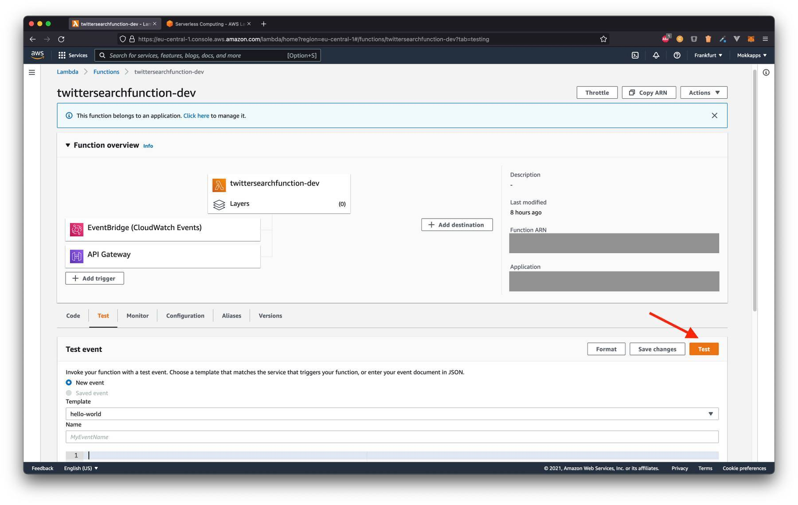

  
In this article, I will demonstrate to you how I built a simple serverless Node.js function on [AWS](https://aws.amazon.com/) that sends me a daily email with a list of tweets that mention me on [Twitter](https://twitter.com/mokkapps).

Recently, I used [Twilert](https://twilert.com/) and [Birdspotter](https://birdspotter.net/) for that purpose, which are specialized tools for Twitter keyword monitoring. But their free plans/trials don't fulfill my simple requirements, so I decided to implement them independently.

## Prerequisites

I chose [again](https://www.mokkapps.de/categories/aws) AWS Amplify to deploy the serverless function to [AWS](https://aws.amazon.com/).

If you don't already have an AWS account, you'll need to create one to follow the steps outlined in this article. Please follow [this tutorial](https://portal.aws.amazon.com/billing/signup?redirect_url=https%3A%2F%2Faws.amazon.com%2Fregistration-confirmation#/start) to create an account.

Next, you need to install and configure the [Amplify Command Line Interface (CLI)](https://docs.amplify.aws/start/getting-started/installation/q/integration/js/#install-and-configure-the-amplify-cli).

The serverless function will need access to secrets stored in the [AWS Secret Manager](https://aws.amazon.com/secrets-manager/). My article [“How to Use Environment Variables to Store Secrets in AWS Amplify Backend”](https://www.mokkapps.de/blog/how-to-use-environment-variables-to-store-secrets-in-aws-amplify-backend/) will guide you through this process.

## Add Serverless Function to AWS

The first step is to add a new Lambda (serverless) function with the Node.js runtime to the Amplify application.

The function gets invoked on a recurring schedule. In my case, it will be invoked every day at 08:00 PM.

Let's add the serverless function using the Amplify CLI:

```bash
▶ amplify add function
? Select which capability you want to add: Lambda function (serverless function)
? Provide an AWS Lambda function name: twittersearchfunction
? Choose the runtime that you want to use: NodeJS
? Choose the function template that you want to use: Hello World
? Do you want to configure advanced settings? Yes
? Do you want to access other resources in this project from your Lambda function? No
? Do you want to invoke this function on a recurring schedule? Yes
? At which interval should the function be invoked: Daily
? Select the start time (use arrow keys): 08:00 PM
? Do you want to enable Lambda layers for this function? No
? Do you want to configure environment variables for this function? No
? Do you want to configure secret values this function can access? No
? Do you want to edit the local lambda function now? No
```

## Get a list of tweets for a specific Twitter keyword

Now it's time to write the JavaScript code that returns a list of tweets for a given keyword. 

Let's start by writing the `twitter-client.js` module. This module uses [FeedHive’s Twitter Client](https://github.com/FeedHive/twitter-api-client) to access the [Twitter API](https://developer.twitter.com/en/docs/twitter-api). The first step is to initialize [the Twitter API client](https://github.com/FeedHive/twitter-api-client) and trigger the request:

```js
const mokkappsTwitterId = 481186762;
const searchQuery = 'mokkapps';
const searchResultCount = 100;

const fetchRecentTweets = async secretValues => {
  // Configure Twitter API Client
  const twitterClient = new twitterApiClient.TwitterClient({
    apiKey: secretValues.TWITTER_API_KEY,
    apiSecret: secretValues.TWITTER_API_KEY_SECRET,
    accessToken: secretValues.TWITTER_ACCESS_TOKEN,
    accessTokenSecret: secretValues.TWITTER_ACCESS_TOKEN_SECRET,
  });

  // Trigger search endpoint: https://github.com/FeedHive/twitter-api-client/blob/main/REFERENCES.md#twitterclienttweetssearchparameters
  const searchResponse = await twitterClient.tweets.search({
    q: searchQuery,
    count: searchResultCount,
    result_type: 'recent',
  });

  // Access statuses from response
  const statuses = searchResponse.statuses;
};
```

Next, we want to filter the response into three groups:

- Tweets: Tweets from the last 24 hours that were not published by my Twitter account and are no replies or retweets
- Replies: Tweets from the last 24 hours that were not published by my Twitter account and are replies
- Retweets: Tweets from the last 24 hours that were not published by my Twitter account and are retweets

Let's start by the filtering the `statuses` response for "normal" tweets that are no replies or retweets:

```js
const isTweetedInLast24Hours = status => {
  const tweetDate = new Date(status.created_at);
  const now = new Date();
  const timeDifference = now.getTime() - tweetDate.getTime();
  const daysDifference = timeDifference / (1000 * 60 * 60 * 24);
  return daysDifference <= 1;
};

const fetchRecentTweets = async secretValues => {
  // ...
  const statuses = searchResponse.statuses;

  // highlight-start
  const tweets = statuses.filter(status => {
    const isNotOwnAccount = status.user.id !== mokkappsTwitterId;
    const isNoReply = status.in_reply_to_status_id === null;
    const isNoRetweet = status.retweeted_status === null;
    return (
      isNotOwnAccount &&
      isNoReply &&
      isNoRetweet &&
      isTweetedInLast24Hours(status)
    );
  });
  // highlight-end
};
```

Now we can filter for retweets and replies in a similar way:

```js
const retweets = statuses.filter(status => {
  const isNotOwnAccount = status.user.id !== mokkappsTwitterId;
  const isRetweet = status.retweeted_status;
  return isNotOwnAccount && isRetweet && isTweetedInLast24Hours(status);
});

const replies = statuses.filter(status => {
  const isNotOwnAccount = status.user.id !== mokkappsTwitterId;
  const isReply = status.in_reply_to_status_id !== null;
  return isNotOwnAccount && isReply && isTweetedInLast24Hours(status);
});
```

The last step is to map the results to a very simple HTML structure that will be rendered inside the email body:

```js
const { formatDistance } = require('date-fns');

const mapStatus = status => {
  const {
    id_str: id,
    created_at,
    in_reply_to_screen_name,
    in_reply_to_status_id_str,
    text,
    retweet_count,
    favorite_count,
    user: {
      screen_name: user_screen_name,
      followers_count,
      created_at: userCreatedAt,
      friends_count,
    },
  } = status;
  const createdAtLocaleString = new Date(created_at).toLocaleString();
  const url = `https://twitter.com/${user_screen_name}/status/${id}`;
  const userUrl = `https://twitter.com/${user_screen_name}`;
  const originalUrl = in_reply_to_screen_name
    ? `https://twitter.com/${in_reply_to_screen_name}/status/${in_reply_to_status_id_str}`
    : null;
  const userCreatedDateDistance = formatDistance(
    new Date(),
    new Date(userCreatedAt)
  );

  return `
    <div style="margin-bottom: 20px; padding: 10px; border: 1px solid gray; border-radius: 5px;">
      <h2>From <a href=${userUrl}>${user_screen_name}</a> at ${createdAtLocaleString}</h2>
      <small><strong>Followers:</strong> ${followers_count}, <strong>Following:</strong> ${friends_count}, <strong>Account Created:</strong> ${userCreatedDateDistance} ago</small>
      <h3>${text}</h3>
      <a href=${url} style="margin-top: 10px">Tweet</a>
      <small style="margin-top: 5px">(<strong>Likes:</strong> ${favorite_count}, <strong>Retweets: ${retweet_count})</strong></small>
      ${
        originalUrl
          ? `<div style="margin-top: 10px"></br><a href=${originalUrl}>Original Tweet</a></div>`
          : ''
      }
    </div>
    `;
};

const fetchRecentTweets = async secretValues => {
  // ...
  const retweets = statuses
    .filter(status => {
      const isNotOwnAccount = status.user.id !== mokkappsTwitterId;
      const isRetweet = status.retweeted_status;
      return isNotOwnAccount && isRetweet && isTweetedInLast24Hours(status);
    })
    // highlight-next-line
    .map(status => mapStatus(status));
};
```

This is the code for the whole `twitter-client.js` module:

```js
const twitterApiClient = require('twitter-api-client');
const { formatDistance } = require('date-fns');

const mokkappsTwitterId = 481186762;
const searchQuery = 'mokkapps';
const searchResultCount = 100;

const mapStatus = status => {
  const {
    id_str: id,
    created_at,
    in_reply_to_screen_name,
    in_reply_to_status_id_str,
    text,
    retweet_count,
    favorite_count,
    user: {
      screen_name: user_screen_name,
      followers_count,
      created_at: userCreatedAt,
      friends_count,
    },
  } = status;
  const createdAtLocaleString = new Date(created_at).toLocaleString();
  const url = `https://twitter.com/${user_screen_name}/status/${id}`;
  const userUrl = `https://twitter.com/${user_screen_name}`;
  const originalUrl = in_reply_to_screen_name
    ? `https://twitter.com/${in_reply_to_screen_name}/status/${in_reply_to_status_id_str}`
    : null;
  const userCreatedDateDistance = formatDistance(
    new Date(),
    new Date(userCreatedAt)
  );

  return `
    <div style="margin-bottom: 20px; padding: 10px; border: 1px solid gray; border-radius: 5px;">
      <h2>From <a href=${userUrl}>${user_screen_name}</a> at ${createdAtLocaleString}</h2>
      <small><strong>Followers:</strong> ${followers_count}, <strong>Following:</strong> ${friends_count}, <strong>Account Created:</strong> ${userCreatedDateDistance} ago</small>
      <h3>${text}</h3>
      <a href=${url} style="margin-top: 10px">Tweet</a>
      <small style="margin-top: 5px">(<strong>Likes:</strong> ${favorite_count}, <strong>Retweets: ${retweet_count})</strong></small>
      ${
        originalUrl
          ? `<div style="margin-top: 10px"></br><a href=${originalUrl}>Original Tweet</a></div>`
          : ''
      }
    </div>
    `;
};

const isTweetedInLast24Hours = status => {
  const tweetDate = new Date(status.created_at);
  const now = new Date();
  const timeDifference = now.getTime() - tweetDate.getTime();
  const daysDifference = timeDifference / (1000 * 60 * 60 * 24);
  return daysDifference <= 1;
};

const fetchRecentTweets = async secretValues => {
  const twitterClient = new twitterApiClient.TwitterClient({
    apiKey: secretValues.TWITTER_API_KEY,
    apiSecret: secretValues.TWITTER_API_KEY_SECRET,
    accessToken: secretValues.TWITTER_ACCESS_TOKEN,
    accessTokenSecret: secretValues.TWITTER_ACCESS_TOKEN_SECRET,
  });

  const searchResponse = await twitterClient.tweets.search({
    q: searchQuery,
    count: searchResultCount,
    result_type: 'recent',
  });

  const statuses = searchResponse.statuses;

  const tweets = statuses
    .filter(status => {
      const isNotOwnAccount = status.user.id !== mokkappsTwitterId;
      const isNoReply = status.in_reply_to_status_id === null;
      const isNoRetweet = status.retweeted_status === null;
      return (
        isNotOwnAccount &&
        isNoReply &&
        isNoRetweet &&
        isTweetedInLast24Hours(status)
      );
    })
    .map(status => mapStatus(status));

  const retweets = statuses
    .filter(status => {
      const isNotOwnAccount = status.user.id !== mokkappsTwitterId;
      const isRetweet = status.retweeted_status;
      return isNotOwnAccount && isRetweet && isTweetedInLast24Hours(status);
    })
    .map(status => mapStatus(status));

  const replies = statuses
    .filter(status => {
      const isNotOwnAccount = status.user.id !== mokkappsTwitterId;
      const isReply = status.in_reply_to_status_id !== null;
      return isNotOwnAccount && isReply && isTweetedInLast24Hours(status);
    })
    .map(status => mapStatus(status));

  return {
    tweets,
    retweets,
    replies,
  };
};

module.exports = fetchRecentTweets;
```

## Serverless function code

We can now use the `twitter-client.js` in our serverless function:

```js
const AWS = require('aws-sdk');
const nodemailer = require('nodemailer');
const fetchRecentTweets = require('./twitter-client');

const secretsManager = new AWS.SecretsManager();
const responseHeaders = {
  'Content-Type': 'application/json'
};

exports.handler = async event => {
  console.log(`👷 Function is ready to search for tweets`);

  const secretData = await secretsManager
    .getSecretValue({ SecretId: 'YOUR_SECRET_ID' })
    .promise();
  const secretValues = JSON.parse(secretData.SecretString);

  const transporter = nodemailer.createTransport({
    service: secretValues.MAIL_HOST,
    auth: {
      user: secretValues.MAIL_USER,
      pass: secretValues.MAIL_PW,
    },
  });

  const defaultMailOptions = {
    from: secretValues.MAIL_USER,
    to: secretValues.MAIL_SUCCESS,
    subject: `[Mokkapps API] Twitter Search Results`,
  };

  try {
    // Fetch recent tweets
    const { tweets, replies, retweets } = await fetchRecentTweets(secretValues);

    // Skip sending email if we have no results
    if (tweets.length === 0 && replies.length === 0 && retweets.length === 0) {
      return {
        statusCode: 200,
        headers: responseHeaders,
        body: [],
      };
    }

    // Send email
    await transporter.sendMail({
      ...defaultMailOptions,
      html: `
        <h1>Tweets that mentioned "mokkapps" in the last 24 hours</h1>
        ${tweets.length === 0 ? '<p>No results</p>' : tweets.join('')}
        <h1>Replies that mentioned "mokkapps" in the last 24 hours</h1>
        ${replies.length === 0 ? '<p>No results</p>' : replies.join('')}
        <h1>Retweets that mentioned "mokkapps" in the last 24 hours</h1>
        ${retweets.length === 0 ? '<p>No results</p>' : retweets.join('')}
      `,
    });
    
    return {
      statusCode: 200,
      headers: responseHeaders,
      body: JSON.stringify({ tweets, replies, retweets }),
    };
  } catch (e) {
    console.error('☠ Twitter Search Function Error:', e);
    return {
      statusCode: 500,
      headers: responseHeaders,
      body: e.message ? e.message : JSON.stringify(e),
    };
  }
};
```

At this point, we can publish our function by running: 

```bash
amplify push
```

If we successfully pushed the function to AWS, we can manually invoke the function in [AWS Lamba](https://aws.amazon.com/lambda/) by clicking the "Test" button: 



The serverless function should then send an email with a list of tweets if someone mentioned the monitored keyword in the last 24 hours:


## Conclusion

I had a lot of fun building this simple serverless function to monitor keywords on Twitter. 

Serverless functions are a perfect choice for such a monitoring tool, as we only have to pay for the execution time of the serverless function.

What do you think about my solution? Leave a comment and tell me how you monitor your Twitter keywords.

If you liked this article, follow me on [Twitter](https://twitter.com/mokkapps) to get notified about new blog posts and more content from me.

Alternatively (or additionally), you can also [subscribe to my newsletter](https://mokkapps.de/newsletter).
