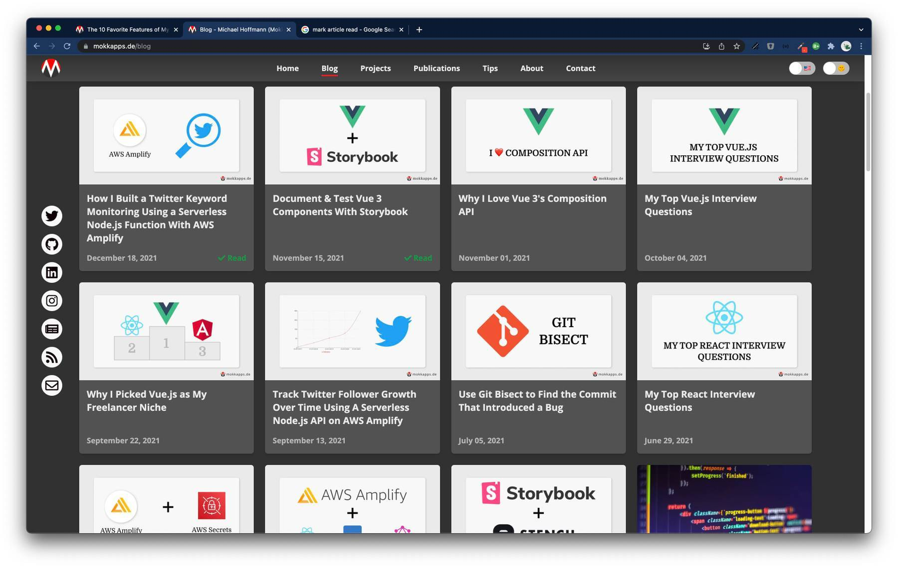
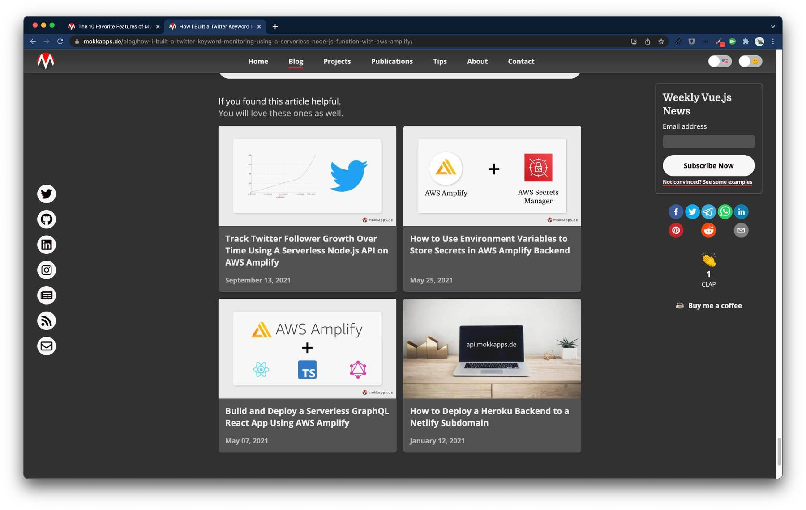
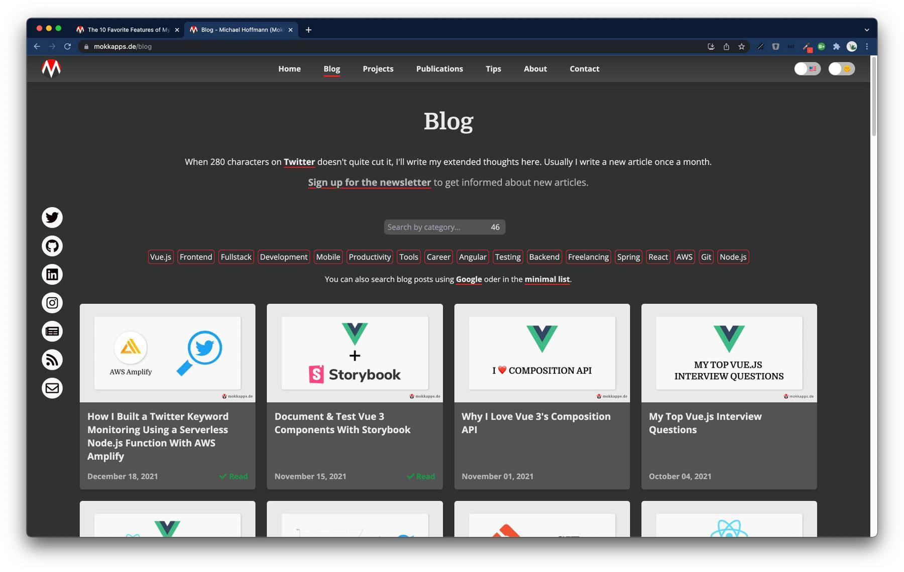

Inspired by [Braydon Coyer's new blogfolio](https://braydoncoyer.dev/blog/introducing-my-new-blogfolio), I've added some excellent new features to my portfolio website.

In this article, I want to demonstrate the ten favorite features of my blogfolio.

## Table of Contents

* [1. Stats page](#1-stats-page)
* [2. Article Reactions](#2-article-reactions)
* [3. Automated Open Graph Images](#3-automated-open-graph-images)
* [4. Mark Article as Read](#4-mark-article-as-read)
* [5. Intelligent Article Suggestions](#5-intelligent-article-suggestions)
* [6. Article Search Options](#6-article-search-options)
* [7. Prism Code Highlighting](#7-prism-code-highlighting)
* [8. MDX](#8-mdx)
* [9. Generate Scripts](#9-generate-scripts)
* [10. Open Source Analytics](#10-open-source-analytics)
* [Conclusion](#conclusion)

## 1. Stats page

Inspired by [SLD](https://sld.codes/) and [Braydon Coyer](http://braydoncoyer.dev/stats), I've added a [Stats page on my site](https://mokkapps.de/stats).

It shows statistics about the site itself, for example, how many active visitors are currently on the site and how many have visited it in total.

Additionally, it shows some information about my social media channels like the follower count of [GitHub](https://github.com/mokkapps), [Twitter](https://twitter.com/mokkapps), [Dev.to](https://dev.to/mokkapps), and more.

I use [AWS Amplify Serverless Functions](https://mokkapps.de/categories/aws) to access a variety of APIs to provide the necessary data for this site.


## 2. Article Reactions

Built with [Supabase](https://supabase.com/) and AWS Amplify Serverless Functions, readers of my articles can now react to the article with the clap emoji.

Additionally, I use the same database table to store the number of page views.


## 3. Automated Open Graph Images

I use [Braydon's approach](https://braydoncoyer.dev/blog/how-to-dynamically-create-open-graph-images-with-cloudinary-and-next.js) to automatically generate [Open Graph](https://ogp.me/) images for certain pages using the [Cloudinary API](https://cloudinary.com/documentation/cloudinary_references).

The code grabs the site's title and generates an Open Graph image using Cloudinary API.

The following image shows such an automatically generated image that I use on my website:


## 4. Mark Article as Read

Visitors of my website can see at a glimpse which articles they've already read. It's a nice little feature for recurring readers of my blog.



## 5. Intelligent Article Suggestions

If a reader of a blog article reaches the end of the article, he will see four similar articles. They are selected by checking how many categories match between the articles.



## 6. Article Search Options

I provide multiple ways to search for blog articles:

1. All articles are available on the [blog page](https://mokkapps.de/blog), and you can scroll or use the browser search to find an article.
2. Use the [minimal list](https://mokkapps.de/minimal-blog-list), which shows all blog posts grouped in years by title.
4. Use [Google](https://www.google.com/search?q=site%3Amokkapps.de%2Fblog).



## 7. Prism Code Highlighting

I invested some time to create beautiful code snippets on my blog posts, as they are an essential part of my articles.

I use [Prism](https://prismjs.com/) with the [Gatsby Prism Remark plugin](https://www.gatsbyjs.com/plugins/gatsby-remark-prismjs/) to show code blocks in my markdown files:

```js
export const getCategoryDisplayText = category => {
  // highlight-start
  if (category === 'aws') {
    return category.toUpperCase();
  }
  // highlight-end

  if (category.includes('-js')) {
    const name = category.split('-')[0];
    return `${capitalize(name)}.js`;
  }

  return capitalize(category);
};
```

I can highlight certain lines of code, and I show the programming language as a nice badge on the top right.

## 8. MDX

[MDX](https://mdxjs.com/) is very powerful, and I use it for my tips page, where I inject the following React component into my Markdown files to create a beautiful comparison of two code blocks:

import TipCard from 'components/TipCard';

export const badCode = `<div :class="isDisabled ? 'disabled' : ''"></div>
<!-- Will render <div class></div> -->
`.trim();

export const goodCode = `<div :class="isDisabled ? 'disabled' : null"></div>
<!-- Will render <div></div> -->`.trim();

<TipCard highlight="bad" language="html">
  {badCode}
</TipCard>

<br />

<TipCard highlight="good" language="html">
  {goodCode}
</TipCard>

## 9. Generate Scripts

Inspired by [Kent C. Dodds](https://github.com/kentcdodds), I use [multiple JS scripts](https://github.com/Mokkapps/website/tree/master/scripts/generate) to generate boilerplate files for new blog posts and tips.

For example, the `blogpost.js` script will generate a similar output in the console:

```bash
? Title this is a test to see if my script is awesome
? Categories development, career, tools
? Release Date (format: yyyy-mm-dd) 2022-01-08
? Dry run without creating files? (default: false) Yes


Date:
2022-01-08

Slug:
this-is-a-test-to-see-if-my-script-is-awesome

Markdown data:
---
title: "This Is a Test to See if My Script Is Awesome"
categories:
  - "development"
  - "career"
  - "tools"
cover: "images/cover.jpg"
---

## Conclusion

If you liked this article, follow me on [Twitter](https://twitter.com/mokkapps) to get notified about new blog posts and more content from me.

Alternatively (or additionally), you can also [subscribe to my newsletter](https://mokkapps.de/newsletter).
```

The script asks for some mandatory information, converts the entered title to title caps, and finally generates the markdown file with the slug name at the correct directory.

Additionally, I have a script to generate a Table of Content (ToC) for a finished article and an image optimization script.

## 10. Open Source Analytics

I use [Umami](https://github.com/mikecao/umami) with a database hosted on [Digital Ocean](https://www.digitalocean.com/). I send custom events if a visitor, for example, clicks a social link, subscribes to the newsletter or,
edits an article on GitHub. These events provide some valuable insights into how many visitors are using the features on my portfolio website.


## Conclusion

My portfolio website is my favorite digital playground. I love to experiment with different new features and try to provide the best possible
experience for visitors.

The source code of my website is [available on GitHub](https://github.com/Mokkapps/website), so feel free to take a closer look if you are interested in
implementation details. Leave a comment if you want more information about a specific topic.

If you liked this article, follow me on [Twitter](https://twitter.com/mokkapps) to get notified about new blog posts and more content from me.

Alternatively (or additionally), you can also [subscribe to my newsletter](https://mokkapps.de/newsletter).
