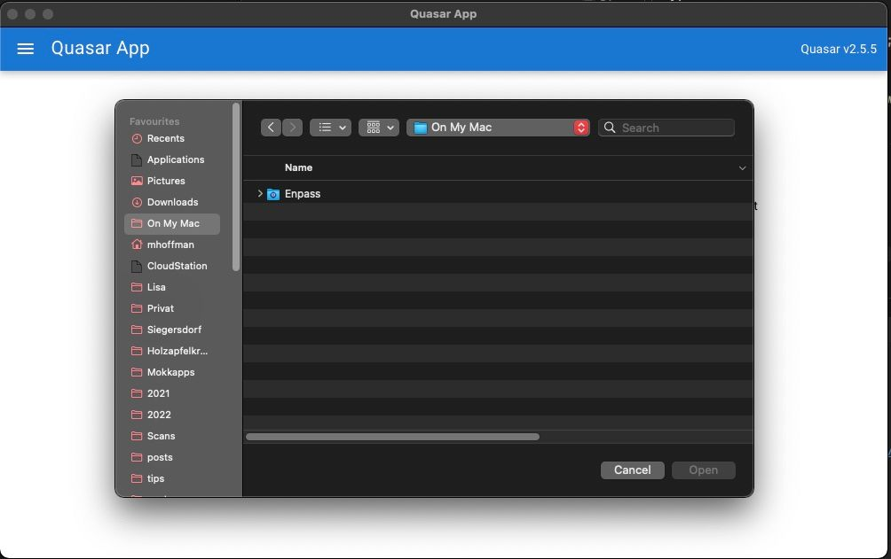

Recently, I planned to rewrite my ["Scrum Daily Standup Picker" Electron application](https://github.com/Mokkapps/scrum-daily-standup-picker/) in Vue 3. I wrote the initial release in Angular, but I wanted to refactor the code base and rewrite it in Vue 3. 

Why? Because I love Vue and want to have a public showcase that I can reference to potential customers.
 
## Why Quasar?

[Quasar](https://quasar.dev/) is an MIT licensed open-source Vue.js based framework that targets SPA, SSR, PWA, mobile app, desktop app, and browser extension all using one codebase.
It handles the build setup and provides a complete collection of Material Design compliant UI components.

Quasar's motto is:

> Write code once and simultaneously deploy it as a website, a Mobile App and/or an Electron App.

Using Quasar drastically saves development time due to these reasons:

- It's based on Vue.js.
- It provides many UI components that follow Material Design guidelines.
- It has a regular release cycle inclusive of new features.
- It provides support for each build mode (SPA, SSR, PWA, Mobile app, Desktop app & Browser Extension).
- It has its own CLI that provides a pleasant developer experience. For example, we can build our application as SPA, mobile, or desktop app within the same project folder.

[Read more](https://quasar.dev/introduction-to-quasar) about why Quasar might be a good choice for your next project.

## Install Quasar CLI

[[info]]
| The source code for the following demo is [available at GitHub](https://github.com/Mokkapps/quasar-electron-vue3-pinia-demo)

```bash
# Node.js >=12.22.1 is required.

$ yarn global add @quasar/cli
# or
$ npm install -g @quasar/cli
```

Let's start by creating a new project using the Quasar CLI:

```bash
▶ quasar create vue3-electron-demo

  ___
 / _ \ _   _  __ _ ___  __ _ _ __
| | | | | | |/ _` / __|/ _` | '__|
| |_| | |_| | (_| \__ \ (_| | |
 \__\_\\__,_|\__,_|___/\__,_|_|


? Project name (internal usage for dev) vue3-electron-demo
? Project product name (must start with letter if building mobile apps) Quasar App
? Project description A Quasar Framework app
? Author Michael Hoffmann <michael.hoffmann@mokkapps.de>
? Pick your CSS preprocessor: SCSS
? Check the features needed for your project: ESLint (recommended), TypeScript
? Pick a component style: Composition
? Pick an ESLint preset: Prettier
? Continue to install project dependencies after the project has been created? (recommended) NPM
```

We chose [SCSS](https://sass-lang.com/) as our CSS preprocessor, [ESLint](https://eslint.org/) & [Typescript](https://www.typescriptlang.org/) as additional features, [Vue 3's Composition API](https://vuejs.org/guide/introduction.html#api-styles) and [Prettier](https://prettier.io/) for code formatting.

[[warning]]
| Do not choose Vuex as we will add another state library in the next chapter. If you accidentally added Vuex, remove it manually from your `package.json`.

[Read the official docs](https://quasar.dev/quasar-cli/installation) for additional information about the Quasar CLI.

## Add Pinia as Vue store library

We'll use [Pinia](https://pinia.vuejs.org/) as Vue store library, which is now the recommended state library for Vue.

First, we need to install Pinia:

```bash
yarn add pinia
# or with npm
npm install pinia
```

To be able to register Pinia at our Vue application instance we need to create a [Quasar Boot File](https://quasar.dev/quasar-cli/boot-files):

> A common use case for Quasar applications is to run code before the root Vue app instance is instantiated, like injecting and initializing your own dependencies (examples: Vue components, libraries…) or simply configuring some startup code of your app.

Our boot file is called `pinia.ts` and is located at `src/boot`:

```ts
import { boot } from 'quasar/wrappers';
import { createPinia } from 'pinia';

export default boot(({ app }) => {
  app.use(createPinia());
});
```

We also need to add this new file to `quasar.conf.js`:

```js
module.exports = configure(function (ctx) {
  return {
    ...
    // app boot file (/src/boot)
    // --> boot files are part of "main.js"
    // https://quasar.dev/quasar-cli/boot-files
    // highlight-next-line
    boot: ['pinia'],
    ...
  }
}
```

Now, we can create a new folder called `pinia` in `src`.

[[warning]]
| We cannot name this folder `store` as this name is reserved for the official Vuex integration.

A basic store could look like this:

```js
import { defineStore } from 'pinia';

// useStore could be anything like useUser, useCart
// the first argument is a unique id of the store across your application
const useStore = defineStore('storeId', {
  state: () => {
    return {
      counter: 0,
      lastName: 'Michael',
      firstName: 'Michael',
    };
  },
  getters: {
    fullName: state => `${state.firstName} ${state.lastName}`,
  },
  actions: {
    increment() {
      this.counter++;
    },
  },
});

export default useStore;
```

We can use this store in any Vue component:

```vue
<template>Counter: {{ store.counter }}</template>

<script setup lang="ts">
import { useStore } from '@/stores/counter';

const store = useStore();
</script>
```

Now we can run the Vue application using the Quasar CLI: 

```bash
quasar dev
```

The Vue application is served at `http://localhost:8080`:


## Setup Electron

[[info]]
| Read this [introduction](https://quasar.dev/quasar-cli/developing-electron-apps/introduction) if you are new to Electron.

To develop/build a Quasar Electron app, we need to add the Electron mode to our Quasar project:

```bash
quasar mode add electron
```

Every Electron app has two threads: the main thread (deals with the window and initialization code – from the newly created folder `/src-electron`) and the renderer thread (which deals with the actual content of your app from `/src`).

The new folder has the following structure:

```
.
└── src-electron/
├── icons/                # Icons of your app for all platforms
|   ├── icon.icns         # Icon file for Darwin (MacOS) platform
|   ├── icon.ico          # Icon file for win32 (Windows) platform
|   └── icon.png          # Tray icon file for all platforms
├── electron-preload.js   # (or .ts) Electron preload script (injects Node.js stuff into renderer thread)
└── electron-main.js      # (or .ts) Main thread code
```

Now we are ready to start our Electron application:

```bash
quasar dev -m electron
```

This command will open up an Electron window which will render your app along with Developer Tools opened side by side:


[Read the official docs](https://quasar.dev/quasar-cli/developing-electron-apps/) for additional and detailed information about developing Electron apps with Quasar.

## Control Electron from Vue code

If we want to use Electron features like opening a file dialog, we need to write some code to be able to access Electron's API.

For example, if we want to show a dialog to open files, Electron provides the [dialog API](https://www.electronjs.org/docs/latest/api/dialog/) to display native system dialogs for opening and saving files, alerting, etc.

First, we need to install `@electron/remote`:

```bash
npm install -D @electron/remote
```

Then we need to modify `src-electron/electron-main.js` and initialize `@electron/remote`:

```js
import { app, BrowserWindow, nativeTheme } from 'electron'
// highlight-next-line
import { initialize, enable } from '@electron/remote/main'
import path from 'path'
import os from 'os'

// highlight-next-line
initialize();

let mainWindow;

function createWindow () {
  /**
   * Initial window options
   */
  mainWindow = new BrowserWindow({
    icon: path.resolve(__dirname, 'icons/icon.png'), // tray icon
    width: 1000,
    height: 600,
    useContentSize: true,
    webPreferences: {
      contextIsolation: true,
      // More info: /quasar-cli/developing-electron-apps/electron-preload-script
      preload: path.resolve(__dirname, process.env.QUASAR_ELECTRON_PRELOAD)
    }
  })
  
  // ....

  // highlight-next-line
  enable(mainWindow.webContents);
}
```

If we want to use Electron API from our Vue code we need to add some code to `src-electron/electron-preload.js`:

```js
import { contextBridge } from 'electron';
// highlight-next-line
import { dialog } from '@electron/remote';

// 'electronApi' will be available on the global window context
contextBridge.exposeInMainWorld('electronApi', {
  openFileDialog: async (title, folder, filters) => {
    // calling showOpenDialog from Electron API: https://www.electronjs.org/docs/latest/api/dialog/
    // highlight-start
    const response = await dialog.showOpenDialog({
      title,
      filters,
      properties: ['openFile', 'multiSelections'],
    });
    // highlight-end
    return response.filePaths;
  }
});
```

Next we create `src/api/electron-api.ts` to access this code from within our Vue application: 

```ts
export interface ElectronFileFilter {
  name: string;
  extensions: string[];
}

export interface ElectronApi {
  openFileDialog: (
    title: string,
    folder: string,
    filters: ElectronFileFilter
  ) => Promise<string[]>;
}

// eslint-disable-next-line @typescript-eslint/ban-ts-comment
// @ts-ignore
export const electronApi: ElectronApi = (window as { electronApi: ElectronApi })
  .electronApi;
```

Now we can use this API anywhere in our Vue component: 

```vue
<template>
  <q-btn @click="openElectronFileDialog">Open Electron File Dialog</q-btn>
</template>

<script lang="ts">
import { defineComponent } from 'vue';
import { electronApi } from 'src/api/electron-api';

export default defineComponent({
  name: 'PageIndex',
  components: { },
  setup() {
    const openElectronFileDialog = async () => {
      return electronApi.openFileDialog('Test', 'folder', { name: 'images', extensions: ['jpg'] });
    };

    return { openElectronFileDialog };
  },
});
</script>
```

Clicking on the button should now open the native OS file dialog:



## Conclusion

Quasar allows us to quickly develop Electron desktop applications in Vue with high-quality UI components that follow Material Design guidelines. 

The most significant advantage against a custom Electron + Vue boilerplate project from GitHub is that Quasar has a regular release cycle and provides [upgrade guides](https://quasar.dev/quasar-cli/developing-electron-apps/electron-upgrade-guide) for older versions.

Take a look at my ["Scrum Daily Standup Picker" GitHub repository](https://github.com/Mokkapps/scrum-daily-standup-picker) to see a more complex "Quasar-Electron-Vue3-Typescript-Pinia" project. The demo source code for the following demo is [available at GitHub](https://github.com/Mokkapps/quasar-electron-vue3-pinia-demo).

If you liked this article, follow me on [Twitter](https://twitter.com/mokkapps) to get notified about new blog posts and more content from me.

Alternatively (or additionally), you can also [subscribe to my newsletter](https://mokkapps.de/newsletter).
