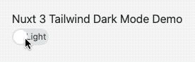

I am currently rewriting my [portfolio website](https://github.com/mokkapps/website) with [Nuxt 3](https://v3.nuxtjs.org/) which is still in beta. In this article, I want to show you how I implemented a dark mode switch in Nuxt 3 using [Tailwind CSS](https://tailwindcss.com/) that I will use in my new portfolio website.

## Create Nuxt 3 project

To create a new Nuxt 3 project, we need to run this command in our terminal:

```bash
npx nuxi init nuxt3-app
```

## Add Tailwind CSS 3

Next, we add the [nuxt/tailwind](https://tailwindcss.nuxtjs.org) module, which provides a [prerelease version](https://tailwindcss.nuxtjs.org/releases/#Nuxt%203%20and%20Tailwindcss%203%20support) that supports Nuxt 3 and Tailwind CSS v3:

```bash
npm install --save-dev @nuxtjs/tailwindcss@5.0.0-4
```

Then we need to add this module to the `buildModules` section in `nuxt.config.js`:

```js
import { defineNuxtConfig } from 'nuxt3';

// https://v3.nuxtjs.org/docs/directory-structure/nuxt.config
export default defineNuxtConfig({
  // highlight-next-line
  buildModules: ['@nuxtjs/tailwindcss'],
});
```

Now, we can create the Tailwind configuration file `tailwind.config.js` by running the following command:

```bash
npx tailwindcss init
```

Let's add a basic CSS file at `./assets/css/tailwind.css` (see [official docs](https://tailwindcss.nuxtjs.org/setup#tailwind-files) for further configuration options):

```css
@tailwind base;
@tailwind components;
@tailwind utilities;

.theme-light {
  --background: #f8f8f8;
  --text: #313131;
}

.theme-dark {
  --background: #313131;
  --text: #f8f8f8;
}
```

We define two CSS classes for the dark and light theme. [CSS variables](https://developer.mozilla.org/en-US/docs/Web/CSS/Using_CSS_custom_properties) (indicated by `--`) are used to change CSS values based on the selected theme dynamically.

Therefore, we need to define these colors in our `tailwind.conf.js`:

```js
module.exports = {
  content: [
    `components/**/*.{vue,js,ts}`,
    `layouts/**/*.vue`,
    `pages/**/*.vue`,
    `app.vue`,
    `plugins/**/*.{js,ts}`,
    `nuxt.config.{js,ts}`,
  ],
  theme: {
    extend: {
      // highlight-start
      colors: {
        themeBackground: 'var(--background)',
        themeText: 'var(--text)',
      },
      // highlight-end
    },
  },
  plugins: [],
};
```

## Implement Theme Switch

Let's start to implement a theme switch by adding this simple template to our `app.vue` component:

```vue
<template>
  <div
    :class="{
      'theme-light': !darkMode,
      'theme-dark': darkMode,
    }"
    class="h-screen bg-themeBackground p-5"
  >
    <h1 class="text-themeText">Nuxt 3 Tailwind Dark Mode Demo</h1>
    <Toggle v-model="darkMode" off-label="Light" on-label="Dark" />
  </div>
</template>
```

On the `div` container element, we dynamically set `theme-light` or `theme-dark` CSS class based on the reactive `darkMode` variable value, which we will implement later in the `script` part of the component.

The `h1` and container `div` elements use our Tailwind CSS classes `bg-themeBackground` and `text-themeText` to use theme-specific colors for the background and text color.

Additionally, we use the [Vue 3 Toggle](https://github.com/vueform/toggle) library to switch between our themes.

Let's take a look at the `script` part of `app.vue`:

```vue
<script setup lang="ts">
import Toggle from '@vueform/toggle';
import { useState } from '#app';
import { onMounted, watch } from '@vue/runtime-core';

type Theme = 'light' | 'dark';

const LOCAL_STORAGE_THEME_KEY = 'theme';

const darkMode = useState('theme', () => false);

const setTheme = (newTheme: Theme) => {
  localStorage.setItem(LOCAL_STORAGE_THEME_KEY, newTheme);
  darkMode.value = newTheme === 'dark';
};

onMounted(() => {
  const isDarkModePreferred = window.matchMedia(
    '(prefers-color-scheme: dark)'
  ).matches;

  const themeFromLocalStorage = localStorage.getItem(
    LOCAL_STORAGE_THEME_KEY
  ) as Theme;

  if (themeFromLocalStorage) {
    setTheme(themeFromLocalStorage);
  } else {
    setTheme(isDarkModePreferred ? 'dark' : 'light');
  }
});

watch(darkMode, selected => {
  setTheme(selected ? 'dark' : 'light');
});
</script>
```

We store the selected theme value in [Local Storage](https://developer.mozilla.org/en-US/docs/Tools/Storage_Inspector/Local_Storage_Session_Storage) and use [useState](https://v3.nuxtjs.org/docs/usage/state) to define a reactive variable called `darkMode`:

```ts
const darkMode = useState('theme', () => false);
```

If the component is mounted, we first detect if the user has requested light or dark color theme by using [the CSS media feature "prefers-color-scheme"](https://developer.mozilla.org/en-US/docs/Web/CSS/@media/prefers-color-scheme):

```ts
const isDarkModePreferred = window.matchMedia(
  '(prefers-color-scheme: dark)'
).matches;
```

Then we set the theme value based on the local storage value:

```ts
const setTheme = (newTheme: Theme) => {
  localStorage.setItem(LOCAL_STORAGE_THEME_KEY, newTheme);
  darkMode.value = newTheme === 'dark';
};

onMounted(() => {
  const isDarkModePreferred = window.matchMedia(
    '(prefers-color-scheme: dark)'
  ).matches;

  // highlight-start
  const themeFromLocalStorage = localStorage.getItem(
    LOCAL_STORAGE_THEME_KEY
  ) as Theme;

  if (themeFromLocalStorage) {
    setTheme(themeFromLocalStorage);
  } else {
    setTheme(isDarkModePreferred ? 'dark' : 'light');
  }
  // highlight-end
});
```

This the complete `app.vue` component code:

```vue
<template>
  <div
    :class="{
      'theme-light': !darkMode,
      'theme-dark': darkMode,
    }"
    class="h-screen bg-themeBackground p-5"
  >
    <h1 class="text-themeText">Nuxt 3 Tailwind Dark Mode Demo</h1>
    <Toggle v-model="darkMode" off-label="Light" on-label="Dark" />
  </div>
</template>

<script setup lang="ts">
import Toggle from '@vueform/toggle';
import { useState } from '#app';
import { onMounted, watch } from '@vue/runtime-core';

type Theme = 'light' | 'dark';

const LOCAL_STORAGE_THEME_KEY = 'theme';

const darkMode = useState('theme', () => false);

const setTheme = (newTheme: Theme) => {
  localStorage.setItem(LOCAL_STORAGE_THEME_KEY, newTheme);
  darkMode.value = newTheme === 'dark';
};

onMounted(() => {
  const isDarkModePreferred = window.matchMedia(
    '(prefers-color-scheme: dark)'
  ).matches;

  const themeFromLocalStorage = localStorage.getItem(
    LOCAL_STORAGE_THEME_KEY
  ) as Theme;

  if (themeFromLocalStorage) {
    setTheme(themeFromLocalStorage);
  } else {
    setTheme(isDarkModePreferred ? 'dark' : 'light');
  }
});

watch(darkMode, selected => {
  setTheme(selected ? 'dark' : 'light');
});
</script>

<style src="@vueform/toggle/themes/default.css"></style>
```

Now we can use run the following command to start our Nuxt app in development mode:

```bash
npm run dev
```

Finally, we can test our dark mode theme switch at `http://localhost:3000`:



## StackBlitz Demo

My simple demo is available as interactive StackBlitz demo:

<iframe width="100%" height="500" src="https://stackblitz.com/github/Mokkapps/nuxt-3-tailwind-3-dark-mode-switch-demo?embed=1"></iframe>

## Nuxt 3 Module

Alternatively, you could also use the [color-mode](https://color-mode.nuxtjs.org/) module that supports Nuxt Bridge and Nuxt 3.

## Conclusion

This article showed you how to create a simple dark mode switch in Nuxt 3 with Tailwind CSS v3. You can expect more Nuxt 3 posts in the following months as I plan to blog about interesting topics that I discover while I rewrite my portfolio website.

If you liked this article, follow me on [Twitter](https://twitter.com/mokkapps) to get notified about new blog posts and more content from me.

Alternatively (or additionally), you can also [subscribe to my weekly Vue.js newsletter](https://mokkapps.de/newsletter).
