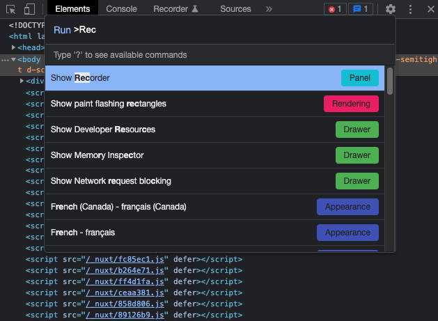
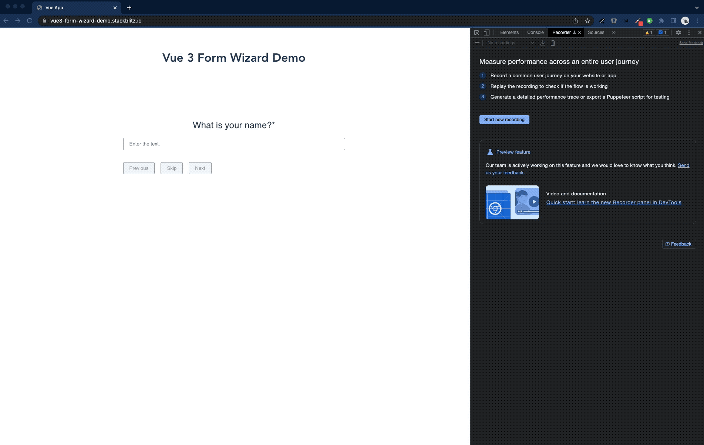

Typically, a user needs to process multiple pages or steps to finish his journey, such as submitting an order or completing a registration. If we as developers need to develop one of the last pages of this user flow, we need to manually process all the previous pages/steps every time we refresh the page or need to restart the flow. 

If multiple team members (also tester) have to do the same steps repeatedly, this costs a lot of time and, therefore, money. In previous projects, we often developed custom tools to proceed to certain pages/steps in the application automatically.

But now, the [Chrome browser](https://chrome.com/) provides this functionality as a preview feature. 

## What is Chrome Recorder?

[Chrome Recorder](https://developer.chrome.com/docs/devtools/recorder/) is a preview feature in the Chrome browser designed to record, replay and measure user flows of an application. 

You can start a recording, execute the steps you'd like to record in the app (such as typing or clicking), and export the recording as JSON file, [Puppeteer](https://pptr.dev/) script or [@puppeteer/replay](https://github.com/puppeteer/replay) script.

It's then possible to replay the recorded user flow and measure the performance of the run.

## Open Recorder

To find the Recorder, you first open up the Chrome DevTools.

> Command+Option+C (Mac) or Control+Shift+C (Windows, Linux, ChromeOS).

You can open the Recorder from the options menu:

Alternatively, you can open it from [Command Menu](https://developer.chrome.com/docs/devtools/command-menu/):

## Record

I'll be using [Vue 3 Form Wizard](https://github.com/Anivive/vue3-form-wizard) to demonstrate the recording & replaying of a simple user flow. 

[The demo page](https://vue3-form-wizard-demo.stackblitz.io/) provides a simple wizard with multiple steps containing common input types like text & select inputs.

Let's start the recording:

[[info]]
| The selector attribute textbox is optional. See [Customize the recording's selector](https://developer.chrome.com/docs/devtools/recorder/#customize-selector).

Once you hit the record button, you can enter all data in the wizard. If you are done, hit the "End recording" button at the bottom of the recorder panel.

The following GIF visualizes this process:

It's also possible to manually edit the recorded steps. For example, you can manually change selectors:

Additionally, you can manually add or remove steps: 

## Replay

After recording a user flow, you can replay it by clicking on the "Replay" button.

[[info]]
| When replaying a user flow recording, the Recorder waits until the element is visible or clickable in the viewport or tries to automatically scroll the element into the viewport before replaying the corresponding step.

It's also possible to simulate a slow network connection in the "Replay" settings:

## Measure performance

You can also measure the performance of your recording by clicking the "Measure performance" button. This way, you can regularly measure the performance of critical user flows.

## Conclusion

The Chrome Recorder is valuable tool that will boost my productivity during development. It's still a preview feature, but I think it will become a must-have tool for web developers.

I recommend reading the [official Chrome blog post](https://developer.chrome.com/docs/devtools/recorder/).

If you liked this article, follow me on [Twitter](https://twitter.com/mokkapps) to get notified about new blog posts and more content from me.

Alternatively (or additionally), you can also [subscribe to my newsletter](https://mokkapps.de/newsletter).
