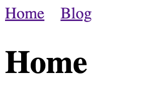

I prefer simple Markdown files as the content source for my blog posts. In this article, I want to show you how can set up a simple blog using [Nuxt Content v2](https://content.nuxtjs.org/).

## Nuxt Content v2

[Nuxt Content v2](https://content.nuxtjs.org/) is a [Nuxt 3](https://v3.nuxtjs.org/) module that reads local files from the `/content` directory in your project. It supports `.md`, `.yml`, `.csv` and `.json` files. Additionally, it's possible to use Vue components in Markdown with the [MDC Syntax](https://content.nuxtjs.org/guide/writing/mdc).

## Setup Nuxt App

First, let's start a new Nuxt Content project with:

```bash
npx nuxi init nuxt-demo-blog -t content
```

Then we need to install the dependencies in the `nuxt-demo-blog` folder:

```bash
yarn install
```

Now we can start the Nuxt content app in development mode:

```bash
yarn dev
```

A browser window should automatically open for `http://localhost:3000`. Alternatively, you can start playing with Nuxt Content in your browser using [StackBlitz](https://stackblitz.com/github/nuxt/starter/tree/content) or [CodeSandbox](https://codesandbox.io/s/github/nuxt/starter/tree/content).

The following StackBlitz sandbox demonstrates the simple blog application we create in this article:

<iframe width="100%" height="500" src="https://stackblitz.com/edit/nuxt-content-v2-blog-demo?embed=1"></iframe>

## Blog Content Structure

Our demo blog will have this structure inside the `/content` directory:

```
├── blog
│ ├── _index.md
│ ├── a-great-article
│   └── cover.jpg
│ │ └── index.md
│ └── another-great-article
│   └── cover.jpg
│   └── index.md
```

`blog/_index.md` is a [Partial](https://content.nuxtjs.org/guide/writing/content-directory#partials) content that will show a list of all available blog posts.

Each blog post has its directory, including an `index.md` and a `cover.jpg` file.

The `index.md` files include [Front-matter](https://content.nuxtjs.org/guide/writing/markdown#front-matter) at the top of the file to provide meta-data to pages, like title, date, and the cover image URL:

```
---
title: A Great Article
date: 2018-05-11
cover: /content/blog/a-great-article/cover.jpg
---

This is a great article body!
```

## Simple Navigation

First, we need simple navigation in our application to be able to navigate to our blog page.

Let's start by adding a [default layout](https://v3.nuxtjs.org/guide/directory-structure/layouts) in `layouts`:

```vue
<template>
  <div>
    <nav>
      <NuxtLink to="/" class="link">Home</NuxtLink>
      <NuxtLink to="/blog" class="link">Blog</NuxtLink>
    </nav>
    <main>
      <slot />
    </main>
  </div>
</template>

<style>
.link {
  margin-right: 1rem;
}
</style>
```

In our `app.vue` we need to wrap the NuxtPage component with the NuxtLayout component:

```vue
<template>
  <div>
    <NuxtLayout>
      <NuxtPage />
    </NuxtLayout>
  </div>
</template>
```

Finally, we create a `index.vue` in `pages` directory:

```vue
<template>
  <h1>Home</h1>
</template>
```



## Blog List

Let's look at how we can implement a list of all available blog posts.

First, we need to create a `BlogPosts.vue` Vue component in `components/content/` that queries and renders all available blog posts:

```vue
<template>
  <h1>Blog</h1>
  <ul>
    <li v-for="{ _path: slug, title } in blogPosts" :key="slug">
      <NuxtLink :to="slug">{{ title }}</NuxtLink>
    </li>
  </ul>
</template>

<script setup lang="ts">
const blogPosts = await queryContent('/blog')
  .sort({ date: -1 }) // show latest articles first
  .where({ _partial: false }) // exclude the Partial files
  .find();
</script>
```

We use the [queryContent function](https://content.nuxtjs.org/guide/displaying/querying#querying-content) from Nuxt to query a list of our blog posts.

Now we can reference this Vue component inside our `content/blog/_index.md` file:

```
---
title: Blog
---

::blog-posts
```

We can use any component in the `components/content/` directory or any component made available globally in your application in Markdown files.

If we now click on the "Blog" navigation link in our application, we can see a list of all available blog posts:


[[warning]]
| I reported a [Nuxt content bug](https://github.com/nuxt/content/issues/1197) that you need to reload some routes; otherwise, their content is not visible.

## Blog Post Page

Finally, we need to create a [dynamic route](https://v3.nuxtjs.org/guide/directory-structure/pages#dynamic-routes=) for the blog posts. Thus, we create a `[...slug].vue` file in `pages/blog`:

```vue
<template>
  <ContentDoc
    :path="$route.params.slug ? `/blog/${$route.params.slug[0]}` : '/blog'"
  >
    <template #not-found>
      <h2>Blog slug ({{ $route.params.slug }}) not found</h2>
    </template>
  </ContentDoc>
</template>
```

We use the current slug in the route parameters (`$route.params.slug`) to determine whether we want to render the blog post list or an individual blog post.

We can now see the content of the corresponding blog post:


## Conclusion

It's effortless to create a Markdown file-based blog using [Nuxt Content v2](https://content.nuxtjs.org/). This article demonstrates the basic steps to set up such a blog.

You can expect more [Nuxt 3](https://v3.nuxtjs.org/) posts in the following months as I plan to blog about interesting topics that I discover while rewriting my portfolio website.

If you liked this article, follow me on [Twitter](https://twitter.com/mokkapps) to get notified about new blog posts and more content from me.

Alternatively (or additionally), you can also [subscribe to my newsletter](https://mokkapps.de/newsletter).
