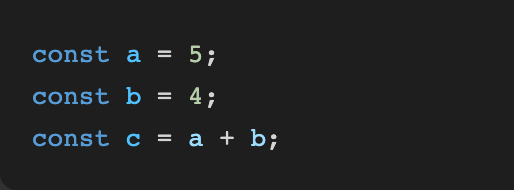
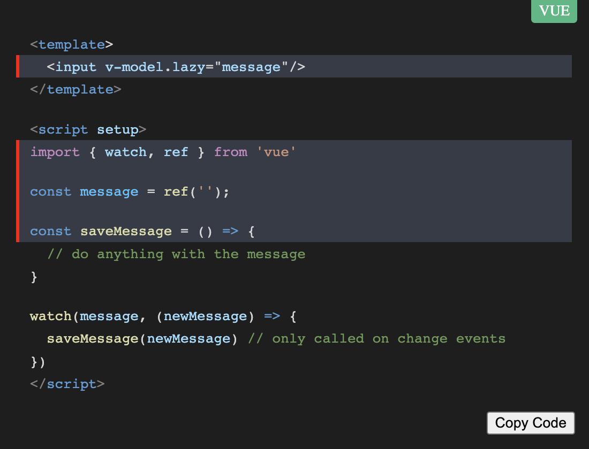

Code blocks are essential for blogs about software development. In this article, I want to show you how can define a custom code block component in [Nuxt Content v2](https://content.nuxtjs.org/) with the following features:

- Custom styling for code blocks inside Markdown files
- Show language name (if available)
- Show file name (if available)
- Show a "Copy Code" button

## Nuxt Content v2

[Nuxt Content v2](https://content.nuxtjs.org/) is a [Nuxt 3](https://v3.nuxtjs.org/) module that reads local files from the `/content` directory in your project. It supports `.md`, `.yml`, `.csv` and `.json` files. Additionally, it's possible to use Vue components in Markdown with the [MDC Syntax](https://content.nuxtjs.org/guide/writing/mdc).

## Setup Nuxt App

First, let's start a new Nuxt Content project with:

```bash
npx nuxi init nuxt-custom-code-blocks -t content
```

Then we need to install the dependencies in the `nuxt-custom-code-blocks` folder:

```bash
yarn install
```

Now we can start the Nuxt content app in development mode:

```bash
yarn dev
```

A browser window should automatically open for `http://localhost:3000`. Alternatively, you can start playing with Nuxt Content in your browser using [StackBlitz](https://stackblitz.com/github/nuxt/starter/tree/content) or [CodeSandbox](https://codesandbox.io/s/github/nuxt/starter/tree/content).

The following [StackBlitz sandbox](https://stackblitz.com/edit/nuxt-content-v2-custom-code-blocks) demonstrates the application we create in this article:

<iframe width="100%" height="500" src="https://stackblitz.com/edit/nuxt-content-v2-custom-code-blocks?embed=1&ctl=1"></iframe>

## Custom Prose Component

[Prose](https://content.nuxtjs.org/guide/writing/markdown#prose) represents the HTML tags output from the Markdown syntax in Nuxt Content. Nuxt Content provides a Vue component for each HTML tag like links, title levels, etc.

It's possible to override these Vue components, which is precisely what we'll do to create a custom code block component.

To customize a Prose component, we have to perform these steps:

- Check out the original component sources.
- Use the same props.
- Name it the same in our `components/content/` directory.

In our example, we want to override [ProseCode](https://github.com/nuxt/content/blob/main/src/runtime/components/Prose/ProseCode.vue), which is Nuxt Content's default Vue component to render code blocks in Markdown files.

This component accepts the following props: 

- `code`: the provided code as a string
- `language`: the provided language name
- `filename`: the provided filename
- `highlights`: a list of highlighted line numbers

Let's take a look at how we can set these values in a Markdown file: 

````
  ```js [src/index.js] {1, 2-3}
  const a = 4;
  const b = a + 3;
  const c  = a * b;
  ```
````

In the above example:

- `js` is the value passed to the `language` prop
- `src/index.js` is the value passed to the `filename` prop
- `[1, 2, 3]` is the value passed to the `highlights` prop

To override the component, we create `ProseCode.vue` in the `components/content` directory and use the exact same props that are defined in the default component:

```vue
<template>
  <slot />
</template>

<script setup lang="ts">
const props = withDefaults(
  defineProps<{
    code?: string;
    language?: string | null;
    filename?: string | null;
    highlights?: Array<number>;
  }>(),
  { code: '', language: null, filename: null, highlights: [] }
);
</script>
```

Now we can customize this component however we want. 

## Style Container

First, we want to style the container that includes the code. Therefore, we wrap the `<slot />` in a `div` and style it:

```vue
<template>
  <div class="container">
    <slot />
  </div>
</template>

<style scoped>
.container {
  background: #1e1e1e;
  position: relative;
  margin-top: 1rem;
  margin-bottom: 1rem;
  overflow: hidden;
  border-radius: 0.5rem;
}
</style>
```

Let's take a look at our custom code block:



## Show Language

Next, we want to show the name of the language on the top right, if it is available. 

```vue
<template>
  <div class="container">
    // highlight-start
    <span
      v-if="languageText"
      :style="{ background: languageBackground, color: languageColor }"
      class="language-text"
    >
      {{ languageText }}
    </span>
    // highlight-end
    <slot />
  </div>
</template>

<script setup lang="ts">
const props = withDefaults(
  defineProps<{
    code?: string;
    language?: string | null;
    filename?: string | null;
    highlights?: Array<number>;
  }>(),
  { code: '', language: null, filename: null, highlights: [] }
);

const languageMap: Record<
  string,
  { text: string; color: string; background: string }
> = {
  vue: {
    text: 'vue',
    background: '#42b883',
    color: 'white',
  },
  js: {
    text: 'js',
    background: '#f7df1e',
    color: 'black',
  },
};

const languageText = computed(() =>
  props.language ? languageMap[props.language]?.text : null
);
const languageBackground = computed(() =>
  props.language ? languageMap[props.language]?.background : null
);
const languageColor = computed(() =>
  props.language ? languageMap[props.language]?.color : null
);
</script>

<style scoped>
.container {
  background: #1e1e1e;
  padding-top: 1em;
}

.language-text {
  position: absolute;
  top: 0;
  right: 1em;
  padding: 0.25em 0.5em;
  font-size: 14px;
  text-transform: uppercase;
  border-bottom-right-radius: 0.25em;
  border-bottom-left-radius: 0.25em;
}
</style>
```

We define a map called `languageMap` that contains the displayed text, the CSS background, and text color for each programming language.
We style the `span` tag that renders the language inside our template based on this map and the provided `language` prop:


## Show File Name

Next, we want to show the file's name on the top left, if it is available:

```vue
<template>
  <div class="container">
    <span v-if="filename" class="filename-text">
      {{ filename }}
    </span>
    <slot />
  </div>
</template>

<style scoped>
.filename-text {
  position: absolute;
  top: 0;
  left: 1em;
  padding: 0.25em 0.5em;
  color: white;
  font-size: 14px;
}
</style>
```

The result looks like this:


## Add Copy Code Button

Finally, we want to show a button that copies the code to the clipboard. Therefore, we use [the useClipboard composable from VueUse](https://vueuse.org/core/useclipboard/#useclipboard=):

```vue
<template>
  <div class="container">
    <slot />
    <div class="bottom-container">
      <div class="copy-container">
        <span class="copied-text" v-if="copied">Copied code!</span>
        <button @click="copy(code)">Copy Code</button>
      </div>
    </div>
  </div>
</template>

<script setup lang="ts">
import { useClipboard } from '@vueuse/core';

const { copy, copied, text } = useClipboard();
</script>

<style scoped>
.bottom-container {
  display: flex;
  justify-content: flex-end;
}

.copy-container {
  display: flex;
}

.copied-text {
  margin-right: 1em;
}
</style>
```

Let's take a look at the final result with language & file name, copy code button, and line highlighting:



## Conclusion

Custom code blocks are essential for my blog as my blog posts contain a lot of code snippets. Features like copy code or line highlighting provide excellent value to my readers, and it is straightforward to add such features by creating a custom code block component in Nuxt Content v2.

The source code of this demo is available at [GitHub](https://github.com/Mokkapps/nuxt-content-v2-custom-code-blocks/tree/master) or as [StackBlitz sandbox](https://stackblitz.com/edit/nuxt-content-v2-custom-code-blocks).

You can expect more [Nuxt 3](https://v3.nuxtjs.org/) posts in the following months as I plan to blog about interesting topics that I discover while rewriting my portfolio website.

If you liked this article, follow me on [Twitter](https://twitter.com/mokkapps) to get notified about new blog posts and more content from me.

Alternatively (or additionally), you can also [subscribe to my newsletter](https://mokkapps.de/newsletter).
