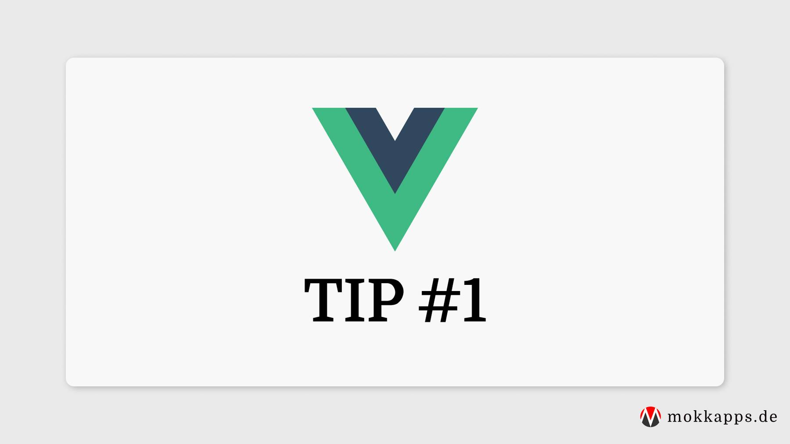

[Slots](https://v3.vuejs.org/guide/component-slots.html#slots) in Vue.js give more flexibility than [props](https://v3.vuejs.org/guide/component-props.html#props).

In general, you should use slots to give the parent the freedom to customize components.

On the other hand, you should use props if you have a defined design and need to change some values.

Let's take a quick look at a simple Vue component that accepts a message as property:

```vue
<template>
  <div>{{ msg }}</div>
</template>

<script>
export default {
  name: 'HelloWorldProps',
  props: {
    msg: String,
  },
};
</script>

<style scoped></style>
```

The following Vue component uses a slot instead of a property to show the message:

```vue
<template>
  <div><slot /></div>
</template>

<script>
export default {
  name: 'HelloWorldSlots',
  props: {},
};
</script>

<style scoped></style>
```

The following code shows how both components can be used in your Vue application:

```vue
<template>
  <div>
    <HelloWorldProps msg="Welcome to Your Vue.js App" />
    <HelloWorldSlots>
      <h2>Welcome to Your Vue.js App</h2>
    </HelloWorldSlots>
  </div>
</template>
```

As you can see, the slot provides more flexibility as you can pass any HTML code into the slot.
