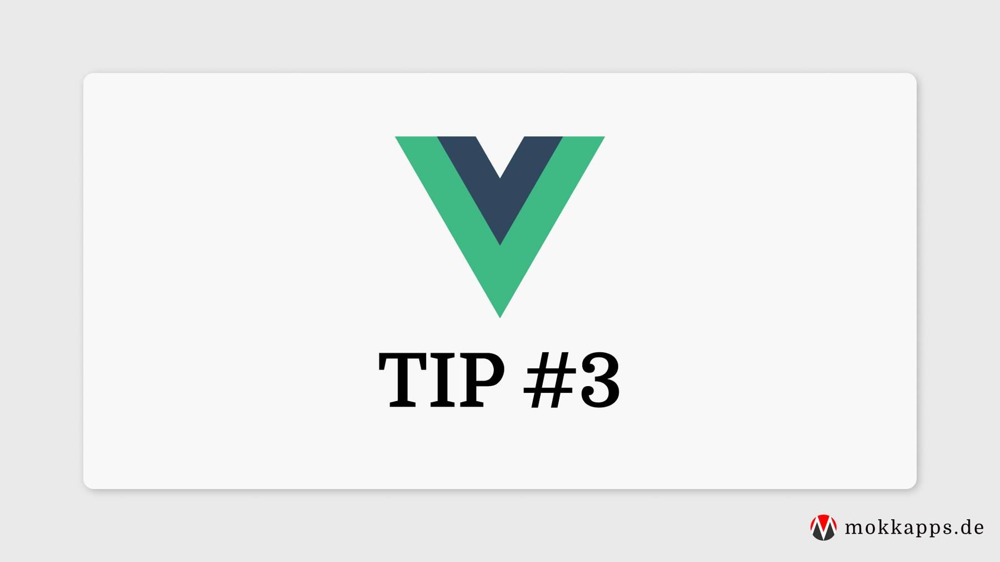

import TipCard from '../../../components/TipCard';

Your Vue.js prop definitions should always be as detailed as possible, specifying at least type(s):

export const badCode = `props: {
  status: String
}`.trim();

export const goodCode = `props: {
  status: {
    type: String,
    required: true,
    validator: value => { return [ 'syncing', 'synced', 'version-conflict', 'error' ].includes(value) }
  }
}`.trim();

<TipCard highlight="good" language="js">
  {goodCode}
</TipCard>

 

<TipCard highlight="bad" language="js">
  {badCode}
</TipCard>

 

This has two advantages:
 - API documentation: It's easy to see how the component is meant to be used.
 - Development Warnings: In development mode, you will get warnings if you pass incorrectly formatted props to a component.

---

 

If you liked this tip, follow me on [Twitter](https://twitter.com/mokkapps) to get notified about new tips, blog posts and more content from me.

Alternatively (or additionally), you can also [subscribe to my newsletter](https://mokkapps.de/newsletter).
