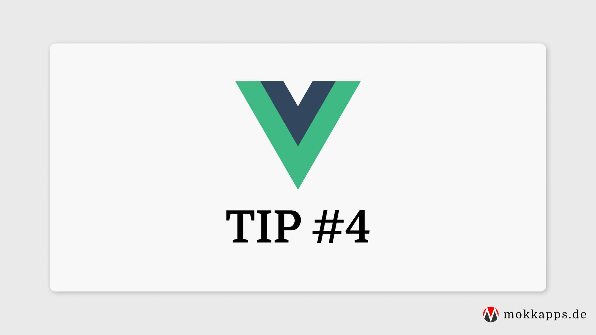

When using the setup function in [Vue 3](https://v3.vuejs.org/) Composition API, it will take two arguments: props and context.

```vue
<script>
export default {
  props: {
    title: String,
  },
  setup(props, context) {
    /**
     * Setup does not have the same access to `this` as
     * the Options API methods.
     * Thankfully, the setup method accepts a components props
     * as its first argument
     */
    console.log(props);

    /**
     * Context object exposes three properties of a Vue instance
     * 1. attrs - a component's attributes
     * 2. slots - a component's slots
     * 3. emit - allows us to emit an event from this component
     */
    console.log(context);
    context.emit('eventName');
  },
};
</script>
```

The first argument in the `setup` function is the `props` argument. `props` are reactive and will be updated when new props are passed in.

[[warning]]
| ⚠️ You cannot use ES6 destructuring because it will remove `props` reactivity. If you want to destructure `props` you need to use [toRefs](https://v3.vuejs.org/guide/reactivity-fundamentals.html#destructuring-reactive-state).

The second argument in the `setup` function is the `context` argument. It is a normal JavaScript object that exposes some useful values:

```js
export default {
  setup(props, context) {
    // Attributes (Non-reactive object, equivalent to $attrs)
    console.log(context.attrs)

    // Slots (Non-reactive object, equivalent to $slots)
    console.log(context.slots)

    // Emit events (Function, equivalent to $emit)
    console.log(context.emit)

    // Expose public properties (Function)
    console.log(context.expose)
  }
}
```

---
<br/>

If you liked this tip, follow me on [Twitter](https://twitter.com/mokkapps) to get notified about new tips, blog posts and more content from me.

Alternatively (or additionally), you can also [subscribe to my newsletter](https://mokkapps.de/newsletter).
